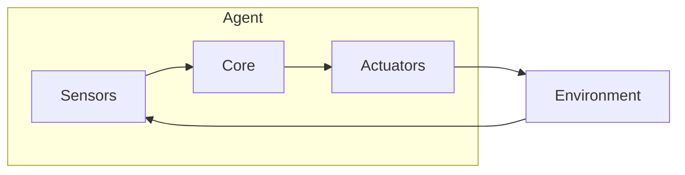
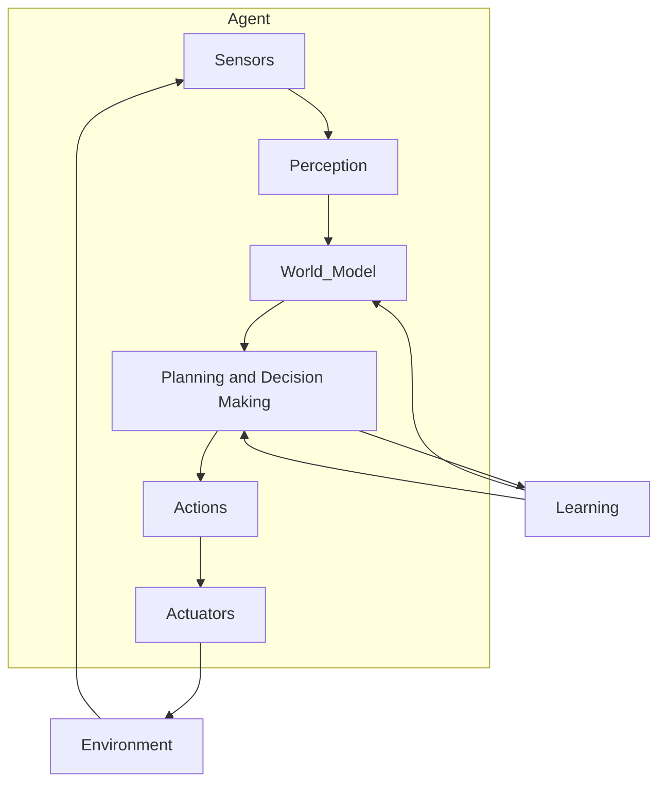

# AI Agent: AI的下一个风口 企业级应用与任务规划

## 1. 背景介绍

### 1.1 AI的发展历程

人工智能(AI)的发展可以追溯到20世纪50年代,当时它被定义为"使机器能够模仿人类的智能行为"。从那时起,AI经历了几个重要的发展阶段:

- 1950年代:AI的概念被首次提出,研究主要集中在博弈问题、神经网络和符号逻辑等领域。
- 1960-1970年代:专家系统和知识表示成为研究热点,同时也出现了第一次"AI寒冬"。
- 1980-1990年代:机器学习、模糊逻辑和进化算法等技术快速发展,推动了AI的复兴。
- 2000年代至今:大数据、GPU计算和深度学习的兴起,使AI取得了突破性进展,在计算机视觉、自然语言处理、决策控制等领域取得了卓越成就。

### 1.2 AI的商业化进程

随着AI技术的不断成熟,AI开始逐步从实验室走向商业化应用。一些领先的科技公司如谷歌、亚马逊、微软和苹果等,纷纷将AI技术应用于自身的产品和服务中。同时,一批AI初创公司也应运而生,为各行各业提供AI解决方案。

企业开始意识到AI的巨大潜力,并将其视为提高效率、优化决策和创造新商业模式的重要工具。根据IDC的预测,到2024年,全球AI系统支出将达到5540亿美元。

### 1.3 AI代理的兴起

在这一背景下,AI代理(AI Agent)这一概念开始引起关注。AI代理是指具备一定自主性、能够感知环境、做出决策并采取行动的软件实体。它们可以根据特定目标和约束条件,自主完成各种任务。

AI代理的出现,标志着AI技术从单一功能向综合应用的转变。它们可以将多种AI技术(如计算机视觉、自然语言处理、规划与决策等)集成到一个智能体中,从而实现更复杂、更智能化的应用。

AI代理在企业级应用中扮演着越来越重要的角色,成为推动企业数字化转型、提高生产效率、优化决策流程的关键力量。本文将重点探讨AI代理在企业级应用中的作用、核心技术以及任务规划等方面的内容。

## 2. 核心概念与联系

### 2.1 AI代理的定义

AI代理是一种能够感知环境、做出决策并采取行为的智能软件实体。它由感知器(Sensor)、执行器(Actuator)和智能决策核心(Intelligent Decision Core)三个基本组成部分构成:

- **感知器(Sensors)**: 用于从环境中获取信息,包括视觉、听觉、文本等各种形式的输入数据。
- **执行器(Actuators)**: 根据决策结果,对环境产生影响或执行相应的操作,如控制机器人运动、生成自然语言输出等。
- **智能决策核心(Intelligent Decision Core)**: 基于感知器获取的信息和预定义的目标与约束条件,运行各种AI算法(如机器学习、规划与决策、知识推理等),做出智能决策并指导执行器采取行动。

### 2.2 AI代理的特征

AI代理具有以下几个关键特征:

1. **自主性(Autonomy)**: AI代理能够根据自身的目标和环境信息,自主做出决策和采取行动,而无需人工干预。
2. **反应性(Reactivity)**: AI代理能够实时感知环境变化,并相应地调整自身的行为。
3. **主动性(Pro-activeness)**: AI代理不仅被动响应环境变化,还能够基于目标主动采取行动,以期达成预期效果。
4. **持续时间(Temporal Continuity)**: AI代理是持续运行的,它们不是一次性任务,而是长期存在并随时间演化。
5. **社会能力(Social Ability)**: AI代理能够与人类或其他代理进行交互和协作,共同完成复杂任务。

### 2.3 AI代理与传统软件的区别

相比传统的软件系统,AI代理具有以下不同之处:

1. **智能决策**:传统软件主要依赖预先设计的算法和规则,而AI代理则具备智能决策能力,可以根据环境变化做出合理判断。
2. **自主性**:传统软件执行预定义的指令,而AI代理能够自主地感知环境、制定计划并采取行动。
3. **学习能力**:AI代理通过机器学习等技术,可以从经验中学习和持续优化自身的决策模型。
4. **不确定性处理**:AI代理能够较好地处理复杂、不确定的环境,而传统软件则难以应对这种情况。
5. **开放性**:AI代理通常需要与外部世界进行交互,因此具有更强的开放性和适应性。

## 3. 核心算法原理与具体操作步骤

AI代理的核心是智能决策模块,它集成了多种AI算法,用于解决感知、规划、学习和决策等问题。下面将介绍一些常用的核心算法原理。

### 3.1 机器学习算法

机器学习算法是AI代理获取知识和建模的基础,常用算法包括:

1. **监督学习**:
    - **分类算法**:逻辑回归、支持向量机(SVM)、决策树、随机森林等。
    - **回归算法**:线性回归、多项式回归、SVR等。
2. **无监督学习**:
    - **聚类算法**:K-Means、层次聚类、DBSCAN等。 
    - **降维算法**:主成分分析(PCA)、t-SNE等。
3. **强化学习**:
    - **策略梯度算法**:REINFORCE、Actor-Critic等。
    - **价值迭代算法**:Q-Learning、Sarsa、Deep Q Network等。
4. **深度学习**:
    - **前馈神经网络**:多层感知机(MLP)。
    - **卷积神经网络**(CNN):用于计算机视觉任务。
    - **循环神经网络**(RNN):用于序列数据处理,如自然语言处理。
    - **生成对抗网络**(GAN):用于生成式任务。

机器学习算法可以从数据中学习模式,并用于构建AI代理的感知模型(如图像分类、语音识别等)和决策模型。

### 3.2 规划与决策算法

规划与决策算法是AI代理制定行动计划和做出决策的关键,包括:

1. **启发式搜索算法**:
    - **A*算法**:利用评价函数有效地在搜索树中查找最优路径。
    - **IDA*算法**:基于深度优先、记忆有限的启发式搜索算法。
2. **经典规划算法**:
    - **状态空间搜索**:通过搜索状态空间图找到从初始状态到目标状态的路径。
    - **层次任务网络(HTN)规划**:将复杂任务分解为子任务,递归求解。
3. **概率规划算法**:
    - **马尔可夫决策过程(MDP)**:用于建模决策序列在概率环境下的规划问题。
    - **蒙特卡罗树搜索(MCTS)**:通过反复模拟,构建搜索树并选择最优行动序列。
4. **约束优化技术**:
    - **线性规划**:在线性约束条件下求解最优解。
    - **混合整数规划**:处理包含离散和连续变量的优化问题。

规划与决策算法可以帮助AI代理根据目标和环境约束,生成行动策略和执行顺序。

### 3.3 多智能体协作算法

在复杂任务场景下,AI代理通常需要相互协作完成任务。多智能体协作涉及以下关键技术:

1. **分布式约束优化**(DCOP):在分布式环境下求解包含多个变量和约束的优化问题。
2. **协作博弈论**:研究多个智能体在博弈环境下如何达成均衡。
3. **形成控制**:控制多个智能体如何形成特定的队形或运动模式。
4. **任务分配**:根据各智能体的能力和约束,为它们分配合理的任务子集。
5. **协作规划**:多个智能体共同协作规划出完成整体任务的行动序列。

通过多智能体协作技术,AI代理可以相互协调行为,从而完成单个智能体难以完成的复杂任务。

### 3.4 人机交互技术

由于AI代理需要与人类用户进行交互,因此人机交互技术也是AI代理系统的重要组成部分,包括:

1. **自然语言处理**(NLP):
    - **自然语言理解**:将人类语言转换为机器可理解的形式。
    - **自然语言生成**:根据系统内部表示生成自然语言输出。
    - **对话管理**:控制对话流程,实现自然、连贯的人机对话。
2. **计算机视觉**:
    - **目标检测与识别**:检测和识别图像/视频中的目标物体。
    - **行为识别**:识别图像/视频中的动作行为。
    - **姿态估计**:估计目标物体或人体的姿态信息。
3. **多模态交互**:融合视觉、语音、手势等多种模态输入,实现自然交互。

良好的人机交互能力可以提高AI代理系统的用户友好性和实用性。

### 3.5 算法工作流程

AI代理系统的整体工作流程可以概括为以下步骤:

1. **感知(Perception)**:通过各种传感器获取环境信息,并使用计算机视觉、自然语言处理等技术对原始数据进行处理,转换为代理可理解的符号表示形式。
2. **建模(World Modeling)**:基于感知得到的信息,结合先验知识,构建对环境的内部表示模型。
3. **规划与决策(Planning and Decision Making)**:根据目标和环境模型,利用规划与决策算法生成行动计划,并做出最优决策。
4. **执行(Acting)**:将决策结果转化为具体的行动命令,通过执行器对环境产生影响。
5. **学习(Learning)**:从执行的反馈结果中学习,持续优化环境模型和决策模型。

这个循环过程使AI代理能够持续感知环境变化,并根据新信息调整自身的决策和行为。

## 4. 数学模型和公式详细讲解举例说明

在AI代理的核心算法中,数学模型和公式扮演着重要角色。本节将详细介绍一些常用的数学模型和公式。

### 4.1 机器学习模型

#### 4.1.1 线性回归

线性回归是一种常用的监督学习算法,用于建立自变量$X$和因变量$Y$之间的线性关系模型:

$$
Y = \theta_0 + \theta_1X_1 + \theta_2X_2 + ... + \theta_nX_n
$$

其中$\theta_i$是需要通过训练数据估计的模型参数。我们可以使用最小二乘法来求解最优参数:

$$
\min_\theta \sum_{i=1}^m (y^{(i)} - \theta^Tx^{(i)})^2
$$

这是一个凸优化问题,可以通过梯度下降法等优化算法求解。

#### 4.1.2 逻辑回归

逻辑回归是一种用于二分类问题的监督学习算法。它通过对线性回归的结果使用Sigmoid函数进行转换,将输出值映射到(0,1)区间,从而可以表示预测样本属于正类的概率:

$$
P(Y=1|X) = \frac{1}{1 + e^{-\theta^TX}}
$$

我们可以使用极大似然估计的方法,求解参数$\theta$的最优值。

#### 4.1.3 支持向量机

支持向量机(SVM)是一种常用的分类和回归模型。以线性可分SVM为例,我们希望