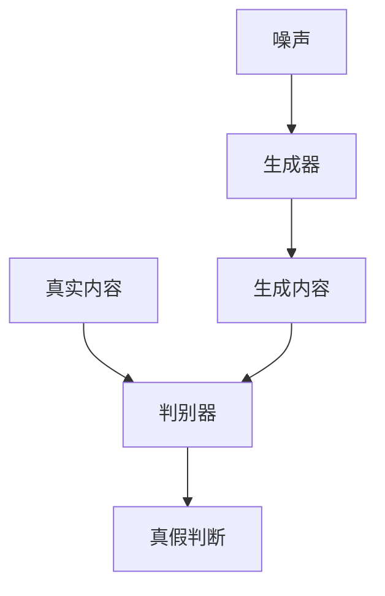
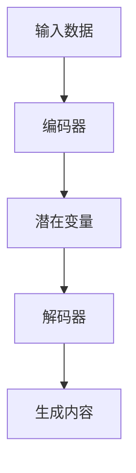
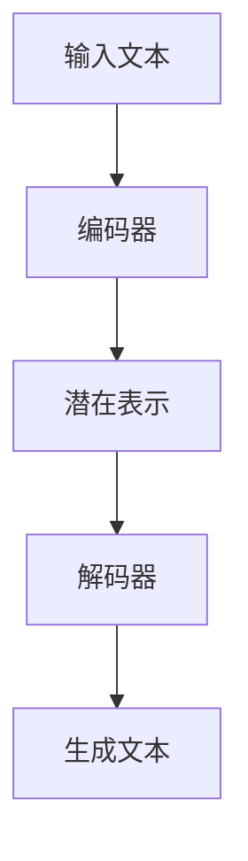

# AIGC伦理与安全：AI创作的边界与责任

作者：禅与计算机程序设计艺术

## 1. 背景介绍

### 1.1 AIGC的崛起
人工智能生成内容（AIGC, AI-Generated Content）是近年来在人工智能和机器学习领域迅速发展的一个分支。随着生成对抗网络（GANs）、变分自编码器（VAEs）和自然语言处理（NLP）技术的进步，AI不仅能够生成文本、图像和音乐，还能创作复杂的艺术作品和编写代码。AIGC的应用范围从娱乐、教育到商业和科学研究，各行各业都在探索其潜力。

### 1.2 伦理与安全问题的提出
然而，AIGC的快速发展也带来了诸多伦理与安全问题。AI创作内容的真实性、版权归属、隐私保护、以及潜在的滥用问题都引发了广泛关注。如何在享受AIGC带来的便利和创新的同时，确保其在伦理和安全方面的合规性，成为亟待解决的重要课题。

### 1.3 文章目的
本文旨在探讨AIGC在伦理与安全方面的边界与责任，分析其核心概念与联系，介绍相关算法的原理和操作步骤，提供实际应用场景和代码实例，并对未来发展趋势与挑战进行展望。

## 2. 核心概念与联系

### 2.1 AIGC的定义与分类
AIGC指的是通过人工智能技术生成的各种形式的内容，包括但不限于文本、图像、音频和视频。根据生成内容的不同，可以将AIGC分为以下几类：

- **文本生成**：如GPT-3生成的文章和对话。
- **图像生成**：如GANs生成的虚拟人物和艺术作品。
- **音频生成**：如AI作曲和语音合成。
- **视频生成**：如Deepfake技术生成的虚拟视频。

### 2.2 伦理问题分类
AIGC的伦理问题主要集中在以下几个方面：

- **真实性与欺骗**：AI生成的内容可能被用来制造虚假信息，误导公众。
- **版权与知识产权**：AI创作的内容版权归属问题尚未明确，涉及到原始数据的版权和AI模型的贡献。
- **隐私保护**：AI生成内容可能涉及个人隐私数据，如何保护这些数据是一个重要问题。
- **社会影响**：AI生成内容的广泛应用可能对就业、教育等社会领域产生深远影响。

### 2.3 安全问题分类
AIGC的安全问题主要包括：

- **数据安全**：AI生成内容所依赖的数据安全性，包括数据泄露和篡改。
- **模型安全**：AI模型本身的安全性，包括模型攻击和防御。
- **应用安全**：AIGC应用的安全性，包括应用程序的漏洞和防护措施。

## 3. 核心算法原理具体操作步骤

### 3.1 生成对抗网络（GANs）
生成对抗网络（GANs）由一个生成器（Generator）和一个判别器（Discriminator）组成，通过相互博弈的方式生成高质量的内容。

#### 3.1.1 GANs的基本结构
生成器试图生成逼真的内容，而判别器则试图区分真实内容和生成内容。两者通过不断的训练，生成器逐渐学会生成越来越逼真的内容。



#### 3.1.2 GANs的训练步骤
1. **初始化生成器和判别器的参数**。
2. **生成器生成初始内容**，并将其与真实内容一起输入判别器。
3. **判别器输出真假判断**，并计算损失函数。
4. **更新判别器参数**，使其能够更好地区分真实内容和生成内容。
5. **生成器根据判别器的反馈更新参数**，以生成更逼真的内容。
6. **重复上述步骤**，直到生成内容达到预期质量。

### 3.2 变分自编码器（VAEs）
变分自编码器（VAEs）是一种生成模型，通过编码器和解码器的结构实现内容生成。

#### 3.2.1 VAEs的基本结构
编码器将输入数据编码成潜在变量（latent variables），解码器则将潜在变量解码生成新的内容。



#### 3.2.2 VAEs的训练步骤
1. **初始化编码器和解码器的参数**。
2. **编码器将输入数据编码成潜在变量**，并计算潜在变量的分布。
3. **解码器将潜在变量解码生成内容**，并计算生成内容与输入数据的重构误差。
4. **计算总损失**，包括重构误差和潜在变量分布的KL散度。
5. **更新编码器和解码器的参数**，以最小化总损失。
6. **重复上述步骤**，直到生成内容达到预期质量。

### 3.3 自然语言处理（NLP）模型
NLP模型通过深度学习技术实现文本生成，如GPT-3。

#### 3.3.1 NLP模型的基本结构
NLP模型通常采用Transformer架构，通过编码器和解码器实现文本生成。



#### 3.3.2 NLP模型的训练步骤
1. **初始化模型参数**。
2. **将输入文本编码成潜在表示**，并计算潜在表示的分布。
3. **解码器将潜在表示解码生成文本**，并计算生成文本与输入文本的重构误差。
4. **计算总损失**，包括重构误差和潜在表示分布的KL散度。
5. **更新模型参数**，以最小化总损失。
6. **重复上述步骤**，直到生成文本达到预期质量。

## 4. 数学模型和公式详细讲解举例说明

### 4.1 GANs的数学模型
GANs的目标是通过生成器 $G$ 和判别器 $D$ 的博弈，找到生成器 $G$ 生成的分布 $p_g$ 与真实数据分布 $p_{data}$ 之间的最优解。

$$
\min_G \max_D V(D, G) = \mathbb{E}_{x \sim p_{data}(x)}[\log D(x)] + \mathbb{E}_{z \sim p_z(z)}[\log (1 - D(G(z)))]
$$

其中，$p_z(z)$ 是噪声分布，$G(z)$ 是生成内容，$D(x)$ 是判别器对输入 $x$ 的判断。

### 4.2 VAEs的数学模型
VAEs通过最大化似然函数 $p(x)$ 来训练模型，其中 $x$ 是输入数据，$z$ 是潜在变量。

$$
p(x) = \int p(x|z)p(z)dz
$$

由于直接计算 $p(x)$ 非常困难，VAEs采用变分推断的方法，引入近似分布 $q(z|x)$，并通过最大化证据下界（ELBO）来优化模型：

$$
\log p(x) \geq \mathbb{E}_{q(z|x)}[\log p(x|z)] - \text{KL}(q(z|x) \| p(z))
$$

### 4.3 NLP模型的数学模型
NLP模型通过最大化生成文本的似然函数 $p(y|x)$ 来训练模型，其中 $x$ 是输入文本，$y$ 是生成文本。

$$
p(y|x) = \prod_{t=1}^T p(y_t|y_{<t}, x)
$$

其中，$y_t$ 是生成文本在时间步 $t$ 的输出，$y_{<t}$ 是之前时间步的输出。

## 5. 项目实践：代码实例和详细解释说明

### 5.1 GANs的代码实例

```python
import torch
import torch.nn as nn
import torch.optim as optim
from torchvision import datasets, transforms

# 定义生成器
class Generator(nn.Module):
    def __init__(self):
        super(Generator, self).__init__()
        self.model = nn.Sequential(
            nn.Linear(100, 256),
            nn.ReLU(True),
            nn.Linear(256,