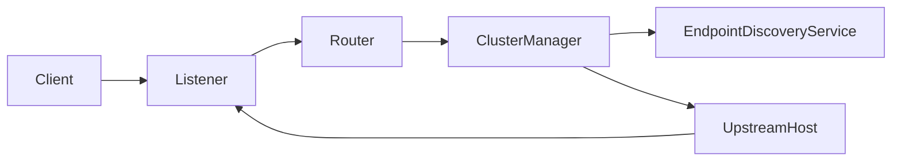

# AI系统Envoy原理与代码实战案例讲解

作者：禅与计算机程序设计艺术

## 1. 背景介绍

### 1.1 微服务架构的兴起与挑战

近年来，随着互联网业务的快速发展，传统的单体应用架构已经无法满足日益增长的业务需求。微服务架构作为一种新的架构风格，将单体应用拆分成多个小型、独立的服务单元，每个服务单元运行在独立的进程中，服务之间通过轻量级的通信机制进行交互，例如 RESTful API。

微服务架构的优势在于：

*   **易于开发和维护：**每个服务单元代码量较小，功能单一，易于开发、测试和维护。
*   **独立部署：**每个服务单元可以独立部署，互不影响，可以快速迭代和发布新功能。
*   **技术异构性：**不同的服务单元可以使用不同的编程语言和技术栈，提高了开发效率和灵活性。
*   **可扩展性：**可以根据业务需求对单个服务单元进行水平扩展，提高系统的吞吐量和可用性。

然而，微服务架构也带来了一些挑战：

*   **服务治理：**如何管理和协调多个服务单元之间的调用关系、负载均衡、故障恢复等问题。
*   **可观测性：**如何监控和追踪分布式系统中各个服务的运行状态、性能指标和调用链路。
*   **安全性：**如何保障微服务架构中各个服务的安全性，包括身份认证、授权和数据加密等方面。

### 1.2 Envoy 的诞生背景与优势

Envoy 是一款由 Lyft 开源的高性能、可编程的 L7 代理和通信总线，旨在解决微服务架构中服务治理、可观测性和安全性等方面的挑战。

Envoy 的主要优势包括：

*   **高性能：**Envoy 使用 C++ 编写，性能优异，能够处理高并发流量。
*   **可编程性：**Envoy 提供了丰富的 API 和扩展机制，用户可以根据自身需求定制 Envoy 的功能。
*   **可观测性：**Envoy 内置了丰富的监控指标和日志记录功能，支持与多种监控系统集成。
*   **安全性：**Envoy 支持 TLS 加密、身份认证和授权等安全特性。

## 2. 核心概念与联系

### 2.1 Envoy 的架构和组件

Envoy 的核心架构如下图所示：



*   **Listener：**监听来自客户端的连接请求，并将请求转发给相应的 Filter Chain 进行处理。
*   **Filter Chain：**由一系列 Filter 组成，用于对请求和响应进行处理，例如路由、认证、限流等。
*   **Router：**根据路由规则将请求转发到对应的 Cluster。
*   **Cluster Manager：**管理所有 Upstream Cluster，负责服务发现、健康检查和负载均衡。
*   **Upstream Host：**表示一个上游服务实例，Envoy 会将请求转发到 Upstream Host。

### 2.2 Envoy 的配置模型

Envoy 使用 YAML 或 JSON 格式的配置文件进行配置，配置文件中定义了 Listener、Filter、Cluster 等组件的配置信息。

```yaml
admin:
  # ...
static_resources:
  listeners:
  - name: listener_0
    address:
      socket_address:
        address: 0.0.0.0
        port_value: 8080
    filter_chains:
    - filters:
      - name: envoy.filters.network.http_connection_manager
        typed_config:
          "@type": type.googleapis.com/envoy.extensions.filters.network.http_connection_manager.v3.HttpConnectionManager
          stat_prefix: ingress_http
          route_config:
            name: local_route
            virtual_hosts:
            - name: local_service
              