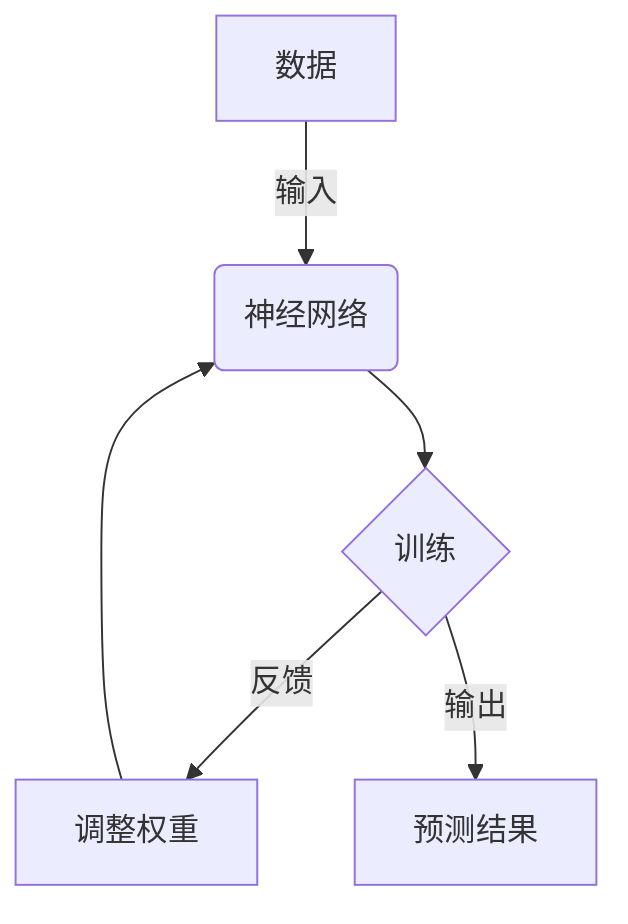
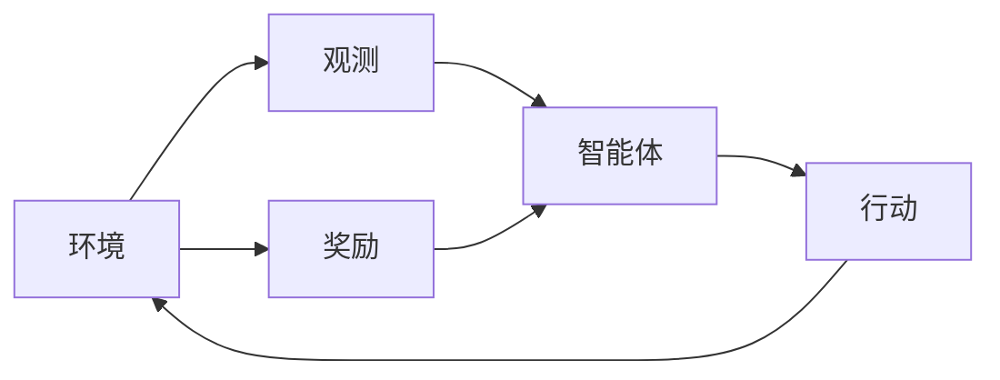
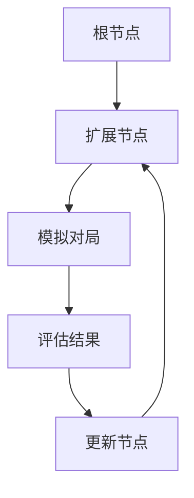

# AlphaGo 原理与代码实例讲解

## 1.背景介绍

### 1.1 人工智能与游戏的历史

人工智能(Artificial Intelligence, AI)的发展与游戏有着密不可分的关系。游戏一直被视为测试人工智能系统的理想试验场。从国际象棋、西洋棋到圍棋,这些看似简单的棋类游戏对于人工智能系统来说都是极具挑战性的。

### 1.2 圍棋的挑战

圍棋是一种起源于中国的古老棋类游戏,其简单的规则背后蕴含着巨大的复杂性。圍棋棋盘由19×19个交叉点组成,双方下子的可能性高达约10^170种,远远超过了国际象棋(10^47种)和西洋棋(10^120种)。这种海量的可能性空间使得圍棋成为人工智能领域的一大挑战。

### 1.3 AlphaGo的诞生

2016年,由谷歌DeepMind公司研发的AlphaGo人工智能系统在与世界冠军李世乭的对弈中获胜,这一里程碑式的成就标志着人工智能在游戏领域取得了重大突破。AlphaGo的出现不仅彻底改变了人们对于圍棋的认知,更为人工智能的发展注入了新的动力。

## 2.核心概念与联系

### 2.1 深度学习

AlphaGo的核心是基于深度学习(Deep Learning)的神经网络模型。深度学习是机器学习的一个新的领域,它模仿人脑的结构和功能,通过构建神经网络来学习数据,并用于各种复杂的任务,如图像识别、自然语言处理和决策制定等。



上图展示了深度学习的基本工作原理。通过输入大量的数据,神经网络会自动调整内部参数(权重),从而学习到数据的特征和模式,最终实现对新数据的预测和决策。

### 2.2 强化学习

除了深度学习之外,AlphaGo还采用了强化学习(Reinforcement Learning)的技术。强化学习是一种基于奖励的学习方式,智能体(Agent)通过与环境(Environment)的交互来学习如何获得最大化的奖励。

在AlphaGo中,神经网络充当了智能体的角色,而圍棋对局则是环境。每一步的着子都会产生一个奖励值(胜利或失败),神经网络会根据这些奖励值不断调整自身的参数,从而学习到更好的下棋策略。



上图描述了强化学习的基本过程。智能体根据对环境的观测做出行动,环境会给出相应的奖励,智能体会基于奖励来调整自身的策略,如此循环往复,最终实现优化。

### 2.3 蒙特卡罗树搜索

除了神经网络和强化学习,AlphaGo还结合了蒙特卡罗树搜索(Monte Carlo Tree Search, MCTS)算法。MCTS是一种高效的决策制定方法,通过在树形结构中随机模拟对局过程,来评估每一个可能的行动,从而选择最优策略。



上图展示了MCTS算法的基本流程。从根节点开始,算法会不断地扩展新节点、模拟对局、评估结果并更新节点统计数据,最终在树中找到具有最高胜率的着法。

AlphaGo将深度学习、强化学习和蒙特卡罗树搜索有机结合,充分利用了各自的优势,从而在圍棋这一复杂的领域取得了突破性的成就。

## 3.核心算法原理具体操作步骤 

### 3.1 策略网络(Policy Network)

策略网络是AlphaGo的核心组件之一,它的作用是评估当前局面下每一个合法着子位置的概率分布,即下一步的最佳着子位置。策略网络由两部分组成:

1. **卷积神经网络(Convolutional Neural Network, CNN)**: 用于从当前棋局状态中提取特征
2. **循环神经网络(Recurrent Neural Network, RNN)**: 用于整合历史信息,产生移动概率

具体操作步骤如下:

1. 将当前棋局状态表示为一个高维特征平面(feature planes),包括棋子位置、自己的气等信息。
2. 将特征平面输入到CNN中,提取局面特征。
3. 将CNN的输出与之前的RNN隐藏状态结合,输入到RNN中。
4. RNN输出一个概率分布,表示下一步每个合法位置的概率。
5. 根据概率分布采样或选择最大概率的位置作为下一步着子。

策略网络通过大量的自我对弈数据进行训练,学习圍棋专家的着法模式,从而能够生成接近人类水平的着法。

### 3.2 价值网络(Value Network)

价值网络是AlphaGo的另一个重要组件,它的作用是评估当前局面对于两方的胜率。价值网络的结构与策略网络类似,也是由CNN和RNN组成,但最后的输出是一个标量值,表示当前局面的胜率评估。

具体操作步骤如下:

1. 将当前棋局状态表示为特征平面,输入到CNN中提取特征。
2. 将CNN的输出与之前的RNN隐藏状态结合,输入到RNN中。
3. RNN输出一个标量值,表示当前局面的胜率评估。

价值网络通过大量的完整对局数据进行训练,学习如何评估局面的胜负,从而辅助策略网络做出更好的着法选择。

### 3.3 蒙特卡罗树搜索(MCTS)

蒙特卡罗树搜索是AlphaGo的第三个关键组件,它将策略网络和价值网络的输出结合起来,通过在树形结构中模拟对局过程,来评估每一个可能的着法,从而选择最优策略。

具体操作步骤如下:

1. 初始化一个根节点,表示当前局面。
2. 选择phase:
    - 从根节点开始,通过一定的策略(如UCB公式)选择最有前景的子节点,直到遇到一个未展开的节点。
3. 展开phase:
    - 对于未展开的节点,通过策略网络获取该节点的子节点(合法着法)的先验概率分布。
    - 根据先验概率分布展开一个新的子节点。
4. 模拟phase:
    - 从新展开的节点开始,通过快速模拟(如随机模拟)完成剩余的对局。
    - 使用价值网络对最终结果进行评估,获得一个胜率值。
5. 反向传播phase:
    - 将模拟获得的胜率值沿着选择路径反向传播,更新每个节点的统计数据(访问次数、总行动值等)。
6. 重复步骤2-5,不断展开新节点、模拟对局、更新统计数据。
7. 根据统计数据,选择整个树中访问次数最多(或总行动值最大)的节点对应的着法作为最终决策。

通过大量的模拟和统计,MCTS能够逐步收敛到最优策略,并利用神经网络提供的先验知识来提高搜索效率。

## 4.数学模型和公式详细讲解举例说明

在AlphaGo的算法中,有几个关键的数学模型和公式值得详细讲解。

### 4.1 策略网络(Policy Network)

策略网络的目标是学习一个概率模型 $p(a|s)$,即在状态 $s$ 下选择行动 $a$ 的概率。策略网络由一个卷积神经网络和一个循环神经网络组成。

卷积神经网络的作用是从棋局状态 $s$ 中提取特征,得到一个特征向量 $\phi(s)$。然后将特征向量 $\phi(s)$ 与循环神经网络的隐藏状态 $h$ 结合,输入到循环神经网络中,得到一个概率分布 $\pi = p(a|s)$。

具体来说,策略网络的输出概率由以下公式给出:

$$\pi = \text{RNN}(\phi(s), h)$$

其中, $\text{RNN}$ 表示循环神经网络的计算过程。

在训练过程中,我们希望策略网络的输出概率 $\pi$ 能够逼近人类专家的着法概率分布 $\pi^*$。因此,策略网络的损失函数可以定义为:

$$\mathcal{L}_\pi = -\sum_a \pi^*(a|s) \log \pi(a|s)$$

这是一个交叉熵损失函数,可以通过反向传播算法对策略网络的参数进行优化。

### 4.2 价值网络(Value Network)

价值网络的目标是学习一个状态评估函数 $v(s)$,即给定状态 $s$,预测最终胜率的期望值。价值网络的结构与策略网络类似,也由一个卷积神经网络和一个循环神经网络组成。

卷积神经网络从棋局状态 $s$ 中提取特征 $\phi(s)$,然后与循环神经网络的隐藏状态 $h$ 结合,输入到循环神经网络中,得到一个标量值 $v(s)$,表示当前状态的胜率评估。

具体来说,价值网络的输出由以下公式给出:

$$v(s) = \text{RNN}(\phi(s), h)$$

在训练过程中,我们希望价值网络的输出 $v(s)$ 能够逼近真实的胜率 $z$。因此,价值网络的损失函数可以定义为:

$$\mathcal{L}_v = (z - v(s))^2$$

这是一个均方误差损失函数,可以通过反向传播算法对价值网络的参数进行优化。

### 4.3 蒙特卡罗树搜索(MCTS)

在蒙特卡罗树搜索中,我们需要评估每个节点的价值,以决定下一步应该选择哪个节点进行扩展。常用的评估公式是上置信界(Upper Confidence Bound, UCB)公式:

$$U(s, a) = Q(s, a) + c_\text{puct} \times P(s, a) \times \frac{\sqrt{\sum_b N(s, b)}}{1 + N(s, a)}$$

其中:

- $Q(s, a)$ 表示状态 $s$ 下选择行动 $a$ 的平均行动值(Action Value)
- $P(s, a)$ 表示策略网络给出的 $(s, a)$ 的先验概率
- $N(s, a)$ 表示状态 $s$ 下行动 $a$ 被访问的次数
- $c_\text{puct}$ 是一个调节探索和利用权衡的超参数

UCB公式平衡了两个因素:已知的平均行动值 $Q(s, a)$ 和未探索的潜力 $P(s, a)$。通过选择具有最大 $U(s, a)$ 值的节点进行扩展,MCTS可以在探索和利用之间达到平衡,从而逐步收敛到最优策略。

## 4.项目实践:代码实例和详细解释说明

为了更好地理解AlphaGo的原理,我们将通过一个简化的Python实现来演示其核心算法。这个实现主要包括三个部分:策略网络、价值网络和蒙特卡罗树搜索。

### 4.1 策略网络

我们使用一个简单的全连接神经网络来模拟策略网络,输入是当前棋局状态的特征向量,输出是每个合法着子位置的概率分布。

```python
import torch
import torch.nn as nn

class PolicyNetwork(nn.Module):
    def __init__(self, input_size, output_size):
        super(PolicyNetwork, self).__init__()
        self.fc1 = nn.Linear(input_size, 128)
        self.fc2 = nn.Linear(128, output_size)
        self.softmax = nn.Softmax(dim=1)

    def forward(