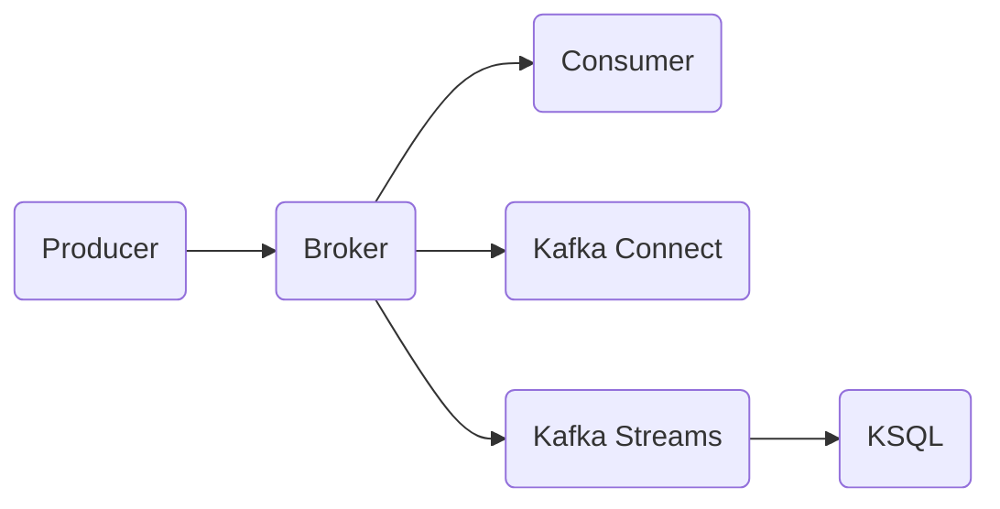

# ApacheKafka

作者：禅与计算机程序设计艺术

## 1.背景介绍
### 1.1 大数据时代下的实时数据处理需求
#### 1.1.1 海量数据的实时产生
#### 1.1.2 传统数据处理架构的局限性
#### 1.1.3 实时数据处理的重要意义
### 1.2 消息队列中间件的兴起  
#### 1.2.1 消息队列的基本概念
#### 1.2.2 消息队列的主要功能
#### 1.2.3 主流消息队列中间件概览
### 1.3 Apache Kafka的崛起
#### 1.3.1 Kafka的诞生背景
#### 1.3.2 Kafka在业界的广泛应用
#### 1.3.3 Kafka的核心优势

## 2.核心概念与联系
### 2.1 Producer（生产者）
#### 2.1.1 生产者的作用
#### 2.1.2 生产者的客户端API
#### 2.1.3 生产者的配置参数
### 2.2 Consumer（消费者）  
#### 2.2.1 消费者的作用
#### 2.2.2 消费者的客户端API
#### 2.2.3 消费者组的概念
### 2.3 Broker（代理节点）
#### 2.3.1 Broker的功能
#### 2.3.2 Broker的工作原理
#### 2.3.3 Broker的集群部署
### 2.4 Topic（主题）和Partition（分区）
#### 2.4.1 Topic的概念和作用 
#### 2.4.2 Partition的概念和作用
#### 2.4.3 Topic和Partition的关系
### 2.5 Replication（副本）
#### 2.5.1 副本的概念
#### 2.5.2 Leader和Follower副本
#### 2.5.3 副本同步机制
### 2.6 Kafka生态系统
#### 2.6.1 Kafka Connect
#### 2.6.2 Kafka Streams
#### 2.6.3 KSQL
### 2.7 Kafka架构图


## 3.核心算法原理具体操作步骤
### 3.1 生产者端
#### 3.1.1 消息发送流程
##### 3.1.1.1 创建ProducerRecord
##### 3.1.1.2 序列化
##### 3.1.1.3 分区器
##### 3.1.1.4 批次发送
#### 3.1.2 可靠性保证
##### 3.1.2.1 ack机制
##### 3.1.2.2 重试机制
##### 3.1.2.3 幂等性
### 3.2 代理端
#### 3.2.1 请求处理流程
##### 3.2.1.1 请求验证
##### 3.2.1.2 磁盘存储
##### 3.2.1.3 响应回复
#### 3.2.2 消息存储格式
##### 3.2.2.1 Log文件存储
##### 3.2.2.2 稀疏索引
##### 3.2.2.3 零拷贝技术
#### 3.2.3 Leader选举
##### 3.2.3.1 Controller组件
##### 3.2.3.2 ZooKeeper的作用
##### 3.2.3.3 ISR机制
### 3.3 消费者端 
#### 3.3.1 消息消费模型
##### 3.3.1.1 Pull模型
##### 3.3.1.2 Push模型
##### 3.3.1.3 两种模型比较
#### 3.3.2 位移(offset)提交  
##### 3.3.2.1 自动提交
##### 3.3.2.2 手动提交
##### 3.3.2.3 位移存储
#### 3.3.3 再均衡(Rebalance)
##### 3.3.3.1 再均衡触发条件
##### 3.3.3.2 再均衡分区分配策略
##### 3.3.3.3 无感知再均衡

## 4.数学模型和公式详细讲解举例说明
### 4.1 吞吐量模型
#### 4.1.1 影响因素分析
#### 4.1.2 数学建模和公式推导
$$Throughput = \frac{N * B}{T}$$
其中，$N$为分区数，$B$为每个分区的批次大小，$T$为发送时间间隔。
#### 4.1.3 实例分析与优化建议
### 4.2 数据平衡模型  
#### 4.2.1 发生数据倾斜的原因
#### 4.2.2 数学建模和公式推导  
$$Skew = \frac{MAX(P_i)}{AVG(P)}$$
其中，$P_i$为第$i$个分区的数据量，$AVG(P)$为所有分区数据量的平均值。
#### 4.2.3 解决方案与实践经验
### 4.3 消费者Lag模型
#### 4.3.1 Lag的概念和影响
#### 4.3.2 数学建模和公式推导
$$Lag=LogEndOffset-ConsumerOffset$$
其中，$LogEndOffset$为最新消息的位移，$ConsumerOffset$为消费者提交的位移。 
#### 4.3.3 监控和告警最佳实践

## 5.项目实践：代码实例和详细解释说明
### 5.1 环境准备
#### 5.1.1 JDK安装
#### 5.1.2 ZooKeeper集群部署
#### 5.1.3 Kafka集群部署
### 5.2 Java客户端代码实例
#### 5.2.1 生产者示例代码及说明
```java
Properties props = new Properties();
props.put("bootstrap.servers", "localhost:9092");
props.put("key.serializer", "org.apache.kafka.common.serialization.StringSerializer");
props.put("value.serializer", "org.apache.kafka.common.serialization.StringSerializer");
Producer<String, String> producer = new KafkaProducer<>(props);

for (int i = 0; i < 10; i++) {
     producer.send(new ProducerRecord<String, String>("my-topic", Integer.toString(i), Integer.toString(i)));
}
producer.close();
```
#### 5.2.2 消费者示例代码及说明  
```java
Properties props = new Properties();
     props.setProperty("bootstrap.servers", "localhost:9092");
     props.setProperty("group.id", "test");
     props.setProperty("enable.auto.commit", "true");
     props.setProperty("key.deserializer", "org.apache.kafka.common.serialization.StringDeserializer");
     props.setProperty("value.deserializer", "org.apache.kafka.common.serialization.StringDeserializer");
     KafkaConsumer<String, String> consumer = new KafkaConsumer<>(props);
     consumer.subscribe(Arrays.asList("my-topic"));
     while (true) {
         ConsumerRecords<String, String> records = consumer.poll(Duration.ofMillis(100));
         for (ConsumerRecord<String, String> record : records)
             System.out.printf("offset = %d, key = %s, value = %s%n", record.offset(), record.key(), record.value());
     }
```
### 5.3 Kafka Streams代码实例
#### 5.3.1 WordCount案例和说明
```java
StreamsBuilder builder = new StreamsBuilder();
KStream<String, String> textLines = builder.stream("TextLinesTopic");
KTable<String, Long> wordCounts = textLines
    .flatMapValues(textLine -> Arrays.asList(textLine.toLowerCase().split("\\W+")))
    .groupBy((key, word) -> word)
    .count(Materialized.<String, Long, KeyValueStore<Bytes, byte[]>>as("counts-store"));
wordCounts.toStream().to("WordsWithCountsTopic", Produced.with(Serdes.String(), Serdes.Long()));
```
#### 5.3.2 KTable和KStream的区别  
### 5.4 Kafka Connect代码实例
#### 5.4.1 FileStreamSource连接器
#### 5.4.2 JdbcSinkConnector连接器

## 6.实际应用场景
### 6.1 日志聚合
#### 6.1.1 日志收集和处理流程
#### 6.1.2 ELK技术栈与Kafka结合
#### 6.1.3 实时日志分析平台架构
### 6.2 数据管道  
#### 6.2.1 异构数据源集成
#### 6.2.2 Lambda架构和Kappa架构   
#### 6.2.3 Kafka在数据管道中的作用
### 6.3 事件溯源
#### 6.3.1 事件溯源的基本概念
#### 6.3.2 CQRS架构模式  
#### 6.3.3 利用Kafka实现事件溯源
### 6.4 流处理应用
#### 6.4.1 实时数仓
#### 6.4.2 实时推荐系统
#### 6.4.3 欺诈检测

## 7.工具和资源推荐
### 7.1 Kafka监控工具
#### 7.1.1 Kafka Manager
#### 7.1.2 Kafka Eagle  
#### 7.1.3 Kafka Offset Monitor
### 7.2 Kafka可视化工具 
#### 7.2.1 Kafka Tool
#### 7.2.2 Kafdrop
#### 7.2.3 Kafka Topics UI
### 7.3 Kafka集成组件
#### 7.3.1 Flume
#### 7.3.2 Spark Streaming
#### 7.3.3 Flink
### 7.4 Kafka学习资源
#### 7.4.1 官网文档
#### 7.4.2 Kafka权威指南
#### 7.4.3 优秀博客推荐

## 8.总结：未来发展趋势与挑战
### 8.1 消息队列未来发展
#### 8.1.1 Cloud-Native消息传递 
#### 8.1.2 Serverless消息模式
#### 8.1.3 多云支持  
### 8.2 Kafka 面临的挑战
#### 8.2.1 功能复杂度提升
#### 8.2.2 海量Topic管理
#### 8.2.3 多语言客户端支持
### 8.3 Apache Kafka路线图
#### 8.3.1 优化存储引擎
#### 8.3.2 强化安全机制
#### 8.3.3 无感知弹性伸缩

## 9.附录：常见问题与解答
### 9.1 生产环境参数调优
#### 9.1.1 broker端参数
#### 9.1.2 producer端参数
#### 9.1.3 consumer端参数
### 9.2 数据丢失问题排查
#### 9.2.1 生产阶段数据丢失
#### 9.2.2 broker端数据丢失
#### 9.2.3 消费阶段数据丢失
### 9.3 Kafka集群监控指标
#### 9.3.1 集群健康度指标
#### 9.3.2 性能瓶颈指标 
#### 9.3.3 资源利用率指标

以上就是一篇关于ApacheKafka的技术博客文章的大纲结构。本文从Kafka的背景介绍入手，系统阐述了Kafka的核心概念和工作原理，深入分析了内部的算法实现和数学模型，并给出了丰富的代码实例。同时，文章还总结了Kafka在实际场景中的典型应用，推荐了常用的工具和学习资源，展望了Kafka的未来发展趋势和挑战，并在附录中解答了读者关心的常见问题。全文逻辑严谨，结构清晰，图文并茂，力求为读者呈现一篇高质量的Kafka技术博文。当然，受篇幅所限，细节之处还需读者自行展开学习和研究。

希望这篇文章对你学习和应用ApacheKafka能有所启发。Kafka作为新一代分布式消息流平台，为实时数据处理带来了革命性变化，值得每一位数据开发者和架构师深入探索。让我们一起在数据时代的浪潮中乘风破浪，用Kafka打造丰富多彩的应用场景吧！