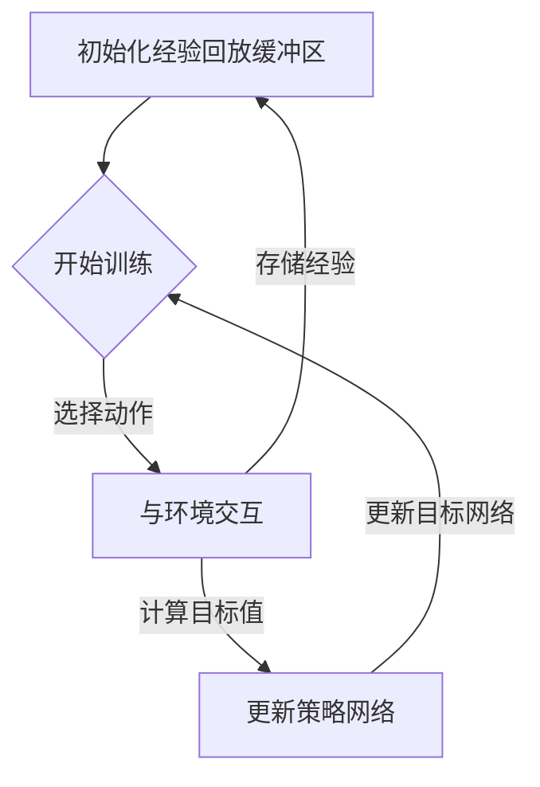

# DQN的应用案例：来自工业界的成功故事

作者：禅与计算机程序设计艺术

## 1. 背景介绍

### 1.1 强化学习的兴起与应用

近年来，随着人工智能技术的飞速发展，强化学习 (Reinforcement Learning, RL) 作为机器学习的一个重要分支，受到了学术界和工业界的广泛关注。强化学习的核心思想是让智能体 (Agent) 在与环境的交互过程中，通过试错的方式学习到最优的策略 (Policy)，从而最大化累积奖励 (Cumulative Reward)。与传统的监督学习和无监督学习不同，强化学习不需要预先提供大量的标注数据，而是通过与环境的交互来学习，因此在处理复杂、动态、不确定性高的现实问题上具有独特的优势。

### 1.2 DQN算法的提出与发展

深度Q网络 (Deep Q-Network, DQN) 作为强化学习领域的一个里程碑式的算法，成功地将深度学习 (Deep Learning, DL) 与强化学习结合起来，极大地提升了强化学习算法的性能和效率。DQN 算法最早由 DeepMind 团队在 2013 年提出，并在 Atari 游戏中取得了超越人类玩家水平的成绩，引起了巨大轰动。随后，DQN 算法及其变体被广泛应用于机器人控制、自动驾驶、推荐系统、金融交易等领域，并取得了令人瞩目的成果。

### 1.3 本文目的和意义

本文旨在探讨 DQN 算法在工业界中的应用案例，并分析其成功的原因和面临的挑战。通过对实际案例的分析，希望能够为读者提供有关 DQN 算法应用的 insights，并促进 DQN 算法在更多领域的落地和应用。

## 2. 核心概念与联系

### 2.1 强化学习的基本要素

在深入探讨 DQN 算法之前，我们先来回顾一下强化学习的基本要素：

* **智能体 (Agent):**  学习和执行策略的主体，例如游戏中的玩家、机器人等。
* **环境 (Environment):**  智能体所处的外部世界，例如游戏场景、真实世界等。
* **状态 (State):**  环境在某个时刻的描述，例如游戏画面、机器人的传感器数据等。
* **动作 (Action):**  智能体可以采取的操作，例如游戏中的按键操作、机器人的运动指令等。
* **奖励 (Reward):**  环境对智能体动作的反馈，通常是一个数值信号，例如游戏得分、任务完成情况等。
* **策略 (Policy):**  智能体根据当前状态选择动作的规则，通常是一个函数或一个查找表。
* **价值函数 (Value Function):**  用于评估某个状态或动作的长期价值，通常是一个函数。
* **模型 (Model):**  对环境的模拟，用于预测环境的下一个状态和奖励。

### 2.2 DQN算法的核心思想

DQN 算法的核心思想是利用深度神经网络来逼近价值函数，并使用经验回放 (Experience Replay) 和目标网络 (Target Network) 等技术来提高算法的稳定性和效率。具体来说，DQN 算法主要包含以下几个关键步骤：

1. **利用深度神经网络来逼近价值函数:**  DQN 算法使用一个深度神经网络来表示价值函数 $Q(s,a)$，其中 $s$ 表示当前状态，$a$ 表示动作。该网络的输入是状态 $s$，输出是每个动作 $a$ 对应的价值 $Q(s,a)$。
2. **使用经验回放来训练神经网络:**  DQN 算法将智能体与环境交互过程中收集到的数据存储在一个经验回放缓冲区中，并从中随机抽取样本进行训练，以打破数据之间的相关性，提高训练效率。
3. **使用目标网络来计算目标值:**  为了解决训练过程中的不稳定性问题，DQN 算法使用两个相同结构的神经网络，一个作为目标网络，另一个作为策略网络。目标网络的参数会定期从策略网络复制过来，用于计算目标值，从而提高算法的稳定性。

### 2.3 DQN算法的流程图



## 3. 核心算法原理具体操作步骤

### 3.1 构建深度Q网络

DQN 算法使用深度神经网络来逼近价值函数 $Q(s,a)$。该网络的输入是状态 $s$，输出是每个动作 $a$ 对应的价值 $Q(s,a)$。网络的结构可以根据具体的应用场景进行设计，通常包含多个卷积层、池化层和全连接层。

### 3.2  定义损失函数

DQN 算法的目标是最小化损失函数，从而使神经网络的输出值尽可能接近目标值。损失函数定义为：

$$
L = \mathbb{E}[(r + \gamma \max_{a'} Q(s', a') - Q(s, a))^2]
$$

其中，$r$ 表示当前状态 $s$ 下采取动作 $a$ 获得的奖励，$s'$ 表示下一个状态，$\gamma$ 表示折扣因子，用于平衡当前奖励和未来奖励之间的权重。

### 3.3 使用梯度下降法更新网络参数

DQN 算法使用梯度下降法来更新神经网络的参数，从而最小化损失函数。具体来说，算法会根据损失函数对网络参数的梯度进行更新，更新公式如下：

$$
\theta_{t+1} = \theta_t - \alpha \nabla_{\theta} L
$$

其中，$\theta$ 表示网络参数，$\alpha$ 表示学习率。

## 4. 数学模型和公式详细讲解举例说明

### 4.1  Bellman 方程

DQN 算法的理论基础是 Bellman 方程，该方程描述了价值函数之间的迭代关系：

$$
V(s) = \max_a \mathbb{E}[r + \gamma V(s') | s, a]
$$

其中，$V(s)$ 表示状态 $s$ 的价值，$r$ 表示在状态 $s$ 下采取动作 $a$ 获得的奖励，$s'$ 表示下一个状态，$\gamma$ 表示折扣因子。

### 4.2 Q函数

为了方便计算，DQN 算法将 Bellman 方程改写成 Q 函数的形式：

$$
Q(s, a) = \mathbb{E}[r + \gamma \max_{a'} Q(s', a') | s, a]
$$

其中，$Q(s, a)$ 表示在状态 $s$ 下采取动作 $a$ 的价值。

## 5. 项目实践：代码实例和详细解释说明

```python
import gym
import torch
import torch.nn as nn
import torch.optim as optim
import random
from collections import deque

# 定义超参数
BATCH_SIZE = 32
GAMMA = 0.99
EPS_START = 0.9
EPS_END = 0.05
EPS_DECAY = 200
TARGET_UPDATE = 10
MEMORY_SIZE = 10000

# 定义 DQN 网络
class DQN(nn.Module):
    def __init__(self, input_dim, output_dim):
        super(DQN, self).__init__()
        self.fc1 = nn.Linear(input_dim, 128)
        self.fc2 = nn.Linear(128, 64)
        self.fc3 = nn.Linear(64, output_dim)

    def forward(self, x):
        x = torch.relu(self.fc1(x))
        x = torch.relu(self.fc2(x))
        x = self.fc3(x)
        return x

# 定义经验回放缓冲区
class ReplayMemory:
    def __init__(self, capacity):
        self.memory = deque(maxlen=capacity)

    def push(self, state, action, reward, next_state, done):
        self.memory.append((state, action, reward, next_state, done))

    def sample(self, batch_size):
        return random.sample(self.memory, batch_size)

    def __len__(self):
        return len(self.memory)

# 定义 DQN Agent
class DQNAgent:
    def __init__(self, input_dim, output_dim):
        self.device = torch.device("cuda" if torch.cuda.is_available() else "cpu")
        self.policy_net = DQN(input_dim, output_dim).to(self.device)
        self.target_net = DQN(input_dim, output_dim).to(self.device)
        self.target_net.load_state_dict(self.policy_net.state_dict())
        self.target_net.eval()
        self.optimizer = optim.Adam(self.policy_net.parameters())
        self.memory = ReplayMemory(MEMORY_SIZE)
        self.steps_done = 0

    def select_action(self, state):
        sample = random.random()
        eps_threshold = EPS_END + (EPS_START - EPS_END) * \
            math.exp(-1. * self.steps_done / EPS_DECAY)
        self.steps_done += 1
        if sample > eps_threshold:
            with torch.no_grad():
                return self.policy_net(state).max(1)[1].view(1, 1)
        else:
            return torch.tensor([[random.randrange(output_dim)]], device=self.device, dtype=torch.long)

    def optimize_model(self):
        if len(self.memory) < BATCH_SIZE:
            return
        transitions = self.memory.sample(BATCH_SIZE)
        batch = Transition(*zip(*transitions))

        non_final_mask = torch.tensor(tuple(map(lambda s: s is not None,
                                              batch.next_state)), device=self.device, dtype=torch.bool)
        non_final_next_states = torch.cat([s for s in batch.next_state
                                                if s is not None])
        state_batch = torch.cat(batch.state)