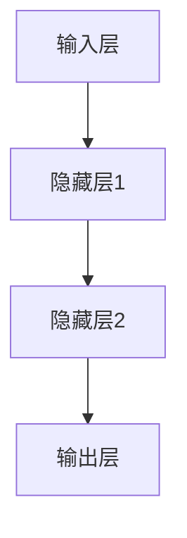

# Deep Learning 原理与代码实战案例讲解

作者：禅与计算机程序设计艺术

## 1. 背景介绍

### 1.1 深度学习的起源与发展

深度学习（Deep Learning）作为机器学习的一个分支，源自于人工神经网络（Artificial Neural Networks, ANN）的理论研究。自20世纪80年代以来，随着计算能力的提升和大数据的普及，深度学习逐渐成为人工智能领域的核心技术。其在图像识别、语音识别、自然语言处理等领域取得了突破性进展。

### 1.2 深度学习的基本概念

深度学习通过构建多层神经网络来自动提取数据的多层次特征。其核心思想是利用大量的训练数据和计算资源，训练出能够进行复杂模式识别和预测的模型。常见的深度学习模型包括卷积神经网络（Convolutional Neural Networks, CNN）、循环神经网络（Recurrent Neural Networks, RNN）和生成对抗网络（Generative Adversarial Networks, GAN）等。

### 1.3 深度学习的应用领域

深度学习的应用领域非常广泛，包括但不限于：

- 图像识别与处理：如自动驾驶、医疗影像分析等。
- 语音识别与合成：如智能助手、语音翻译等。
- 自然语言处理：如文本分类、情感分析、机器翻译等。
- 游戏与娱乐：如AlphaGo、游戏AI等。

## 2. 核心概念与联系

### 2.1 神经网络的基本结构

神经网络由输入层、隐藏层和输出层组成。每一层由若干神经元（Neurons）组成，神经元之间通过权重（Weights）连接。神经网络通过前向传播（Forward Propagation）和反向传播（Backpropagation）来进行训练。



### 2.2 激活函数

激活函数（Activation Function）用于引入非线性，使神经网络能够拟合复杂的函数。常见的激活函数包括：

- Sigmoid 函数：$\sigma(x) = \frac{1}{1 + e^{-x}}$
- ReLU 函数：$f(x) = \max(0, x)$
- Tanh 函数：$tanh(x) = \frac{e^x - e^{-x}}{e^x + e^{-x}}$

### 2.3 损失函数

损失函数（Loss Function）用于衡量模型预测值与真实值之间的差异。常见的损失函数包括均方误差（Mean Squared Error, MSE）和交叉熵损失（Cross-Entropy Loss）。

### 2.4 优化算法

优化算法用于最小化损失函数，从而优化模型参数。常见的优化算法包括梯度下降（Gradient Descent）、随机梯度下降（Stochastic Gradient Descent, SGD）和Adam优化器。

## 3. 核心算法原理具体操作步骤

### 3.1 前向传播

前向传播是指从输入层到输出层的计算过程。每一层的输出是上一层输出的线性变换和激活函数的组合。

$$
z^{(l)} = W^{(l)}a^{(l-1)} + b^{(l)}
$$

$$
a^{(l)} = \sigma(z^{(l)})
$$

其中，$W^{(l)}$ 是第 $l$ 层的权重矩阵，$b^{(l)}$ 是偏置向量，$\sigma$ 是激活函数。

### 3.2 反向传播

反向传播用于计算损失函数相对于每个参数的梯度，并通过梯度下降更新参数。反向传播的核心公式为：

$$
\delta^{(l)} = (W^{(l+1)})^T \delta^{(l+1)} \odot \sigma'(z^{(l)})
$$

$$
\frac{\partial L}{\partial W^{(l)}} = \delta^{(l)} (a^{(l-1)})^T
$$

其中，$\delta^{(l)}$ 是第 $l$ 层的误差项，$\odot$ 表示逐元素相乘。

### 3.3 梯度下降

梯度下降通过沿着损失函数的负梯度方向更新参数。更新公式为：

$$
\theta = \theta - \eta \nabla_\theta J(\theta)
$$

其中，$\theta$ 是模型参数，$\eta$ 是学习率，$J(\theta)$ 是损失函数。

## 4. 数学模型和公式详细讲解举例说明

### 4.1 线性回归

线性回归模型用于预测连续值，其模型形式为：

$$
y = X\beta + \epsilon
$$

其中，$X$ 是输入特征矩阵，$\beta$ 是回归系数，$\epsilon$ 是误差项。通过最小化均方误差来估计$\beta$：

$$
J(\beta) = \frac{1}{2m} \sum_{i=1}^m (y_i - X_i \beta)^2
$$

### 4.2 逻辑回归

逻辑回归用于分类问题，其模型形式为：

$$
P(y=1|X) = \sigma(X\beta)
$$

其中，$\sigma$ 是Sigmoid函数，通过最大化对数似然函数来估计$\beta$：

$$
\ell(\beta) = \sum_{i=1}^m \left[ y_i \log(\sigma(X_i \beta)) + (1 - y_i) \log(1 - \sigma(X_i \beta)) \right]
$$

### 4.3 多层感知机

多层感知机（MLP）是最简单的前馈神经网络，其数学模型为：

$$
a^{(l)} = \sigma(W^{(l)}a^{(l-1)} + b^{(l)})
$$

通过最小化损失函数来训练网络：

$$
J(W, b) = \frac{1}{m} \sum_{i=1}^m L(y_i, \hat{y}_i)
$$

## 5. 项目实践：代码实例和详细解释说明

### 5.1 数据准备

首先，我们需要准备数据集。以MNIST手写数字识别数据集为例：

```python
import tensorflow as tf
from tensorflow.keras.datasets import mnist
from tensorflow.keras.utils import to_categorical

# 加载数据
(x_train, y_train), (x_test, y_test) = mnist.load_data()

# 预处理数据
x_train = x_train.reshape(-1, 28, 28, 1).astype('float32') / 255
x_test = x_test.reshape(-1, 28, 28, 1).astype('float32') / 255
y_train = to_categorical(y_train, 10)
y_test = to_categorical(y_test, 10)
```

### 5.2 构建模型

接下来，我们构建一个简单的卷积神经网络模型：

```python
from tensorflow.keras.models import Sequential
from tensorflow.keras.layers import Conv2D, MaxPooling2D, Flatten, Dense

model = Sequential()
model.add(Conv2D(32, kernel_size=(3, 3), activation='relu', input_shape=(28, 28, 1)))
model.add(MaxPooling2D(pool_size=(2, 2)))
model.add(Flatten())
model.add(Dense(128, activation='relu'))
model.add(Dense(10, activation='softmax'))
```

### 5.3 编译模型

编译模型时，我们需要指定损失函数、优化器和评估指标：

```python
model.compile(loss='categorical_crossentropy',
              optimizer='adam',
              metrics=['accuracy'])
```

### 5.4 训练模型

使用训练数据训练模型：

```python
model.fit(x_train, y_train, batch_size=128, epochs=10, validation_split=0.2)
```

### 5.5 评估模型

使用测试数据评估模型性能：

```python
test_loss, test_acc = model.evaluate(x_test, y_test)
print(f'Test accuracy: {test_acc}')
```

## 6. 实际应用场景

### 6.1 图像识别

深度学习在图像识别中的应用非常广泛，从自动驾驶中的道路标志识别到医疗影像中的病灶检测，深度学习模型都表现出了卓越的性能。

### 6.2 语音识别

语音识别技术已经广泛应用于智能助手、语音翻译等领域。深度学习模型能够处理复杂的语音信号，实现高准确率的语音识别。

### 6.3 自然语言处理

自然语言处理包括文本分类、情感分析、机器翻译