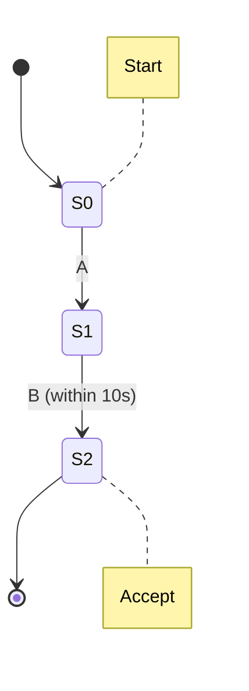

# Flink PatternAPI原理与代码实例讲解

## 1.背景介绍

### 1.1 流式数据处理的重要性

在当今快节奏的数字世界中,数据正以前所未有的速度被生成和消费。从社交媒体活动到物联网设备,再到金融交易,海量的数据源源不断地产生着连续的数据流。有效地处理和分析这些数据流对于及时做出数据驱动的决策至关重要。传统的批处理系统无法满足对实时性的需求,因此流式数据处理应运而生。

Apache Flink是一个开源的分布式流处理框架,被广泛应用于构建实时数据管道、事件驱动应用程序以及批流统一的分析系统。Flink提供了强大的流处理能力,其中PatternAPI是一个非常有用的功能,用于检测和匹配复杂的事件模式。

### 1.2 PatternAPI的作用

PatternAPI允许开发人员在无边界的数据流中指定一个要搜索的模式(Pattern),并对匹配该模式的事件序列执行相应的操作。这种模式匹配功能在许多场景下都有应用,例如:

- 网络入侵检测系统中识别恶意活动模式
- 物联网设备监控中发现异常事件序列
- 电子商务网站中识别用户购买行为模式
- 金融交易系统中检测欺诈性交易模式
- 生产线监控中发现设备故障模式

通过PatternAPI,开发人员可以编写复杂的模式规则,并将其应用于实时数据流,从而实现对关键事件序列的高效检测和处理。

## 2.核心概念与联系  

在深入探讨PatternAPI的原理和使用之前,我们需要先了解几个核心概念及其相互关系。

### 2.1 事件(Event)

在PatternAPI中,数据流被视为一系列不间断的事件。每个事件可以携带任意类型的有效负载数据,例如传感器测量值、网络日志条目或交易记录等。事件通常包含时间戳信息,用于确定其在数据流中的顺序。

### 2.2 模式(Pattern)

模式是一个规则,用于描述我们想要在数据流中搜索和匹配的事件序列。Flink提供了多种模式构建块,可以组合成复杂的模式表达式。例如,我们可以指定一个模式,要求事件A后面紧跟着事件B,或者事件C和事件D之间的时间间隔不超过5秒钟。

### 2.3 模式状态(Pattern State)

为了能够检测复杂的模式,PatternAPI需要跟踪到目前为止匹配的事件序列。这种中间状态被称为模式状态(Pattern State)。模式状态由一个有限状态机(Finite State Machine)来维护,每个状态对应模式的部分匹配情况。

### 2.4 侧输出流(Side Output)

当事件序列与模式完全匹配时,PatternAPI允许将这些匹配事件发送到主输出流或侧输出流。侧输出流可用于将已匹配的复杂事件发送到下游系统进行进一步处理,同时主输出流可以继续处理其他数据。

### 2.5 时间语义

由于数据流是无边界的,因此时间在PatternAPI中扮演着重要角色。Flink支持事件时间和处理时间两种时间语义,前者基于事件自身携带的时间戳,后者基于机器的系统时钟。选择正确的时间语义对于准确检测和处理事件模式至关重要。

上述核心概念相互关联,共同构建了PatternAPI的工作原理。事件流经过模式匹配检测,与模式匹配的事件序列将被发送到侧输出流,同时模式状态会随之更新,以支持连续的模式搜索。时间语义则决定了如何对事件进行正确的排序和窗口划分。

## 3.核心算法原理具体操作步骤

现在,让我们深入探讨PatternAPI的核心算法原理和具体操作步骤。

### 3.1 模式构建

PatternAPI提供了一组模式操作符,用于构建所需的复杂事件模式。这些操作符包括:

- `pattern.begin()`和`pattern.end()`定义模式的开始和结束条件。
- `pattern.next()`指定下一个期望事件。
- `pattern.followedBy()`要求前一个事件后紧跟着指定的事件。
- `pattern.followedByAny()`要求前一个事件后紧跟着任意事件。
- `pattern.where()`添加事件过滤条件。
- `pattern.within()`设置事件之间的最大时间间隔。

通过组合这些操作符,我们可以构建出复杂的模式表达式。例如,下面的代码定义了一个模式,要求事件A后面紧跟着事件B,且两个事件之间的时间间隔不超过10秒钟:

```java
Pattern<Event, ?> pattern = Pattern.<Event>begin("start")
    .next("A")
    .followedBy("B")
    .where(new SimpleCondition<Event>() {
        @Override
        public boolean filter(Event value) throws Exception {
            return value.getId() > 0;
        }
    })
    .within(Time.seconds(10));
```

### 3.2 模式检测

构建好模式表达式后,我们需要将其应用于数据流,以检测匹配的事件序列。PatternAPI提供了`CEP`(Complex Event Processing)算子,用于执行模式匹配操作。

```java
DataStream<Event> input = ...

PatternStream<Event> patternStream = CEP.pattern(input, pattern);
```

在内部,PatternAPI使用有限状态机(Finite State Machine)来跟踪模式的部分匹配情况。每个状态对应模式的一部分,当有新事件到达时,状态机会根据模式规则进行状态转移。如果最终达到接受状态,则表示事件序列与模式完全匹配。

### 3.3 结果处理

一旦检测到匹配的事件序列,我们可以对其执行各种操作,例如输出、转换或进一步处理。PatternAPI提供了`select`和`flatSelect`方法,用于从匹配的事件序列中提取感兴趣的信息。

```java
DataStream<AlertEvent> alerts = patternStream.select(
    new PatternFlatTimeoutFunction<Event, AlertEvent>() {...}
    new PatternFlatSelectFunction<Event, AlertEvent>() {...}
);
```

在上面的示例中,我们使用`select`方法从匹配的事件序列中生成警报事件(AlertEvent)。`PatternFlatTimeoutFunction`用于处理部分匹配的事件序列,而`PatternFlatSelectFunction`则处理完全匹配的情况。

此外,我们还可以使用侧输出流将匹配的事件序列发送到其他下游系统进行进一步处理。

```java
OutputTag<String> outputTag = new OutputTag<String>("side-output"){};

SingleOutputStreamOperator<String> processed = patternStream
    .flatSelect(outputTag, ...);

DataStream<String> sideOutput = processed.getSideOutput(outputTag);
```

通过以上步骤,我们成功地将PatternAPI应用于流式数据,实现了对复杂事件模式的高效检测和处理。

## 4.数学模型和公式详细讲解举例说明

在PatternAPI的内部实现中,有限状态机(Finite State Machine)扮演着核心角色。有限状态机是一种数学计算模型,用于模拟具有有限个状态的动态系统。它由一组有限的状态、输入事件集合、状态转移函数以及一组初始和接受状态组成。

我们可以使用下面的数学表示来形式化地定义一个有限状态机:

$$
M = (Q, \Sigma, \delta, q_0, F)
$$

其中:

- $Q$ 是一个有限的状态集合,表示系统可能处于的所有状态。
- $\Sigma$ 是一个有限的输入字母表,表示可能的输入事件。
- $\delta: Q \times \Sigma \rightarrow Q$ 是状态转移函数,它定义了在给定当前状态和输入事件的情况下,系统将转移到哪个新状态。
- $q_0 \in Q$ 是初始状态,表示系统的起始状态。
- $F \subseteq Q$ 是一个接受状态集合,表示系统可以接受的终止状态。

在PatternAPI中,每个模式都可以表示为一个有限状态机。状态集合$Q$对应模式的部分匹配情况,输入字母表$\Sigma$对应数据流中的事件类型。状态转移函数$\delta$由模式规则定义,它描述了在当前状态和输入事件的情况下,模式匹配应该如何进展。初始状态$q_0$表示模式匹配的起点,而接受状态集合$F$对应完全匹配的终止状态。

让我们以一个具体示例来说明有限状态机在PatternAPI中的应用。假设我们想要检测以下模式:事件A后紧跟着事件B,且两个事件之间的时间间隔不超过10秒钟。我们可以构建如下有限状态机来表示这个模式:



在这个有限状态机中:

- 状态集合为 $Q = \{S_0, S_1, S_2\}$
- 输入字母表为 $\Sigma = \{A, B\}$
- 状态转移函数为:
    - $\delta(S_0, A) = S_1$
    - $\delta(S_1, B) = S_2$ (如果时间间隔在10秒内)
- 初始状态为 $q_0 = S_0$
- 接受状态集合为 $F = \{S_2\}$

当数据流中出现事件A时,有限状态机从初始状态$S_0$转移到$S_1$。如果在10秒内接收到事件B,则状态机将转移到接受状态$S_2$,表示模式匹配成功。否则,状态机将回到初始状态$S_0$,重新开始模式匹配。

通过将模式表示为有限状态机,PatternAPI可以高效地跟踪模式的部分匹配情况,并在达到接受状态时输出匹配的事件序列。这种基于状态机的模式匹配算法保证了高性能和低延迟,使PatternAPI能够在实时数据流上执行复杂的事件处理任务。

## 4.项目实践:代码实例和详细解释说明

为了更好地理解PatternAPI的使用方式,让我们通过一个实际项目案例来探索代码实例。在这个案例中,我们将构建一个简单的网络入侵检测系统,用于监控网络流量并检测可疑的连接模式。

### 4.1 数据源

我们将使用一个模拟的网络流量数据源,其中每个事件代表一个网络连接,包含以下字段:

- `srcIP`: 源IP地址
- `destIP`: 目标IP地址
- `srcPort`: 源端口号
- `destPort`: 目标端口号
- `timestamp`: 连接时间戳

这些数据将被封装为`NetworkConnection`类的对象,并作为数据流的输入源。

### 4.2 模式定义

我们将定义一个模式,用于检测可疑的网络连接序列。具体来说,如果同一个源IP地址在5秒钟内尝试连接3个不同的目标IP地址,则认为这是一种扫描行为,可能存在安全风险。

使用PatternAPI,我们可以按如下方式构建这个模式:

```java
Pattern<NetworkConnection, ?> pattern = Pattern.<NetworkConnection>begin("start")
    .next("first")
    .next("second")
    .next("third")
    .where(new SimpleCondition<NetworkConnection>() {
        @Override
        public boolean filter(NetworkConnection value) throws Exception {
            return value.getSrcIP().equals(firstIP);
        }
    })
    .within(Time.seconds(5));
```

在上面的代码中,我们首先使用`pattern.begin()`定义模式的起点。然后,我们使用三个`pattern.next()`操作符指定需要匹配的连续三个事件。`pattern.where()`用于添加过滤条件,确保这三个事件都来自同一个源IP地址。最后,`pattern.within()`设置了事件之间的最大时间间隔为5秒钟。

### 4.3 模式检测和结果处理

定义好模式后,我们需要将其应用于网络流量数据流,并对匹配的事件序列执行相应的操作。

```java
DataStream<NetworkConnection> connections = env.addSource(new NetworkTrafficSource());

PatternStream<NetworkConnection> patternStream = CEP.pattern(connections, pattern);

DataStream<Alert> alerts = pattern