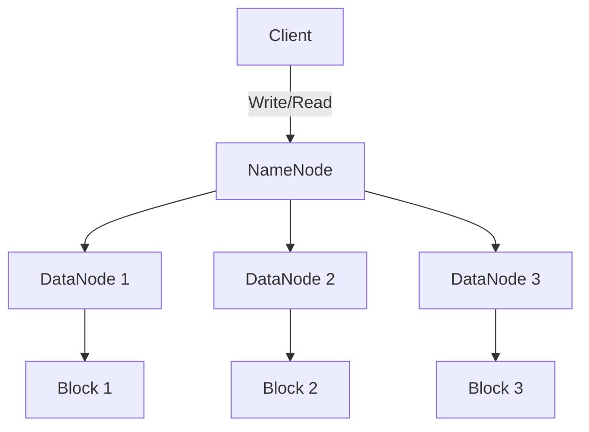
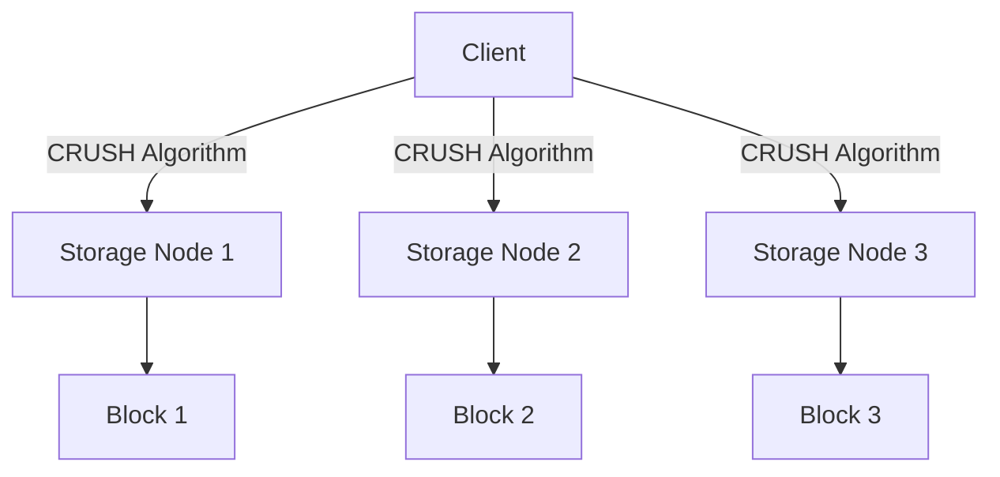
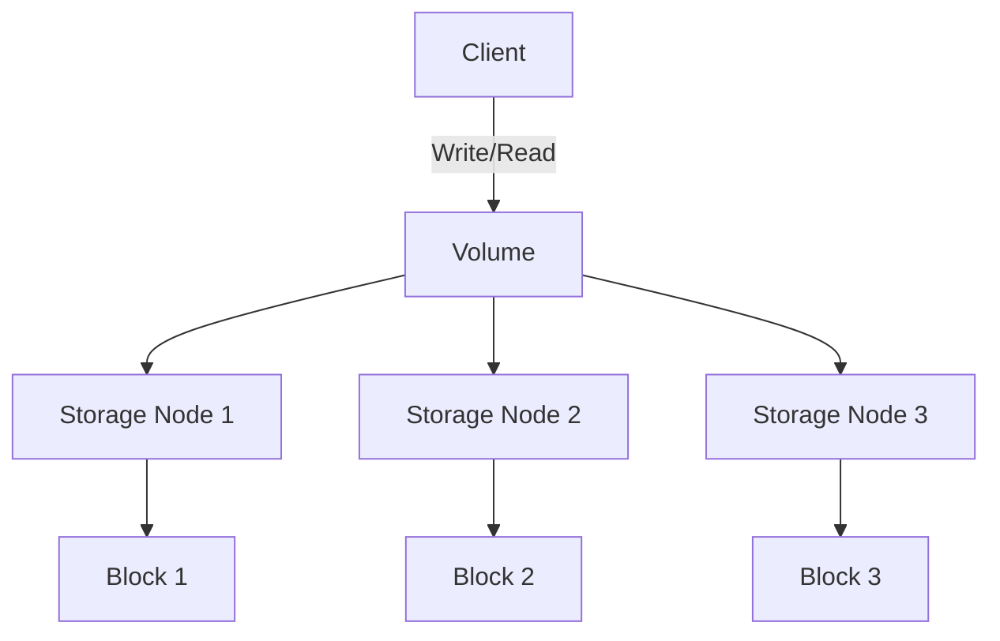

# HDFS与其他分布式文件系统：比较分析与技术选型

作者：禅与计算机程序设计艺术

## 1. 背景介绍

### 1.1 分布式文件系统的兴起

随着大数据时代的到来，数据量呈指数级增长，传统的单机文件系统已经无法满足海量数据存储和处理的需求。分布式文件系统（Distributed File System, DFS）应运而生，通过将数据分散存储在多台机器上，实现高效的存储和管理。

### 1.2 HDFS的诞生

HDFS（Hadoop Distributed File System）是Apache Hadoop项目的一部分，专为大规模数据集的分布式存储而设计。HDFS以其高容错性和高吞吐量的特点，成为大数据存储的首选解决方案。

### 1.3 其他分布式文件系统的出现

除了HDFS，市场上还出现了许多其他分布式文件系统，如Ceph、GlusterFS、Amazon S3、Google File System (GFS)等。这些系统各有特点，适用于不同的应用场景。

## 2. 核心概念与联系

### 2.1 分布式文件系统的基本概念

分布式文件系统通过将文件分块存储在多个节点上，实现数据的分布式存储和管理。其核心概念包括数据分块、数据冗余、元数据管理、数据一致性等。

### 2.2 HDFS的核心概念

HDFS的核心概念包括：

- **NameNode**：负责管理文件系统的元数据和命名空间。
- **DataNode**：负责存储实际的数据块。
- **Block**：HDFS将文件分割成固定大小的数据块进行存储。
- **Replication**：为了提高容错性，HDFS会将每个数据块复制到多个DataNode上。

### 2.3 其他分布式文件系统的核心概念

不同的分布式文件系统在实现细节上有所不同，但其核心概念大致相同。例如：

- **Ceph**：采用CRUSH算法进行数据分布，支持对象存储、块存储和文件系统存储。
- **GlusterFS**：通过扩展卷（Volume）实现数据分布和冗余。
- **Amazon S3**：基于对象存储的分布式文件系统，提供高可用性和高扩展性。
- **Google File System (GFS)**：HDFS的设计灵感来源，采用类似的主从架构。

### 2.4 核心概念的联系

尽管不同分布式文件系统在实现细节上有所不同，但其核心概念和目标是一致的：通过数据分布和冗余实现高效、可靠的数据存储和管理。

## 3. 核心算法原理具体操作步骤

### 3.1 HDFS的架构与工作原理

HDFS采用主从架构，由一个NameNode和多个DataNode组成。其工作原理如下：

1. **文件写入**：客户端将文件分块后，通过NameNode将数据块写入多个DataNode。
2. **数据读取**：客户端向NameNode请求文件的元数据，根据返回的DataNode列表读取数据块。
3. **数据冗余**：每个数据块会被复制到多个DataNode，以提高容错性。

以下是HDFS的架构图：



### 3.2 Ceph的架构与工作原理

Ceph采用无中心化的架构，通过CRUSH算法进行数据分布和冗余。其工作原理如下：

1. **数据存储**：客户端通过CRUSH算法计算数据块的存储位置，直接将数据写入对应的存储节点。
2. **数据读取**：客户端通过CRUSH算法计算数据块的位置，直接从存储节点读取数据。
3. **数据冗余**：通过CRUSH算法实现数据的分布和冗余，提高容错性。

以下是Ceph的架构图：



### 3.3 GlusterFS的架构与工作原理

GlusterFS采用无中心化的架构，通过扩展卷（Volume）实现数据分布和冗余。其工作原理如下：

1. **数据存储**：客户端将数据写入卷，GlusterFS会自动将数据分布到多个存储节点。
2. **数据读取**：客户端从卷中读取数据，GlusterFS会自动从对应的存储节点获取数据。
3. **数据冗余**：通过卷的配置实现数据的分布和冗余，提高容错性。

以下是GlusterFS的架构图：



## 4. 数学模型和公式详细讲解举例说明

### 4.1 数据分布模型

分布式文件系统的核心在于数据的分布和冗余。以HDFS为例，其数据分布模型可以用以下公式表示：

$$
D = \{B_1, B_2, \ldots, B_n\}
$$

其中 $D$ 表示文件，$B_i$ 表示文件的第 $i$ 个数据块。

### 4.2 数据冗余模型

为了提高容错性，HDFS会将每个数据块复制到多个DataNode上。其数据冗余模型可以用以下公式表示：

$$
R(B_i) = \{D_1, D_2, \ldots, D_m\}
$$

其中 $R(B_i)$ 表示数据块 $B_i$ 的副本集合，$D_j$ 表示存储数据块 $B_i$ 的第 $j$ 个DataNode。

### 4.3 CRUSH算法

Ceph采用CRUSH算法进行数据分布和冗余。CRUSH算法的核心思想是通过哈希函数计算数据块的存储位置。其公式如下：

$$
P(B_i) = \text{CRUSH}(B_i, \text{ClusterMap})
$$

其中 $P(B_i)$ 表示数据块 $B_i$ 的存储位置，$\text{ClusterMap}$ 表示集群的拓扑结构。

### 4.4 数据一致性模型

分布式文件系统需要保证数据的一致性。以HDFS为例，其数据一致性模型可以用以下公式表示：

$$
C(D) = \forall B_i \in D, R(B_i) \text{ is consistent}
$$

其中 $C(D)$ 表示文件 $D$ 的一致性，$R(B_i)$ 表示数据块 $B_i$ 的副本集合。

## 5. 项目实践：代码实例和详细解释说明

### 5.1 HDFS的基本操作

以下是使用HDFS进行基本操作的代码示例：

#### 5.1.1 文件写入

```java
import org.apache.hadoop.conf.Configuration;
import org.apache.hadoop.fs.FileSystem;
import org.apache.hadoop.fs.Path;
import java.io.BufferedWriter;
import java.io.OutputStreamWriter;

public class HDFSWriteExample {
    public static void main(String[] args) throws Exception {
        Configuration conf = new Configuration();
        FileSystem fs = FileSystem.get(conf);
        Path path = new Path("/user/hadoop/example.txt");
        BufferedWriter br = new BufferedWriter(new OutputStreamWriter(fs.create(path, true)));
        br.write("Hello, HDFS!");
        br.close();
    }
}
```

#### 5.1.2 文件读取

```java
import org.apache.hadoop.conf.Configuration;
import org.apache.hadoop.fs.FileSystem;
import org.apache.hadoop.fs.Path;
import java.io.BufferedReader;
import java.io.InputStreamReader;

public class HDFSReadExample {
    public static void main(String[] args) throws Exception {
        Configuration conf = new Configuration();
        FileSystem fs = FileSystem.get(conf);
        Path path = new Path("/user/hadoop/example.txt");
        BufferedReader br = new BufferedReader(new InputStreamReader(fs.open(path)));
        String line;
        while ((line = br.readLine()) != null) {
            System.out.println(line);
        }
        br.close();
    }
}
