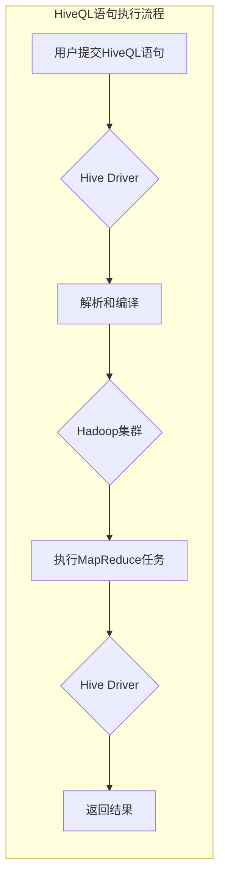

# HiveQL未来发展趋势和挑战

作者：禅与计算机程序设计艺术

## 1. 背景介绍

### 1.1 大数据时代的来临

近年来，随着互联网、物联网等技术的快速发展，全球数据量呈现爆炸式增长，人类社会已经步入大数据时代。海量数据的出现，为各行各业带来了前所未有的机遇和挑战，如何高效地存储、处理和分析这些数据，成为企业和研究机构面临的重要课题。

### 1.2 Hive的诞生与发展

为了应对大数据带来的挑战，Google率先提出了MapReduce编程模型，并开发了Hadoop分布式计算平台。Hadoop的出现，极大地降低了大数据处理的门槛，但MapReduce编程模型的复杂性，使得普通用户难以直接使用Hadoop进行数据分析。为了解决这一问题，Facebook开发了Hive数据仓库系统，Hive提供了一种类似于SQL的查询语言HiveQL，用户可以使用熟悉的SQL语法进行数据分析，而无需了解底层的MapReduce实现细节。

Hive的出现，极大地简化了大数据分析的流程，降低了大数据分析的技术门槛，使得更多的人能够参与到大数据分析的浪潮中来。随着大数据应用的不断深入，Hive也在不断发展和完善，其功能和性能都得到了极大的提升。

## 2. 核心概念与联系

### 2.1 HiveQL语言基础

HiveQL是Hive提供的一种类似于SQL的查询语言，它支持大部分SQL语法，例如：SELECT、FROM、WHERE、GROUP BY、ORDER BY、JOIN等。HiveQL语句会被Hive编译器转换成一系列的MapReduce任务，并在Hadoop集群上执行。

**HiveQL与SQL的主要区别：**

* HiveQL不支持行级操作，例如：UPDATE、DELETE等。
* HiveQL不支持事务，所有操作都是批处理操作。
* HiveQL的执行效率相对较低，因为它需要将查询语句转换成MapReduce任务，并在Hadoop集群上执行。

### 2.2 Hive数据模型

Hive的数据模型主要包括：数据库、表、分区、桶等。

* **数据库：** Hive中的数据库是一个逻辑概念，它用于组织表。
* **表：** Hive中的表类似于关系型数据库中的表，它由行和列组成。
* **分区：** Hive中的分区是将表的数据按照某个字段的值进行划分，例如：可以按照日期对数据进行分区，这样可以提高查询效率。
* **桶：** Hive中的桶是将表的数据按照某个字段的哈希值进行划分，这样可以提高查询效率。

### 2.3 Hive架构

Hive的架构主要包括：

* **Hive Client：** Hive客户端，用户可以通过Hive Client提交HiveQL语句。
* **Hive Metastore：** Hive元数据存储，存储Hive的元数据信息，例如：数据库、表、分区、桶等信息。
* **Hive Driver：** Hive驱动器，负责接收HiveQL语句，并将其转换成MapReduce任务。
* **Hadoop集群：** Hive的底层计算平台，负责执行MapReduce任务。

## 3. 核心算法原理具体操作步骤

### 3.1 HiveQL语句执行流程

HiveQL语句的执行流程如下：

1. 用户通过Hive Client提交HiveQL语句。
2. Hive Driver接收HiveQL语句，并对其进行解析和编译，生成一系列的MapReduce任务。
3. Hive Driver将MapReduce任务提交到Hadoop集群上执行。
4. Hadoop集群执行MapReduce任务，并将结果返回给Hive Driver。
5. Hive Driver将结果返回给Hive Client。

### 3.2 Hive数据存储格式

Hive支持多种数据存储格式，例如：TEXTFILE、SEQUENCEFILE、ORC、PARQUET等。

* **TEXTFILE：** 文本文件格式，每行存储一条记录，默认的分隔符是制表符。
* **SEQUENCEFILE：** 序列文件格式，以键值对的形式存储数据。
* **ORC：** Optimized Row Columnar，列式存储格式，可以提高查询效率。
* **PARQUET：** 列式存储格式，可以提高查询效率。

### 3.3 Hive数据压缩

Hive支持多种数据压缩算法，例如：GZIP、BZIP2、SNAPPY等。

* **GZIP：** 压缩率较高，但压缩速度较慢。
* **BZIP2：** 压缩率更高，但压缩速度更慢。
* **SNAPPY：** 压缩率较低，但压缩速度很快。

## 4. 数学模型和公式详细讲解举例说明

### 4.1 数据倾斜问题

数据倾斜是指MapReduce程序执行过程中，某些Reduce任务处理的数据量远远大于其他Reduce任务，导致程序执行时间过长的问题。

**数据倾斜的原因：**

* **数据本身的特性：** 例如，某些用户的访问量远远大于其他用户。
* **Join操作：** 例如，两个表进行Join操作时，如果Join Key的分布不均匀，就会导致数据倾斜。

**数据倾斜的解决方案：**

* **数据预处理：** 例如，对数据进行抽样、过滤等操作，使数据的分布更加均匀。
* **调整参数：** 例如，增加Reduce任务的数量、调整MapReduce程序的参数等。
* **使用其他工具：** 例如，使用Spark、Flink等计算引擎处理数据。

## 5. 项目实践：代码实例和详细解释说明

### 5.1 创建Hive表

```sql
CREATE TABLE user_info (
  user_id INT,
  user_name STRING,
  age INT,
  gender STRING
)
ROW FORMAT DELIMITED
FIELDS TERMINATED BY ','
STORED AS TEXTFILE;
```

**代码解释：**

* `CREATE TABLE user_info`：创建名为user_info的表。
* `user_id INT`：定义user_id字段为INT类型。
* `user_name STRING`：定义user_name字段为STRING类型。
* `age INT`：定义age字段为INT类型。
* `gender STRING`：定义gender字段为STRING类型。
* `ROW FORMAT DELIMITED`：指定行分隔符。
* `FIELDS TERMINATED BY ','`：指定字段分隔符为逗号。
* `STORED AS TEXTFILE`：指定数据存储格式为TEXTFILE。

### 5.2 数据导入

```sql
LOAD DATA LOCAL INPATH '/path/to/user_info.txt' INTO TABLE user_info;
```

**代码解释：**

* `LOAD DATA LOCAL INPATH '/path/to/user_info.txt'`：指定要导入的数据文件路径。
* `INTO TABLE user_info`：指定要导入数据的表名。

### 5.3 数据查询

```sql
SELECT * FROM user_info;
```

**代码解释：**

* `SELECT *`：查询所有字段。
* `FROM user_info`：指定要查询的表名。

## 6. 实际应用场景

### 6.1 数据仓库

Hive可以作为数据仓库，用于存储和分析企业的海量数据，例如：用户行为数据、交易数据、日志数据等。

### 6.2 ETL工具

Hive可以作为ETL工具，用于从不同的数据源中抽取、转换和加载数据，例如：可以将关系型数据库中的数据导入到Hive中。

### 6.3 数据挖掘

Hive可以作为数据挖掘平台，用于进行数据分析和挖掘，例如：可以使用Hive进行用户画像、商品推荐等。

## 7. 总结：未来发展趋势与挑战

### 7.1 未来发展趋势

* **与云计算平台深度整合：** 随着云计算技术的不断发展，Hive将会与云计算平台进行更加深度地整合，例如：与AWS、Azure、阿里云等云平台进行集成。
* **支持更多的数据源：** Hive将会支持更多的数据源，例如：NoSQL数据库、消息队列等。
* **性能优化：** Hive的性能将会得到进一步的优化，例如：支持更快的查询引擎、更优的数据存储格式等。

### 7.2 面临的挑战

* **与其他大数据技术融合：** Hive需要与其他大数据技术进行更加紧密地融合，例如：Spark、Flink等。
* **安全性和可靠性：** 随着Hive应用的不断深入，安全性和可靠性问题将会变得越来越重要。
* **人才短缺：** Hive技术人才的短缺，将会制约Hive的进一步发展。

## 8. 附录：常见问题与解答

### 8.1 Hive和Spark的区别是什么？

Hive和Spark都是大数据处理引擎，但它们之间也有一些区别：

* **处理方式：** Hive是基于MapReduce的批处理引擎，而Spark是基于内存的迭代计算引擎。
* **性能：** Spark的性能通常比Hive更高，因为它支持内存计算。
* **易用性：** Hive的SQL语法更加简单易用，而Spark的API更加灵活。

### 8.2 Hive如何进行性能优化？

Hive的性能优化可以从以下几个方面入手：

* **数据存储格式：** 选择合适的的数据存储格式，例如：ORC、PARQUET等。
* **数据压缩：** 对数据进行压缩，可以减少磁盘IO和网络传输。
* **表分区和分桶：** 对表进行分区和分桶，可以提高查询效率。
* **Hive参数调优：** 调整Hive的参数，例如：MapReduce任务的数量、内存大小等。

### 8.3 Hive有哪些常用的函数？

Hive提供了丰富的内置函数，例如：

* **字符串函数：** length、substring、concat等。
* **日期函数：** year、month、day、hour等。
* **数学函数：** abs、round、ceil、floor等。
* **聚合函数：** count、sum、avg、max、min等。

##  Mermaid流程图



##  总结

HiveQL作为一种SQL-like查询语言，极大地简化了大数据分析的流程，降低了大数据分析的技术门槛。随着大数据应用的不断深入，Hive也在不断发展和完善，其功能和性能都得到了极大的提升。未来，Hive将会与云计算平台进行更加深度地整合，支持更多的数据源，性能也会得到进一步的优化。但同时，Hive也面临着与其他大数据技术融合、安全性和可靠性、人才短缺等挑战。