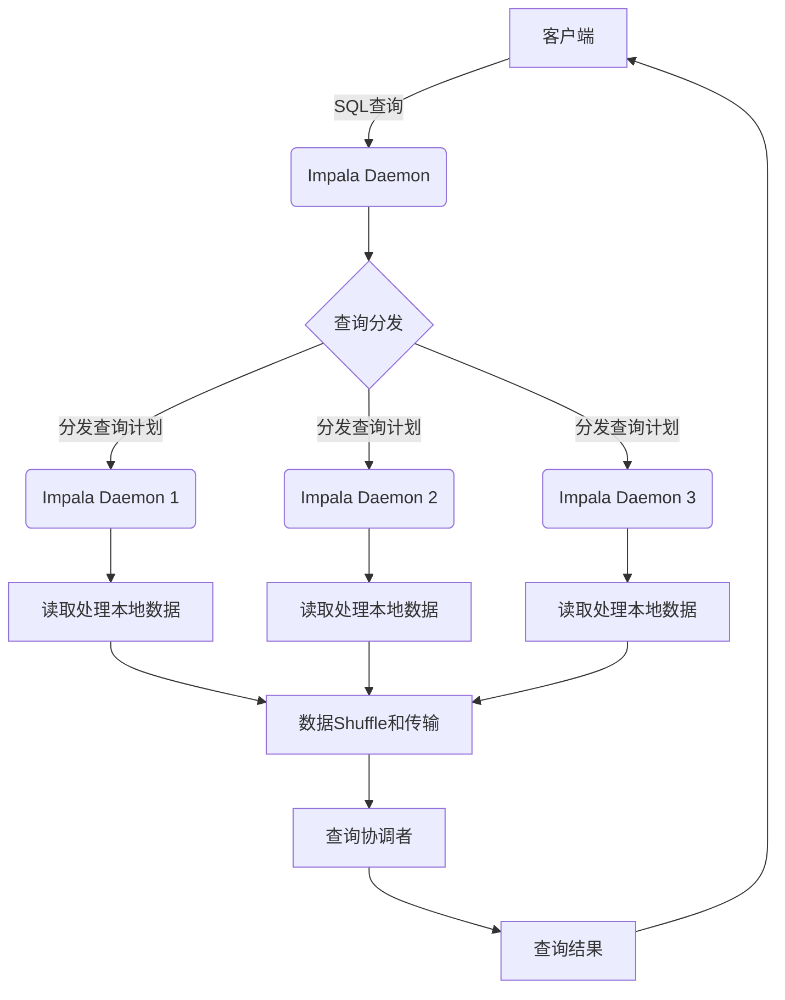
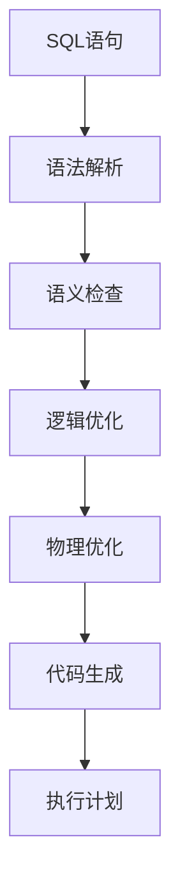
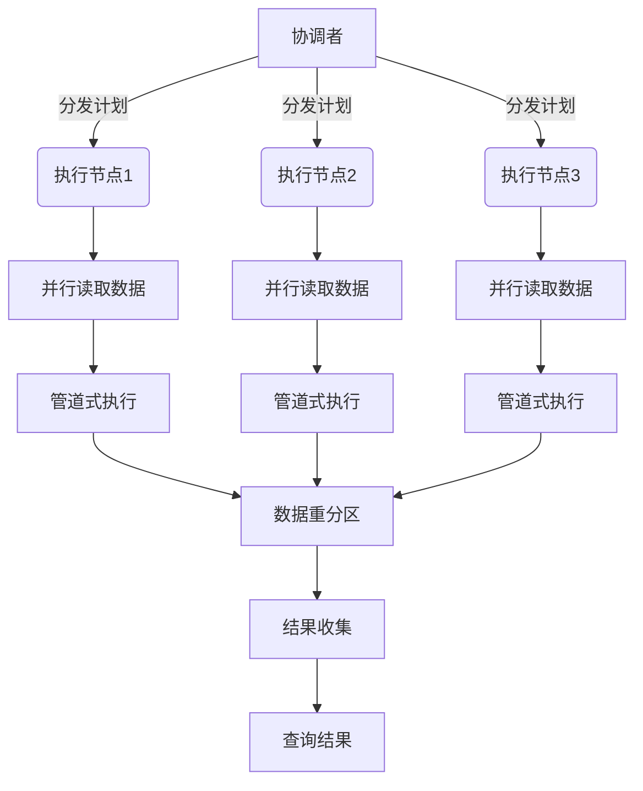
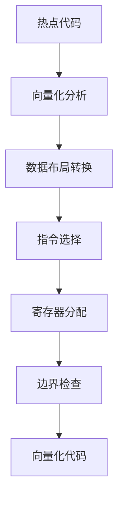
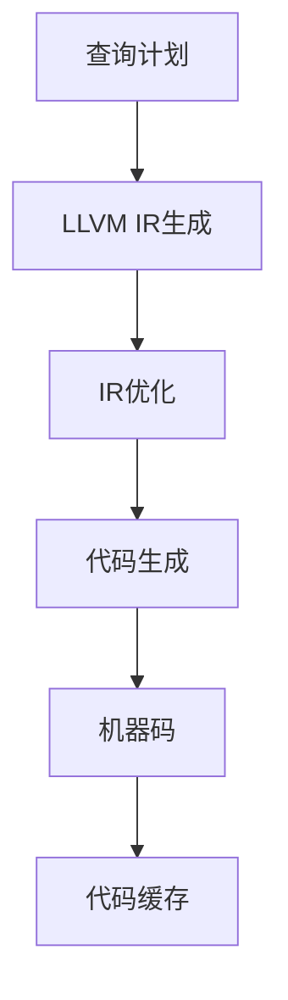

# Impala原理与代码实例讲解

## 1.背景介绍

### 1.1 什么是Impala

Impala是Cloudera公司开发的开源的大数据分析查询引擎,专门针对存储在Apache Hadoop集群中的数据进行快速的低延迟的SQL查询。它利用了分布式并行处理框架和内存计算技术,能够快速地查询和分析存储在Hadoop集群中的海量数据。

### 1.2 Impala的优势

- **高性能**:Impala使用了大量的编码优化技术,如代码向量化、循环代码展开等,充分利用现代CPU的SIMD指令集,实现了高性能的并行查询。
- **低延迟**:Impala在查询时直接从HDFS读取数据到内存进行处理,无需先加载数据,避免了数据加载的延迟。同时它采用了延迟材料化视图技术,加快了查询速度。
- **SQL支持**:Impala使用类SQL语法,支持大多数标准SQL语法,易于数据分析师使用。
- **高并发**:Impala采用了全新的查询执行架构,使用分布式查询执行引擎,支持高并发查询。
- **容错性**:Impala可以在节点失败时自动重试和故障转移,提供了较好的容错能力。

### 1.3 Impala的应用场景

- 交互式数据分析:Impala适合交互式的数据探索和分析,如商业智能、数据挖掘等。
- 实时数据查询:Impala可以对最新加载的数据进行低延迟查询,支持准实时数据分析。
- 大数据ETL:Impala可以高效地进行数据转换和处理,用于构建大数据ETL管道。

## 2.核心概念与联系

### 2.1 Impala的架构

Impala采用了全新的分布式查询执行架构,主要由以下三个组件组成:

1. **Impala Daemon(impalad)**:运行在每个数据节点上,负责读取和处理存储在本地的数据文件。
2. **StateStore**:一个轻量级进程,用于监控集群的运行状态,并将状态信息广播给所有impalad。
3. **Catalog Server**:存储Impala元数据,如表、列、分区等信息。

Impala查询的执行流程如下:

1. 客户端通过impalad发起SQL查询。
2. 查询被分发到所有参与查询的impalad执行。
3. 每个impalad读取和处理本地数据文件,执行查询计划中分配的工作。
4. 查询结果通过网络进行shuffle和传输。
5. 查询协调者收集所有impalad的结果并返回给客户端。



### 2.2 Impala内存模型

Impala采用了全新的内存管理模型,充分利用现代硬件的大内存和多核CPU,实现高效的内存计算。主要包括以下几个部分:

1. **Buffer Pool**:用于缓存读取的HDFS数据块,避免重复读取。
2. **Query对象池**:缓存查询执行期间生成的对象,避免频繁GC。
3. **Stream缓存**:缓存中间查询结果数据流,用于数据传输。
4. **Scratch空间**:临时磁盘空间,用于溢写内存不够时的数据。

### 2.3 Impala文件格式

Impala可以直接查询常见的列式存储文件格式,如Parquet、ORC等,充分利用了列式存储的特性进行高效查询。同时它也支持行式存储格式如TextFile。Impala会根据文件格式自动选择合适的读取和解析方式。

### 2.4 Impala SQL

Impala使用了类SQL语法,支持绝大部分标准SQL语法,如DDL、DML、查询等。同时它也提供了一些Impala特有的语法扩展,如COMPUTE STATS、INVALIDATE METADATA等,用于优化查询性能。

## 3.核心算法原理具体操作步骤  

### 3.1 查询编译和优化

Impala在执行SQL查询时,首先需要将SQL语句编译成分布式执行计划。编译优化主要包括以下几个步骤:

1. **语法解析**:使用ANTLR解析SQL语句,构建语法树。
2. **语义检查**:基于元数据检查语句的语义正确性。
3. **逻辑优化**:对查询语句进行一系列等价变换,如谓词下推、投影剪裁等。
4. **物理优化**:为逻辑计划选择高效的物理执行策略,如Join顺序优化。
5. **代码生成**:将优化后的物理计划翻译成高效的执行代码。



### 3.2 并行查询执行

Impala采用了全新的分布式并行查询执行引擎,充分利用集群的计算资源,实现高效的并行查询。

1. **查询分发**:协调者将查询计划分发给所有参与的执行节点。
2. **并行读取**:每个执行节点并行读取和处理本地数据文件。
3. **管道式执行**:查询计划通过构建执行管道,使上下游操作者能够并行处理数据。
4. **数据重分区**:在Join、Group By等操作时,需要对数据进行重新分区。
5. **结果收集**:协调者收集所有执行节点的结果并返回给客户端。



### 3.3 代码向量化

Impala在代码生成阶段会对热点代码路径进行向量化优化,利用CPU的SIMD指令集实现数据级并行,大幅提升了查询性能。

向量化的基本思路是将标量操作替换为向量操作,一次处理多个数据元素。主要包括以下几个步骤:

1. **向量化分析**:分析代码中可以向量化的热点代码路径。
2. **数据布局转换**:将标量数据转换为SIMD寄存器可处理的向量布局。
3. **指令选择**:根据操作类型选择合适的SIMD指令。
4. **寄存器分配**:分配SIMD寄存器,尽量复用寄存器避免内存访问。
5. **边界检查**:处理输入数据不足SIMD宽度的边界情况。



### 3.4 代码生成技术

Impala采用了LLVM作为代码生成框架,通过JIT编译技术生成高度优化的机器码,实现高效的查询执行。

1. **LLVM IR生成**:根据查询计划生成LLVM中间表示(IR)。
2. **IR优化**:对IR进行一系列传统编译优化,如常量折叠、死码消除等。
3. **代码生成**:LLVM将优化后的IR编译成机器码。
4. **代码缓存**:生成的机器码会被缓存,避免重复编译。



## 4.数学模型和公式详细讲解举例说明

在查询优化和执行过程中,Impala使用了多种数学模型和算法,下面我们详细介绍其中的几种。

### 4.1 代价模型

Impala使用基于代价的优化器(CBO)为查询选择最优的执行计划。代价模型用于估算每个候选执行计划的代价,包括CPU、IO、内存和网络开销等。

假设有一个表T,表的大小为|T|,查询需要扫描的行数为|T|*sf,sf为选择率。如果使用全表扫描,则代价为:

$$
Cost(FullScan) = \alpha * |T|
$$

其中$\alpha$是读取单位数据的代价常数。

如果使用索引扫描,假设索引大小为|Idx|,则代价为:

$$
Cost(IndexScan) = \beta * |Idx| + \gamma * |T| * sf
$$

其中$\beta$是读取索引的代价常数,$\gamma$是根据索引读取数据的代价常数。

优化器会比较两种方案的代价,选择代价更小的执行计划。

### 4.2 数据重分区

在执行Join、Group By等操作时,往往需要对数据进行重新分区(Repartition),以实现更高效的数据shuffle。Impala采用了基于散列的数据分区算法。

假设有N个执行节点,对于一个待分区的数据块,我们可以使用散列函数计算其分区号:

$$
Partition(key) = hash(key) \% N
$$

其中hash可以使用高效的非加密散列算法,如MurmurHash。

对于需要分区的数据流,可以使用上述公式将数据划分到不同的分区中,再通过网络传输到对应的执行节点进行下游处理。

### 4.3 Bloom Filter

Impala在处理Join和Semi-Join等操作时,会使用Bloom Filter来减少不必要的数据传输,提高查询效率。

Bloom Filter是一种空间高效的概率数据结构,用于快速判断一个元素是否属于集合。其基本思想是使用k个不同的哈希函数对集合元素进行哈希映射,并将结果存储在一个位向量中。

对于一个大小为m的位向量,k个哈希函数,集合S中的元素x,判断x是否属于S的过程如下:

1. 计算x经过k个哈希函数映射后的k个位置:
   $$ 
   f_1(x), f_2(x), \dots, f_k(x)
   $$
2. 检查位向量中这k个位置是否全为1,如果有任意一个为0,则x肯定不在S中。
3. 如果全为1,则x可能在S中,但有一定的错误率。

Bloom Filter的关键在于选择合适的m和k,以平衡空间开销和错误率。

## 4.项目实践:代码实例和详细解释说明

接下来我们通过一些代码示例,展示如何使用Impala进行数据分析查询。

### 4.1 创建表

使用Impala的CREATE TABLE语句可以创建新表。以下示例在Impala中创建一个名为sales的Parquet表:

```sql
CREATE TABLE sales (
  product_id INT,
  sale_date STRING,
  price FLOAT,
  quantity INT
) 
PARTITIONED BY (region STRING)
STORED AS PARQUET;
```

该语句创建了一个四列的表sales,其中region列将作为分区列。表的数据将以Parquet列式存储格式保存在HDFS上。

### 4.2 加载数据

可以使用LOAD DATA语句将数据导入Impala表中:

```sql
LOAD DATA INPATH '/user/impala/sales/2023/part-m-00001.snappy.parquet' 
INTO TABLE sales PARTITION (region='US');
```

该语句将HDFS路径下的Parquet文件加载到sales表的US分区中。Impala支持多种文件格