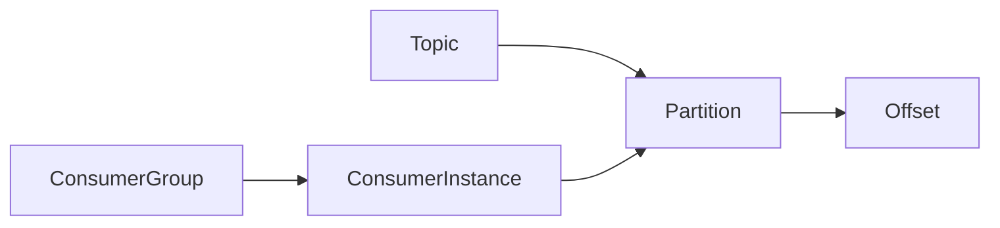

# Kafka代码实例：消费者API详解

作者：禅与计算机程序设计艺术

## 1. 背景介绍

### 1.1 消息队列与Kafka

在现代分布式系统中，消息队列已经成为不可或缺的基础组件。它能够有效地解耦系统模块、异步处理消息、提高系统吞吐量和可扩展性。Kafka作为一款高吞吐量、低延迟、持久化的消息队列，在实时数据流处理、日志收集、事件驱动架构等领域得到广泛应用。

### 1.2 Kafka消费者API概述

Kafka消费者API提供了丰富的功能，允许应用程序从Kafka主题中读取消息。它支持多种消费模式，例如：

* **单消费者:**  单个消费者实例从单个分区中消费消息。
* **消费者组:** 多个消费者实例组成一个组，共同消费一个主题的所有分区。
* **手动提交偏移量:**  应用程序可以手动控制消息的消费进度。
* **自动提交偏移量:**  Kafka自动跟踪消息的消费进度。

## 2. 核心概念与联系

### 2.1 主题(Topic)

Kafka的消息通过主题进行分类和存储。主题可以被多个生产者写入消息，也可以被多个消费者读取消息。

### 2.2 分区(Partition)

为了提高吞吐量和可扩展性，Kafka将主题划分为多个分区。每个分区都是一个有序的消息队列。

### 2.3 偏移量(Offset)

每个分区中的消息都有一个唯一的偏移量，用于标识消息在分区中的位置。消费者通过维护消费的偏移量来跟踪消息的消费进度。

### 2.4 消费者组(Consumer Group)

消费者组是多个消费者实例的逻辑分组，它们共同消费一个主题的所有分区。每个分区只会被同一个消费者组中的一个消费者实例消费。

### 2.5 消费者实例(Consumer Instance)

消费者实例是实际从Kafka主题中读取消息的应用程序。

### 2.6 关系图



## 3. 核心算法原理具体操作步骤

### 3.1 创建消费者实例

```java
Properties props = new Properties();
props.put("bootstrap.servers", "localhost:9092");
props.put("group.id", "my-group");
props.put("key.deserializer", "org.apache.kafka.common.serialization.StringDeserializer");
props.put("value.deserializer", "org.apache.kafka.common.serialization.StringDeserializer");
KafkaConsumer<String, String> consumer = new KafkaConsumer<>(props);
```

### 3.2 订阅主题

```java
consumer.subscribe(Collections.singletonList("my-topic"));
```

### 3.3 拉取消息

```java
ConsumerRecords<String, String> records = consumer.poll(Duration.ofMillis(100));
```

### 3.4 处理消息

```java
for (ConsumerRecord<String, String> record : records) {
  System.out.printf("offset = %d, key = %s, value = %s%n", record.offset(), record.key(), record.value());
}
```

### 3.5 提交偏移量

```java
consumer.commitSync();
```

## 4. 数学模型和公式详细讲解举例说明

Kafka消费者API不涉及复杂的数学模型和公式。

## 5. 项目实践：代码实例和详细解释说明

### 5.1 示例代码

```java
import org.apache.kafka.clients.consumer.ConsumerConfig;
import org.apache.kafka.clients.consumer.ConsumerRecord;
import org.apache.kafka.clients.consumer.ConsumerRecords;
import org.apache.kafka.clients.consumer.KafkaConsumer;
import org.apache.kafka.common.serialization.StringDeserializer;

import java.time.Duration;
import java.util.Collections;
import java.util.Properties;

public class KafkaConsumerExample {

    public static void main(String[] args) {
        // 设置消费者配置
        Properties props = new Properties();
        props.put(ConsumerConfig.BOOTSTRAP_SERVERS_CONFIG, "localhost:9092");
        props.put(ConsumerConfig.GROUP_ID_CONFIG, "my-group");
        props.put(ConsumerConfig.KEY_DESERIALIZER_CLASS_CONFIG, StringDeserializer.class.getName());
        props.put(ConsumerConfig.VALUE_DESERIALIZER_CLASS_CONFIG, StringDeserializer.class.getName());

        // 创建消费者实例
        KafkaConsumer<String, String> consumer = new KafkaConsumer<>(props);

        // 订阅主题
        consumer.subscribe(Collections.singletonList("my-topic"));

        // 拉取并处理消息
        try {
            while (true) {
                ConsumerRecords<