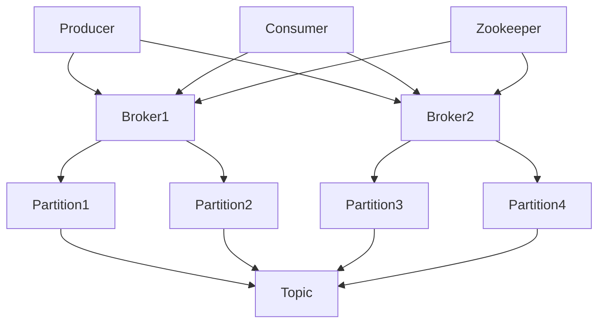

# Kafka挑战与应对：海量数据与高并发

作者：禅与计算机程序设计艺术

## 1. 背景介绍

### 1.1 大数据时代的挑战

在大数据时代，数据的生成速度和规模都达到了前所未有的高度。无论是社交媒体、物联网设备还是企业内部系统，都在不断地产生海量数据。这些数据不仅需要被快速处理，还需要在高并发的环境下保持稳定和高效。传统的数据处理系统在面对如此巨大的数据量和并发请求时，往往显得力不从心。

### 1.2 Kafka的诞生

为了应对这些挑战，Apache Kafka应运而生。Kafka由LinkedIn开发，并于2011年开源，它是一种分布式流处理平台，旨在处理高吞吐量、低延迟的数据流。Kafka的设计理念是提供一个统一、高吞吐量、低延迟的平台，用于处理实时数据流。

### 1.3 Kafka的应用场景

Kafka广泛应用于日志收集、实时分析、数据流处理、事件驱动架构等场景。其核心优势在于高吞吐量、可扩展性和可靠性，使其成为处理海量数据和高并发请求的理想选择。

## 2. 核心概念与联系

### 2.1 Kafka的基本架构

Kafka的架构主要包括以下几个核心组件：

- **Producer**：生产者，负责将数据发布到Kafka集群。
- **Consumer**：消费者，从Kafka集群中读取数据。
- **Broker**：Kafka服务器，负责数据的存储和传输。
- **Topic**：主题，数据的分类单元。
- **Partition**：分区，每个主题可以分为多个分区，以实现并行处理。
- **Zookeeper**：用于协调和管理Kafka集群的元数据。



### 2.2 数据流模型

Kafka的数据流模型包括以下几个步骤：

1. **数据生产**：Producer将数据发布到指定的Topic。
2. **数据存储**：Broker将数据存储在对应的Partition中。
3. **数据消费**：Consumer从指定的Partition中读取数据。

### 2.3 高可用性和容错机制

Kafka通过复制机制实现高可用性和容错性。每个Partition可以配置多个副本，其中一个为Leader，其余为Follower。当Leader不可用时，Follower会自动提升为新的Leader，以确保数据的可用性和一致性。

## 3. 核心算法原理具体操作步骤

### 3.1 数据生产和消费

#### 3.1.1 数据生产

Producer将数据发送到Kafka集群的具体步骤如下：

1. **连接Kafka集群**：Producer首先需要连接到Kafka集群。
2. **选择Topic和Partition**：Producer选择要发布数据的Topic和Partition。
3. **发送数据**：Producer将数据发送到指定的Partition。
4. **确认发送**：Kafka集群确认数据已成功接收。

#### 3.1.2 数据消费

Consumer从Kafka集群读取数据的具体步骤如下：

1. **连接Kafka集群**：Consumer首先需要连接到Kafka集群。
2. **订阅Topic**：Consumer订阅指定的Topic。
3. **拉取数据**：Consumer从指定的Partition中拉取数据。
4. **处理数据**：Consumer处理拉取到的数据。

### 3.2 数据存储和复制

#### 3.2.1 数据存储

Kafka使用分区日志的方式存储数据，每个Partition对应一个日志文件。数据以顺序写入的方式存储，保证了高效的写入性能。

#### 3.2.2 数据复制

Kafka通过复制机制实现数据的高可用性。每个Partition可以配置多个副本，其中一个为Leader，其余为Follower。数据写入时，首先写入Leader，然后同步到Follower。

### 3.3 高并发处理

#### 3.3.1 分区机制

Kafka通过分区机制实现高并发处理。每个Topic可以分为多个Partition，Producer可以并行地将数据写入不同的Partition，Consumer也可以并行地从不同的Partition中读取数据。

#### 3.3.2 消费者组

Kafka引入了消费者组的概念，以实现高并发的消费模式。每个消费者组中的多个Consumer可以并行地消费一个Topic的不同Partition，从而提高消费的并发性和效率。

## 4. 数学模型和公式详细讲解举例说明

### 4.1 分区选择算法

Kafka的Producer在发送数据时，需要选择将数据发送到哪个Partition。常见的分区选择算法包括轮询算法和哈希算法。

#### 4.1.1 轮询算法

轮询算法是一种简单的分区选择算法，Producer按照顺序将数据依次发送到不同的Partition。假设有 $n$ 个Partition，当前数据发送到第 $i$ 个Partition，则下一个数据发送到第 $(i+1) \mod n$ 个Partition。

$$
P_{next} = (P_{current} + 1) \mod n
$$

#### 4.1.2 哈希算法

哈希算法根据数据的Key计算哈希值，然后将哈希值对Partition数取模，得到目标Partition。假设数据的Key为 $k$，哈希函数为 $H(k)$，有 $n$ 个Partition，则目标Partition为：

$$
P_{target} = H(k) \mod n
$$

### 4.2 消费者组的负载均衡

Kafka的消费者组通过负载均衡算法将不同的Partition分配给组内的不同Consumer。假设有 $n$ 个Partition和 $m$ 个Consumer，负载均衡算法需要确保每个Consumer分配到的Partition数尽量均衡。

#### 4.2.1 平均分配算法

平均分配算法按照尽量均衡的原则，将Partition分配给Consumer。假设有 $n$ 个Partition和 $m$ 个Consumer，则每个Consumer分配到的Partition数为：

$$
P_{avg} = \left\lfloor \frac{n}{m} \right\rfloor
$$

剩余的Partition按照顺序分配给前 $r$ 个Consumer，其中 $r = n \mod m$。

## 5. 项目实践：代码实例和详细解释说明

### 5.1 环境搭建

在进行Kafka项目实践之前，需要先搭建Kafka环境。以下是Kafka环境搭建的基本步骤：

1. **下载Kafka**：从[Kafka官网](https://kafka.apache.org/downloads)下载Kafka安装包。
2. **解压安装包**：将下载的安装包解压到指定目录。
3. **启动Zookeeper**：Kafka依赖Zookeeper进行集群管理，首先需要启动Zookeeper。

```sh
bin/zookeeper-server-start.sh config/zookeeper.properties
```

4. **启动Kafka**：启动Kafka服务器。

```sh
bin/kafka-server-start.sh config/server.properties
```

### 5.2 生产者代码实例

以下是一个简单的Kafka生产者代码实例，使用Java语言实现：

```java
import org.apache.kafka.clients.producer.KafkaProducer;
import org.apache.kafka.clients.producer.ProducerRecord;
import java.util.Properties;

public class SimpleProducer {
    public static void main(String[] args) {
        Properties props = new Properties();
        props.put("bootstrap.servers", "localhost:9092");
        props.put("key.serializer", "org.apache.kafka.common.serialization.StringSerializer");
        props.put("value.serializer", "org.apache.kafka.common.serialization.StringSerializer");

        KafkaProducer<String, String> producer = new KafkaProducer<>(props);
        for (int i = 0; i < 100; i++) {
            ProducerRecord<String, String> record = new ProducerRecord<>("my-topic", Integer.toString(i), "message-" + i);
            producer.send(record);
        }
        producer.close();
    }
}
```

### 5.3 消费者代码实例

以下是一个简单的Kafka消费者代码实例，使用Java语言实现：

```java
import org.apache.kafka.clients.consumer.ConsumerRecord;
import org.apache.kafka.clients.consumer.KafkaConsumer;
import org.apache.kafka.clients.consumer.ConsumerRecords;
import java.util.Collections;
import java.util.Properties;

public class SimpleConsumer {
    public static void main(String[] args) {
        Properties props = new Properties();
        props.put("bootstrap.servers", "localhost:9092");
        props.put("group.id", "test-group");
        props.put("key.deserializer", "org.apache.kafka.common.serialization.StringDeserializer");
        props.put("value.deserializer", "org.apache.kafka.common.serialization.StringDeserializer");

        KafkaConsumer<String, String> consumer = new KafkaConsumer