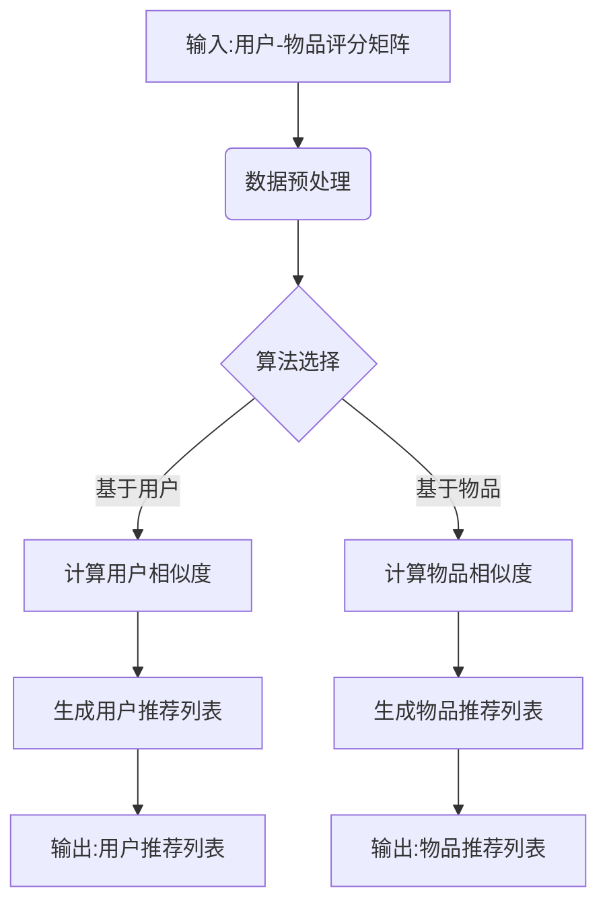
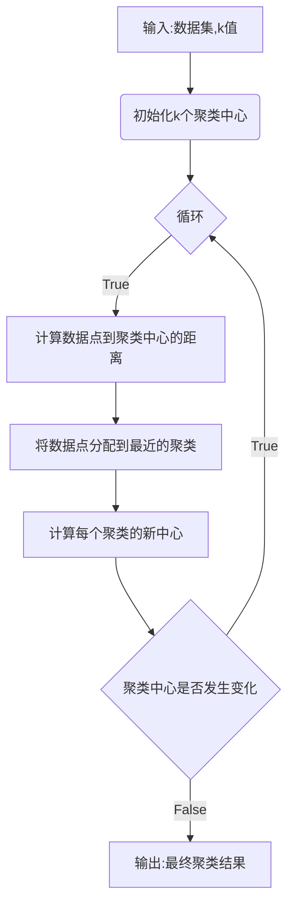

# Mahout原理与代码实例讲解

## 1.背景介绍

### 1.1 大数据时代的到来

随着互联网、物联网、移动互联网等新兴技术的快速发展,数据量呈现出爆炸式增长。传统的数据处理方式已经无法满足大数据时代对数据存储、处理和分析的需求。为了应对这一挑战,一种全新的大数据处理架构应运而生——Hadoop。

Apache Hadoop是一个开源的分布式系统基础架构,由Apache软件基金会所开发。它能够可靠、高效地处理大规模数据集,为大数据生态系统提供了坚实的基础。

### 1.2 机器学习在大数据时代的重要性

在大数据时代,海量数据中蕴含着巨大的商业价值。如何从这些原始数据中发现有价值的信息和知识,成为了企业获取竞争优势的关键。机器学习作为人工智能的一个重要分支,为大数据分析提供了强大的算法支持。

通过机器学习算法,我们可以从大量历史数据中发现隐藏的模式和规律,并基于这些规律对未来做出预测或决策。机器学习已广泛应用于推荐系统、金融风险控制、图像识别、自然语言处理等诸多领域。

### 1.3 Mahout简介

Apache Mahout是一个可扩展的机器学习和数据挖掘库,其设计目的是帮助开发人员更好地构建可扩展的机器学习应用程序。Mahout包含了众多的机器学习算法实现,如聚类、分类、协同过滤等,可在大数据环境中高效运行。

作为Apache旗下的顶级项目,Mahout天生就拥有良好的可扩展性和容错性,能够在Hadoop分布式计算框架上运行。这使得Mahout不仅可以处理单机无法承载的大规模数据集,还能充分利用大数据集群的并行计算能力,大幅提升机器学习任务的执行效率。

## 2.核心概念与联系  

### 2.1 MapReduce编程模型

MapReduce是Hadoop分布式计算框架的核心编程模型,也是Mahout底层算法实现的基础。它将计算过程分为两个阶段:Map阶段和Reduce阶段。

**Map阶段**负责将输入数据划分为多个数据块,并对每个数据块进行转换处理,生成中间结果。**Reduce阶段**则是对Map阶段产生的中间结果进行汇总。

MapReduce编程模型的优势在于:

1. **自动并行化**:MapReduce自动将任务划分为多个子任务并行执行,极大提高了数据处理效率。
2. **容错性强**:如果某个子任务失败,MapReduce会自动重新执行该子任务,确保整体任务的完成。
3. **可扩展性好**:只需增加计算节点,就能线性扩展MapReduce的计算能力。

### 2.2 向量空间模型

向量空间模型是信息检索和自然语言处理领域的一个核心概念,也是Mahout中许多算法的基础。它将文本文档表示为一个向量,每个维度对应文档中的一个单词或短语,维度的值表示该单词在文档中出现的频率或权重。

通过将文档映射到向量空间,我们就可以使用线性代数等数学工具对文档进行处理和分析。例如,可以计算两个文档向量之间的相似度,从而实现文档聚类、分类等功能。

### 2.3 协同过滤算法

协同过滤(Collaborative Filtering)是一种常用的推荐算法,也是Mahout的核心算法之一。它通过分析用户之间的行为相似性或者物品之间的相关性,为用户推荐感兴趣的物品。

协同过滤算法分为两大类:

1. **基于用户的协同过滤**:根据目标用户与其他用户之间的相似度,推荐相似用户喜欢的物品。
2. **基于物品的协同过滤**:根据目标物品与其他物品之间的相似度,推荐与目标物品相似的其他物品。

协同过滤算法广泛应用于电子商务网站、视频网站、音乐网站等推荐系统中,为用户提供个性化的推荐服务。

### 2.4 Mermaid流程图

下面是Mahout中协同过滤算法的核心流程图:

上图展示了Mahout中协同过滤算法的基本工作流程:

1. 输入用户对物品的评分数据
2. 对原始数据进行预处理,如去除噪声、填充缺失值等
3. 根据算法选择基于用户还是基于物品的协同过滤方式
4. 计算用户之间或物品之间的相似度
5. 基于相似度生成推荐列表
6. 输出推荐结果

## 3.核心算法原理具体操作步骤

在上一节中,我们介绍了Mahout中的一些核心概念。接下来,我们将深入探讨Mahout中一些核心算法的原理和实现细节。

### 3.1 基于物品的协同过滤算法

基于物品的协同过滤算法是Mahout中最常用的推荐算法之一。它的核心思想是:对于目标物品,找到与它最相似的其他物品集合,然后基于用户对这些相似物品的偏好,为用户生成推荐列表。

算法的具体步骤如下:

1. **计算物品相似度矩阵**

   对于任意两个物品i和j,计算它们的相似度,常用的相似度计算方法有:
   
   - 余弦相似度
   - 皮尔逊相关系数
   - Tanimoto系数

2. **构建物品相似度矩阵**

   将所有物品两两之间的相似度存储在一个矩阵中,这就是物品相似度矩阵。

3. **为用户生成推荐列表**

   对于目标用户u:
   - 找到用户u已评分的物品集合N
   - 对于集合N中的每个物品i,从物品相似度矩阵中找到与i最相似的k个物品
   - 将这些相似物品合并到一个候选物品集合C中,并根据相似度对C中的物品赋予权重
   - 从C中移除用户u已经评分过的物品,剩余的物品就是推荐列表

上述算法的MapReduce实现思路为:

- Map阶段:为每个物品找到与它最相似的k个物品
- Reduce阶段:对Map阶段的结果进行合并,生成最终的推荐列表

### 3.2 K-Means聚类算法

K-Means是一种常用的无监督学习算法,用于将数据集划分为k个聚类。算法的目标是最小化每个数据点到其所属聚类中心的距离平方和。

算法步骤:

1. **初始化k个聚类中心**

   通常随机选择k个数据点作为初始聚类中心。

2. **分配数据点到最近的聚类**

   对于每个数据点,计算它到k个聚类中心的距离,将其分配到距离最近的那个聚类。

3. **更新聚类中心**

   对于每个聚类,计算属于该聚类的所有数据点的均值,作为新的聚类中心。

4. **重复步骤2和3**

   重复执行步骤2和3,直到聚类中心不再发生变化或达到最大迭代次数。

K-Means算法的MapReduce实现:

- **Map阶段**:为每个数据点找到距离最近的聚类中心
- **Reduce阶段**:汇总每个聚类的所有数据点,计算新的聚类中心

### 3.3 Mermaid流程图

下面是K-Means聚类算法的流程图:

该流程图展示了K-Means算法的主要步骤:

1. 初始化k个随机聚类中心
2. 对于每个数据点,计算它到k个聚类中心的距离
3. 将数据点分配到距离最近的聚类
4. 计算每个聚类的新中心
5. 如果聚类中心发生变化,重复步骤2-4;否则输出最终聚类结果

## 4.数学模型和公式详细讲解举例说明

在上一节中,我们介绍了Mahout中的一些核心算法原理。这些算法往往涉及一些数学模型和公式,下面我们将详细讲解其中的一些关键公式。

### 4.1 余弦相似度

余弦相似度是计算两个向量相似性的一种常用方法,在协同过滤、文本挖掘等领域有广泛应用。

对于两个向量$\vec{a}$和$\vec{b}$,它们的余弦相似度定义为:

$$\text{sim}(\vec{a}, \vec{b}) = \cos(\theta) = \frac{\vec{a} \cdot \vec{b}}{\|\vec{a}\| \|\vec{b}\|} = \frac{\sum\limits_{i=1}^{n}a_ib_i}{\sqrt{\sum\limits_{i=1}^{n}a_i^2}\sqrt{\sum\limits_{i=1}^{n}b_i^2}}$$

其中$\theta$是$\vec{a}$和$\vec{b}$之间的夹角,$\|\vec{a}\|$和$\|\vec{b}\|$分别表示$\vec{a}$和$\vec{b}$的$L_2$范数。

余弦相似度的取值范围是$[-1,1]$,当两个向量的方向完全相同时,余弦相似度为1;当两个向量完全相反时,余弦相似度为-1;当两个向量正交时,余弦相似度为0。

**示例**:假设有两个向量$\vec{a} = (2, 3, 1)$和$\vec{b} = (1, 2, 4)$,计算它们的余弦相似度:

$$\begin{aligned}
\text{sim}(\vec{a}, \vec{b}) &= \frac{\vec{a} \cdot \vec{b}}{\|\vec{a}\| \|\vec{b}\|} \\
&= \frac{2 \times 1 + 3 \times 2 + 1 \times 4}{\sqrt{2^2 + 3^2 + 1^2} \sqrt{1^2 + 2^2 + 4^2}} \\
&= \frac{14}{\sqrt{14} \sqrt{21}} \\
&\approx 0.6666
\end{aligned}$$

可见,这两个向量的余弦相似度约为0.6666,说明它们的方向比较接近。

### 4.2 皮尔逊相关系数

皮尔逊相关系数是一种常用的相似度量方法,在协同过滤、回归分析等领域有广泛应用。

对于两个随机变量$X$和$Y$,它们的皮尔逊相关系数定义为:

$$\rho_{X,Y} = \frac{\text{cov}(X, Y)}{\sigma_X\sigma_Y} = \frac{\mathbb{E}[(X - \mu_X)(Y - \mu_Y)]}{\sigma_X\sigma_Y}$$

其中$\text{cov}(X, Y)$是$X$和$Y$的协方差,$\sigma_X$和$\sigma_Y$分别是$X$和$Y$的标准差,$\mu_X$和$\mu_Y$分别是$X$和$Y$的均值。

皮尔逊相关系数的取值范围是$[-1,1]$,当两个变量完全正相关时,相关系数为1;当两个变量完全负相关时,相关系数为-1;当两个变量相互独立时,相关系数为0。

**示例**:假设有两个随机变量$X$和$Y$,分别取值为$(1, 2, 3, 4, 5)$和$(5, 6, 4