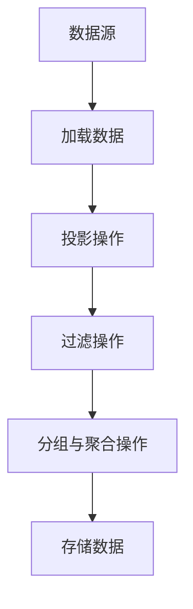
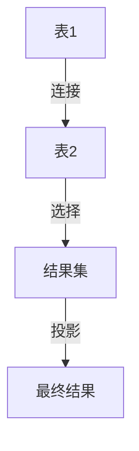

# Pig与关系型数据库：连接Pig与传统数据库

作者：禅与计算机程序设计艺术

## 1.背景介绍

### 1.1 大数据时代的挑战

在大数据时代，数据量的爆炸式增长使得传统的数据处理工具难以应对。特别是对于需要处理海量非结构化和半结构化数据的场景，传统的关系型数据库（RDBMS）显得力不从心。为了应对这些挑战，Hadoop生态系统中的Pig应运而生。

### 1.2 Pig的诞生与发展

Apache Pig是一个用于分析大型数据集的高层数据流脚本语言。它由Yahoo!开发，旨在简化复杂的MapReduce编程。Pig提供了一种称为Pig Latin的语言，允许用户编写数据分析程序，这些程序会被编译成MapReduce任务在Hadoop集群上执行。

### 1.3 关系型数据库的优势

尽管Pig在处理大数据方面有显著优势，但关系型数据库在数据一致性、事务处理和复杂查询优化方面仍然具有不可替代的地位。许多企业在其数据架构中同时使用Pig和关系型数据库，以充分利用各自的优势。

### 1.4 连接Pig与关系型数据库的必要性

为了在实际应用中充分发挥Pig和关系型数据库的优势，必须实现两者之间的无缝连接。这不仅可以利用Pig处理大数据的能力，还可以充分利用关系型数据库在数据管理和查询优化方面的优势。

## 2.核心概念与联系

### 2.1 Pig的基本概念

Pig Latin是一种数据流语言，主要包括以下几个核心概念：

- **Relation**：类似于关系型数据库中的表。
- **Field**：关系中的单个元素，类似于数据库表中的列。
- **Tuple**：关系中的一行数据，类似于数据库表中的记录。

### 2.2 关系型数据库的基本概念

关系型数据库（RDBMS）基于关系模型，主要包括以下几个核心概念：

- **表（Table）**：数据的集合，包含行和列。
- **行（Row）**：表中的单个记录。
- **列（Column）**：表中的字段。

### 2.3 Pig与关系型数据库的联系

Pig和关系型数据库在数据处理和存储方面有许多相似之处，但也有显著的差异：

- **数据模型**：Pig使用的是数据流模型，而关系型数据库使用的是关系模型。
- **查询语言**：Pig使用Pig Latin，而关系型数据库使用SQL。
- **处理方式**：Pig适合处理大规模、复杂的数据处理任务，而关系型数据库适合处理结构化数据和复杂查询。

### 2.4 连接的必要性

通过连接Pig与关系型数据库，可以实现以下目标：

- **数据迁移**：将数据从关系型数据库迁移到Pig进行大规模数据处理，或将处理后的数据存储回关系型数据库。
- **混合查询**：结合Pig和SQL的优势，进行复杂的数据分析和查询。
- **数据集成**：整合不同数据源，实现数据的统一管理和分析。

## 3.核心算法原理具体操作步骤

### 3.1 数据导入与导出

要实现Pig与关系型数据库的连接，首先需要了解如何在两者之间导入和导出数据。Pig提供了多种数据加载和存储函数，可以方便地与关系型数据库进行交互。

#### 3.1.1 使用JDBC加载数据

Pig可以通过JDBC（Java Database Connectivity）连接关系型数据库，加载数据到Pig中。以下是一个示例：

```pig
REGISTER /path/to/jdbc-driver.jar;

DEFINE JDBCLoad org.apache.pig.piggybank.storage.DBStorage(
    'com.mysql.jdbc.Driver', 'jdbc:mysql://hostname:port/dbname', 'username', 'password', 'SELECT * FROM tablename'
);

data = LOAD 'dummy' USING JDBCLoad AS (field1:chararray, field2:int, field3:float);
```

#### 3.1.2 使用JDBC存储数据

类似地，Pig也可以通过JDBC将处理后的数据存储回关系型数据库：

```pig
REGISTER /path/to/jdbc-driver.jar;

DEFINE JDBCSave org.apache.pig.piggybank.storage.DBStorage(
    'com.mysql.jdbc.Driver', 'jdbc:mysql://hostname:port/dbname', 'username', 'password', 'INSERT INTO tablename VALUES (?, ?, ?)'
);

STORE processed_data INTO 'dummy' USING JDBCSave;
```

### 3.2 数据转换与处理

在将数据从关系型数据库加载到Pig中后，可以使用Pig Latin进行各种数据转换和处理操作。以下是一些常见的操作：

#### 3.2.1 投影操作

投影操作用于选择数据中的特定字段：

```pig
projected_data = FOREACH data GENERATE field1, field2;
```

#### 3.2.2 过滤操作

过滤操作用于从数据集中选择满足特定条件的记录：

```pig
filtered_data = FILTER data BY field2 > 100;
```

#### 3.2.3 分组与聚合操作

分组与聚合操作用于对数据进行分组，并对每组数据进行聚合计算：

```pig
grouped_data = GROUP data BY field1;
aggregated_data = FOREACH grouped_data GENERATE group, SUM(data.field2) AS total;
```

### 3.3 数据存储与输出

处理完成后，可以将数据存储回关系型数据库，或者输出到其他存储系统。例如，可以将数据存储到HDFS（Hadoop分布式文件系统）：

```pig
STORE processed_data INTO 'hdfs://path/to/output' USING PigStorage(',');
```

## 4.数学模型和公式详细讲解举例说明

### 4.1 数据模型

Pig的数据模型基于数据流和关系模型，而关系型数据库的数据模型基于关系模型。两者的主要区别在于数据的组织和处理方式。

### 4.2 数据流模型

在数据流模型中，数据被视为流动的集合，通过一系列的转换操作进行处理。每个操作的输出可以作为下一个操作的输入。以下是一个简单的数据流模型示例：



### 4.3 关系模型

在关系模型中，数据被组织成表格形式，每个表包含行和列。通过SQL查询语言，可以对数据进行各种操作。以下是一个简单的关系模型示例：



### 4.4 数学公式

在数据处理过程中，常常需要使用各种数学公式进行计算。例如，在分组与聚合操作中，可以使用以下公式计算总和：

$$
\text{SUM}(x) = \sum_{i=1}^{n} x_i
$$

其中，$x$ 表示数据集中的一个字段，$n$ 表示数据集的记录数。

## 5.项目实践：代码实例和详细解释说明

### 5.1 项目背景

假设我们有一个电子商务平台，需要分析用户的购买行为数据。数据存储在MySQL数据库中，我们希望使用Pig进行大规模数据处理和分析。

### 5.2 数据准备

首先，我们在MySQL数据库中创建一个用户购买记录表：

```sql
CREATE TABLE purchase_records (
    user_id INT,
    product_id INT,
    purchase_amount FLOAT,
    purchase_date DATE
);
```

### 5.3 数据加载

使用Pig Latin将数据从MySQL数据库加载到Pig中：

```pig
REGISTER /path/to/mysql-connector-java.jar;

DEFINE JDBCLoad org.apache.pig.piggybank.storage.DBStorage(
    'com.mysql.jdbc.Driver', 'jdbc:mysql://hostname:port/dbname', 'username', 'password', 'SELECT * FROM purchase_records'
);

purchase_data = LOAD 'dummy' USING JDBCLoad AS (user_id:int, product_id:int, purchase_amount:float, purchase_date:chararray);
```

### 5.4 数据处理

对数据进行处理，计算每个用户的总购买金额：

```pig
grouped_data = GROUP purchase_data BY user_id;
user_totals = FOREACH grouped_data GENERATE group AS user_id, SUM(purchase_data.purchase_amount) AS total_amount;
```

### 5.5 数据存储

将处理后的数据存储回MySQL数据库：

```pig
DEFINE JDBCSave org.apache.pig.piggybank.storage.DBStorage(
    'com.mysql.jdbc.Driver', 'jdbc:mysql://hostname:port/dbname', 'username', 'password', 'INSERT INTO user_totals VALUES (?, ?)'
);

STORE user_totals INTO 'dummy' USING JDBCSave;
```

### 5.6 代码解释

- **REGISTER**：注册J