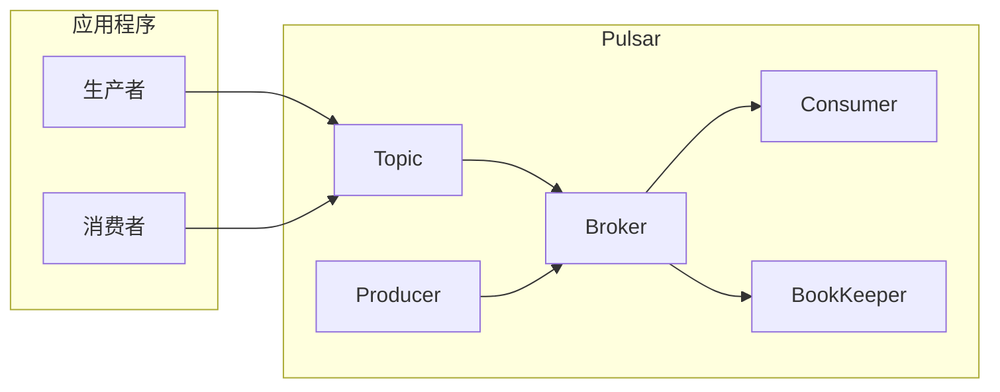

# Pulsar入门:分布式消息队列的未来

作者：禅与计算机程序设计艺术

## 1. 背景介绍

### 1.1. 消息队列概述

在当今互联网时代，构建高性能、高可用、可扩展的分布式系统已经成为一种趋势。而消息队列作为分布式系统中不可或缺的组件之一，扮演着至关重要的角色。它能够有效地解耦系统模块、异步处理消息、提高系统吞吐量和可靠性。

### 1.2. 传统消息队列的局限性

传统的开源消息队列，例如 RabbitMQ、Kafka 等，虽然在一定程度上解决了消息传递的问题，但在面对海量数据、高并发、低延迟等场景时，仍然存在一些局限性：

* **性能瓶颈:**  传统消息队列通常采用单一的 Broker 架构，容易出现性能瓶颈，无法满足海量消息的处理需求。
* **数据可靠性:**  部分传统消息队列缺乏完善的数据复制和容错机制，容易导致数据丢失或不一致。
* **运维成本:**  传统消息队列的部署、配置和维护相对复杂，需要投入较高的运维成本。

### 1.3. Pulsar：下一代分布式消息队列

为了克服传统消息队列的局限性，新一代分布式消息队列 Pulsar 应运而生。Pulsar 是由 Yahoo! 开发并开源的下一代分布式消息发布订阅系统，它具备以下优势：

* **高性能:**  Pulsar 采用分层架构，将 Broker 和存储分离，并支持多租户、多命名空间，能够轻松应对海量消息的处理需求。
* **高可用:**  Pulsar 基于 Apache BookKeeper 实现持久化存储，支持跨地域的数据复制，保证了数据的强一致性和高可用性。
* **低延迟:**  Pulsar 采用高效的 IO 模型和消息确认机制，能够实现毫秒级的消息延迟。
* **易于使用:**  Pulsar 提供了简单易用的 API 和丰富的客户端库，方便开发者快速上手。

## 2. 核心概念与联系

### 2.1. 主题 (Topic)

主题是消息的逻辑分类，类似于数据库中的表。生产者将消息发送到特定的主题，消费者订阅感兴趣的主题以接收消息。

### 2.2. 生产者 (Producer)

生产者是负责创建和发送消息到 Pulsar 主题的应用程序。

### 2.3. 消费者 (Consumer)

消费者是负责从 Pulsar 主题接收和处理消息的应用程序。

### 2.4. Broker

Broker 是 Pulsar 的核心组件，负责接收来自生产者的消息，并将消息持久化到 BookKeeper，然后将消息分发给消费者。

### 2.5. BookKeeper

BookKeeper 是 Apache 软件基金会下的一个分布式日志存储系统，Pulsar 使用 BookKeeper 作为持久化存储。

### 2.6. 消息 (Message)

消息是 Pulsar 中的基本数据单元，包含消息体和一些元数据信息。

### 2.7. 订阅 (Subscription)

订阅是消费者对主题的一种消费方式，Pulsar 支持多种订阅模式，例如：独占订阅、共享订阅、故障转移订阅等。

### 2.8. 命名空间 (Namespace)

命名空间是 Pulsar 中的一种逻辑隔离机制，用于将不同的主题进行分组管理。

### 2.9. 租户 (Tenant)

租户是 Pulsar 中最高级别的隔离机制，用于隔离不同应用程序的资源。

### 2.10. 核心概念关系图



## 3. 核心算法原理具体操作步骤

### 3.1. 生产者发送消息流程

1. 生产者创建到 Broker 的连接。
2. 生产者选择一个主题，并将消息发送到该主题。
3. Broker 接收消息，并将其写入 BookKeeper。
4. Broker 向生产者发送确认消息。

### 3.2. 消费者接收消息流程

1. 消费者创建到 Broker 的连接。
2. 消费者订阅一个主题。
3. Broker 将消息从 BookKeeper 读取出来，并发送给消费者。
4. 消费者接收消息，并进行处理。
5. 消费者向 Broker 发送确认消息。

### 3.3. 消息确认机制

Pulsar 支持两种消息确认机制：

* **单条确认:**  消费者每消费一条消息，就向 Broker 发送一条确认消息。
* **累积确认:**  消费者可以累积多条消息，然后一次性向 Broker 发送确认消息。

## 4. 数学模型和公式详细讲解举例说明

Pulsar 并没有复杂的数学模型和公式，其核心原理是基于分布式系统和消息队列的基本概念。

## 5. 项目实践：代码实例和详细解释说明

### 5.1. 安装 Pulsar

```bash
# 下载 Pulsar
$ wget https://archive.apache.org/dist/pulsar/pulsar-2.10.0/apache-pulsar-2.10.0-bin.tar.gz

# 解压 Pulsar
$ tar -xzf apache-pulsar-2.10.0-bin.tar.gz

# 进入 Pulsar 目录
$ cd apache-pulsar-2.10.0

# 启动 Pulsar
$ bin/pulsar standalone
```

### 5.2. 使用 Java 客户端发送和接收消息

```java
// 引入 Pulsar 客户端依赖
import org.apache.pulsar.client.api.*;

public class PulsarDemo {

    public static void main(String[] args) throws Exception {

        // 创建 Pulsar 客户端
        PulsarClient client = PulsarClient.builder()
                .serviceAddress("pulsar://localhost:6650")
                .build();

        // 创建生产者
        Producer<byte[]> producer = client.newProducer()
                .topic("my-topic")
                .create();

        // 发送消息
        producer.send("Hello Pulsar!".getBytes());

        // 创建消费者
        Consumer<byte[]> consumer = client.newConsumer()
                .topic("my-topic")
                .subscriptionName("my-subscription")
                .create();

        // 接收消息
        Message<byte[]> msg = consumer.receive();
        System.out.println("Received message: " + new String(msg.getData()));

        // 关闭客户端
        client.close();
    }
}
```

## 6. 实际应用场景

### 6.1. 金融交易系统

Pulsar 可以用于构建高性能、低延迟的金融交易系统，例如：股票交易、期货交易等。

### 6.2. 物联网数据采集

Pulsar 可以用于实时采集和处理海量的物联网数据，例如：传感器数据、设备状态等。

### 6.3. 日志收集与分析

Pulsar 可以用于收集和分析应用程序的日志数据，例如：错误日志、访问日志等。

## 7. 工具和资源推荐

### 7.1. Pulsar 官网

https://pulsar.apache.org/

### 7.2. Pulsar GitHub 仓库

https://github.com/apache/pulsar

### 7.3. Pulsar 官方文档

https://pulsar.apache.org/docs/

## 8. 总结：未来发展趋势与挑战

### 8.1. 未来发展趋势

* **云原生支持:**  Pulsar 将会更加深度地集成到云原生生态系统中，例如：Kubernetes、Serverless 等。
* **流处理能力:**  Pulsar 将会增强其流处理能力，提供更加完善的流处理 API 和工具。
* **生态系统建设:**  Pulsar 社区将会更加活跃，涌现出更多基于 Pulsar 的工具和应用。

### 8.2. 面临的挑战

* **技术复杂度:**  Pulsar 的架构相对复杂，学习曲线较陡峭。
* **社区发展:**  Pulsar 社区规模相对较小，需要更多开发者和用户的参与。

## 9. 附录：常见问题与解答

### 9.1. Pulsar 与 Kafka 的区别是什么？

Pulsar 和 Kafka 都是分布式消息队列，但它们在架构、功能、性能等方面存在一些区别：

| 特性 | Pulsar | Kafka |
|---|---|---|
| 架构 | 分层架构，Broker 和存储分离 | 单层架构，Broker 存储数据 |
| 持久化 | 基于 BookKeeper，支持跨地域复制 | 基于磁盘，数据可靠性相对较低 |
| 订阅模式 | 支持独占订阅、共享订阅、故障转移订阅 | 支持消费者组 |
| 消息顺序 | 保证分区内消息顺序 | 保证分区内消息顺序 |

### 9.2. Pulsar 支持哪些消息协议？

Pulsar 支持多种消息协议，例如：

* Pulsar 原生协议
* Kafka 协议
* AMQP 协议
* MQTT 协议

### 9.3. 如何保证 Pulsar 的数据可靠性？

Pulsar 通过以下机制保证数据可靠性：

* **数据持久化:**  Pulsar 使用 BookKeeper 作为持久化存储，BookKeeper 支持跨地域的数据复制，保证了数据的强一致性和高可用性。
* **消息确认机制:**  Pulsar 支持单条确认和累积确认两种消息确认机制，确保消息不会丢失。
* **Broker 容错:**  Pulsar 的 Broker 支持主从复制，当主 Broker 宕机时，从 Broker 可以接管服务，保证了服务的可用性。
