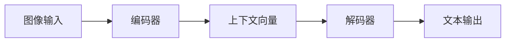
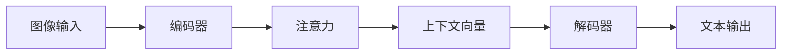
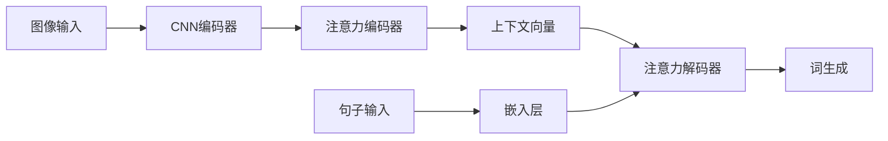

# RNN进行图像描述：用文字描绘图像

## 1.背景介绍

### 1.1 图像描述任务概述

图像描述是一项需要同时利用计算机视觉和自然语言处理技术的复杂任务。它的目标是根据给定的图像,自动生成一段描述图像内容的自然语言文本。这种技术在很多领域都有广泛的应用前景,例如为视障人士提供图像辅助描述、智能相册管理、基于内容的图像检索等。

传统的图像描述方法大多采用从图像中提取视觉特征,然后基于这些特征生成描述的流水线方式。这种方法需要人工设计合适的视觉特征和语言模型,并人为划分视觉理解和语言生成两个独立的子任务,缺乏端到端的优化。

近年来,受深度学习技术的发展推动,基于神经网络的端到端图像描述模型取得了令人瞩目的进展。其中,利用循环神经网络(Recurrent Neural Networks,RNN)对图像进行编码并生成描述是一种有效且热门的方法。

### 1.2 RNN在图像描述中的应用优势

RNN是一种具有内在记忆能力的神经网络结构,能够很好地建模序列数据。在图像描述任务中,RNN可以将图像编码为一个向量表示,然后根据这个向量逐词生成与图像相关的文字描述。

与传统的流水线方法相比,基于RNN的端到端图像描述模型具有以下优势:

1. **端到端训练**:整个系统是一个统一的端到端神经网络模型,能够同时最优化视觉特征提取和语言生成两个子任务,避免了传统方法中错误累积的问题。

2. **联合学习**:模型可以同时学习图像和文本之间的语义关联,而不需要人为设计复杂的特征。

3. **灵活性**:RNN具有内在的记忆机制,能够生成任意长度的文本描述,而不受限于固定模板。

4. **泛化能力**:深度神经网络模型通常比传统机器学习模型具有更强的泛化能力,能够更好地应对现实世界的复杂情况。

基于这些优势,近年来基于RNN的图像描述模型在多项国际评测中取得了领先的表现,成为该领域的主流方法之一。

## 2.核心概念与联系

### 2.1 编码器-解码器框架

基于RNN的图像描述模型通常采用编码器-解码器(Encoder-Decoder)框架,如下图所示:

编码器负责从输入图像中提取语义特征,并将其编码为一个向量表示,即上下文向量(Context Vector)。解码器则根据该向量逐词生成与图像对应的文本描述。

编码器和解码器都可以使用RNN或其变种(如LSTM、GRU等)来构建。这种设计灵感来源于机器翻译任务,将图像理解视为"翻译"图像到文本的过程。

### 2.2 注意力机制

尽管编码器-解码器框架取得了一定成功,但仍然存在一些局限性。最主要的问题是上下文向量是一个固定长度的向量,需要编码整个图像的信息,这对于复杂场景可能会导致信息丢失。

为了解决这个问题,研究人员引入了注意力机制(Attention Mechanism)。注意力机制允许解码器在生成每个单词时,专注于图像的某些区域,而不是被限制于固定的上下文向量。这种选择性关注可以更好地建模单词与图像区域之间的对应关系。

注意力增强的编码器-解码器框架如下所示:

在每个时间步,注意力模块会根据当前的解码器隐藏状态,动态计算一个注意力权重分布,用于选择性地聚焦于图像的不同区域。通过这种方式,模型能够更精确地关注与当前生成的单词相关的图像部分。

### 2.3 多模态融合

除了注意力机制,多模态融合(Multimodal Fusion)也是提升图像描述性能的一种重要技术。多模态融合旨在更好地融合图像和文本两种模态的信息。

常见的多模态融合策略包括:

1. **初始融合**:在编码器阶段就将图像特征和文本特征融合在一起。这种方式的缺点是无法捕捉两种模态之间的动态关系。

2. **逐步融合**:在解码器的每个时间步,将当前的解码器隐藏状态与图像特征融合,得到多模态表示。这种方式更加灵活,但计算开销也更大。

3. **双向交互**:除了单向地将图像特征输入到解码器,还允许解码器的隐藏状态反过来影响图像特征的计算。通过显式建模两种模态之间的相互关系,可以进一步提升性能。

4. **外部记忆**:采用外部记忆模块(如记忆网络)来存储和关注不同模态之间的关系,使模型能够更好地利用跨模态的知识。

多模态融合的目标是充分利用图像和文本两种模态的互补信息,从而生成更准确、更丰富的描述。

## 3.核心算法原理具体操作步骤

在这一部分,我们将介绍基于注意力机制的编码器-解码器模型的核心算法原理和具体操作步骤。为了便于说明,我们以一种常见的模型架构为例进行讲解。

### 3.1 模型架构概览

下图展示了该模型的整体架构:

该模型主要包括以下几个模块:

1. **CNN编码器**:使用预训练的卷积神经网络(CNN)从图像中提取视觉特征,得到一个特征向量序列。

2. **注意力编码器**:使用RNN(通常为LSTM或GRU)对CNN提取的特征序列进行编码,并利用注意力机制生成上下文向量。

3. **注意力解码器**:另一个RNN模块,根据上下文向量及输入的句子(通过嵌入层处理),利用注意力机制逐词生成图像描述。

4. **词生成层**:根据解码器的输出,通过一个全连接层和softmax计算每个可能的词的概率分布,并选择概率最大的词作为输出。

整个模型是端到端可训练的,我们可以最大化预测句子与真实句子的对数似然,同时优化所有模块的参数。

### 3.2 CNN编码器

CNN编码器的作用是从输入图像中提取视觉特征。常见的做法是使用预训练的CNN模型(如VGGNet、ResNet等),并将最后一个卷积层或池化层的特征图作为特征序列的输出。

对于一个 $C \times H \times W$ 的特征图张量,我们可以将其重新排列成一个 $L \times D$的特征序列,其中 $L=H \times W$ 是特征的长度, $D=C \times k \times k$ 是每个特征向量的维度($k \times k$是卷积核尺寸)。

形式上,设输入图像为 $I$,CNN编码器可以表示为:

$$
f_{cnn} : I \mapsto \mathbf{v} = \{\mathbf{v}_1, \mathbf{v}_2, \dots, \mathbf{v}_L\}
$$

其中 $\mathbf{v}$ 是长度为 $L$ 的特征序列,每个 $\mathbf{v}_i \in \mathbb{R}^D$ 对应图像的一个局部区域。

### 3.3 注意力编码器

注意力编码器的输入是CNN编码器输出的特征序列 $\mathbf{v}$。它使用RNN(如LSTM或GRU)对这个序列进行编码,得到一系列隐藏状态 $\mathbf{h}_1, \mathbf{h}_2, \dots, \mathbf{h}_L$:

$$
\mathbf{h}_t = \text{RNN}(\mathbf{v}_t, \mathbf{h}_{t-1})
$$

然后,注意力编码器计算一个上下文向量 $\mathbf{c}$,作为对整个图像的编码表示。这个向量是所有隐藏状态的加权和,其中权重由注意力机制决定:

$$
\begin{aligned}
\mathbf{c} &= \sum_{t=1}^L \alpha_t \mathbf{h}_t \\
\alpha_t &= \frac{\exp(e_t)}{\sum_{k=1}^L \exp(e_k)}\\
e_t &= f_{att}(\mathbf{h}_t)
\end{aligned}
$$

其中 $\alpha_t$ 是第 $t$ 个位置的注意力权重, $e_t$ 是对应的节点得分, $f_{att}$ 是注意力评分函数,通常使用单层感知机或多层感知机。

通过这种方式,模型可以自动分配不同的注意力权重,聚焦于对生成描述更加重要的图像区域。

### 3.4 注意力解码器

注意力解码器的输入包括上下文向量 $\mathbf{c}$ 和输入句子的词嵌入序列 $\mathbf{x}_1, \mathbf{x}_2, \dots, \mathbf{x}_M$。它使用另一个RNN按照序列顺序生成输出词序列 $\mathbf{y}_1, \mathbf{y}_2, \dots, \mathbf{y}_N$:

$$
\mathbf{s}_t = \text{RNN}(\mathbf{y}_{t-1}, \mathbf{s}_{t-1}, \mathbf{c}_t)
$$

其中 $\mathbf{s}_t$ 是解码器的隐藏状态, $\mathbf{c}_t$ 是当前时间步的上下文向量。

与编码器类似,解码器也采用注意力机制来动态关注图像的不同区域。具体来说,在每个时间步 $t$,解码器计算一个新的上下文向量 $\mathbf{c}_t$:

$$
\begin{aligned}
\mathbf{c}_t &= \sum_{i=1}^L \alpha_{t,i} \mathbf{h}_i \\
\alpha_{t,i} &= \frac{\exp(e_{t,i})}{\sum_{k=1}^L \exp(e_{t,k})}\\
e_{t,i} &= f_{att}(\mathbf{s}_t, \mathbf{h}_i)
\end{aligned}
$$

其中 $\alpha_{t,i}$ 是第 $t$ 个词对第 $i$ 个图像位置的注意力权重, $e_{t,i}$ 是对应的注意力得分, $f_{att}$ 是注意力评分函数,输入包括当前的解码器隐藏状态 $\mathbf{s}_t$ 和编码器隐藏状态 $\mathbf{h}_i$。

通过这种动态注意力机制,解码器可以在生成每个单词时关注与之相关的图像区域,从而产生更准确的描述。

### 3.5 词生成层

最后,模型通过一个词生成层将解码器的输出 $\mathbf{s}_t$ 映射到词的概率分布:

$$
P(y_t | y_1, \dots, y_{t-1}, I) = g(\mathbf{W}_o \mathbf{s}_t + \mathbf{b}_o)
$$

其中 $g$ 是softmax函数, $\mathbf{W}_o$ 和 $\mathbf{b}_o$ 是可训练参数。在训练时,我们最大化预测句子与真实句子的对数似然,同时对所有模块的参数进行端到端优化。

在测试时,我们通过贪心搜索或beam search等方法,从最大化概率的角度生成最佳描述句子。

以上就是基于注意力机制的编码器-解码器模型的核心算法原理和操作步骤。通过有效融合图像和文本信息,并动态关注相关的图像区域,该模型能够生成准确、丰富的图像描