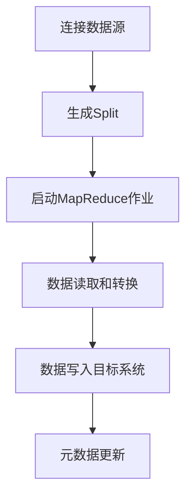
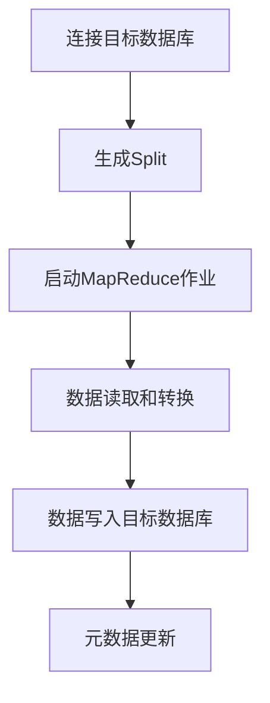

# Sqoop最佳实践：优化数据迁移效率和可靠性

## 1.背景介绍

### 1.1 大数据时代的数据集成挑战

在当今的大数据时代，企业和组织面临着海量数据的存储、处理和分析挑战。数据通常分散在不同的系统和平台中，如关系型数据库、NoSQL数据库、数据仓库等。为了有效利用这些数据资产,需要将它们集成到一个统一的大数据平台中进行处理和分析。

### 1.2 Sqoop的作用和重要性  

Apache Sqoop是一款开源的数据集成工具,旨在高效地在结构化数据存储(如关系型数据库)和大数据集群(如Hadoop)之间传输批量数据。它提供了一种简单、可靠的方式来将数据从关系型数据库导入到Hadoop生态系统中,或者从Hadoop生态系统导出到关系型数据库。

随着数据量的不断增长,确保数据迁移的高效性和可靠性变得至关重要。Sqoop作为一款专门设计用于大数据环境的数据传输工具,具有并行处理、容错机制、数据压缩等优势,可以显著提高数据迁移的性能和稳定性。

## 2.核心概念与联系

### 2.1 Sqoop架构概览

Sqoop由以下几个核心组件组成:

1. **Sqoop Client**: 运行在边缘节点上的客户端工具,用于发起导入或导出操作。
2. **Sqoop Server**: 运行在数据节点上的服务器组件,负责执行实际的数据传输任务。
3. **Metastore**: 存储有关已导入或导出的表和作业的元数据信息。
4. **Connector**: 用于连接不同类型的数据源和目标系统,如关系型数据库连接器、Kafka连接器等。


### 2.2 Sqoop工作流程

Sqoop的工作流程如下:

1. 用户通过Sqoop Client提交导入或导出作业。
2. Sqoop Client与Sqoop Server通信,将作业提交到Hadoop集群。
3. Sqoop Server启动MapReduce作业,并将数据从源系统并行导入或导出到目标系统。
4. 作业完成后,Sqoop Server将元数据信息存储到Metastore中。

### 2.3 Sqoop连接器

Sqoop支持多种连接器,用于连接不同类型的数据源和目标系统。常见的连接器包括:

- **关系型数据库连接器**: 支持MySQL、Oracle、PostgreSQL等主流关系型数据库。
- **NoSQL数据库连接器**: 支持HBase、Cassandra等NoSQL数据库。
- **Kafka连接器**: 用于将数据导入或导出到Apache Kafka。
- **HDFS连接器**: 用于将数据导入或导出到HDFS文件系统。

## 3.核心算法原理具体操作步骤

### 3.1 Sqoop导入数据流程

1. **连接数据源**: Sqoop通过连接器连接到源数据库,并获取表的元数据信息。
2. **生成Split**: 根据表的大小和并行度,Sqoop将表划分为多个Split,每个Split对应一个MapReduce任务。
3. **启动MapReduce作业**: Sqoop向Hadoop集群提交MapReduce作业,每个Map任务负责处理一个Split。
4. **数据读取和转换**: Map任务从源数据库读取数据,并将其转换为适合Hadoop的格式(如文本文件或SequenceFile)。
5. **数据写入目标系统**: Reduce任务将Map任务的输出数据写入到目标系统(如HDFS)。
6. **元数据更新**: 作业完成后,Sqoop将导入的表和作业信息存储到Metastore中。



### 3.2 Sqoop导出数据流程

1. **连接目标数据库**: Sqoop通过连接器连接到目标数据库。
2. **生成Split**: 根据HDFS上数据的大小和并行度,Sqoop将数据划分为多个Split。
3. **启动MapReduce作业**: Sqoop向Hadoop集群提交MapReduce作业,每个Map任务负责处理一个Split。
4. **数据读取和转换**: Map任务从HDFS读取数据,并将其转换为目标数据库所需的格式。
5. **数据写入目标数据库**: Reduce任务将Map任务的输出数据写入到目标数据库。
6. **元数据更新**: 作业完成后,Sqoop将导出的表和作业信息存储到Metastore中。



## 4.数学模型和公式详细讲解举例说明

在Sqoop的数据导入和导出过程中,涉及到一些数学模型和公式,用于优化性能和资源利用率。

### 4.1 Split计算

Sqoop需要将大表划分为多个Split,以实现并行处理。Split的大小和数量直接影响作业的性能和资源利用率。Sqoop使用以下公式计算Split的大小:

$$
Split Size = \frac{Table Size}{Number of Maps}
$$

其中:

- $Table Size$: 表的总大小(以字节为单位)
- $Number of Maps$: 要启动的Map任务数量

Sqoop还提供了一些参数来控制Split的大小和数量,如`--split-by`、`--boundary-query`等。

### 4.2 并行度优化

Sqoop支持通过调整并行度来优化性能。并行度指的是同时运行的Map任务数量。过高的并行度可能会导致资源竞争和性能下降,而过低的并行度则无法充分利用集群资源。Sqoop使用以下公式来确定最佳的并行度:

$$
Optimal Parallelism = \frac{Total Cluster Resources}{Resources per Map}
$$

其中:

- $Total Cluster Resources$: 集群的总资源(如CPU、内存等)
- $Resources per Map$: 每个Map任务所需的资源

用户可以通过`--num-mappers`参数手动设置并行度,或者让Sqoop自动计算最佳值。

### 4.3 压缩优化

Sqoop支持在导入和导出过程中对数据进行压缩,以减小网络传输和存储开销。常用的压缩算法包括gzip、bzip2、lzo等。压缩率和解压缩速度之间存在权衡,需要根据具体场景进行选择。

压缩率可以使用以下公式计算:

$$
Compression Ratio = \frac{Uncompressed Size}{Compressed Size}
$$

其中:

- $Uncompressed Size$: 未压缩数据的大小
- $Compressed Size$: 压缩后数据的大小

通常,压缩率越高,网络传输和存储开销越小,但解压缩的CPU开销也会增加。

## 4.项目实践:代码实例和详细解释说明

### 4.1 导入数据示例

以下是一个使用Sqoop从MySQL导入数据到HDFS的示例:

```bash
sqoop import \
  --connect jdbc:mysql://hostname/databasename \
  --username myuser \
  --password mypassword \
  --table employees \
  --target-dir /user/hadoop/employees \
  --fields-terminated-by ',' \
  --lines-terminated-by '\n' \
  --num-mappers 4 \
  --compression-codec org.apache.hadoop.io.compress.GzipCodec
```

- `--connect`: 指定MySQL数据库的JDBC连接字符串。
- `--username`和`--password`: 指定数据库的用户名和密码。
- `--table`: 指定要导入的表名。
- `--target-dir`: 指定HDFS上的目标目录。
- `--fields-terminated-by`和`--lines-terminated-by`: 指定字段和行的分隔符。
- `--num-mappers`: 设置并行度为4个Map任务。
- `--compression-codec`: 使用gzip压缩导入的数据。

### 4.2 导出数据示例

以下是一个使用Sqoop将HDFS上的数据导出到MySQL的示例:

```bash
sqoop export \
  --connect jdbc:mysql://hostname/databasename \
  --username myuser \
  --password mypassword \
  --table employees_backup \
  --export-dir /user/hadoop/employees \
  --input-fields-terminated-by ',' \
  --num-mappers 2 \
  --batch
```

- `--connect`: 指定MySQL数据库的JDBC连接字符串。
- `--username`和`--password`: 指定数据库的用户名和密码。
- `--table`: 指定要导出到的表名。
- `--export-dir`: 指定HDFS上的源数据目录。
- `--input-fields-terminated-by`: 指定输入数据的字段分隔符。
- `--num-mappers`: 设置并行度为2个Map任务。
- `--batch`: 启用批量模式,提高导出性能。

## 5.实际应用场景

Sqoop在各种场景下都有广泛的应用,包括但不限于:

1. **数据迁移**: 将企业的历史数据从关系型数据库迁移到Hadoop生态系统中,以便进行大数据分析。
2. **数据集成**: 将来自不同源系统(如数据库、NoSQL、文件等)的数据集成到Hadoop中,构建数据湖或数据仓库。
3. **ETL流程**: 作为ETL(提取、转换、加载)流程的一部分,将数据从源系统提取并加载到Hadoop中进行转换和处理。
4. **实时数据处理**: 与Kafka等流处理系统结合,实现实时数据的导入和导出。
5. **备份和恢复**: 将Hadoop中的数据定期导出到关系型数据库,作为备份和灾难恢复的一种方式。

## 6.工具和资源推荐

### 6.1 Sqoop相关工具

- **Sqoop Web UI**: 一个基于Web的图形用户界面,可以方便地管理和监控Sqoop作业。
- **Sqoop Connectors**: Sqoop提供了多种连接器,用于连接不同类型的数据源和目标系统。
- **Sqoop Cookbook**: 一本详细介绍Sqoop使用方法和最佳实践的书籍。

### 6.2 其他相关工具

- **Apache Kafka**: 一个分布式流处理平台,可与Sqoop集成实现实时数据处理。
- **Apache Hive**: 一个基于Hadoop的数据仓库工具,可用于对导入的数据进行查询和分析。
- **Apache Oozie**: 一个工作流调度器,可用于编排Sqoop作业与其他大数据工作流。

### 6.3 在线资源

- **Sqoop官方文档**: https://sqoop.apache.org/docs/
- **Sqoop邮件列表**: https://sqoop.apache.org/mail-lists.html
- **Sqoop Stack Overflow**: https://stackoverflow.com/questions/tagged/sqoop

## 7.总结:未来发展趋势与挑战

### 7.1 云原生支持

随着云计算的快速发展,Sqoop需要进一步增强对云原生环境的支持,如Kubernetes和云数据库等。这将使Sqoop能够更好地集成到现代云架构中,提供更灵活和可扩展的数据迁移解决方案。

### 7.2 实时数据集成

虽然Sqoop主要用于批量数据迁移,但未来可能需要支持实时数据集成。这可以通过与流处理系统(如Kafka)更紧密集成来实现,以满足实时数据处理的需求。

### 7.3 元数据管理

随着数据量和集成场景的增加,对元数据管理的需求也会增加。Sqoop需要提供更强大的元数据管理功能,以跟踪和管理复杂的数据lineage和依赖关系。

### 7.4 安全性和隐私保护

在处理敏感数据时,数据安全性和隐私保护是一个重大挑战。Sqoop需要加强对数据加密、访问控制和审计等安全功能的支持,以满足企业的合规性和隐私保护要求。

### 7.5 智能优化

通过机器学习和人工智能技术,Sqoop可以实现自动化的性能优化和资源调度。例如,根据历史数据和当前环境自动选择最佳的并行度、压缩算法等参数,从而提高数据迁移的效率和可靠性。

## 8.附录:常见问题与解答

### 8.1 如何确定导入/导出的并行度?

并行度的选择取决于集群资源和数据量。一般来说,可以先使用`--num-mappers`参数设置