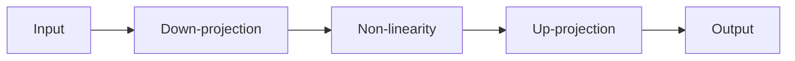
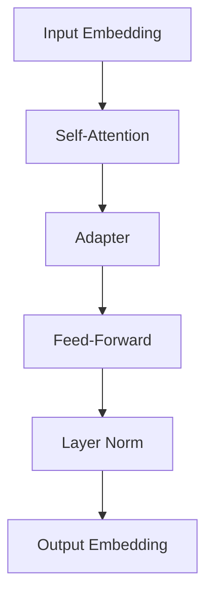

# T5模型的参数高效微调技术

作者：禅与计算机程序设计艺术

## 1. 背景介绍

### 1.1 T5模型概述
T5 (Text-to-Text Transfer Transformer) 模型是谷歌在2020年提出的一种大型预训练语言模型，它在多个自然语言处理任务上取得了出色的表现。T5模型基于transformer架构，采用encoder-decoder结构，可以完成多种NLP任务，如机器翻译、文本摘要、问答系统、文本分类等。

### 1.2 预训练语言模型的优势
预训练语言模型的出现极大地推动了自然语言处理领域的发展。通过在大规模无标注语料上进行自监督预训练，模型可以学习到丰富的语言知识和通用语义表示。在特定任务上微调预训练模型，可以显著提升任务性能，同时减少对标注数据的依赖。

### 1.3 T5模型面临的挑战
尽管T5模型在诸多NLP任务上表现优异，但仍存在一些挑战：

1. **模型参数量巨大**：T5模型参数量高达110亿，训练和部署成本高昂。
2. **任务适应性不足**：预训练模型在特定任务上微调时，可能存在过拟合问题，泛化能力有待提升。
3. **推理速度较慢**：模型规模大导致推理速度慢，难以满足实时响应需求。

为了应对这些挑战，研究者们提出了各种参数高效微调技术，以期在保持模型性能的同时，降低计算和存储开销，提升模型的实用性。

## 2. 核心概念与联系

### 2.1 参数高效微调
参数高效微调（Parameter-Efficient Fine-tuning）是指在预训练模型的基础上，通过较小的参数量调整，使模型适应特定任务，同时尽可能保持预训练权重不变。这种方法可以大幅减少微调过程中需要训练的参数量，加速训练和推理过程。

### 2.2 Adapter
Adapter是一种插入到预训练模型中的轻量级模块，用于为特定任务调整模型行为。通过在transformer层之间插入adapter，可以在不改变原始模型参数的情况下，学习任务特定的适应能力。Adapter的参数量相对较小，易于训练和存储。

### 2.3 Prefix-tuning
Prefix-tuning是一种基于prompt learning的参数高效微调方法。通过学习一组连续的向量（prefix），作为输入序列的前缀，可以引导模型生成与任务相关的输出。Prefix-tuning在固定预训练模型参数的情况下，只训练prefix参数，实现参数高效微调。

### 2.4 Low-Rank Adaptation
Low-Rank Adaptation通过引入低秩矩阵，在预训练模型的权重矩阵上进行低秩分解，从而减少微调过程中需要调整的参数量。通过控制分解的秩，可以在参数效率和性能之间进行权衡。

## 3. 核心算法原理与具体操作步骤

### 3.1 Adapter的原理与实现

#### 3.1.1 Adapter模块设计
Adapter模块通常由两个全连接层和一个非线性激活函数组成，如图1所示。


<center>图1 Adapter模块结构</center>

具体地，设输入特征维度为$d_{model}$，Adapter的瓶颈维度为$d_{adapter}$，则Adapter的计算过程如下：

$$
\begin{aligned}
h &= \text{FC}_{down}(x) \\
h &= \text{Non-linearity}(h) \\
y &= \text{FC}_{up}(h) + x
\end{aligned}
$$

其中，$\text{FC}_{down} \in \mathbb{R}^{d_{model} \times d_{adapter}}$，$\text{FC}_{up} \in \mathbb{R}^{d_{adapter} \times d_{model}}$，Non-linearity通常选择ReLU函数。

#### 3.1.2 将Adapter插入预训练模型
将设计好的Adapter模块插入到T5预训练模型的每一层transformer块中，具体位置可以选择self-attention之后、前馈神经网络之前，如图2所示。


<center>图2 在T5模型中插入Adapter</center>

#### 3.1.3 训练Adapter参数
在微调阶段，冻结T5预训练模型的所有参数，只训练新引入的Adapter参数。假设T5模型有$L$层transformer块，每层插入一个Adapter，则训练参数量为：

$$
N_{params} = L \times (d_{model} \times d_{adapter} + d_{adapter} \times d_{model})
$$

通过合理设置$d_{adapter}$，可以大幅减少微调参数量，同时保持模型性能。

### 3.2 Prefix-tuning的原理与实现

#### 3.2.1 Prefix的设计
Prefix是一组可学习的连续向量，用作输入序列的前缀。设输入序列为$\mathbf{x} = (x_1, x_2, \dots, x_n)$，prefix长度为$m$，则加入prefix后的输入序列为：

$$
\mathbf{x}_{prefix} = (\mathbf{p}_1, \mathbf{p}_2, \dots, \mathbf{p}_m, x_1, x_2, \dots, x_n)
$$

其中，$\mathbf{p}_i \in \mathbb{R}^{d_{model}}$为第$i$个prefix向量，需要通过梯度下降学习得到。

#### 3.2.2 在T5模型中应用Prefix-tuning
将学习得到的prefix向量拼接到T5模型的输入序列之前，然后正常进行编码器-解码器的计算过程，如图3所示。


<center>图3 在T5模型中应用Prefix-tuning</center>

#### 3.2.3 训练Prefix参数
在微调阶段，冻结T5预训练模型的所有参数，只训练prefix向量。假设prefix长度为$m$，则训练参数量为：

$$
N_{params} = m \times d_{model}
$$

通过调节prefix长度$m$，可以灵活控制微调参数量，实现参数高效微调。

### 3.3 Low-Rank Adaptation的原理与实现

#### 3.3.1 低秩分解
Low-Rank Adaptation的核心思想是对预训练模型的权重矩阵进行低秩分解，从而减少微调参数量。设预训练权重矩阵为$\mathbf{W} \in \mathbb{R}^{m \times n}$，Low-Rank Adaptation将其分解为：

$$
\mathbf{W} = \mathbf{U} \cdot \text{diag}(\mathbf{s}) \cdot \mathbf{V}^T
$$

其中，$\mathbf{U} \in \mathbb{R}^{m \times r}, \mathbf{V} \in \mathbb{R}^{n \times r}$为低秩矩阵，$\mathbf{s} \in \mathbb{R}^r$为对角矩阵的对角线元素，$r \ll \min(m,n)$为分解的秩。

#### 3.3.2 在T5模型中应用Low-Rank Adaptation
对T5模型中的权重矩阵（例如self-attention的投影矩阵、前馈神经网络的权重矩阵等）进行低秩分解，得到低秩矩阵$\mathbf{U}, \mathbf{V}$和对角矩阵$\text{diag}(\mathbf{s})$。在前向计算过程中，使用分解后的矩阵替代原始权重矩阵，如图4所示。

```mermaid
graph LR
A[Input] --> B[Low-Rank Matrix U]
B --> C[Diagonal Matrix diag(s)]
C --> D[Low-Rank Matrix V] 
D --> E[Output]
```
<center>图4 Low-Rank Adaptation的计算过程</center>

#### 3.3.3 训练低秩矩阵参数
在微调阶段，冻结T5预训练模型的所有参数，只训练低秩矩阵$\mathbf{U}, \mathbf{V}$和对角矩阵$\text{diag}(\mathbf{s})$的参数。假设对$L$个权重矩阵进行低秩分解，每个矩阵的原始形状为$m \times n$，秩为$r$，则训练参数量为：

$$
N_{params} = L \times (m \times r + n \times r + r)
$$

通过调节分解的秩$r$，可以在参数效率和模型性能之间进行平衡。

## 4. 数学模型和公式详细讲解举例说明

本节通过一个具体的数值例子，详细说明Adapter的计算过程。

假设T5模型的隐藏状态维度$d_{model}=768$，Adapter的瓶颈维度$d_{adapter}=64$。对于某一层transformer块的输入$\mathbf{x} \in \mathbb{R}^{768}$，Adapter的计算过程如下：

1. 通过第一个全连接层$\text{FC}_{down} \in \mathbb{R}^{768 \times 64}$，将输入映射到低维空间：

$$
\mathbf{h} = \text{FC}_{down}(\mathbf{x}) = \mathbf{x} \cdot \mathbf{W}_{down} + \mathbf{b}_{down}
$$
其中，$\mathbf{W}_{down} \in \mathbb{R}^{768 \times 64}, \mathbf{b}_{down} \in \mathbb{R}^{64}$为全连接层的权重和偏置。

2. 通过非线性激活函数ReLU对$\mathbf{h}$进行非线性变换：

$$
\mathbf{h} = \text{ReLU}(\mathbf{h}) = \max(0, \mathbf{h})
$$

3. 通过第二个全连接层$\text{FC}_{up} \in \mathbb{R}^{64 \times 768}$，将低维特征映射回原始维度，并与输入进行残差连接：

$$
\mathbf{y} = \text{FC}_{up}(\mathbf{h}) + \mathbf{x} = \mathbf{h} \cdot \mathbf{W}_{up} + \mathbf{b}_{up} + \mathbf{x}
$$
其中，$\mathbf{W}_{up} \in \mathbb{R}^{64 \times 768}, \mathbf{b}_{up} \in \mathbb{R}^{768}$为全连接层的权重和偏置。

最终，Adapter的输出$\mathbf{y} \in \mathbb{R}^{768}$作为下一个transformer块的输入。

在微调阶段，只需要学习Adapter模块中的参数$\mathbf{W}_{down}, \mathbf{b}_{down}, \mathbf{W}_{up}, \mathbf{b}_{up}$，总参数量为：

$$
N_{params} = 768 \times 64 + 64 + 64 \times 768 + 768 = 100,096
$$

相比于T5模型的参数量（以T5-base为例，约2.2亿参数），Adapter的参数量可以忽略不计，但却能在多个任务上取得与微调整个模型相当的性能。

## 5. 项目实践：代码实例和详细解释说明

本节以PyTorch代码为例，演示如何使用Adapter对T5模型进行参数高效微调。

```python
import torch
import torch.nn as nn
from transformers import T5ForConditionalGeneration, T5Tokenizer

# 定义Adapter模块
class Adapter(nn.Module):
    def __init__(self, d_model, d_adapter):
        super().__init__()
        self.down_proj = nn.Linear(d_model, d_adapter)
        self.up_proj = nn.Linear(d_adapter, d_model)
        self.act = nn.ReLU()
    
    def forward(self, x):
        h = self.down_proj(x)
        h = self.act(h)
        y = self.up_proj(h) + x
        return y

# 加载预训练的T5模型和tokenizer
model = T5ForConditionalGeneration.from_pretrained('t5-base')
tokenizer = T5Tokenizer.from_pretrained('t5-base')

# 冻结T5模型的所有参数
for param in model.parameters():
    param.requires_grad = False

# 设置Adapter的维度
d_model = model.config.d_model
d_adapter = 64

# 在每一层transformer块中插入Adapter
for block in model.encoder.block:
    block.adapter = Adapter(d_model, d_adapter)
for block in model.decoder.block:
    block.adapter = Adapter(d_model,