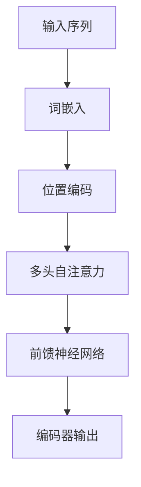
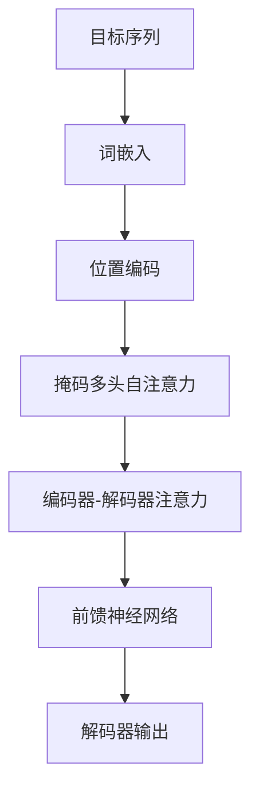

# Transformer在自然语言处理中的应用

作者：禅与计算机程序设计艺术

---

## 1. 背景介绍

### 1.1 自然语言处理的发展历程

自然语言处理（NLP）是计算机科学和人工智能领域的一个重要分支，旨在实现计算机对人类语言的理解和生成。早期的NLP系统依赖于规则和统计方法，这些方法虽然在特定任务中取得了一些成功，但在处理复杂语言现象时往往力不从心。随着深度学习的兴起，NLP迎来了新的发展机遇，尤其是基于神经网络的方法，如循环神经网络（RNN）和长短期记忆网络（LSTM），在诸多NLP任务中展现了强大的性能。

### 1.2 Transformer的引入

2017年，Vaswani等人在论文《Attention is All You Need》中提出了Transformer模型，彻底改变了NLP领域的格局。Transformer摒弃了传统的RNN结构，采用了完全基于注意力机制的架构，大大提升了模型的训练效率和性能。自此，Transformer成为了NLP领域的主流模型，并催生了一系列强大的变体，如BERT、GPT和T5等。

### 1.3 文章结构

本文将详细介绍Transformer在自然语言处理中的应用，涵盖背景知识、核心概念、算法原理、数学模型、项目实践、实际应用场景、工具和资源推荐、未来发展趋势与挑战以及常见问题与解答。

---

## 2. 核心概念与联系

### 2.1 注意力机制

注意力机制是Transformer的核心思想之一。它允许模型在处理每个词时，动态地选择关注输入序列中的不同部分，从而更好地捕捉长距离依赖关系。注意力机制的基本形式是通过计算查询（Query）、键（Key）和值（Value）之间的相似度来实现的。

### 2.2 自注意力机制（Self-Attention）

自注意力机制是Transformer中的一个重要组成部分，它允许模型在同一输入序列的不同位置之间建立联系。自注意力机制通过计算输入序列中每个词对其他所有词的注意力权重，从而实现信息的动态聚合。

### 2.3 多头注意力机制（Multi-Head Attention）

多头注意力机制是对单一注意力机制的扩展，它通过并行计算多个注意力头，使模型能够捕捉到不同的子空间信息。每个注意力头独立地执行注意力计算，最后将所有头的输出进行拼接并线性变换，得到最终的多头注意力输出。

### 2.4 位置编码（Positional Encoding）

由于Transformer模型不使用RNN或CNN结构，它无法直接捕捉输入序列中词的位置信息。为了解决这个问题，Transformer引入了位置编码，通过将位置信息加入到词向量中，使模型能够感知词在序列中的相对位置。

### 2.5 编码器-解码器架构

Transformer采用了编码器-解码器架构，其中编码器负责将输入序列编码成隐表示，解码器则根据编码器的输出生成目标序列。编码器和解码器均由多个相同的层堆叠而成，每层包含多头自注意力机制和前馈神经网络。

---

## 3. 核心算法原理具体操作步骤

### 3.1 编码器的操作步骤

#### 3.1.1 输入嵌入

编码器首先将输入序列中的每个词转换为词向量，这些词向量通常通过预训练的词嵌入模型（如Word2Vec或GloVe）获得。

#### 3.1.2 位置编码

将位置编码加入到词向量中，使模型能够感知词在序列中的相对位置。位置编码通常采用正弦和余弦函数生成。

#### 3.1.3 多头自注意力机制

对输入序列进行多头自注意力计算，得到每个词对其他所有词的注意力权重，并根据这些权重对输入序列进行加权求和，得到新的表示。

#### 3.1.4 前馈神经网络

将多头自注意力的输出传入前馈神经网络，前馈神经网络由两个线性变换和一个激活函数组成。

#### 3.1.5 残差连接和层归一化

在每个子层之后，添加残差连接和层归一化，以确保梯度的稳定性和模型的训练效率。

### 3.2 解码器的操作步骤

#### 3.2.1 输入嵌入

解码器首先将目标序列中的每个词转换为词向量。

#### 3.2.2 位置编码

将位置编码加入到词向量中，使模型能够感知词在序列中的相对位置。

#### 3.2.3 掩码多头自注意力机制

对目标序列进行掩码多头自注意力计算，掩码的作用是确保解码器在生成当前词时，只能看到当前词之前的词。

#### 3.2.4 编码器-解码器注意力机制

对编码器的输出和解码器的输入进行多头注意力计算，使解码器能够利用编码器的隐表示生成目标序列。

#### 3.2.5 前馈神经网络

将编码器-解码器注意力的输出传入前馈神经网络，前馈神经网络由两个线性变换和一个激活函数组成。

#### 3.2.6 残差连接和层归一化

在每个子层之后，添加残差连接和层归一化，以确保梯度的稳定性和模型的训练效率。

---

## 4. 数学模型和公式详细讲解举例说明

### 4.1 注意力机制的数学定义

注意力机制的核心在于计算查询（Query）、键（Key）和值（Value）之间的相似度。具体来说，给定查询矩阵 $Q$，键矩阵 $K$ 和值矩阵 $V$，注意力机制的输出可以表示为：

$$
\text{Attention}(Q, K, V) = \text{softmax}\left(\frac{QK^T}{\sqrt{d_k}}\right)V
$$

其中，$d_k$ 是键向量的维度，用于对相似度进行缩放。

### 4.2 自注意力机制

在自注意力机制中，查询、键和值均来自同一输入序列。假设输入序列的表示为 $X$，则自注意力机制的输出可以表示为：

$$
\text{Self-Attention}(X) = \text{Attention}(XW_Q, XW_K, XW_V)
$$

其中，$W_Q$，$W_K$ 和 $W_V$ 分别是查询、键和值的线性变换矩阵。

### 4.3 多头注意力机制

多头注意力机制通过并行计算多个注意力头，使模型能够捕捉到不同的子空间信息。假设有 $h$ 个注意力头，每个头的输出可以表示为：

$$
\text{head}_i = \text{Attention}(QW_{Q_i}, KW_{K_i}, VW_{V_i})
$$

多头注意力机制的输出则为：

$$
\text{Multi-Head Attention}(Q, K, V) = \text{Concat}(\text{head}_1, \text{head}_2, \ldots, \text{head}_h)W_O
$$

其中，$W_{Q_i}$，$W_{K_i}$，$W_{V_i}$ 和 $W_O$ 是线性变换矩阵。

### 4.4 位置编码

位置编码通过将位置信息加入到词向量中，使模型能够感知词在序列中的相对位置。位置编码通常采用正弦和余弦函数生成：

$$
PE_{(pos, 2i)} = \sin\left(\frac{pos}{10000^{2i/d_{model}}}\right)
$$

$$
PE_{(pos, 2i+1)} = \cos\left(\frac{pos}{10000^{2