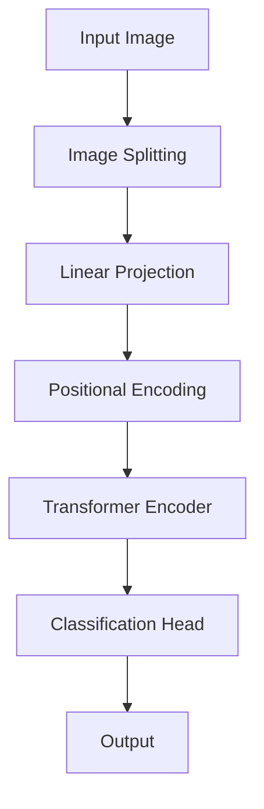

# "ViT问答集：解答您关于ViT的所有疑惑"

## 1. 背景介绍

### 1.1 计算机视觉的发展历程

计算机视觉是人工智能领域的一个重要分支,旨在使机器能够像人类一样理解和解释数字图像或视频。自20世纪60年代以来,计算机视觉一直是研究的热点领域,并取得了长足的进步。

传统的计算机视觉系统主要依赖于手工设计的特征提取器和分类器,如SIFT、HOG等。这些方法需要大量的领域知识和人工参与,难以推广到更复杂的视觉任务。

### 1.2 深度学习在计算机视觉中的应用

2012年,AlexNet在ImageNet大赛上取得了巨大的成功,标志着深度学习在计算机视觉领域的崛起。自此,基于卷积神经网络(CNN)的深度学习模型在图像分类、目标检测、语义分割等任务上取得了卓越的表现。

CNN的关键优势在于自动学习特征表示,而不需要手工设计特征提取器。然而,CNN在处理像素级数据时存在一些固有的局限性,例如对长程依赖的建模能力有限、对位移、缩放和旋转等变换不够鲁棒等。

### 1.3 Transformer在自然语言处理中的成功

2017年,Transformer模型在机器翻译任务中取得了突破性的成果,它完全依赖于注意力机制来捕获输入和输出之间的长程依赖关系,而不再使用循环神经网络或卷积神经网络。

Transformer的出现为自然语言处理领域带来了革命性的变化,促进了大型预训练语言模型(如BERT、GPT等)的发展,极大地推动了该领域的进步。

### 1.4 ViT:视觉Transformer的兴起

受到Transformer在NLP领域的巨大成功的启发,研究人员开始尝试将其应用于计算机视觉任务。2020年,谷歌大脑团队提出了Vision Transformer(ViT),首次将Transformer直接应用于图像数据,并在多个计算机视觉基准测试中取得了令人印象深刻的性能。

ViT的出现为计算机视觉领域带来了全新的视角,开辟了一条崭新的研究方向。它有望克服CNN固有的局限性,并为视觉任务提供更强大的建模能力。

## 2. 核心概念与联系

### 2.1 Transformer架构

Transformer是一种全新的深度学习模型架构,它完全基于注意力机制,不使用任何卷积或循环操作。Transformer的核心组件包括:

1. **编码器(Encoder)**: 将输入序列(如文本或图像块)映射到连续的表示。
2. **解码器(Decoder)**: 根据编码器的输出生成目标序列(如翻译后的文本)。
3. **多头注意力机制(Multi-Head Attention)**: 允许模型同时关注输入序列的不同部分,捕获长程依赖关系。
4. **位置编码(Positional Encoding)**: 注入序列的位置信息,因为Transformer本身没有对位置的内在表示。

在ViT中,只使用了Transformer的编码器部分,因为图像分类是一个编码任务,不需要生成序列输出。

### 2.2 ViT:将Transformer应用于图像

为了将Transformer应用于图像数据,ViT采取了以下关键步骤:

1. **图像分割(Image Splitting)**: 将输入图像分割成一系列固定大小的图像块(patches)。
2. **线性投影(Linear Projection)**: 将每个图像块映射到一个固定维度的向量,称为patch embedding。
3. **位置编码(Positional Encoding)**: 为每个patch embedding添加位置信息,以保留图像的空间结构。
4. **Transformer编码器(Transformer Encoder)**: 将一系列patch embedding输入到标准的Transformer编码器中,对它们进行编码和建模。
5. **分类头(Classification Head)**: 在Transformer编码器的输出上附加一个小的前馈神经网络,用于执行图像分类任务。

通过这种方式,ViT能够直接对图像数据进行建模,而不需要使用任何手工设计的特征提取器或卷积操作。

### 2.3 ViT与CNN的区别

ViT与传统的CNN存在一些关键区别:

1. **架构差异**: ViT完全基于注意力机制,而CNN主要依赖卷积操作。
2. **长程依赖建模**: ViT能够更好地捕获图像中的长程依赖关系,而CNN在这方面存在局限性。
3. **数据不变性**: CNN具有一定的平移不变性,但对缩放和旋转等变换不够鲁棒。ViT则需要通过数据增强来提高对这些变换的鲁棒性。
4. **计算复杂度**: ViT的计算复杂度通常高于CNN,尤其是对于大型输入图像。
5. **归纳偏置**: CNN利用了图像的局部结构和平移不变性,而ViT则需要从数据中学习这些先验知识。

尽管ViT在某些方面存在局限性,但它为计算机视觉领域开辟了新的研究方向,并展现出了巨大的潜力。

## 3. 核心算法原理具体操作步骤

### 3.1 ViT模型架构

ViT模型的核心架构如下所示:

1. **输入图像(Input Image)**: ViT接受一个固定大小的RGB图像作为输入。
2. **图像分割(Image Splitting)**: 将输入图像分割成一系列固定大小的图像块(patches)。
3. **线性投影(Linear Projection)**: 将每个图像块映射到一个固定维度的向量,称为patch embedding。
4. **位置编码(Positional Encoding)**: 为每个patch embedding添加位置信息,以保留图像的空间结构。
5. **Transformer编码器(Transformer Encoder)**: 将一系列patch embedding输入到标准的Transformer编码器中,对它们进行编码和建模。
6. **分类头(Classification Head)**: 在Transformer编码器的输出上附加一个小的前馈神经网络,用于执行图像分类任务。
7. **输出(Output)**: 模型输出图像的预测类别。

### 3.2 图像分割和线性投影

在ViT中,输入图像首先被分割成一系列固定大小的图像块(patches)。每个图像块被展平并通过一个线性投影层映射到一个固定维度的向量,称为patch embedding。

具体操作步骤如下:

1. 将输入图像 $I \in \mathbb{R}^{H \times W \times C}$ 分割成一系列 $N$ 个非重叠图像块,其中 $N = \frac{HW}{P^2}$, $P$ 是每个图像块的大小。
2. 将每个图像块展平为一个向量 $x_p \in \mathbb{R}^{P^2 \cdot C}$。
3. 通过一个线性投影层 $E: \mathbb{R}^{P^2 \cdot C} \rightarrow \mathbb{R}^D$,将每个图像块向量 $x_p$ 映射到一个 $D$ 维的patch embedding向量 $z_p$:

$$z_p = Ex_p + E_{pos}$$

其中 $E_{pos} \in \mathbb{R}^D$ 是一个可学习的位置嵌入,用于保留图像块在原始图像中的位置信息。

4. 将所有 $N$ 个patch embedding向量 $z_p$ 拼接成一个矩阵 $Z_0 \in \mathbb{R}^{N \times D}$,作为Transformer编码器的输入。

通过这种方式,ViT将图像数据转换为一系列向量序列,并保留了图像块在原始图像中的位置信息。这些向量序列随后被输入到Transformer编码器中进行建模和编码。

### 3.3 Transformer编码器

ViT模型的核心部分是标准的Transformer编码器,它由多个相同的编码器层组成。每个编码器层包含两个关键子层:多头注意力(Multi-Head Attention)和前馈神经网络(Feed-Forward Neural Network)。

1. **多头注意力子层**

多头注意力机制允许模型同时关注输入序列的不同部分,捕获长程依赖关系。具体操作步骤如下:

   a. 将输入 $X$ 线性映射到查询(Query)、键(Key)和值(Value)向量:
      $$Q = XW^Q, K = XW^K, V = XW^V$$

   b. 计算注意力权重:
      $$\text{Attention}(Q, K, V) = \text{softmax}(\frac{QK^T}{\sqrt{d_k}})V$$

   c. 对多个注意力头的输出进行拼接和线性变换,得到最终的注意力输出。

2. **前馈神经网络子层**

前馈神经网络子层对每个位置的表示进行独立的非线性变换,其形式为两个全连接层,中间使用GELU非线性激活函数。

3. **残差连接和层归一化**

在每个子层之后,ViT使用残差连接和层归一化来促进梯度传播和加速收敛。

通过堆叠多个编码器层,Transformer编码器能够对输入序列(在ViT中是一系列patch embedding)进行编码和建模,捕获它们之间的长程依赖关系。

### 3.4 分类头和输出

在Transformer编码器的输出上,ViT附加了一个小的前馈神经网络,称为分类头(Classification Head)。分类头的作用是将编码器的输出映射到所需的输出空间,例如在图像分类任务中,将其映射到一个向量,表示每个类别的概率分数。

具体操作步骤如下:

1. 从Transformer编码器的输出中取出第一个patch embedding向量 $z_{0}$,它对应于整个图像的表示。
2. 通过一个前馈神经网络 $f: \mathbb{R}^D \rightarrow \mathbb{R}^K$,将 $z_{0}$ 映射到一个 $K$ 维向量 $y$,其中 $K$ 是类别数。
3. 对向量 $y$ 应用softmax函数,得到每个类别的预测概率分数 $\hat{y}$:

$$\hat{y} = \text{softmax}(y)$$

4. 在训练阶段,使用交叉熵损失函数计算预测值 $\hat{y}$ 与真实标签 $y$ 之间的损失,并通过反向传播算法优化模型参数。
5. 在推理阶段,选择概率分数最高的类别作为模型的预测输出。

通过这种方式,ViT能够将Transformer编码器学习到的图像表示映射到所需的输出空间,完成图像分类或其他计算机视觉任务。

## 4. 数学模型和公式详细讲解举例说明

### 4.1 注意力机制

注意力机制是Transformer及ViT的核心,它允许模型动态地关注输入序列的不同部分,捕获长程依赖关系。在ViT中,注意力机制被应用于一系列patch embedding向量,以建模它们之间的相互关系。

注意力机制的数学表示如下:

$$\text{Attention}(Q, K, V) = \text{softmax}(\frac{QK^T}{\sqrt{d_k}})V$$

其中:

- $Q \in \mathbb{R}^{n \times d_k}$ 是查询(Query)矩阵,表示我们想要关注的部分。
- $K \in \mathbb{R}^{n \times d_k}$ 是键(Key)矩阵,表示我们要关注的对象。
- $V \in \mathbb{R}^{n \times d_v}$ 是值(Value)矩阵,表示我们要获取的信息。
- $d_k$ 和 $d_v$ 分别是键和值的维度。
- $\frac{QK^T}{\sqrt{d_k}}$ 计算查询和键之间的相似性分数,并除以 $\sqrt{d_k}$ 进行缩放,以防止softmax函数的梯度过小或过大。
- $\text{softmax}(\cdot)$ 函数将相似性分数转换为概率分布,表示每个位置应该关注其他位置的程度。
- 最终的注意力输出是值矩阵 $V$ 根据注意力权重的加权和。

注意力机制允许模型动态地分配不同位置之间的关注度,从