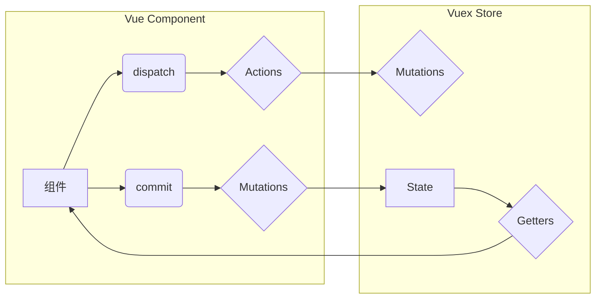

## 1. 背景介绍

### 1.1 单页面应用与状态管理的挑战
近年来，随着前端技术的飞速发展，单页面应用（SPA）逐渐成为构建现代Web应用的主流模式。与传统的服务器端渲染应用相比，SPA具有更流畅的用户体验、更高的开发效率等优势。然而，随着SPA应用规模的不断扩大，如何有效地管理应用状态成为了开发者面临的一大挑战。

传统的组件间通信方式，例如props传递、事件总线等，在处理复杂应用状态时显得力不从心，容易导致代码难以维护、数据流混乱等问题。为了解决这些问题，状态管理库应运而生，例如Redux、MobX、Vuex等，它们提供了一种集中管理应用状态的机制，使得状态变化可预测、可追踪，从而提高了应用的可维护性和可扩展性。

### 1.2 Vuex：专为Vue.js设计的集中式状态管理方案
Vuex是专为Vue.js应用程序开发的状态管理库。它遵循Flux架构模式，将应用状态集中存储在一个全局状态树中，并提供了一套规范化的操作来访问和修改状态。Vuex的出现，为Vue.js开发者提供了一种优雅且高效的状态管理方案，使得构建大型、复杂的SPA应用变得更加容易。

### 1.3 模块化：应对大型应用复杂性的利器
当Vue.js应用的规模不断扩大，状态管理的复杂性也会随之增加。如果将所有状态都集中在一个全局store中，会导致store过于庞大，难以维护。为了应对这种复杂性，Vuex引入了模块化的概念，允许将store分割成多个模块，每个模块拥有自己的状态、mutations、actions等，从而降低了状态管理的复杂度，提高了代码的可维护性。

## 2. 核心概念与联系

### 2.1 状态（State）
状态是应用数据的单一数据源，它是一个包含所有应用数据的JavaScript对象。在Vuex中，状态是响应式的，任何对状态的修改都会触发视图的更新。

### 2.2  Getters
Getters 是从 store 中的 state 派生出状态的函数。Getters 类似于组件中的计算属性，它可以对 state 中的数据进行过滤、计算等操作，并将结果缓存起来，只有当依赖的 state 发生改变时才会重新计算。

### 2.3 变更（Mutations）
Mutations 是同步函数，用于修改状态。在Vuex中，状态的修改只能通过提交 mutations 来完成，mutations 必须是同步的，以便于追踪状态的变化。

### 2.4  Actions
Actions 类似于 mutations，不同的是 Actions 提交的是 mutations，而不是直接变更状态。Actions 可以包含异步操作，例如网络请求、定时器等。

### 2.5 模块（Modules）
模块是将 store 分割成更小、更可管理的部分的一种机制。每个模块都包含自己的 state、mutations、actions、getters 等。

### 2.6 核心概念联系图



## 3. 核心算法原理具体操作步骤

### 3.1 创建模块

```javascript
const moduleA = {
  state: () => ({
    count: 0
  }),
  mutations: {
    increment (state) {
      state.count++
    }
  },
  actions: {
    incrementAsync (context) {
      setTimeout(()