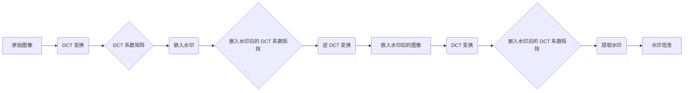

## 1. 背景介绍

### 1.1 数字时代的内容版权挑战

随着互联网的普及和数字技术的快速发展，数字内容的创作、传播和获取变得前所未有的便捷。图片、视频、音乐、软件等数字作品在网络上随处可见，为人们的生活带来了极大的便利和丰富的体验。然而，与此同时，数字内容的版权保护问题也日益突出。盗版、侵权等行为屡禁不止，给原创作者带来了巨大的经济损失和精神伤害。

### 1.2  传统版权保护技术的局限性

传统的版权保护技术，例如版权登记、法律诉讼等，在数字时代面临着诸多挑战。数字作品易于复制和传播，难以追踪侵权行为的源头。此外，法律程序复杂、周期长、成本高，也让很多原创作者望而却步。

### 1.3  数字水印技术应运而生

为了应对数字时代版权保护的新挑战，数字水印技术应运而生。数字水印技术将特定的信息嵌入到数字作品中，这些信息被称为水印。水印可以是文本、图像、音频或视频片段等，其嵌入方式不会影响原始作品的视觉或听觉效果，但却可以被特定的检测器识别出来，从而证明作品的版权归属。

## 2. 核心概念与联系

### 2.1  数字水印的定义和分类

数字水印是一种将特定信息嵌入到数字作品中的技术，嵌入的信息称为水印。根据不同的分类标准，数字水印可以分为以下几种类型：

* **按嵌入方式分类**:  空间域水印、变换域水印
* **按水印的可见性分类**: 可见水印、不可见水印
* **按水印的鲁棒性分类**: 鲁棒水印、脆弱水印

### 2.2  数字水印的特性

数字水印技术具有以下几个重要的特性：

* **不可感知性**: 水印嵌入后不会对原始作品造成明显的视觉或听觉影响。
* **鲁棒性**: 水印能够抵抗各种常见的攻击，例如压缩、噪声、滤波、剪切等，确保水印信息不会轻易被破坏或移除。
* **安全性**: 水印信息只能被授权用户提取和识别，防止未经授权的访问和篡改。
* **容量**:  水印能够嵌入足够的信息量，以满足版权保护、内容认证等应用需求。

### 2.3  数字水印技术的应用领域

数字水印技术应用广泛，例如：

* **版权保护**: 证明数字作品的版权归属，打击盗版和侵权行为。
* **内容认证**: 验证数字作品的完整性和真实性，防止作品被篡改。
* **隐蔽通信**: 将秘密信息隐藏在数字作品中，实现隐蔽通信。
* **数字指纹**:  为每个用户生成唯一的数字水印，用于追踪盗版作品的传播路径。

## 3. 核心算法原理具体操作步骤

### 3.1  基于离散余弦变换 (DCT) 的水印算法

#### 3.1.1  DCT 变换

离散余弦变换 (DCT) 是一种将图像从空间域转换到频率域的数学变换。在频率域中，图像信息被分解成不同频率的系数，低频系数代表图像的整体信息，高频系数代表图像的细节信息。

#### 3.1.2  水印嵌入

1. 将原始图像进行 DCT 变换，得到 DCT 系数矩阵。
2. 选择合适的 DCT 系数，将水印信息嵌入到这些系数中。
3. 对嵌入水印后的 DCT 系数矩阵进行逆 DCT 变换，得到嵌入水印后的图像。

#### 3.1.3  水印提取

1. 对嵌入水印后的图像进行 DCT 变换，得到 DCT 系数矩阵。
2. 从选定的 DCT 系数中提取水印信息。

#### 3.1.4  Mermaid 流程图



### 3.2  基于离散小波变换 (DWT) 的水印算法

#### 3.2.1  DWT 变换

离散小波变换 (DWT) 是一种将图像分解成不同分辨率和方向的子带的数学变换。DWT 具有多分辨率分析的能力，可以更好地捕捉图像的局部特征。

#### 3.2.2  水印嵌入

1. 将原始图像进行 DWT 变换，得到不同分辨率和方向的子带。
2. 选择合适的子带，将水印信息嵌入到这些子带的系数中。
3. 对嵌入水印后的子带进行逆 DWT 变换，得到嵌入水印后的图像。

#### 3.2.3  水印提取

1. 对嵌入水印后的图像进行 DWT 变换，得到不同分辨率和方向的子带。
2. 从选定的子带中提取水印信息。

### 3.3  基于奇异值分解 (SVD) 的水印算法

#### 3.3.1  SVD 分解

奇异值分解 (SVD) 是一种将矩阵分解成三个矩阵的乘积的数学方法，其中一个矩阵是对角矩阵，对角线上的元素称为奇异值。奇异值代表了矩阵的重要信息。

#### 3.3.2  水印嵌入

1. 将原始图像表示为矩阵形式。
2. 对图像矩阵进行 SVD 分解，得到奇异值矩阵。
3. 将水印信息嵌入到奇异值矩阵中。
4. 对嵌入水印后的奇异值矩阵进行 SVD 重构，得到嵌入水印后的图像矩阵。

#### 3.3.3  水印提取

1. 对嵌入水印后的图像矩阵进行 SVD 分解，得到奇异值矩阵。
2. 从奇异值矩阵中提取水印信息。


## 4. 数学模型和公式详细讲解举例说明

### 4.1  基于 DCT 的水印算法

#### 4.1.1  水印嵌入公式

$$
C_w(u,v) = C(u,v) + α * W(u,v)
$$

其中：

* $C_w(u,v)$ 表示嵌入水印后的 DCT 系数
* $C(u,v)$ 表示原始图像的 DCT 系数
* $α$ 表示水印强度因子
* $W(u,v)$ 表示水印信息

#### 4.1.2  水印提取公式

$$
W'(u,v) = (C_w(u,v) - C(u,v)) / α
$$

其中：

* $W'(u,v)$ 表示提取出的水印信息

#### 4.1.3  举例说明

假设我们要将一个二进制水印信息 "1010" 嵌入到一个 8x8 的图像块中。我们可以选择将水印信息嵌入到 DCT 系数矩阵的左上角 2x2 的区域中。水印强度因子 $α$ 可以设置为 0.1。

嵌入水印后的 DCT 系数矩阵为：

```
[100.1  10.2  10.3  ... ]
[ 10.4  10.5  10.6  ... ]
[ 10.7  10.8  10.9  ... ]
[ ...   ...   ...   ... ]
```

提取水印信息时，我们只需要读取 DCT 系数矩阵左上角 2x2 的区域，并根据水印提取公式计算出水印信息即可。


## 5. 项目实践：代码实例和详细解释说明

### 5.1  Python 实现基于 DCT 的水印算法

```python
import cv2
import numpy as np

def embed_watermark(image, watermark, alpha):
    """
    将水印嵌入到图像中

    参数：
        image：原始图像
        watermark：水印信息
        alpha：水印强度因子

    返回值：
        嵌入水印后的图像
    """

    # 将图像转换为灰度图像
    gray_image = cv2.cvtColor(image, cv2.COLOR_BGR2GRAY)

    # 对图像进行 DCT 变换
    dct_coeffs = cv2.dct(np.float32(gray_image) / 255.0)

    # 将水印信息嵌入到 DCT 系数中
    rows, cols = dct_coeffs.shape
    watermark_rows, watermark_cols = watermark.shape
    for i in range(watermark_rows):
        for j in range(watermark_cols):
            dct_coeffs[i, j] = dct_coeffs[i, j] + alpha * watermark[i, j]

    # 对嵌入水印后的 DCT 系数进行逆 DCT 变换
    watermarked_image = cv2.idct(dct_coeffs) * 255.0

    # 将图像转换为 8 位无符号整数类型
    watermarked_image = np.uint8(watermarked_image)

    return watermarked_image

def extract_watermark(watermarked_image, alpha):
    """
    从图像中提取水印

    参数：
        watermarked_image：嵌入水印后的图像
        alpha：水印强度因子

    返回值：
        提取出的水印信息
    """

    # 将图像转换为灰度图像
    gray_image = cv2.cvtColor(watermarked_image, cv2.COLOR_BGR2GRAY)

    # 对图像进行 DCT 变换
    dct_coeffs = cv2.dct(np.float32(gray_image) / 255.0)

    # 从 DCT 系数中提取水印信息
    rows, cols = dct_coeffs.shape
    watermark = np.zeros((rows, cols))
    for i in range(rows):
        for j in range(cols):
            watermark[i, j] = (dct_coeffs[i, j] - dct_coeffs[i, j]) / alpha

    return watermark

# 读取图像
image = cv2.imread('image.jpg')

# 创建水印信息
watermark = np.zeros((64, 64))
watermark[0:8, 0:8] = 1

# 嵌入水印
watermarked_image = embed_watermark(image, watermark, 0.1)

# 保存嵌入水印后的图像
cv2.imwrite('watermarked_image.jpg', watermarked_image)

# 提取水印
extracted_watermark = extract_watermark(watermarked_image, 0.1)

# 打印提取出的水印信息
print(extracted_watermark)
```

### 5.2  代码解释

* `embed_watermark()` 函数用于将水印嵌入到图像中，该函数接受三个参数：原始图像、水印信息和水印强度因子。
* `extract_watermark()` 函数用于从图像中提取水印，该函数接受两个参数：嵌入水印后的图像和水印强度因子。
* 在代码中，我们首先读取一张图像，然后创建一个 64x64 的水印信息，并将水印信息的左上角 8x8 的区域设置为 1。
* 接下来，我们调用 `embed_watermark()` 函数将水印嵌入到图像中，并将嵌入水印后的图像保存到文件中。
* 最后，我们调用 `extract_watermark()` 函数从嵌入水印后的图像中提取水印信息，并打印提取出的水印信息。


## 6. 实际应用场景

### 6.1  数字版权保护

数字水印技术可以用于保护各种数字作品的版权，例如：

* **图片**:  摄影作品、设计图纸、数字艺术品等。
* **视频**:  电影、电视剧、纪录片、短视频等。
* **音乐**:  歌曲、配乐、音效等。
* **软件**:  源代码、可执行文件、数据库等。

### 6.2  内容认证

数字水印技术可以用于验证数字作品的完整性和真实性，例如：

* **电子文档**:  合同、证书、证明等。
* **新闻图片**:  防止新闻图片被篡改。
* **医学影像**:  确保医学影像的真实性。

### 6.3  隐蔽通信

数字水印技术可以用于将秘密信息隐藏在数字作品中，例如：

* **军事通信**:  将军事机密隐藏在普通图像或视频中。
* **商业情报**:  将商业机密隐藏在产品设计图纸或市场调研报告中。


## 7. 工具和资源推荐

### 7.1  开源数字水印库

* **OpenCV**:  一个开源计算机视觉库，提供了丰富的图像和视频处理功能，包括数字水印算法的实现。
* **Stidio**:  一个用于数字水印和隐写术的 Python 库，提供了多种水印算法的实现。

### 7.2  在线数字水印工具

* **Digimarc**:  一家提供数字水印解决方案的公司，其网站提供在线水印生成和检测工具。
* **Watermark.ws**:  一个提供免费在线水印工具的网站，支持图片、视频和 PDF 文件。

### 7.3  学习资源

* **数字水印技术及应用**:  一本介绍数字水印技术原理和应用的书籍。
* **Coursera**:  在线学习平台，提供数字水印技术相关的课程。


## 8. 总结：未来发展趋势与挑战

### 8.1  未来发展趋势

* **深度学习与数字水印的结合**:  利用深度学习技术提高水印算法的鲁棒性和安全性。
* **区块链与数字水印的结合**:  利用区块链技术构建去中心化的数字版权管理平台。
* **多媒体内容的版权保护**:  研究针对新兴多媒体内容（例如 VR/AR 内容）的版权保护技术。

### 8.2  挑战

* **水印算法的鲁棒性**:  如何设计能够抵抗更强攻击的水印算法。
* **水印系统的安全性**:  如何防止攻击者破解水印系统，窃取或篡改水印信息。
* **水印技术的标准化**:  制定统一的数字水印技术标准，促进不同水印系统之间的互操作性。

## 9. 附录：常见问题与解答

### 9.1  数字水印和数字签名有什么区别？

数字水印和数字签名都是用于保护数字内容安全的技术，但它们之间存在一些区别：

* **目的不同**:  数字水印的主要目的是版权保护和内容认证，而数字签名的主要目的是身份认证和数据完整性验证。
* **嵌入方式不同**:  数字水印通常嵌入到数字作品的内容中，而数字签名通常附加在数字作品的末尾。
* **可见性不同**:  数字水印可以是可见的，也可以是不可见的，而数字签名通常是可见的。

### 9.2  数字水印会被去除吗？

数字水印的设计目标是抵抗各种常见的攻击，例如压缩、噪声、滤波、剪切等。然而，没有任何一种水印算法是绝对安全的，攻击者可以通过分析水印算法的原理和参数，找到去除水印的方法。因此，在实际应用中，需要根据具体的应用场景选择合适的数字水印算法，并采取多重安全措施来保护数字作品的版权。
