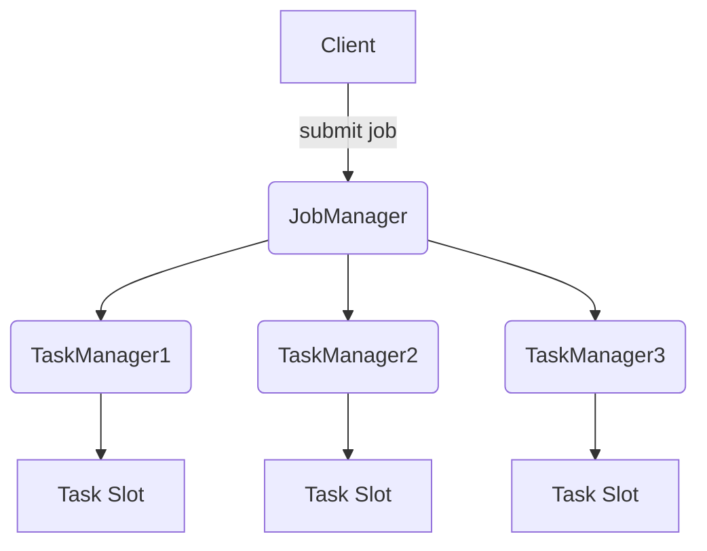
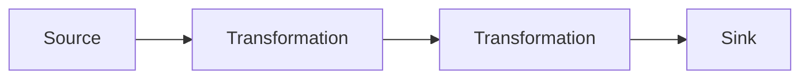
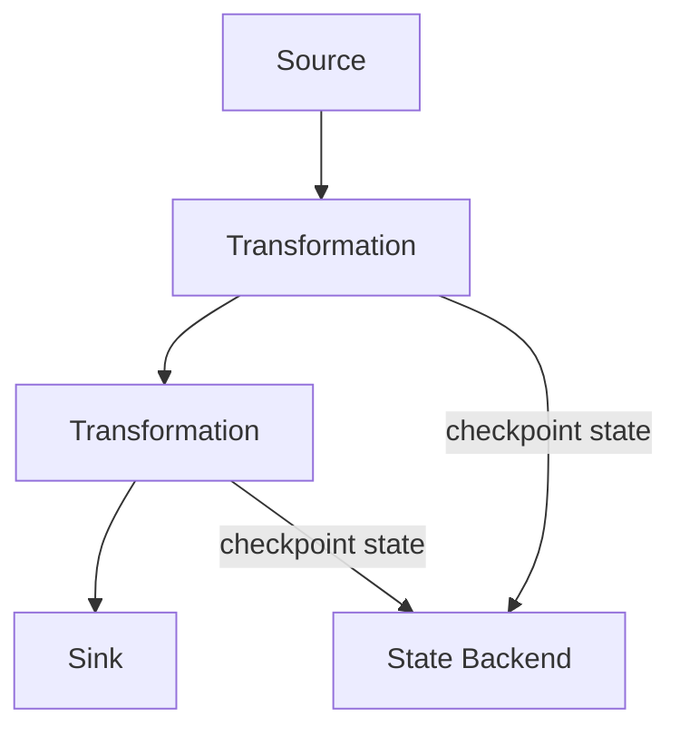

# 【AI大数据计算原理与代码实例讲解】Flink

## 1. 背景介绍

### 1.1 大数据时代的到来

随着互联网、物联网和移动互联网的快速发展,海量的数据正以前所未有的规模和速度被产生和积累。这些数据蕴含着巨大的价值,为企业带来了新的机遇和挑战。传统的数据处理方式已经无法满足当前大数据环境下的需求,因此大数据处理技术应运而生。

### 1.2 大数据处理的需求与挑战

大数据处理面临着以下几个主要挑战:

1. **大规模数据存储和管理**:如何高效地存储和管理PB甚至EB级别的海量数据?
2. **高性能数据处理**:如何快速地对大规模数据进行处理和分析?
3. **实时性和低延迟**:对于一些应用场景,需要以毫秒或秒级的低延迟对数据进行实时处理。
4. **容错性和高可用性**:大规模分布式系统需要具备良好的容错能力和高可用性。

### 1.3 大数据处理技术发展历程

为了应对大数据处理的挑战,出现了一系列创新的大数据处理技术和框架,例如:

- **Apache Hadoop**:最早也是最具代表性的大数据处理框架,主要用于离线批处理。
- **Apache Spark**:针对Hadoop的批处理缺陷,提出了更高效的内存计算模型,支持批处理和流处理。
- **Apache Storm**:专注于实时流处理,具有毫秒级的低延迟特性。
- **Apache Flink**:新一代统一的批流处理引擎,具有高吞吐、低延迟和精确一次语义等优势。

## 2. 核心概念与联系

### 2.1 Apache Flink 概述

Apache Flink是一个开源的分布式大数据处理引擎,最初由柏林理工大学的学生开发。Flink支持有状态计算,具有高吞吐、低延迟和精确一次(Exactly-Once)语义等优势。它可以在所有常见的集群环境中运行,并可以与众多常用的调度器(如YARN、Kubernetes)无缝集成。

### 2.2 Flink 核心概念

#### 2.2.1 流与批处理

Flink 将流式处理作为内核,批处理则被视为有界的流处理特例。这种统一的流式处理模型使得Flink可以同时支持批处理和流处理工作负载。

#### 2.2.2 有状态计算

Flink 支持有状态计算,可以维护应用程序的状态,并在发生故障时自动进行恢复。这种状态管理能力使得Flink可以支持更复杂的应用场景,如会话窗口、数据库连接池等。

#### 2.2.3 分布式数据流

Flink 中的数据被建模为持续不断的流,可以从各种源(如消息队列、文件系统等)获取数据,并将结果输出到不同的目标系统。数据流可以被转换、过滤、聚合等操作。

#### 2.2.4 Window 操作

Flink 提供了各种窗口操作,如滚动窗口、滑动窗口、会话窗口等,用于对无界数据流进行切分并进行聚合计算。窗口是对流式数据进行切分的一种方式。

### 2.3 Flink 与其他大数据框架的关系

- **Apache Hadoop**: Flink 可以与 HDFS 等 Hadoop 组件无缝集成,支持读写 HDFS 数据。
- **Apache Kafka**: Flink 可以从 Kafka 消费数据,并将结果输出到 Kafka。Kafka 常作为 Flink 的数据源和输出目标。
- **Apache Hive**: Flink 可以读写 Hive 表,支持使用 HiveQL 查询 Hive 数据。
- **Apache Spark**: Flink 和 Spark 都支持批处理和流处理,但 Flink 的流处理性能更优异,而 Spark 在批处理方面更加成熟。

## 3. 核心算法原理具体操作步骤

### 3.1 Flink 架构概览

Flink 采用了主从架构,由一个 JobManager(主节点)和多个 TaskManager(从节点)组成。



- **Client**: 用于提交 Flink 作业,并监控作业执行情况。
- **JobManager**: 负责协调分布式执行,调度任务、协调 checkpoint 等。
- **TaskManager**: 执行具体的任务,在 Task Slot 中执行一个或多个子任务。
- **Task Slot**: 在 TaskManager 进程中的工作线程,用于执行子任务。

### 3.2 Flink 执行模型

Flink 采用了基于流的执行模型,所有计算都是对逻辑流的转换操作。



- **Source**: 定义了数据的来源,如文件、socket、Kafka 等。
- **Transformation**: 对数据流进行各种转换操作,如 map、flatMap、filter、window 等。
- **Sink**: 定义了数据的输出位置,如文件系统、数据库、远程系统等。

### 3.3 流处理核心算法

Flink 的核心流处理算法主要体现在以下几个方面:

#### 3.3.1 数据分区

Flink 采用了基于 Stream Partitioning 的数据分区策略,将数据流分散到不同的子任务中进行处理,以实现并行计算。主要分区策略有:

- **Rebalance**: 将数据随机分发到下游子任务,实现负载均衡。
- **Hash Partitioning**: 根据数据的 Key 进行 Hash 分区,相同 Key 的数据被分发到同一个子任务。
- **Forward Partitioning**: 将数据直接分发到下游子任务,保持分区和上游一致。

#### 3.3.2 有状态计算

Flink 通过 State Backend 实现有状态计算,将状态存储在可配置的State Backend中,如RocksDB等。Flink 支持以下几种状态:

- **Keyed State**: 根据 Key 对状态进行分区,每个 Key 对应一个状态实例。
- **Operator State**: 每个并行子任务一个状态实例,用于实现有状态的算子。
- **Broadcast State**: 将状态广播到所有并行子任务,用于实现低阶码(Low-Level Code)。

#### 3.3.3 窗口计算

Flink 实现了多种窗口模型,用于对流数据进行切分并进行聚合计算:

- **Tumbling Windows**: 无重叠的窗口,如每5分钟一个窗口。
- **Sliding Windows**: 有重叠的窗口,如每1分钟计算最近5分钟的数据。
- **Session Windows**: 根据数据活动模式动态合并窗口,用于会话数据处理。

窗口计算通常与状态管理和触发器(Triggers)结合使用,以实现复杂的窗口语义。

### 3.4 容错与恢复

为了实现高可用性和容错性,Flink 采用了基于 Chandy-Lamport 算法的分布式快照(Distributed Snapshots)机制,定期对有状态计算的状态进行 Checkpoint 并持久化存储。



当发生故障时,Flink 会从最近一次的 Checkpoint 处恢复计算状态,并重新处理数据,从而实现精确一次(Exactly-Once)语义。Checkpoint 可以持久化存储在分布式文件系统(如 HDFS)或高可用存储系统(如 RocksDB)中。

## 4. 数学模型和公式详细讲解举例说明

在大数据处理领域,常常需要应用一些数学模型和公式来对数据进行分析和处理。下面我们来看几个在 Flink 中常用的数学模型和公式。

### 4.1 基于 Reservoir Sampling 的采样算法

在处理大规模数据流时,我们通常无法将全部数据加载到内存中。因此,需要使用采样技术来获取一个数据子集,以便进行后续的处理和分析。Reservoir Sampling 算法是一种常用的采样技术,它可以在未知数据流长度的情况下,保证每个元素被选中的概率相等。

算法思想:

1. 初始化一个大小为 k 的reservoir(水塘),用前 k 个元素填充它。
2. 对于后续的每个元素 x,以 k/n 的概率将它替换掉reservoir中的一个随机元素,其中 n 为已处理的元素个数。

算法实现:

```java
import java.util.Random;

public class ReservoirSampling {
    private final Random random;
    private int[] reservoir;
    private int count;

    public ReservoirSampling(int k) {
        this.reservoir = new int[k];
        this.random = new Random();
        this.count = 0;
    }

    public void sample(int value) {
        count++;
        if (count <= reservoir.length) {
            reservoir[count - 1] = value;
        } else {
            int r = random.nextInt(count);
            if (r < reservoir.length) {
                reservoir[r] = value;
            }
        }
    }

    public int[] getReservoir() {
        return reservoir;
    }
}
```

在上面的实现中,我们维护了一个大小为 k 的 reservoir 数组,以及一个计数器 count 来记录已处理的元素个数。当 count 小于等于 k 时,我们将元素直接添加到 reservoir 中。当 count 大于 k 时,我们以 k/count 的概率将当前元素替换掉 reservoir 中的一个随机元素。

### 4.2 基于 Flajolet-Martin 算法的基数估计

在大数据处理中,经常需要估计一个数据集合中不重复元素的个数,即基数(Cardinality)。基数估计算法可以在不需要存储全部元素的情况下,对基数进行高效的近似估计。Flajolet-Martin 算法是一种常用的基数估计算法,它基于对数据进行哈希映射,并利用最大前缀0的位数来估计基数。

算法思想:

1. 对每个元素进行哈希映射,得到一个二进制串。
2. 计算每个二进制串中,从最右边开始的最长的连续0的个数,记为 R。
3. 维护一个 M 数组,其中 M[i] 表示 R=i 的元素个数。
4. 基数估计值为 $\phi^{-1}(m/n)$,其中 $\phi(x) = (1 - (1 - x)^{2^m})$,m 为 M 数组中非零元素的最大下标,n 为元素总数。

算法实现:

```java
import java.util.BitSet;

public class FlajoletMartin {
    private final int maxBits;
    private final BitSet bitSet;

    public FlajoletMartin(int maxBits) {
        this.maxBits = maxBits;
        this.bitSet = new BitSet(maxBits + 1);
    }

    public void add(long value) {
        byte[] bytes = longToByteArray(value);
        int leadingZeros = countLeadingZeros(bytes);
        bitSet.set(leadingZeros);
    }

    public long cardinality() {
        int maxZeros = maxBits - bitSet.length() + 1;
        double m = bitSet.cardinality();
        double n = Math.pow(2, maxZeros);
        return (long) (n * Math.pow(2, m / n));
    }

    private int countLeadingZeros(byte[] bytes) {
        int leadingZeros = 0;
        for (byte b : bytes) {
            if (b == 0) {
                leadingZeros += 8;
            } else {
                leadingZeros += Integer.numberOfLeadingZeros(b & 0xFF) / 8;
                break;
            }
        }
        return Math.min(leadingZeros, maxBits);
    }

    private byte[] longToByteArray(long value) {
        byte[] result = new byte[8];
        for (int i = 7; i >= 0; i--) {
            result[i] = (byte) (value & 0xFF);
            value >>= 8;
        }
        return result;
    }
}
```

在上面的实现中,我们使用一个 BitSet 来记录每个元素的最长前缀0的位数。countLeadingZeros 方法用于计算一个长