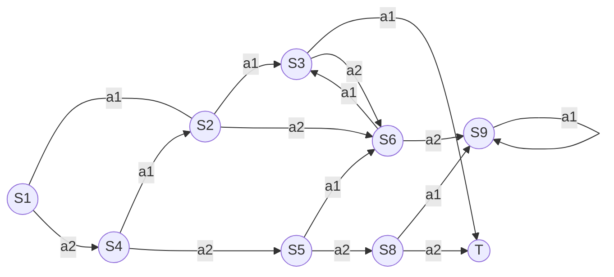

# 一切皆是映射：AI Q-learning在智能电网中的探索

作者：禅与计算机程序设计艺术

## 1.背景介绍
### 1.1 智能电网的挑战与机遇
智能电网作为新一代电力系统,与传统电网相比具有信息化、自动化、互动化等特点。它通过先进的传感测量技术、通信技术、信息技术与控制技术的融合,实现电网的可靠、安全、经济、高效、环境友好和安全运行。

然而,智能电网的实现面临着诸多挑战:
- 海量异构数据的采集与融合
- 电力负荷的随机波动性
- 分布式电源的间歇性和不确定性
- 用户需求响应的实时性

这些特性导致智能电网运行与调度的高度复杂性,传统的集中式优化调度方法难以适应。近年来,人工智能技术的迅猛发展为智能电网优化控制提供了新的思路和方法。强化学习作为一种无需预先建模,通过智能体与环境交互学习获得最优策略的方法,契合了智能电网的应用场景。

### 1.2 强化学习的应用前景
强化学习是人工智能的一个重要分支,其灵感来源于心理学中的行为主义理论。与监督学习和非监督学习不同,强化学习是一种从环境反馈中学习的方法。它通过智能体(agent)与环境(environment)的连续交互,根据反馈的强化信号(reward)不断调整和优化行为策略(policy),最终学习到一个最优策略。

强化学习的优势在于:
1. 无需预先建模,通过不断试错学习
2. 适应动态未知环境,具有在线学习能力 
3. 学习得到的策略是长期最优而非短期最优
4. 有望解决复杂的决策规划问题

强化学习已在自动驾驶、机器人控制、游戏AI等领域取得了瞩目的成就。近年来,学术界和工业界开始关注强化学习在智能电网领域的研究与应用,如需求侧响应、微电网能量管理、电动汽车充电调度等。

本文主要介绍一种经典的强化学习算法——Q-learning及其在智能电网中的应用探索。Q-learning通过状态-行为值函数逼近最优策略,兼顾了建模的便捷性和策略学习的有效性。

## 2.核心概念与联系
### 2.1 强化学习的核心要素
强化学习主要包含四个核心要素:
1. 状态(State): 表示智能体所处的环境,记为s。
2. 行为(Action): 智能体针对不同状态采取的动作,记为a。  
3. 回报(Reward): 环境对智能体行为的即时反馈,引导智能体学习。记为r。
4. 策略(Policy): 将状态映射到行为的决策函数,记为π。

强化学习的目标是学习一个最优策略π*,使得智能体能够获得长期累积回报的最大化。即:

$$
π^*=argmaxE[∑_{t=0}^∞γ^tr_t|π]
$$

其中γ∈[0,1]为折扣因子,表示未来回报的重要程度。t为时间步。

### 2.2 探索与利用的平衡
学习最优策略的过程需要平衡探索(Exploration)和利用(Exploitation):
- 探索: 尝试新的行为,发掘可能更优的策略
- 利用: 基于当前已知,采取能获得最大回报的行为

探索与利用是一对矛盾,需要权衡。过度探索会减慢学习速度,过度利用则可能错失全局最优解。常见的平衡方法有:ϵ-贪婪(ϵ-greedy)、Softmax、UCB等。

### 2.3 值函数逼近最优策略
状态值函数V(s)和动作值函数Q(s,a)是两类重要的值函数,分别表示状态s和状态-行为对(s,a)的长期期望回报。学习过程通过值函数逼近最优策略:

- 状态值函数:

$$
V^π(s)=E[∑_{k=0}^∞γ^kr_{t+k}|S_t=s]
$$

- 动作值函数:

$$
Q^π(s,a)=E[∑_{k=0}^∞γ^kr_{t+k}|S_t=s,A_t=a]
$$

最优值函数满足Bellman最优方程:

$$
V^*(s)=maxQ^*(s,a)
$$

$$
Q^*(s,a)=E[R_{t+1}+γmaxQ^*(S_{t+1},a)|S_t=s,A_t=a]
$$

最优策略通过最优值函数给出:

$$
π^*(a|s)=\argmax{a} Q^*(s,a)
$$

### 2.4 Q-learning算法
Q-learning是一种经典的值迭代类强化学习算法,通过迭代更新动作值函数直接学习最优策略。核心是基于Bellman最优方程的Q值更新:

$$
Q(S_t,A_t) ← Q(S_t,A_t)+α[R_{t+1}+γmaxQ(S_{t+1},a)-Q(S_t,A_t)]
$$

其中α∈[0,1]为学习率。该算法无需预知环境模型,通过不断试错更新Q表,最终收敛到最优动作值函数Q*。算法的简洁高效使其成为应用最广泛的强化学习算法之一。

## 3.核心算法原理具体操作步骤
Q-learning算法的具体操作步骤如下:
1. 初始化Q表,随机或置零。
2. 当前状态为s,基于ϵ-greedy选取行为a: 
    - 以ϵ的概率随机选取
    - 以1-ϵ的概率选取Q值最大的行为 
3. 执行行为a,获得即时回报r和下一状态s'
4. 根据贝尔曼最优方程更新Q表:

$$
Q(s,a) ← Q(s,a)+α[r+γmaxQ(s',a')-Q(s,a)]
$$

5. s←s',重复2-4直到终止 

可以看出,Q-learning是一种离线策略学习,即行为策略(ϵ-greedy)独立于估计策略(贪婪策略)。其中ϵ控制探索和利用的权衡,ϵ随训练进行通常会逐渐减小。α控制Q值更新的速率,一般取较小的常数。

考虑到实际问题的状态和行为空间往往很大,Q表的存储和更新开销会变得不可接受。因此将Q函数用值函数近似器(如神经网络)表示成为一种常用的扩展方法,称为Deep Q Network(DQN)。

## 4.数学模型和公式详细讲解举例说明
为了更好的理解Q-learning算法中的数学公式,这里举一个简单的迷宫寻宝例子。如图1所示,让我们考虑一个3×3的网格世界。


<center>图1 3×3网格世界示意图</center>

- 状态空间S={S1,...,S9,T}
- 行为空间A={a1:向右,a2:向下}
- 回报R:除终点状态T回报为+10外,其余为-1
- 折扣因子γ=0.9,学习率α=0.1

那么根据Q-learning的更新公式:

$$
Q(S_t,A_t) ← Q(S_t,A_t)+α[R_{t+1}+γmaxQ(S_{t+1},a)-Q(S_t,A_t)]
$$

假设当前状态为S1,采取行为a1到达状态S2,得到回报-1。Q表对应项的更新为:

$$
\begin{aligned}
Q(S_1,a_1) &← Q(S_1,a_1)+α[R+γmaxQ(S_2,a)-Q(S_1,a_1)]\\
&=0+0.1×[-1+0.9×max(0,0)-0]\\
&=-0.1
\end{aligned}
$$

可见,Q值的更新量取决于即时回报、下一状态的最大Q值和当前Q值。α控制更新速率,γ控制未来回报的权重。不断重复这一过程,Q表最终收敛到最优值函数Q*:

$$
Q^*(s,a)=E[R_{t+1}+γmaxQ^*(S_{t+1},a)|S_t=s,A_t=a]
$$

此时采取贪婪策略即可获得最优策略:

$$
π^*(a|s)=\argmax{a} Q^*(s,a)
$$

在上述例子中,最优策略为:向右走到S3,再向下到达终点T,期望回报为-1+10=9。

## 4.项目实践：代码实例和详细解释说明
下面给出一个使用Python实现Q-learning算法的最小示例代码:

```python
import numpy as np

# 定义环境类
class GridWorld:
    def __init__(self):
        self.state_space = [i for i in range(10)]  # 状态空间
        self.action_space = [0, 1]  # 行为空间
        
    def transition(self, state, action):
        if state == 9:  # 终止状态
            return state, 10
        next_state = state + action
        if next_state not in self.state_space:
            next_state = state
        reward = -1
        return next_state, reward

# 定义Q-learning智能体类 
class QLearningAgent:
    def __init__(self, env, alpha=0.1, gamma=0.9, epsilon=0.1):
        self.env = env
        self.alpha = alpha
        self.gamma = gamma
        self.epsilon = epsilon
        self.q_table = np.zeros((len(env.state_space), len(env.action_space)))
        
    def take_action(self, state):
        if np.random.rand() < self.epsilon:
            action = np.random.choice(self.env.action_space)
        else:
            action = np.argmax(self.q_table[state])
        return action
    
    def learn(self, state, action, reward, next_state):
        td_error = reward + self.gamma * np.max(self.q_table[next_state]) - self.q_table[state, action]
        self.q_table[state, action] += self.alpha * td_error
        
# 主程序        
env = GridWorld()
agent = QLearningAgent(env)

for episode in range(1000):
    state = 0
    while state != 9:
        action = agent.take_action(state)
        next_state, reward = env.transition(state, action)
        agent.learn(state, action, reward, next_state)
        state = next_state
        
print(agent.q_table)
```

**代码说明:**
1. 首先定义了一个`GridWorld`环境类,模拟了前述3x3网格世界环境。`__init__`方法初始化状态空间和行为空间,`transition`方法定义了状态转移函数和回报函数。

2. 然后定义了一个`QLearningAgent`类,实现了Q-learning算法。`__init__`方法初始化了Q表、超参数等,`take_action`方法实现了$\epsilon$-贪婪策略选择动作,`learn`方法实现了根据Bellman最优方程更新Q表。

3. 主程序部分首先创建环境对象`env`和Q学习智能体对象`agent`,然后进行1000轮训练。每一轮训练(episode)都是从初始状态(state=0)开始,不停执行"采取动作-学习更新Q表-转移状态"的循环,直到达到终止状态(state=9)。

4. 最后打印训练完成后的Q表。可以看到,在训练1000轮后,算法已经成功学习到最优策略。

该示例代码虽然简单,但体现了Q-learning的核心原理。实际应用中,我们还需考虑状态和行为空间的表示、值函数的近似、超参数的调节等,但思想是一致的。

## 5.实际应用场景
Q-learning强大的环境自适应学习能力使其在智能电网优化调度领域具有广阔的应用前景。下面举几个具体的应用场景:

### 5.1 需求侧响应
需求响应(Demand Response)是通过电价或激励措施引导用户主动调整用电行为,配合电网调峰,提高能源利用效率的一种手段。传统需求响应多采用事先制定的静态策略,难以应对复杂多变的现实环境。