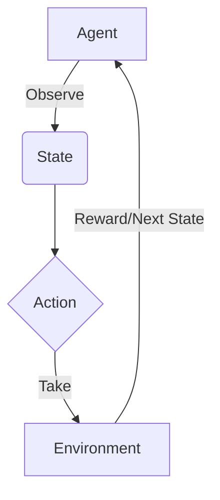

# 一切皆是映射：DQN在交通规划中的应用：智能交通的挑战与机遇

## 1. 背景介绍

### 1.1 交通拥堵问题

随着城市化进程的加快和汽车保有量的不断增长,交通拥堵已经成为许多现代城市面临的一个严峻挑战。交通拥堵不仅导致时间和燃料的浪费,还会产生严重的环境污染和安全隐患。因此,有效缓解交通压力,优化交通流量,提高道路利用效率,对于建设宜居城市至关重要。

### 1.2 传统交通规划的局限性

传统的交通规划方法主要依赖于人工经验和简单的数学模型,难以全面考虑复杂的交通环境和动态交通流量变化。随着大数据和人工智能技术的发展,智能交通系统(Intelligent Transportation Systems, ITS)应运而生,为解决交通拥堵问题提供了新的思路和方法。

### 1.3 人工智能在交通规划中的应用前景

作为人工智能领域的一个重要分支,强化学习(Reinforcement Learning, RL)已经在许多领域取得了卓越的成绩,如机器人控制、游戏AI等。深度强化学习(Deep Reinforcement Learning, DRL)将深度神经网络与强化学习相结合,可以从大量数据中自动学习最优策略,在处理高维、连续的决策问题时表现出色。深度Q网络(Deep Q-Network, DQN)作为DRL的一种典型算法,已经被成功应用于交通信号控制、路径规划等交通领域,展现出广阔的应用前景。

## 2. 核心概念与联系

### 2.1 强化学习概述

强化学习是一种基于环境交互的机器学习范式,其目标是通过试错和奖惩机制,学习一个可以最大化累积奖赏的最优策略。强化学习的核心要素包括:

- 环境(Environment)
- 状态(State)
- 动作(Action)
- 奖赏(Reward)
- 策略(Policy)

强化学习的基本工作流程如下所示:



### 2.2 Q-Learning和Q函数

Q-Learning是一种基于价值函数的强化学习算法,其核心思想是通过不断更新Q函数,逼近最优Q值函数,从而获得最优策略。

Q函数定义为在某个状态下采取某个动作后,可以获得的期望累积奖赏,即:

$$Q(s,a) = \mathbb{E}_\pi[R_t + \gamma R_{t+1} + \gamma^2 R_{t+2} + \cdots | s_t = s, a_t = a, \pi]$$

其中:
- $s$表示状态
- $a$表示动作
- $R_t$表示时刻t获得的奖赏
- $\gamma$为折扣因子,用于平衡即时奖赏和长期奖赏的权重

最优Q函数定义为:

$$Q^*(s,a) = \max_\pi Q^\pi(s,a)$$

通过不断迭代更新Q函数,可以逼近最优Q函数,从而获得最优策略。

### 2.3 深度Q网络(DQN)

传统的Q-Learning算法在处理高维、连续状态空间时存在维数灾难的问题。深度Q网络(DQN)通过利用深度神经网络来逼近Q函数,可以有效解决这一问题。

DQN的核心思想是使用一个深度卷积神经网络(CNN)来逼近Q函数,其输入为当前状态,输出为每个可能动作对应的Q值。通过不断更新网络参数,可以逐步逼近最优Q函数。DQN算法的伪代码如下:

```python
初始化网络参数 θ
初始化经验回放池 D
for episode in range(num_episodes):
    初始化状态 s
    while not terminal:
        选择动作 a = argmax_a Q(s, a; θ) # ε-贪婪策略
        执行动作 a, 观测奖赏 r 和新状态 s'
        存储转移 (s, a, r, s') 到 D
        从 D 中采样小批量数据
        计算目标值 y = r + γ max_a' Q(s', a'; θ-)
        优化损失函数 L = (y - Q(s, a; θ))^2
        更新网络参数 θ
```

DQN算法引入了一些关键技术,如经验回放(Experience Replay)、目标网络(Target Network)等,以提高算法的稳定性和收敛性。

### 2.4 DQN在交通规划中的应用

在交通规划领域,DQN可以被应用于以下几个方面:

- 交通信号控制
- 路径规划和车辆导航
- 交通流量预测
- 智能停车管理
- 智能交通调度

DQN将交通环境建模为马尔可夫决策过程(MDP),通过与环境的交互来学习最优策略。例如,在交通信号控制中,DQN可以根据实时交通流量数据,动态调整信号周期和相位,以最大化车辆通行效率和最小化等待时间。

## 3. 核心算法原理具体操作步骤

### 3.1 马尔可夫决策过程(MDP)

马尔可夫决策过程(Markov Decision Process, MDP)是强化学习的数学基础,用于描述一个完全可观测的、离散时间的、随机决策过程。

一个MDP可以用一个五元组 $(S, A, P, R, \gamma)$ 来表示,其中:

- $S$是状态空间的集合
- $A$是动作空间的集合
- $P(s'|s,a)$是状态转移概率,表示在状态$s$下执行动作$a$后,转移到状态$s'$的概率
- $R(s,a,s')$是奖赏函数,表示在状态$s$下执行动作$a$后,转移到状态$s'$所获得的奖赏
- $\gamma \in [0,1)$是折扣因子,用于平衡即时奖赏和长期奖赏的权重

在MDP中,我们的目标是找到一个最优策略$\pi^*$,使得在任意初始状态$s_0$下,期望累积奖赏最大化:

$$\pi^* = \arg\max_\pi \mathbb{E}_\pi \left[ \sum_{t=0}^\infty \gamma^t R(s_t, a_t, s_{t+1}) \right]$$

其中$a_t = \pi(s_t)$表示在状态$s_t$下,根据策略$\pi$选择的动作。

### 3.2 Q-Learning算法

Q-Learning是一种基于价值函数的强化学习算法,用于求解MDP的最优策略。它通过不断更新Q函数,逼近最优Q值函数,从而获得最优策略。

Q函数定义为在某个状态下采取某个动作后,可以获得的期望累积奖赏:

$$Q(s,a) = \mathbb{E}_\pi\left[R_t + \gamma R_{t+1} + \gamma^2 R_{t+2} + \cdots | s_t = s, a_t = a, \pi\right]$$

最优Q函数定义为:

$$Q^*(s,a) = \max_\pi Q^\pi(s,a)$$

Q-Learning算法通过不断迭代更新Q函数,使其逼近最优Q函数:

$$Q(s_t, a_t) \leftarrow Q(s_t, a_t) + \alpha \left[ r_t + \gamma \max_{a'} Q(s_{t+1}, a') - Q(s_t, a_t) \right]$$

其中$\alpha$是学习率,用于控制更新步长。

通过不断更新Q函数,最终可以获得最优策略:

$$\pi^*(s) = \arg\max_a Q^*(s,a)$$

Q-Learning算法的伪代码如下:

```python
初始化 Q(s, a) 为任意值
for episode in range(num_episodes):
    初始化状态 s
    while not terminal:
        选择动作 a = argmax_a Q(s, a) # ε-贪婪策略
        执行动作 a, 观测奖赏 r 和新状态 s'
        Q(s, a) = Q(s, a) + α * (r + γ * max_a' Q(s', a') - Q(s, a))
        s = s'
```

### 3.3 深度Q网络(DQN)算法

传统的Q-Learning算法在处理高维、连续状态空间时存在维数灾难的问题。深度Q网络(Deep Q-Network, DQN)通过利用深度神经网络来逼近Q函数,可以有效解决这一问题。

DQN算法的核心思想是使用一个深度卷积神经网络(CNN)来逼近Q函数,其输入为当前状态,输出为每个可能动作对应的Q值。通过不断更新网络参数,可以逐步逼近最优Q函数。

DQN算法的伪代码如下:

```python
初始化网络参数 θ
初始化经验回放池 D
for episode in range(num_episodes):
    初始化状态 s
    while not terminal:
        选择动作 a = argmax_a Q(s, a; θ) # ε-贪婪策略
        执行动作 a, 观测奖赏 r 和新状态 s'
        存储转移 (s, a, r, s') 到 D
        从 D 中采样小批量数据
        计算目标值 y = r + γ max_a' Q(s', a'; θ-)
        优化损失函数 L = (y - Q(s, a; θ))^2
        更新网络参数 θ
```

DQN算法引入了一些关键技术,如经验回放(Experience Replay)、目标网络(Target Network)等,以提高算法的稳定性和收敛性。

#### 3.3.1 经验回放(Experience Replay)

在传统的强化学习算法中,数据是按顺序生成和使用的,存在样本相关性强的问题。经验回放技术通过维护一个经验池,随机从中采样小批量数据进行训练,可以打破数据之间的相关性,提高数据利用效率。

#### 3.3.2 目标网络(Target Network)

在DQN算法中,我们使用两个神经网络:

- 在线网络(Online Network): 用于选择动作和更新Q值
- 目标网络(Target Network): 用于计算目标Q值

目标网络的参数是在线网络参数的复制,但更新频率较低。这种分离可以提高算法的稳定性,避免Q值的过度估计。

#### 3.3.3 双重Q学习(Double Q-Learning)

传统的Q-Learning算法在计算目标Q值时,存在过度估计的问题。双重Q学习通过维护两个Q函数,分别用于选择动作和计算目标值,可以有效缓解这一问题。

具体来说,我们使用两个Q网络$Q_1$和$Q_2$,目标值计算公式如下:

$$y_t = r_t + \gamma Q_2\left(s_{t+1}, \arg\max_{a'} Q_1(s_{t+1}, a')\right)$$

## 4. 数学模型和公式详细讲解举例说明

### 4.1 马尔可夫决策过程(MDP)

在交通规划领域,我们可以将交通环境建模为一个马尔可夫决策过程(MDP)。

假设我们要控制一个路口的交通信号灯,MDP的各个元素可以定义如下:

- 状态空间 $S$: 包括当前路口的交通流量、相邻路口的交通状况等信息
- 动作空间 $A$: 改变信号灯的相位和周期
- 状态转移概率 $P(s'|s,a)$: 在当前状态 $s$ 下执行动作 $a$ 后,转移到新状态 $s'$ 的概率
- 奖赏函数 $R(s,a,s')$: 可以根据交通流量、等待时间等指标设计,如最小化车辆等待时间、最大化通行效率等
- 折扣因子 $\gamma$: 用于平衡即时奖赏(如减少当前路口等待时间)和长期奖赏(如优化整个路网的交通流量)

我们的目标是找到一个最优策略 $\pi^*$,使得在任意初始状态 $s_0$ 下,期望累积奖赏最大化:

$$\pi^* = \arg\max_\pi \mathbb{E}_\pi \left[ \sum_{t=0}^\infty \gamma^t R(s_t, a_t, s_{t+1}) \right]$$

其中 $a_t = \pi(s_t)$ 表示在状态 $s_t$ 下,根据策略 $\pi$ 选择