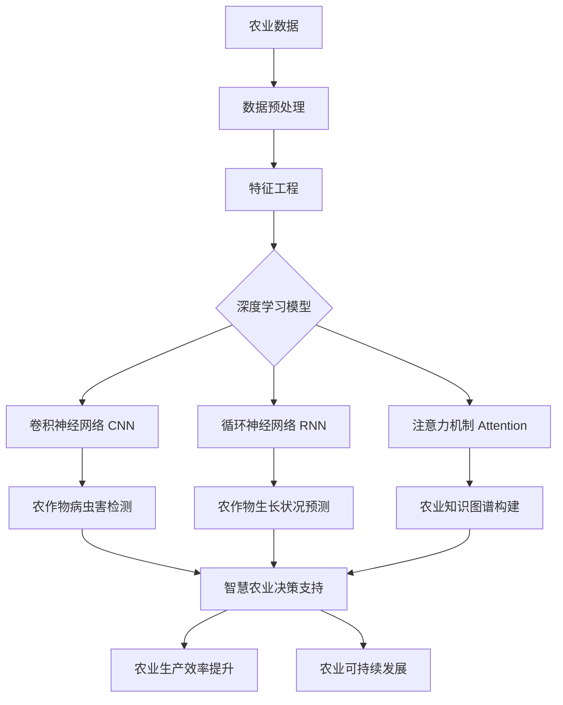

# 一切皆是映射：深度学习在农业科技中的实践

作者：禅与计算机程序设计艺术

## 1. 背景介绍
### 1.1 农业科技的重要性
#### 1.1.1 粮食安全的保障
#### 1.1.2 农业可持续发展的需求
#### 1.1.3 提高农业生产效率的必要性

### 1.2 人工智能在农业领域的应用
#### 1.2.1 智能农业设备
#### 1.2.2 农作物生长监测
#### 1.2.3 农业数据分析与决策支持

### 1.3 深度学习技术概述  
#### 1.3.1 深度学习的基本概念
#### 1.3.2 深度学习的发展历程
#### 1.3.3 深度学习在各领域的应用现状

## 2. 核心概念与联系
### 2.1 映射的概念
#### 2.1.1 映射的数学定义
#### 2.1.2 映射在深度学习中的体现
#### 2.1.3 映射思想在农业科技中的应用

### 2.2 深度学习中的关键概念
#### 2.2.1 神经网络
#### 2.2.2 卷积神经网络（CNN）
#### 2.2.3 循环神经网络（RNN）
#### 2.2.4 注意力机制（Attention Mechanism）

### 2.3 农业科技中的关键概念
#### 2.3.1 精准农业
#### 2.3.2 农业物联网
#### 2.3.3 农业大数据

## 3. 核心算法原理与具体操作步骤
### 3.1 卷积神经网络（CNN）
#### 3.1.1 卷积层
#### 3.1.2 池化层
#### 3.1.3 全连接层
#### 3.1.4 CNN在农业图像识别中的应用

### 3.2 循环神经网络（RNN）
#### 3.2.1 RNN的基本结构
#### 3.2.2 长短期记忆网络（LSTM） 
#### 3.2.3 门控循环单元（GRU）
#### 3.2.4 RNN在农业时序数据分析中的应用

### 3.3 注意力机制（Attention Mechanism）
#### 3.3.1 注意力机制的基本原理
#### 3.3.2 自注意力机制（Self-Attention）
#### 3.3.3 注意力机制在农业数据分析中的应用

## 4. 数学模型和公式详细讲解举例说明
### 4.1 卷积操作的数学表示
#### 4.1.1 二维卷积
#### 4.1.2 多通道卷积
#### 4.1.3 转置卷积

### 4.2 循环神经网络的数学表示
#### 4.2.1 基本RNN的前向传播
#### 4.2.2 LSTM的门控机制
#### 4.2.3 GRU的门控机制

### 4.3 注意力机制的数学表示
#### 4.3.1 注意力得分的计算
#### 4.3.2 注意力权重的归一化
#### 4.3.3 注意力机制在编码器-解码器模型中的应用

## 5. 项目实践：代码实例和详细解释说明
### 5.1 农作物病虫害检测
#### 5.1.1 数据集准备
#### 5.1.2 CNN模型构建
#### 5.1.3 模型训练与评估
#### 5.1.4 模型部署与应用

### 5.2 农作物生长状况预测
#### 5.2.1 数据预处理
#### 5.2.2 LSTM模型构建
#### 5.2.3 模型训练与评估 
#### 5.2.4 模型应用与可视化

### 5.3 农业知识图谱构建
#### 5.3.1 数据采集与清洗
#### 5.3.2 实体识别与关系抽取
#### 5.3.3 知识图谱存储与查询
#### 5.3.4 基于注意力机制的知识推理

## 6. 实际应用场景
### 6.1 智慧农业决策支持系统
#### 6.1.1 系统架构设计
#### 6.1.2 数据采集与传输
#### 6.1.3 数据分析与建模
#### 6.1.4 可视化与交互界面

### 6.2 农作物病虫害早期预警
#### 6.2.1 病虫害监测与数据采集
#### 6.2.2 图像识别与分类
#### 6.2.3 预警信息生成与推送
#### 6.2.4 防治措施推荐

### 6.3 农产品质量溯源
#### 6.3.1 区块链技术在农产品溯源中的应用
#### 6.3.2 农产品生产过程数据上链
#### 6.3.3 质量追溯与信息查询
#### 6.3.4 消费者信任度提升

## 7. 工具和资源推荐
### 7.1 深度学习框架
#### 7.1.1 TensorFlow
#### 7.1.2 PyTorch
#### 7.1.3 Keras

### 7.2 农业数据集
#### 7.2.1 农作物病虫害图像数据集
#### 7.2.2 农业气象数据集
#### 7.2.3 土壤养分数据集

### 7.3 农业科技开源项目
#### 7.3.1 AgriPredict：农作物生长预测
#### 7.3.2 PlantCV：植物表型分析
#### 7.3.3 FarmBot：开源农业机器人

## 8. 总结：未来发展趋势与挑战
### 8.1 农业数字化转型
#### 8.1.1 农业数据的标准化与共享
#### 8.1.2 农业设备的智能化升级
#### 8.1.3 农业决策的数据驱动

### 8.2 跨学科融合与协同创新
#### 8.2.1 农业科技与人工智能的深度融合
#### 8.2.2 农业科技与生物技术的交叉应用
#### 8.2.3 农业科技与区块链技术的结合

### 8.3 面临的挑战与对策
#### 8.3.1 数据隐私与安全问题
#### 8.3.2 算法的可解释性与公平性
#### 8.3.3 人才培养与技术普及

## 9. 附录：常见问题与解答
### 9.1 深度学习在农业科技中应用的局限性
### 9.2 农业大数据的质量控制与管理
### 9.3 农业科技成果的产业化路径
### 9.4 农业人工智能伦理问题的思考

农业是人类赖以生存的基础产业，而科技的进步为农业的发展注入了新的活力。随着人工智能技术的日益成熟，深度学习作为其中最为瞩目的分支，正在农业领域掀起一场变革的浪潮。

深度学习的本质是通过构建多层神经网络，实现对输入数据的层层抽象和特征提取，从而对复杂问题进行建模和预测。而在农业科技领域，深度学习的应用场景十分广泛，从农作物病虫害检测、生长状况监测，到农业知识图谱构建和智能决策支持，无不体现着深度学习技术的强大力量。

在农作物病虫害检测方面，卷积神经网络（CNN）凭借其在图像识别领域的出色表现，成为了首选的技术方案。通过构建深层CNN模型，可以自动提取农作物图像中的关键特征，实现对病虫害的准确识别和分类。这不仅大大提高了病虫害诊断的效率，也为农户提供了及时的防治指导。

而在农作物生长状况监测方面，循环神经网络（RNN）则展现出了其处理时序数据的独特优势。通过对农作物生长过程中的各项指标进行连续采集和分析，RNN模型可以捕捉到农作物生长的动态变化规律，进而对未来的生长趋势进行预测。这为农业生产提供了宝贵的决策参考，有助于实现精准施肥、灌溉和收割。

在农业知识图谱构建方面，注意力机制（Attention Mechanism）的引入为知识的表示和推理带来了新的思路。通过对农业领域的海量文献和数据进行挖掘和分析，利用注意力机制可以自动聚焦于关键信息，提取实体及其关系，构建起全面而准确的农业知识图谱。这为农业科研和决策提供了强大的知识支撑，促进了农业的智慧化发展。

当然，将深度学习技术应用于农业科技领域，还需要解决数据质量、算法可解释性、跨学科融合等诸多挑战。但可以预见的是，随着农业数字化转型的不断推进，深度学习必将在农业科技领域扮演越来越重要的角色，为农业的可持续发展贡献智慧和力量。

未来，农业科技与人工智能的深度融合，将进一步推动农业生产的智能化、精准化和生态化，为保障粮食安全、促进农民增收、实现乡村振兴注入强大动力。让我们携手并进，共同开创农业科技的崭新未来！

附：核心概念原理和架构的Mermaid流程图

以上是一篇关于深度学习在农业科技中应用的技术博客文章，涵盖了背景介绍、核心概念阐述、算法原理解析、数学模型推导、项目实践案例、应用场景展望、工具资源推荐、未来趋势展望等多个方面。希望通过这篇文章，能够为读者全面系统地呈现深度学习在农业领域的应用现状和发展前景，激发更多的创新思考和探索实践。

让我们共同携手，以技术之光照亮农业之路，用智慧之力书写大地之诗。一切皆是映射，深度学习在农业科技中大有可为！