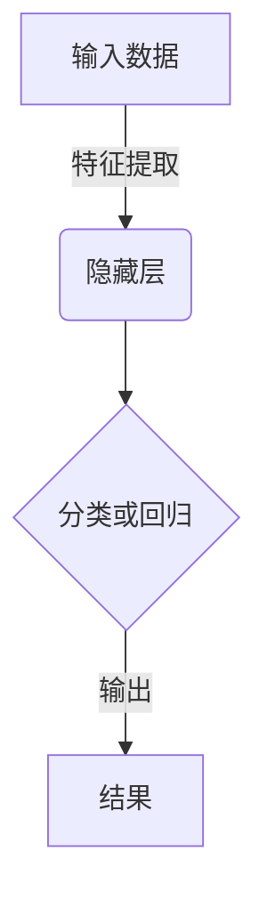
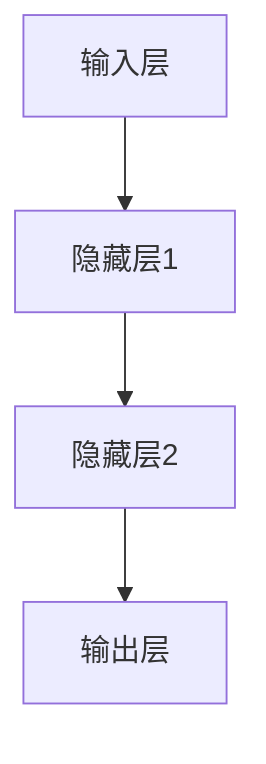

# 一切皆是映射：深度学习在航空航天中的挑战与机会

## 1.背景介绍

### 1.1 航空航天领域的重要性

航空航天工业是一个高科技、资金密集型行业,对国家的经济发展、国防实力和科技创新能力具有重要的战略意义。它不仅推动了相关领域的技术进步,还带动了材料、电子、机械等许多行业的发展。

### 1.2 航空航天面临的挑战

1. **极端工作环境**:飞机和航天器在极端的温度、压力、振动等环境下运行,对结构材料和部件的可靠性提出了很高的要求。

2. **复杂的设计制造**:航空航天器的设计和制造过程涉及多学科、多领域的知识,需要大量的试验和模拟来验证。

3. **提高燃料效率**:减少燃料消耗和排放是当前的一大挑战,需要优化空气动力学设计和发动机效率。

4. **降低成本**:研发和制造成本极高,需要采用新工艺和新材料来降低成本。

### 1.3 人工智能在航空航天中的作用

传统的基于物理模型的方法在解决上述挑战时存在局限性。深度学习等人工智能技术因其强大的数据驱动能力和模式识别能力,在航空航天领域展现出巨大的应用潜力和价值。

## 2.核心概念与联系

### 2.1 深度学习简介

深度学习是机器学习的一个新的研究热点,它模仿人脑神经网络的工作原理,通过对大量数据的学习来捕获其中蕴含的复杂模式,并用于解决计算机视觉、自然语言处理等问题。



### 2.2 深度学习在航空航天中的应用

深度学习在航空航天领域的应用主要集中在以下几个方面:

1. **结构健康监测**:通过分析传感器数据,对航空器结构进行无损检测和剩余寿命预测。

2. **空中交通管理**:利用计算机视觉技术对飞机进行实时检测和跟踪,优化航线,提高航班正常率。

3. **航空发动机监控**:分析发动机工作状态数据,及时发现故障,并对剩余寿命进行预测。

4. **空气动力学设计**:通过数值模拟和机器学习算法优化机翼及整流罩的空气动力学设计。

5. **制造流程优化**:利用深度学习对制造数据进行分析,优化参数,减少缺陷,提高效率和一致性。

### 2.3 挑战与机遇

虽然深度学习在航空航天领域大放异彩,但也面临诸多挑战:

- 可解释性差、缺乏物理约束
- 对大量标注数据的需求
- 鲁棒性和可靠性问题
- 算力和能耗要求高

另一方面,它也为航空航天带来了新的机遇:

- 端到端的学习能力,避免复杂的领域知识
- 利用多源异构数据的能力  
- 持续学习和在线优化的能力

## 3.核心算法原理具体操作步骤  

### 3.1 深度神经网络

深度神经网络是深度学习的核心模型,主要由输入层、隐藏层和输出层组成。每个神经元接收来自上一层的输入,经过激活函数的非线性变换后输出给下一层。



1. **前向传播**:输入数据从输入层开始,经过隐藏层的线性变换和非线性激活,最终到达输出层。
$$y=f(W^{(L)}f(W^{(L-1)}...f(W^{(1)}x+b^{(1)})...+b^{(L-1)})+b^{(L)})$$

2. **反向传播**:将输出层的实际输出与期望输出的差值,按照链式法则沿着网络方向反向传播,更新每层的权重和偏置。
$$\frac{\partial E}{\partial w_{ij}^{(l)}}=\frac{\partial E}{\partial z_{j}^{(l+1)}}\cdot\frac{\partial z_{j}^{(l+1)}}{\partial w_{ij}^{(l)}}$$

3. **权重更新**:使用优化算法如梯度下降对权重进行迭代更新,最小化损失函数。
$$w_{ij}^{(l)}=w_{ij}^{(l)}-\eta\frac{\partial E}{\partial w_{ij}^{(l)}}$$

### 3.2 卷积神经网络

卷积神经网络(CNN)是一种用于处理网格结构数据(如图像)的专门神经网络。它通过局部连接和权重共享大大减少了参数数量,并保留了输入的空间结构信息。


1. **卷积层**:通过在输入上滑动卷积核,提取局部特征。
$$z_{i,j}^{l}=\sum_{a,b}w_{a,b}^{l}x_{i+a,j+b}^{l-1}+b^{l}$$

2. **池化层**:对卷积层的输出进行下采样,减少参数数量,提高鲁棒性。
$$y_{i,j}^{l}=\max_{(a,b)\in R}x_{i+a,j+b}^{l-1}$$

3. **全连接层**:将前面卷积层和池化层的高级特征展平,输入到全连接层进行分类或回归。

### 3.3 循环神经网络

循环神经网络(RNN)是一种用于处理序列数据(如文本、语音)的神经网络。它通过将当前输入与上一时刻的状态相结合,捕获序列数据中的长期依赖关系。


1. **前向计算**:在每个时刻t,RNN单元读取当前输入$x_t$和上一状态$h_{t-1}$,计算当前状态$h_t$和输出$y_t$。
$$h_t=\phi(W_{hh}h_{t-1}+W_{xh}x_t+b_h)\\y_t=\phi(W_{hy}h_t+b_y)$$

2. **反向传播过程**:通过反向传播算法,计算每个时刻的误差梯度,并更新权重矩阵。
$$\frac{\partial E}{\partial W}=\sum_t\frac{\partial E}{\partial y_t}\frac{\partial y_t}{\partial W}$$

3. **长短期记忆网络(LSTM)**: 为了解决RNN梯度消失/爆炸问题,LSTM引入了门控机制,增强了捕获长期依赖的能力。

## 4.数学模型和公式详细讲解举例说明

### 4.1 损失函数

损失函数用于衡量模型的输出与真实值之间的差异,是优化深度神经网络的关键。常用的损失函数包括:

1. **均方误差 (Mean Squared Error)**
$$E=\frac{1}{2n}\sum_{i=1}^{n}(y_i-\hat{y}_i)^2$$

2. **交叉熵 (Cross Entropy)**
$$E=-\frac{1}{n}\sum_{i=1}^{n}[y_i\log\hat{y}_i+(1-y_i)\log(1-\hat{y}_i)]$$

3. **Huber损失 (Robust to outliers)**
$$\begin{cases}
\frac{1}{2}(y_i-\hat{y}_i)^2 & \text{if }|y_i-\hat{y}_i|\leq\delta\\
\delta(|y_i-\hat{y}_i|-\frac{1}{2}\delta) & \text{otherwise}
\end{cases}$$

### 4.2 优化算法

为了最小化损失函数,我们需要使用优化算法来更新网络权重。常用的优化算法包括:

1. **梯度下降 (Gradient Descent)**
$$\theta=\theta-\eta\nabla_\theta E(\theta)$$

2. **动量梯度下降 (Momentum)**
$$v_t=\gamma v_{t-1}+\eta\nabla_\theta E(\theta_{t-1})\\
\theta_t=\theta_{t-1}-v_t$$

3. **RMSProp**
$$E[g^2]_t=0.9E[g^2]_{t-1}+0.1g_t^2\\
\theta_t=\theta_{t-1}-\frac{\eta}{\sqrt{E[g^2]_t+\epsilon}}g_t$$

4. **Adam**
$$m_t=\beta_1 m_{t-1}+(1-\beta_1)g_t\\
v_t=\beta_2 v_{t-1}+(1-\beta_2)g_t^2\\
\hat{m}_t=\frac{m_t}{1-\beta_1^t},\hat{v}_t=\frac{v_t}{1-\beta_2^t}\\
\theta_{t+1}=\theta_t-\frac{\eta}{\sqrt{\hat{v}_t}+\epsilon}\hat{m}_t$$

### 4.3 正则化

为了防止过拟合,我们可以在损失函数中引入正则化项,对模型参数进行约束。常用的正则化方法包括:

1. **L1正则化 (Lasso Regression)** 
$$\Omega(\theta)=\lambda\sum_{i=1}^{n}|\theta_i|$$

2. **L2正则化 (Ridge Regression)**
$$\Omega(\theta)=\frac{\lambda}{2}\sum_{i=1}^{n}\theta_i^2$$  

3. **Dropout**:在训练过程中随机移除神经元,避免过度依赖于任何单个特征检测器。

4. **BatchNormalization**:通过归一化输入数据的均值和方差,加速收敛并提高泛化能力。

### 4.4 示例:鸟类图像分类

假设我们想训练一个卷积神经网络,对不同种类的鸟类图像进行分类。我们可以定义如下损失函数:

$$E=-\frac{1}{n}\sum_{i=1}^{n}\sum_{j=1}^{m}y_{ij}\log\hat{y}_{ij}+\lambda\|\theta\|_2^2$$

其中:
- $y_{ij}$是one-hot编码的真实标签,1表示第i个样本属于第j类,0表示不属于
- $\hat{y}_{ij}$是模型输出的第i个样本属于第j类的预测概率
- $\|\theta\|_2^2$是L2正则化项,用于防止过拟合
- $\lambda$是正则化系数,控制正则化强度

我们可以使用Adam优化算法,对网络权重$\theta$进行迭代更新:

$$\begin{align*}
&m_t=0.9m_{t-1}+0.1\nabla_\theta E(\theta_{t-1})\\
&v_t=0.999v_{t-1}+0.001(\nabla_\theta E(\theta_{t-1}))^2\\
&\hat{m}_t=\frac{m_t}{1-0.9^t},\hat{v}_t=\frac{v_t}{1-0.999^t}\\
&\theta_{t+1}=\theta_t-\frac{0.001}{\sqrt{\hat{v}_t}+10^{-8}}\hat{m}_t
\end{align*}$$

通过以上方法,我们可以有效地训练卷积神经网络,提高鸟类图像分类的准确率。

## 5. 项目实践:代码实例和详细解释说明

为了更好地理解深度学习在航空航天领域的应用,我们将通过一个具体的项目实践来演示如何使用卷积神经网络对飞机部件进行缺陷检测。

### 5.1 数据准备

我们使用NASA的飞机部件图像数据集,其中包含各种金属部件的图像,并标注了缺陷类型和位置。我们将数据集分为训练集、验证集和测试集。

```python
import os
from PIL import Image
import numpy as np

# 加载数据集
data_dir = 'aircraft_components'
X_train, y_train = [], []
X_val, y_val = [], []
X_test, y_test = [], []

for label in os.listdir(data_dir):
    label_dir = os.path.join(data_dir, label)
    for img_file in os.listdir(label_dir):
        img_path = os.path.join(label_dir, img_file)
        