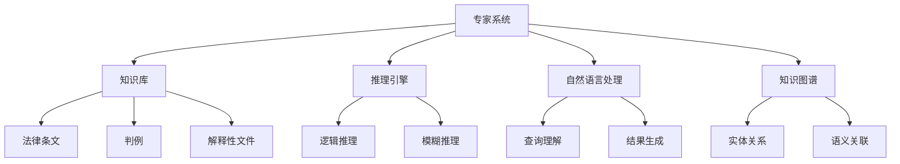

# 专家系统在法律领域的应用：智能法律咨询与辅助判决

## 1.背景介绍

### 1.1 法律领域的复杂性与挑战

法律是一个高度专业化和复杂的领域,涉及大量的法律条文、先例判例和解释性文件。传统的法律咨询和裁决过程通常需要律师和法官耗费大量的时间和精力来研究相关法律资料,并根据具体案情做出判断。这种方式不仅效率低下,而且存在主观性和不确定性。

### 1.2 人工智能在法律领域的应用前景

随着人工智能技术的不断发展,尤其是自然语言处理、知识表示和推理等技术的进步,人工智能在法律领域的应用前景广阔。智能法律咨询系统和辅助判决系统凭借其强大的信息处理能力和推理能力,有望显著提高法律服务的效率和质量。

### 1.3 专家系统在法律领域的作用

专家系统是一种基于知识库和推理引擎的智能系统,能够模拟人类专家的决策过程。在法律领域,专家系统可以充当智能法律顾问,为用户提供准确的法律咨询服务;也可以作为辅助判决系统,为法官提供参考依据,提高裁决的一致性和公正性。

## 2.核心概念与联系

### 2.1 知识库

知识库是专家系统的核心部分,它存储了特定领域的知识和规则。在法律领域,知识库包含了法律条文、判例、解释性文件等结构化和非结构化的法律知识。

### 2.2 推理引擎

推理引擎是专家系统的另一个关键部分,它能够根据知识库中的规则和用户输入的信息进行逻辑推理,得出相应的结论或建议。在法律领域,推理引擎需要具备处理复杂法律逻辑和模糊推理的能力。

### 2.3 自然语言处理

自然语言处理(NLP)技术在专家系统中扮演着重要角色。它能够将用户输入的自然语言查询转换为计算机可理解的形式,并将系统输出的结果转换为自然语言,实现人机交互。在法律领域,NLP技术需要处理法律术语和复杂句式。

### 2.4 知识图谱

知识图谱是一种结构化的知识表示形式,它将实体、概念和它们之间的关系以图的形式组织起来。在法律领域,知识图谱可以用于表示法律知识的语义关联,有助于提高推理的准确性和可解释性。

### 2.5 核心概念关系示意图



## 3.核心算法原理具体操作步骤

### 3.1 知识库构建

构建高质量的法律知识库是专家系统的基础。主要步骤包括:

1. **数据采集**:从各种来源(如法律文本、判决书等)采集相关的法律数据。
2. **数据预处理**:对采集的数据进行清洗、去重、格式化等预处理,以提高数据质量。
3. **知识抽取**:使用自然语言处理技术从预处理后的数据中抽取出法律条文、判例要素、术语定义等结构化知识。
4. **知识表示**:将抽取出的知识按照一定的模式(如本体、知识图谱等)进行形式化表示。
5. **知识融合**:将来自不同来源的知识进行整合,解决异构性和冲突问题。

### 3.2 推理引擎设计

推理引擎是专家系统的核心部分,需要能够根据知识库中的规则对输入的案情进行推理,得出相应的结论或建议。常用的推理方法包括:

1. **规则推理**:根据事实和规则进行前向或后向链推理,推导出结论。适用于处理确定性知识。
2. **案例推理**:根据新案例与知识库中存储的历史案例的相似度,推理出相应的结论。适用于处理不确定性知识。
3. **模糊推理**:使用模糊逻辑和模糊规则处理不精确、不完整的信息,得出模糊结论。适用于处理主观性和不确定性问题。
4. **语义推理**:基于知识图谱中的语义关联进行推理,能够捕捉知识之间的隐式联系。

### 3.3 自然语言处理

自然语言处理模块需要实现以下功能:

1. **查询理解**:将用户输入的自然语言查询转换为形式化的表示,如逻辑形式、语义表示等。
2. **实体识别**:从查询中识别出法律实体,如人名、地名、法律术语等。
3. **语义解析**:分析查询的语义结构,确定核心谓词和论元之间的关系。
4. **结果生成**:将推理引擎输出的结果转换为自然语言的形式,并根据需要进行概括和解释。

### 3.4 系统集成

最后需要将上述各个模块集成到一个统一的系统中,并设计人机交互界面。系统的工作流程如下:

1. 用户通过自然语言输入查询。
2. 自然语言处理模块对查询进行理解和表示。
3. 推理引擎根据知识库中的规则对查询进行推理。
4. 将推理结果通过自然语言处理模块转换为自然语言输出。
5. 用户获取输出结果,并可以根据需要继续交互。

## 4.数学模型和公式详细讲解举例说明  

### 4.1 案例相似度计算

在案例推理中,需要计算新案例与知识库中存储的历史案例之间的相似度。一种常用的相似度度量方法是基于向量空间模型(VSM)。

假设将案例表示为一个 $n$ 维特征向量 $\vec{x}=(x_1, x_2, \cdots, x_n)$,其中每个维度对应一个特征(如涉及的法律条文、事实描述等)的权重。则两个案例 $\vec{x}$ 和 $\vec{y}$ 之间的相似度可以用它们之间的余弦相似度来计算:

$$\text{sim}(\vec{x}, \vec{y}) = \frac{\vec{x} \cdot \vec{y}}{|\vec{x}||\vec{y}|} = \frac{\sum_{i=1}^n x_i y_i}{\sqrt{\sum_{i=1}^n x_i^2} \sqrt{\sum_{i=1}^n y_i^2}}$$

相似度的值介于 0 和 1 之间,值越大表示两个案例越相似。在推理时,可以根据新案例与历史案例的相似度,结合其他规则进行综合判断。

### 4.2 模糊推理

在法律领域,很多问题存在模糊性和不确定性,如"严重过失"、"合理期限"等概念是模糊的。这时可以使用模糊推理技术进行处理。

模糊推理的核心是使用模糊规则和模糊集合进行推理。一条模糊规则的形式如下:

$$\text{IF } (x_1 \text{ is } A_1) \text{ AND } (x_2 \text{ is } A_2) \text{ AND } \cdots \text{ AND } (x_n \text{ is } A_n) \text{ THEN } (y \text{ is } B)$$

其中 $x_1, x_2, \cdots, x_n$ 是输入变量, $A_1, A_2, \cdots, A_n$ 是它们对应的模糊集合,如"严重"、"轻微"等; $y$ 是输出变量, $B$ 是其对应的模糊集合。

在推理过程中,首先需要计算前件(输入变量)对应的真值,即它们属于对应模糊集合的程度。然后根据规则的结论部分,得到输出变量属于相应模糊集合的真值。最后通过解模糊(defuzzification)操作,将模糊输出转换为精确的数值输出。

常用的解模糊方法包括质心法、平均最大法等。以质心法为例,输出变量 $y$ 的精确值可以计算为:

$$y = \frac{\int \mu_B(y) y dy}{\int \mu_B(y) dy}$$

其中 $\mu_B(y)$ 是输出变量 $y$ 属于模糊集合 $B$ 的真值函数。

通过模糊推理,可以较好地处理法律领域中的不确定性和主观性问题。

## 4.项目实践:代码实例和详细解释说明

下面给出一个简单的Python示例,演示如何使用案例推理进行法律判决。

### 4.1 案例表示

我们将每个案例表示为一个包含多个特征的字典,其中包括涉及的法律条文、事实描述等内容。

```python
# 示例案例
case1 = {
    'laws': ['刑法第232条', '刑法第235条'],
    'facts': ['故意伤害他人身体', '导致重伤']
}

case2 = {
    'laws': ['刑法第234条', '刑法第236条'], 
    'facts': ['过失伤害他人身体', '导致轻伤']
}
```

### 4.2 案例向量化

为了计算案例相似度,我们需要将案例转换为向量形式。这里使用TF-IDF向量化模型,将每个案例表示为一个特征向量。

```python
from sklearn.feature_extraction.text import TfidfVectorizer

corpus = [
    ' '.join(case1['laws']) + ' ' + ' '.join(case1['facts']),
    ' '.join(case2['laws']) + ' ' + ' '.join(case2['facts'])
]

vectorizer = TfidfVectorizer()
X = vectorizer.fit_transform(corpus)

# 获取案例向量
case1_vec = X[0]
case2_vec = X[1]
```

### 4.3 相似度计算

计算两个案例向量之间的余弦相似度。

```python
from sklearn.metrics.pairwise import cosine_similarity

sim = cosine_similarity(case1_vec, case2_vec)[0][0]
print(f'案例1与案例2的相似度为: {sim}')
```

### 4.4 案例推理

根据新案例与历史案例的相似度,结合其他规则进行推理,得出判决结果。

```python
new_case = {
    'laws': ['刑法第232条', '刑法第235条'],
    'facts': ['故意伤害他人身体', '导致重伤']
}

new_case_vec = vectorizer.transform([' '.join(new_case['laws']) + ' ' + ' '.join(new_case['facts'])])

sim1 = cosine_similarity(case1_vec, new_case_vec)[0][0]
sim2 = cosine_similarity(case2_vec, new_case_vec)[0][0]

if sim1 > sim2:
    print('新案例与案例1更相似,判决结果为: 有期徒刑')
else:
    print('新案例与案例2更相似,判决结果为: 拘役或罚金')
```

上述示例只是一个简单的案例推理实现,实际的专家系统会更加复杂,需要综合多种推理方法、引入更多的领域知识,并对系统的可解释性、鲁棒性等方面进行优化。

## 5.实际应用场景

智能法律咨询系统和辅助判决系统在法律领域有广阔的应用前景,主要应用场景包括但不限于:

### 5.1 智能法律咨询

- 为普通用户提供在线法律咨询服务,解答法律问题
- 为律师事务所提供辅助咨询,节省律师的工作时间
- 为企业提供合同审查、风险评估等法律咨询服务

### 5.2 辅助裁判

- 为法官提供裁决建议,提高裁决效率和一致性
- 分析案例素材,为法官提供参考依据
- 自动生成判决书初稿,减轻法官的工作量

### 5.3 法律教育

- 为法学院校提供智能教学辅助系统
- 为学生提供个性化的法律学习资源和练习
- 评估学生的法律推理和案例分析能力

### 5.4 法律研究

- 发现法律文本中的