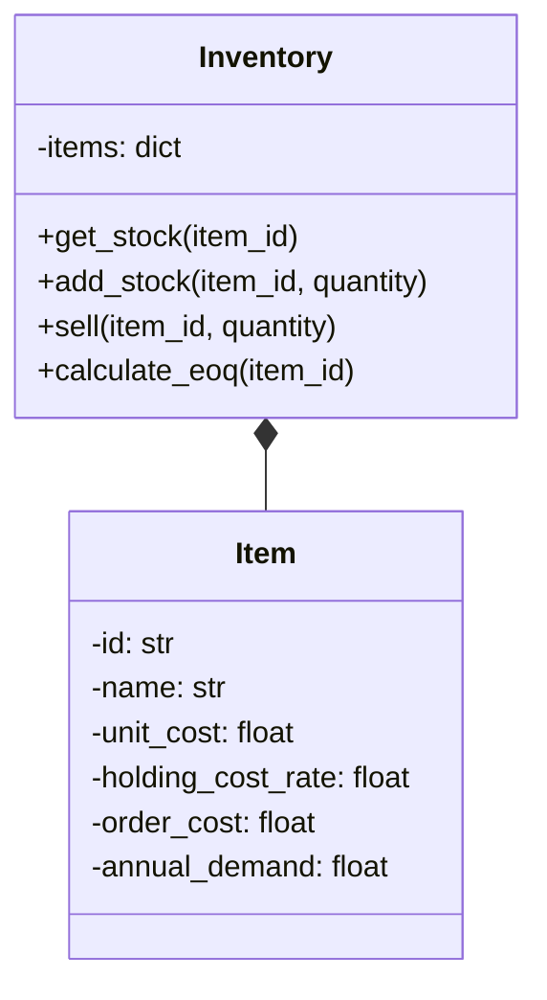

# 企业ERP管理系统详细设计与具体代码实现

## 1. 背景介绍

### 1.1 ERP系统的定义和重要性

企业资源计划(Enterprise Resource Planning, ERP)系统是一种用于管理企业所有资源和业务流程的综合性管理信息系统。它通过集成企业内部各个职能部门的信息流,实现信息共享和资源优化配置,从而提高企业的运营效率和决策水平。

在当今竞争激烈的商业环境中,ERP系统已经成为企业提高竞争力的关键工具。它能够帮助企业:

- 整合内部资源和业务流程
- 降低运营成本和库存水平
- 提高客户服务质量
- 加快决策响应速度
- 增强企业的灵活性和适应能力

### 1.2 ERP系统发展历程

ERP系统的起源可以追溯到20世纪60年代的物料需求计划(MRP)系统。随着计算机技术和商业需求的发展,ERP系统逐步演化为一个集成化的企业管理解决方案。

- 1960s: 物料需求计划(MRP)系统
- 1970s: 制造资源计划(MRP II)系统
- 1990s: 企业资源计划(ERP)系统
- 2000s: 扩展ERP,包括供应链管理(SCM)、客户关系管理(CRM)等模块
- 现在: 云ERP、移动ERP、智能ERP等新兴趋势

### 1.3 ERP系统的主要模块

典型的ERP系统由多个功能模块组成,涵盖企业的各个业务领域,例如:

- 财务管理
- 供应链管理
- 客户关系管理
- 人力资源管理
- 项目管理
- 生产计划和控制
- 业务智能和报告

这些模块相互集成,共享统一的数据库和业务流程,实现企业资源的高效管理和协作。

## 2. 核心概念与联系

### 2.1 ERP系统的体系结构

ERP系统通常采用三层或多层体系结构,包括:

1. **表现层(Presentation Layer)**: 提供用户界面,允许用户与系统进行交互。
2. **应用层(Application Layer)**: 包含各个业务模块的功能逻辑和业务规则。
3. **数据层(Data Layer)**: 负责数据存储和管理,通常使用关系数据库管理系统(RDBMS)。

这种分层架构有利于系统的可维护性、可扩展性和灵活性。

### 2.2 ERP系统的集成性

ERP系统的核心优势在于其集成性。它将企业内部各个部门和业务流程集成到一个统一的平台上,实现数据共享和协同工作。这种集成性有助于:

- 消除数据孤岛和信息不对称
- 优化业务流程和资源利用
- 提高决策效率和响应速度
- 降低运营成本和冗余

### 2.3 ERP系统的灵活性和可配置性

尽管ERP系统提供了标准的业务流程和最佳实践,但它也必须具有足够的灵活性和可配置性,以适应不同企业的特定需求。这通常通过以下方式实现:

- 参数化配置
- 定制化开发
- 集成第三方应用程序
- 开放的API和接口

这种灵活性和可配置性确保ERP系统能够满足企业的独特业务需求,并随着业务环境的变化而不断演进。

## 3. 核心算法原理具体操作步骤

### 3.1 ERP系统的实施方法论

成功实施ERP系统需要遵循一个系统的方法论,通常包括以下阶段:

1. **项目准备**: 确定项目范围、目标和团队组成。
2. **业务蓝图**: 分析现有业务流程,设计未来的目标流程。
3. **实施**: 配置系统、数据迁移、集成测试和用户培训。
4. **最终准备**: 系统测试、切换计划和用户准备就绪。
5. **生产上线**: 系统切换、超级用户支持和常规运营。
6. **运营和优化**: 持续改进和系统升级。

每个阶段都有特定的活动、里程碑和关键决策点,需要项目团队、业务用户和高层管理人员的密切协作。

### 3.2 数据迁移策略

数据迁移是ERP实施的关键环节之一。它需要将历史数据从遗留系统迁移到新的ERP系统中。常见的数据迁移策略包括:

1. **手动数据录入**: 适用于小规模数据迁移,但耗时且容易出错。
2. **数据转换和加载**: 使用ETL(提取、转换、加载)工具自动化数据迁移过程。
3. **数据接口**: 通过接口在遗留系统和ERP系统之间实时同步数据。
4. **数据归档**: 将历史数据归档,只迁移必要的活动数据。

选择合适的数据迁移策略需要权衡数据量、复杂性、准确性和成本等因素。

### 3.3 系统集成方法

ERP系统通常需要与企业内部的其他应用程序和外部系统进行集成,以实现无缝的业务流程。常见的系统集成方法包括:

1. **点对点接口**: 直接在两个系统之间建立接口,适用于简单的集成场景。
2. **企业服务总线(ESB)**: 通过中间件实现应用程序之间的松散耦合集成。
3. **API网关**: 提供统一的API接口,简化系统集成和管理。
4. **微服务架构**: 将系统拆分为独立的微服务,通过轻量级协议进行通信。

选择合适的集成方法需要考虑系统的复杂性、灵活性、可维护性和性能要求。

## 4. 数学模型和公式详细讲解举例说明

在ERP系统中,有许多场景需要使用数学模型和算法来优化资源分配、规划生产计划、管理库存等。以下是一些常见的数学模型和公式:

### 4.1 经济订货量(EOQ)模型

经济订货量(Economic Order Quantity, EOQ)模型是一种用于确定最优订货量的经典模型,旨在平衡订货成本和库存持有成本。EOQ公式如下:

$$EOQ = \sqrt{\frac{2DC_o}{C_h}}$$

其中:
- $D$ 是年度需求量
- $C_o$ 是每次订货的固定成本
- $C_h$ 是每单位产品的年度库存持有成本

通过计算EOQ,企业可以确定每次订货的最优数量,从而最小化总成本。

### 4.2 线性规划模型

线性规划(Linear Programming, LP)是一种用于求解资源优化分配问题的数学模型。它通过建立目标函数和约束条件,找到满足所有约束条件的最优解。

一个典型的线性规划问题可以表示为:

$$\begin{align*}
\max\quad&z = c_1x_1 + c_2x_2 + \cdots + c_nx_n\\
\text{s.t.}\quad&a_{11}x_1 + a_{12}x_2 + \cdots + a_{1n}x_n \leq b_1\\
&a_{21}x_1 + a_{22}x_2 + \cdots + a_{2n}x_n \leq b_2\\
&\vdots\\
&a_{m1}x_1 + a_{m2}x_2 + \cdots + a_{mn}x_n \leq b_m\\
&x_1, x_2, \ldots, x_n \geq 0
\end{align*}$$

其中:
- $z$ 是目标函数,需要最大化或最小化
- $x_1, x_2, \ldots, x_n$ 是决策变量
- $c_1, c_2, \ldots, c_n$ 是决策变量的系数
- $a_{ij}$ 和 $b_i$ 定义了约束条件

线性规划模型在ERP系统中有广泛应用,例如产品组合优化、资源分配优化、运输路线优化等。

### 4.3 时间序列分析和预测模型

时间序列分析和预测模型用于分析和预测未来的需求、销售或其他变量的趋势。常见的模型包括:

1. **移动平均模型(Moving Average)**: 使用过去几个时间段的平均值作为未来预测值。
2. **指数平滑模型(Exponential Smoothing)**: 对过去的观测值赋予不同的权重,更新预测值。
3. **自回归模型(Autoregressive Model, AR)**: 使用过去的观测值作为预测未来值的输入。
4. **ARIMA模型(Autoregressive Integrated Moving Average)**: 结合了自回归和移动平均的综合模型。

这些模型在ERP系统中用于需求预测、库存管理、产能规划等场景,有助于提高资源利用效率和降低成本。

## 5. 项目实践:代码实例和详细解释说明

在这一部分,我们将提供一个基于Python的ERP系统模块的代码示例,并详细解释其实现细节。

### 5.1 需求说明

我们将开发一个简单的库存管理模块,包括以下功能:

1. 查看当前库存水平
2. 添加新的库存
3. 出库(销售)
4. 根据经济订货量(EOQ)模型计算最优订货量

### 5.2 系统架构

我们将采用基于对象的设计方法,并使用Python编程语言实现。系统架构如下:



`Inventory`类负责管理库存,而`Item`类表示单个库存项目的属性和参数。

### 5.3 代码实现

#### 5.3.1 `Item`类

```python
class Item:
    def __init__(self, item_id, name, unit_cost, holding_cost_rate, order_cost, annual_demand):
        self.id = item_id
        self.name = name
        self.unit_cost = unit_cost
        self.holding_cost_rate = holding_cost_rate
        self.order_cost = order_cost
        self.annual_demand = annual_demand

    def calculate_holding_cost(self, quantity):
        return self.unit_cost * quantity * self.holding_cost_rate
```

`Item`类包含了每个库存项目的基本属性,如ID、名称、单位成本、持有成本率、订货成本和年度需求量。`calculate_holding_cost`方法用于计算给定数量的库存持有成本。

#### 5.3.2 `Inventory`类

```python
class Inventory:
    def __init__(self):
        self.items = {}

    def get_stock(self, item_id):
        if item_id in self.items:
            return self.items[item_id]['quantity']
        else:
            return 0

    def add_stock(self, item_id, quantity):
        if item_id in self.items:
            self.items[item_id]['quantity'] += quantity
        else:
            item = Item(item_id, f"Item {item_id}", 10.0, 0.2, 50.0, 1000)
            self.items[item_id] = {'item': item, 'quantity': quantity}

    def sell(self, item_id, quantity):
        if item_id in self.items:
            if self.items[item_id]['quantity'] >= quantity:
                self.items[item_id]['quantity'] -= quantity
            else:
                print(f"Insufficient stock for item {item_id}")
        else:
            print(f"Item {item_id} not found in inventory")

    def calculate_eoq(self, item_id):
        if item_id in self.items:
            item = self.items[item_id]['item']
            eoq = (2 * item.annual_demand * item.order_cost / item.calculate_holding_cost(1)) ** 0.5
            return eoq
        else:
            print(f"Item {item_id} not found in inventory")
            return None
```

`Inventory`类包含以下方法:

- `get_stock(item_id)`: 获取给定项目ID的当前库存量。
- `add_stock(item_id, quantity)`: 为给定项目ID添加指定数量的库存。如果项目不存在,则创建一个新的`Item`实例。
- `sell(item_id, quantity)`: 出库(销售)给定数量的库存项目。如果库存不足,将打印错误消息。
- `calculate_eoq(item_id)`: 根据经济订货量(EOQ)模型计算给定项目ID的最优订货量。

#### 5.3.3 使用示例

```python
# 创建库存管理系统实例
inventory =