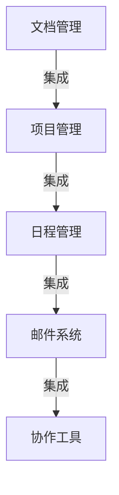

# 企业办公系统的设计与实现

作者：禅与计算机程序设计艺术

## 1.背景介绍

### 1.1 企业办公系统的定义与意义

企业办公系统（Enterprise Office System，EOS）是指用于支持企业内部日常办公活动的软件系统。这些系统通常涵盖了文档管理、邮件通信、日程安排、项目管理、员工协作等功能。通过集成各种办公应用，企业办公系统旨在提高工作效率、促进信息共享和优化业务流程。

### 1.2 发展历程

企业办公系统的发展经历了从单机版办公软件到网络版协同办公系统，再到如今的云办公系统的演变。早期的办公系统主要是基于单机的，如微软的Office套件。随着互联网的发展，企业办公系统逐渐向网络化、协作化方向发展，出现了如Lotus Notes、Microsoft Exchange等协同办公系统。近年来，随着云计算技术的普及，企业办公系统逐步向云端迁移，代表产品有Google Workspace、Microsoft 365等。

### 1.3 当前的技术趋势

当前，企业办公系统的发展呈现出以下几个技术趋势：

- **云计算**：云办公系统通过云端存储和计算资源，提供更高的灵活性和可扩展性。
- **移动办公**：移动设备的普及使得办公系统需要支持多终端访问，提供随时随地的办公能力。
- **人工智能**：AI技术在办公系统中的应用，如智能助手、自动化流程、数据分析等，提升了办公效率。
- **安全性**：随着数据隐私和安全问题的日益重要，企业办公系统需要提供更强的安全保障。

## 2.核心概念与联系

### 2.1 核心模块

企业办公系统通常由以下几个核心模块组成：

- **文档管理**：用于创建、编辑、存储和检索文档。
- **邮件系统**：提供内部和外部的邮件通信功能。
- **日程管理**：包括日历、任务、会议安排等功能。
- **项目管理**：支持项目的规划、执行和监控。
- **协作工具**：如即时通讯、视频会议、共享白板等。

### 2.2 模块之间的联系

这些模块之间的联系紧密，相互依赖。例如，日程管理模块可以与邮件系统集成，通过邮件发送会议邀请；文档管理模块可以与项目管理模块集成，实现项目文档的集中管理。下面是一个简单的架构图，展示了各模块之间的联系：



## 3.核心算法原理具体操作步骤

### 3.1 文档检索算法

文档管理系统的核心功能之一是文档检索，其关键在于高效的索引和查询算法。通常使用倒排索引和TF-IDF算法来实现。

#### 3.1.1 倒排索引

倒排索引是一种索引结构，用于快速查找包含某个词的文档。其基本思想是为每个词建立一个列表，记录包含该词的所有文档ID。

#### 3.1.2 TF-IDF算法

TF-IDF（Term Frequency-Inverse Document Frequency）是一种用于评估一个词语对于一个文档的重要程度的统计方法。其公式为：

$$
\text{TF-IDF}(t, d) = \text{TF}(t, d) \times \text{IDF}(t)
$$

其中，$\text{TF}(t, d)$ 表示词 $t$ 在文档 $d$ 中出现的频率，$\text{IDF}(t)$ 表示词 $t$ 的逆文档频率，计算公式为：

$$
\text{IDF}(t) = \log\left(\frac{N}{1 + \text{DF}(t)}\right)
$$

其中，$N$ 是文档总数，$\text{DF}(t)$ 是包含词 $t$ 的文档数。

### 3.2 日程冲突检测算法

日程管理系统需要处理会议安排中的时间冲突问题。常用的冲突检测算法包括扫描线算法和区间树算法。

#### 3.2.1 扫描线算法

扫描线算法通过将所有事件的开始和结束时间排序，然后扫描时间轴，检测重叠的时间段。

#### 3.2.2 区间树算法

区间树是一种平衡二叉搜索树，用于存储区间并高效地查询重叠区间。

## 4.数学模型和公式详细讲解举例说明

### 4.1 文档检索模型

文档检索模型的核心是倒排索引和TF-IDF算法。假设我们有以下文档集合：

- 文档1： "企业办公系统设计"
- 文档2： "系统设计与实现"
- 文档3： "办公系统的实现"

#### 4.1.1 构建倒排索引

首先，构建倒排索引：

| 词语 | 文档ID |
|------|--------|
| 企业 | 1      |
| 办公 | 1, 3   |
| 系统 | 1, 2, 3|
| 设计 | 1, 2   |
| 实现 | 2, 3   |

#### 4.1.2 计算TF-IDF

计算每个词在每个文档中的TF-IDF值。例如，计算词 "系统" 在文档1中的TF-IDF值：

$$
\text{TF}(\text{系统}, \text{文档1}) = \frac{1}{4}
$$

$$
\text{IDF}(\text{系统}) = \log\left(\frac{3}{1 + 3}\right) = \log\left(\frac{3}{4}\right)
$$

$$
\text{TF-IDF}(\text{系统}, \text{文档1}) = \frac{1}{4} \times \log\left(\frac{3}{4}\right)
$$

### 4.2 日程冲突检测模型

日程冲突检测模型可以通过扫描线算法实现。假设我们有以下会议安排：

- 会议1： 9:00 - 10:00
- 会议2： 9:30 - 11:00
- 会议3： 10:30 - 12:00

#### 4.2.1 扫描线算法

首先，将所有事件的开始和结束时间排序：

| 时间 | 类型 |
|------|------|
| 9:00 | 开始 |
| 9:30 | 开始 |
| 10:00 | 结束 |
| 10:30 | 开始 |
| 11:00 | 结束 |
| 12:00 | 结束 |

然后，扫描时间轴，检测重叠的时间段：

- 9:00 - 9:30： 1个会议
- 9:30 - 10:00： 2个会议（冲突）
- 10:00 - 10:30： 1个会议
- 10:30 - 11:00： 2个会议（冲突）
- 11:00 - 12:00： 1个会议

## 5.项目实践：代码实例和详细解释说明

### 5.1 文档检索系统

下面是一个简单的文档检索系统的代码示例，使用Python实现倒排索引和TF-IDF算法。

```python
import math
from collections import defaultdict

# 文档集合
documents = [
    "企业办公系统设计",
    "系统设计与实现",
    "办公系统的实现"
]

# 构建倒排索引
def build_inverted_index(docs):
    inverted_index = defaultdict(list)
    for doc_id, doc in enumerate(docs):
        for term in doc.split():
            inverted_index[term].append(doc_id)
    return inverted_index

# 计算TF-IDF
def compute_tf_idf(term, doc, docs):
    tf = doc.split().count(term) / len(doc.split())
    df = sum([1 for d in docs if term in d])
    idf = math.log(len(docs) / (1 + df))
    return tf * idf

# 示例运行
inverted_index = build_inverted_index(documents)
for term in inverted_index:
    for doc_id in inverted_index[term]:
        tf_idf = compute_tf_idf(term, documents[doc_id], documents)
        print(f"Term: {term}, DocID: {doc_id}, TF-IDF: {tf_idf}")
```

### 5.2 日程冲突检测系统

下面是一个简单的日程冲突检测系统的代码示例，使用Python实现扫描线算法。

```python
# 会议安排
meetings = [
    (9, 10),
    (9.5