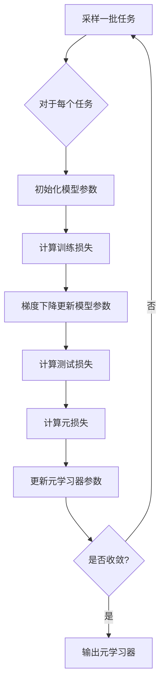
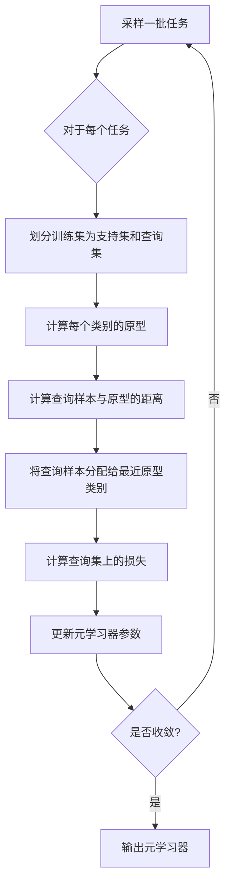

# 元学习(Meta-Learning) - 原理与代码实例讲解

## 1. 背景介绍

### 1.1 机器学习的挑战

在传统的机器学习中,我们通常需要为每个新任务收集大量的标记数据,并从头开始训练一个新的模型。这种方法效率低下,并且难以扩展到大量不同的任务。此外,当我们遇到一个新的任务时,我们无法利用以前学习到的知识,而是必须从头开始学习。

### 1.2 元学习的概念

元学习(Meta-Learning)旨在解决这些挑战。它的目标是学习如何快速适应新任务,并利用以前学习到的知识来加速新任务的学习过程。换句话说,元学习是"学习如何学习"。

### 1.3 元学习的应用场景

元学习在许多领域都有广泛的应用,例如:

- Few-Shot Learning: 在有限的标记数据下快速学习新概念
- 多任务学习: 同时学习多个相关任务,提高泛化能力
- 持续学习: 在不破坏之前知识的情况下学习新概念
- 自动机器学习: 自动搜索优化模型架构和超参数

## 2. 核心概念与联系

### 2.1 元学习的形式化定义

在形式化定义中,我们将机器学习任务视为一个从任务分布 $p(\mathcal{T})$ 中采样的任务 $\mathcal{T}$。每个任务 $\mathcal{T}$ 都由一个训练数据集 $\mathcal{D}_{train}$ 和一个测试数据集 $\mathcal{D}_{test}$ 组成。

元学习的目标是学习一个元学习器(meta-learner) $f_{\theta}$,它能够快速适应每个新任务 $\mathcal{T}$。在元训练阶段,元学习器从一系列任务 $\{\mathcal{T}_i\}$ 中学习,目标是最小化在元测试任务上的损失:

$$\min_{\theta} \mathbb{E}_{\mathcal{T} \sim p(\mathcal{T})} \left[ \mathcal{L}_{\mathcal{T}}(f_{\theta}) \right]$$

其中 $\mathcal{L}_{\mathcal{T}}(f_{\theta})$ 是在任务 $\mathcal{T}$ 上的损失函数。

### 2.2 元学习算法分类

根据元学习器的更新方式,我们可以将元学习算法分为三大类:

1. **基于优化的元学习**: 通过学习一个好的初始化或优化器,使模型能够快速适应新任务。例如 MAML, Reptile 等。

2. **基于度量的元学习**: 学习一个好的嵌入空间,使相似的任务在该空间中更加紧密。例如 Prototypical Networks, Relation Networks 等。

3. **基于生成模型的元学习**: 直接从任务分布中生成新的模型参数或权重。例如 Meta-SGD, Meta-Curvature 等。

### 2.3 元学习与其他机器学习范式的关系

元学习与其他一些机器学习范式有着密切的关系,例如:

- **多任务学习**: 多任务学习可以看作是元学习的一个特例,其中所有任务都来自同一个分布。
- **迁移学习**: 迁移学习关注如何将知识从一个领域迁移到另一个领域,而元学习则更关注如何快速适应新任务。
- **持续学习**: 持续学习和元学习都关注如何在不破坏之前知识的情况下学习新概念。
- **小样本学习**: 小样本学习是元学习的一个重要应用场景。

## 3. 核心算法原理具体操作步骤

在这一节,我们将介绍两种流行的元学习算法:基于优化的 MAML(Model-Agnostic Meta-Learning) 和基于度量的 Prototypical Networks。

### 3.1 MAML (Model-Agnostic Meta-Learning)

MAML 是一种基于优化的元学习算法,它旨在学习一个好的模型初始化,使得模型能够通过几步梯度更新就适应新任务。

#### 3.1.1 MAML 算法步骤

1. 从任务分布 $p(\mathcal{T})$ 中采样一批任务 $\{\mathcal{T}_i\}$
2. 对于每个任务 $\mathcal{T}_i$:
    - 将模型参数初始化为 $\theta$
    - 从 $\mathcal{T}_i$ 的训练集 $\mathcal{D}_{train}^i$ 中采样一批数据,计算损失 $\mathcal{L}_{\mathcal{T}_i}(\theta)$
    - 通过一步或几步梯度下降更新模型参数: $\theta_i' = \theta - \alpha \nabla_{\theta} \mathcal{L}_{\mathcal{T}_i}(\theta)$
    - 从 $\mathcal{T}_i$ 的测试集 $\mathcal{D}_{test}^i$ 中采样一批数据,计算元损失 $\mathcal{L}_{\mathcal{T}_i}(\theta_i')$
3. 更新元学习器参数 $\theta$ 以最小化所有任务的元损失之和: $\theta \leftarrow \theta - \beta \nabla_{\theta} \sum_i \mathcal{L}_{\mathcal{T}_i}(\theta_i')$
4. 重复步骤 1-3 直到收敛

#### 3.1.2 MAML 算法流程图

### 3.2 Prototypical Networks

Prototypical Networks 是一种基于度量的元学习算法,它通过学习一个好的嵌入空间,使相似的任务在该空间中更加紧密。

#### 3.2.1 Prototypical Networks 算法步骤

1. 从任务分布 $p(\mathcal{T})$ 中采样一批任务 $\{\mathcal{T}_i\}$
2. 对于每个任务 $\mathcal{T}_i$:
    - 将训练集 $\mathcal{D}_{train}^i$ 划分为支持集(support set) $S$ 和查询集(query set) $Q$
    - 对于每个类别 $k$,计算支持集中该类别的原型(prototype) $c_k = \frac{1}{|S_k|} \sum_{(x,y) \in S_k} f_{\theta}(x)$
    - 对于每个查询样本 $(x_q, y_q) \in Q$,计算其与每个原型的距离: $d(x_q, c_k) = \left\lVert f_{\theta}(x_q) - c_k \right\rVert_2^2$
    - 将查询样本 $x_q$ 分配给最近的原型类别: $\hat{y}_q = \arg\min_k d(x_q, c_k)$
    - 计算查询集上的损失: $\mathcal{L}_{\mathcal{T}_i}(\theta) = \sum_{(x_q, y_q) \in Q} \mathbb{1}[\hat{y}_q \neq y_q]$
3. 更新元学习器参数 $\theta$ 以最小化所有任务的损失之和: $\theta \leftarrow \theta - \beta \nabla_{\theta} \sum_i \mathcal{L}_{\mathcal{T}_i}(\theta)$
4. 重复步骤 1-3 直到收敛

#### 3.2.2 Prototypical Networks 算法流程图

## 4. 数学模型和公式详细讲解举例说明

在这一节,我们将详细讲解一些元学习中常用的数学模型和公式,并给出具体的例子说明。

### 4.1 MAML 中的二阶近似

在 MAML 算法中,我们通过一步或几步梯度更新来适应新任务。然而,这种一阶近似可能会导致子优化问题。为了解决这个问题,我们可以使用二阶近似来更好地估计新任务的损失函数。

具体来说,我们可以使用泰勒展开来近似新任务的损失函数:

$$\mathcal{L}_{\mathcal{T}}(\theta') \approx \mathcal{L}_{\mathcal{T}}(\theta) + \nabla_{\theta} \mathcal{L}_{\mathcal{T}}(\theta)^{\top} (\theta' - \theta) + \frac{1}{2} (\theta' - \theta)^{\top} \nabla_{\theta\theta}^2 \mathcal{L}_{\mathcal{T}}(\theta) (\theta' - \theta)$$

其中 $\theta'$ 是通过一步梯度下降得到的新参数,而 $\nabla_{\theta\theta}^2 \mathcal{L}_{\mathcal{T}}(\theta)$ 是损失函数的二阶导数(Hessian矩阵)。

通过最小化这个二阶近似,我们可以得到一个更好的参数更新步骤:

$$\theta' = \theta - \alpha (\nabla_{\theta\theta}^2 \mathcal{L}_{\mathcal{T}}(\theta) + \lambda I)^{-1} \nabla_{\theta} \mathcal{L}_{\mathcal{T}}(\theta)$$

其中 $\lambda$ 是一个正则化项,用于避免矩阵不可逆。

这种二阶近似方法通常可以获得更好的性能,但计算开销也更大。在实践中,我们可以使用一些技巧(如对角矩阵近似)来减少计算开销。

### 4.2 Prototypical Networks 中的距离度量

在 Prototypical Networks 中,我们需要定义一个距离度量来计算查询样本与原型之间的相似性。最常用的距离度量是欧几里得距离(L2距离):

$$d(x, y) = \left\lVert f_{\theta}(x) - f_{\theta}(y) \right\rVert_2^2 = \sum_i (f_{\theta}(x)_i - f_{\theta}(y)_i)^2$$

其中 $f_{\theta}(x)$ 和 $f_{\theta}(y)$ 分别表示样本 $x$ 和 $y$ 在嵌入空间中的表示。

除了欧几里得距离,我们还可以使用其他距离度量,如余弦相似度:

$$d(x, y) = 1 - \frac{f_{\theta}(x)^{\top} f_{\theta}(y)}{\left\lVert f_{\theta}(x) \right\rVert_2 \left\lVert f_{\theta}(y) \right\rVert_2}$$

或者高斯核函数:

$$d(x, y) = \exp \left( -\frac{\left\lVert f_{\theta}(x) - f_{\theta}(y) \right\rVert_2^2}{2\sigma^2} \right)$$

不同的距离度量可能会对模型的性能产生影响,因此我们需要根据具体任务进行选择和调优。

### 4.3 小批量梯度更新

在元学习中,我们通常会在每个任务的训练集上进行小批量梯度更新,而不是使用整个训练集。这样可以减少计算开销,并提高训练效率。

具体来说,我们将训练集 $\mathcal{D}_{train}$ 划分为多个小批量 $\{B_1, B_2, \dots, B_n\}$,然后在每个小批量上进行梯度更新:

$$\theta_1 = \theta - \alpha \nabla_{\theta} \mathcal{L}_{B_1}(\theta)$$
$$\theta_2 = \theta_1 - \alpha \nabla_{\theta} \mathcal{L}_{B_2}(\theta_1)$$
$$\dots$$
$$\theta_n = \theta_{n-1} - \alpha \nabla_{\theta} \mathcal{L}_{B_n}(\theta_{n-1})$$

最终,我们将 $\theta_n$ 作为新任务的模型参数。

这种小批量更新方式不仅可以减少计算开销,而且还可以引入一定的噪声,从而提高模型的泛化能力