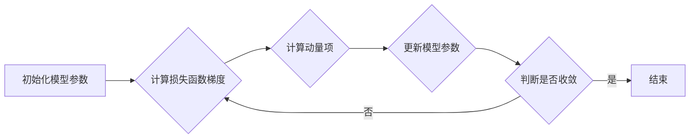

## 1. 背景介绍

### 1.1 机器学习中的优化问题

机器学习的核心任务之一是从数据中学习模型参数，使得模型能够对未知数据进行准确的预测。这一学习过程通常被转化为一个优化问题，即寻找一组模型参数，使得模型在训练数据上的损失函数最小化。损失函数用于衡量模型预测值与真实值之间的差异，常见的损失函数包括均方误差、交叉熵等。

### 1.2 梯度下降算法及其局限性

梯度下降算法是机器学习中应用最广泛的优化算法之一，其基本思想是沿着损失函数梯度的反方向更新模型参数，逐步逼近损失函数的最小值点。然而，传统的梯度下降算法存在一些局限性：

* **收敛速度慢：** 当损失函数较为复杂或训练数据量较大时，梯度下降算法的收敛速度可能非常慢。
* **容易陷入局部最优解：** 对于非凸优化问题，梯度下降算法容易陷入局部最优解，无法找到全局最优解。
* **对学习率敏感：** 学习率是梯度下降算法中的一个重要超参数，其取值对算法的收敛速度和效果有很大影响。

### 1.3 动量优化算法的优势

为了克服传统梯度下降算法的局限性，研究者们提出了一系列改进算法，其中动量优化算法是一类重要的改进算法。动量优化算法的基本思想是在梯度下降算法的基础上，引入动量项，利用历史梯度信息来加速模型参数的更新。

相比于传统的梯度下降算法，动量优化算法具有以下优势：

* **加速收敛速度：** 动量项的引入可以有效加速模型参数的更新，尤其是在损失函数较为平坦的区域，可以更快地跳出局部最优解。
* **抑制震荡：** 动量项可以抑制模型参数更新过程中的震荡现象，使得模型训练过程更加稳定。
* **降低对学习率的敏感性：** 动量优化算法对学习率的取值相对不敏感，更容易找到合适的学习率。

## 2. 核心概念与联系

### 2.1 动量项

动量项是动量优化算法的核心概念，其作用是记录历史梯度信息，并将其用于当前模型参数的更新。具体来说，动量项通常定义为一个向量，其方向与历史梯度的加权平均方向一致，大小由一个称为动量系数的超参数控制。

### 2.2 指数加权移动平均

动量项的计算通常采用指数加权移动平均的方法，该方法可以赋予近期梯度信息更高的权重，而远期梯度信息的权重则会随着时间的推移而逐渐衰减。

指数加权移动平均的计算公式如下：

$$
v_t = \beta v_{t-1} + (1 - \beta) \nabla J(\theta_t)
$$

其中：

* $v_t$ 表示当前时刻的动量项；
* $v_{t-1}$ 表示上一时刻的动量项；
* $\beta$ 表示动量系数，取值范围为 [0, 1]，通常设置为 0.9 或 0.99；
* $\nabla J(\theta_t)$ 表示当前时刻的损失函数梯度。

### 2.3 动量优化算法的更新规则

动量优化算法的更新规则是在梯度下降算法的基础上，将梯度替换为动量项，即：

$$
\theta_{t+1} = \theta_t - \alpha v_t
$$

其中：

* $\theta_t$ 表示当前时刻的模型参数；
* $\alpha$ 表示学习率。

### 2.4 动量优化算法的流程图



## 3. 核心算法原理具体操作步骤

### 3.1 算法流程

动量优化算法的具体操作步骤如下：

1. 初始化模型参数 $\theta_0$，动量项 $v_0 = 0$。
2. 选择合适的学习率 $\alpha$ 和动量系数 $\beta$。
3. 迭代进行以下步骤，直到模型收敛：
    * 计算当前模型参数下的损失函数梯度 $\nabla J(\theta_t)$。
    * 使用指数加权移动平均计算动量项 $v_t = \beta v_{t-1} + (1 - \beta) \nabla J(\theta_t)$。
    * 更新模型参数 $\theta_{t+1} = \theta_t - \alpha v_t$。

### 3.2 代码实现

```python
def momentum(grad_func, theta_0, alpha=0.01, beta=0.9, max_iter=1000, tol=1e-6):
    """
    动量优化算法

    参数：
        grad_func：损失函数梯度计算函数
        theta_0：模型参数初始值
        alpha：学习率
        beta：动量系数
        max_iter：最大迭代次数
        tol：收敛精度

    返回值：
        theta：优化后的模型参数
        losses：每次迭代的损失函数值
    """

    theta = theta_0
    v = 0
    losses = []

    for i in range(max_iter):
        # 计算损失函数梯度
        grad = grad_func(theta)

        # 计算动量项
        v = beta * v + (1 - beta) * grad

        # 更新模型参数
        theta = theta - alpha * v

        # 计算损失函数值
        loss = loss_func(theta)
        losses.append(loss)

        # 判断是否收敛
        if i > 0 and abs(losses[-1] - losses[-2]) < tol:
            break

    return theta, losses
```

## 4. 数学模型和公式详细讲解举例说明

### 4.1 指数加权移动平均的数学推导

指数加权移动平均的计算公式可以展开为：

$$
\begin{aligned}
v_t &= \beta v_{t-1} + (1 - \beta) \nabla J(\theta_t) \\
&= \beta (\beta v_{t-2} + (1 - \beta) \nabla J(\theta_{t-1})) + (1 - \beta) \nabla J(\theta_t) \\
&= \beta^2 v_{t-2} + \beta (1 - \beta) \nabla J(\theta_{t-1}) + (1 - \beta) \nabla J(\theta_t) \\
&= ... \\
&= (1 - \beta) \sum_{i=0}^{t} \beta^i \nabla J(\theta_{t-i})
\end{aligned}
$$

从上式可以看出，指数加权移动平均相当于对历史梯度信息进行加权求和，其中权重系数随着时间的推移呈指数衰减。

### 4.2 动量项对梯度下降的影响

动量项的引入相当于对梯度下降的方向进行修正，使其更加平滑，从而加速模型参数的更新。

如下图所示，假设损失函数的等高线图如下，黑色箭头表示梯度下降的方向，蓝色箭头表示动量项的方向，红色箭头表示最终的更新方向。


从图中可以看出，动量项的作用主要体现在以下两个方面：

* **加速收敛：** 当损失函数的等高线较为平坦时，梯度下降的方向可能会在最小值点附近来回震荡，导致收敛速度变慢。而动量项的引入可以有效地抑制这种震荡现象，加速模型参数的更新。
* **跳出局部最优解：** 当损失函数存在多个局部最优解时，梯度下降算法容易陷入局部最优解，无法找到全局最优解。而动量项的引入可以帮助模型参数跳出局部最优解，找到更优的解。

## 5. 项目实践：代码实例和详细解释说明

### 5.1 数据集介绍

本节将以 MNIST 手写数字识别数据集为例，演示如何使用动量优化算法训练一个简单的多层感知机模型。

MNIST 数据集包含 60000 张训练图片和 10000 张测试图片，每张图片大小为 28x28 像素，代表一个手写数字。

### 5.2 模型构建

本节将构建一个简单的多层感知机模型，包含一个输入层、一个隐藏层和一个输出层。

```python
import torch
import torch.nn as nn

class MLP(nn.Module):
    def __init__(self, input_size, hidden_size, output_size):
        super(MLP, self).__init__()
        self.fc1 = nn.Linear(input_size, hidden_size)
        self.relu = nn.ReLU()
        self.fc2 = nn.Linear(hidden_size, output_size)

    def forward(self, x):
        