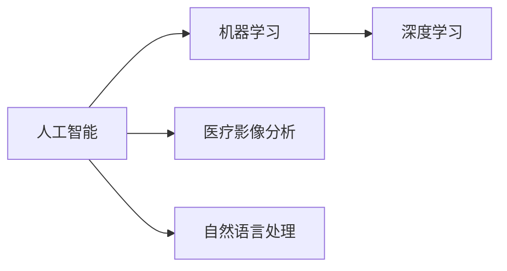

# 医疗AI的挑战与机遇：共克时艰，共赢未来

作者：禅与计算机程序设计艺术

## 1. 背景介绍

### 1.1 医疗AI的兴起

近年来，人工智能（AI）在各个领域都取得了突破性进展，医疗领域也不例外。医疗 AI，即利用人工智能技术来解决医疗问题，正在以前所未有的速度改变着医疗保健行业。从疾病诊断到药物研发，从个性化治疗到健康管理，医疗 AI 都展现出巨大的潜力。

### 1.2 医疗AI的驱动因素

医疗 AI 的快速发展主要得益于以下几个因素：

* **海量医疗数据的积累:**  随着电子病历、基因测序、医学影像等技术的普及，医疗数据呈爆炸式增长，为 AI 算法的训练提供了充足的养料。
* **人工智能技术的进步:** 深度学习、强化学习等 AI 技术的突破，为解决复杂医疗问题提供了新的思路和方法。
* **医疗成本不断攀升:**  传统医疗模式面临着成本高、效率低等问题，医疗 AI 有望通过提高效率、降低成本，缓解医疗资源紧张的现状。
* **政策支持力度加大:**  各国政府纷纷出台政策，鼓励和支持医疗 AI 的研发和应用。

### 1.3 医疗AI的应用场景

医疗 AI 的应用场景非常广泛，涵盖了医疗保健的各个环节，主要包括：

* **疾病诊断:**  AI 可以辅助医生进行疾病诊断，提高诊断的准确性和效率。例如，利用 AI 分析医学影像，可以帮助医生更早、更准确地诊断出癌症、心血管疾病等。
* **药物研发:**  AI 可以加速药物研发过程，降低研发成本，提高研发成功率。例如，利用 AI 筛选潜在的药物靶点，可以大大缩短药物研发周期。
* **个性化治疗:**  AI 可以根据患者的基因、生活习惯等信息，制定个性化的治疗方案，提高治疗效果。
* **健康管理:**  AI 可以帮助人们进行健康管理，预防疾病的发生。例如，利用 AI 分析用户的健康数据，可以为用户提供个性化的健康建议。

## 2. 核心概念与联系

### 2.1 人工智能 (AI)

人工智能（Artificial Intelligence，AI）是指机器模拟人类智能的技术，包括学习、推理、问题求解、感知、自然语言处理等能力。

### 2.2 机器学习 (ML)

机器学习（Machine Learning，ML）是人工智能的一个分支，是指让机器从数据中学习，并根据学习到的知识进行预测或决策的技术。

### 2.3 深度学习 (DL)

深度学习（Deep Learning，DL）是机器学习的一个分支，是指利用多层神经网络对数据进行学习，从而提取数据的高层抽象特征的技术。

### 2.4 医疗影像分析

医疗影像分析是指利用计算机技术对医学影像进行分析，以辅助医生进行疾病诊断的技术。

### 2.5 自然语言处理 (NLP)

自然语言处理（Natural Language Processing，NLP）是指让计算机理解和处理人类语言的技术。

### 2.6 概念联系图



## 3. 核心算法原理具体操作步骤

### 3.1  卷积神经网络 (CNN) 在医学影像分析中的应用

#### 3.1.1  卷积神经网络 (CNN) 原理

卷积神经网络 (CNN) 是一种专门用于处理图像数据的深度学习模型，其核心思想是利用卷积核对图像进行特征提取。

#### 3.1.2 CNN 在医学影像分析中的应用步骤

1. **数据预处理:** 对医学影像数据进行预处理，例如图像缩放、灰度化、去噪等。
2. **构建 CNN 模型:**  根据具体应用场景，构建合适的 CNN 模型，例如使用 LeNet、AlexNet、VGGNet 等经典模型，或者根据实际需求设计新的模型。
3. **训练模型:**  使用标注好的医学影像数据对 CNN 模型进行训练，不断调整模型参数，使模型能够准确地识别图像中的特征。
4. **模型评估:**  使用测试集对训练好的模型进行评估，评估指标包括准确率、精确率、召回率等。
5. **模型部署:**  将训练好的模型部署到实际应用环境中，例如医院的 PACS 系统中，辅助医生进行疾病诊断。

### 3.2 循环神经网络 (RNN) 在医疗文本处理中的应用

#### 3.2.1 循环神经网络 (RNN) 原理

循环神经网络 (RNN) 是一种专门用于处理序列数据的深度学习模型，其核心思想是利用循环结构对序列数据进行建模，从而捕捉序列数据中的时序信息。

#### 3.2.2 RNN 在医疗文本处理中的应用步骤

1. **数据预处理:** 对医疗文本数据进行预处理，例如分词、词干提取、去除停用词等。
2. **构建 RNN 模型:**  根据具体应用场景，构建合适的 RNN 模型，例如使用 LSTM、GRU 等经典模型，或者根据实际需求设计新的模型。
3. **训练模型:**  使用标注好的医疗文本数据对 RNN 模型进行训练，不断调整模型参数，使模型能够准确地理解文本中的语义信息。
4. **模型评估:**  使用测试集对训练好的模型进行评估，评估指标包括准确率、精确率、召回率等。
5. **模型部署:**  将训练好的模型部署到实际应用环境中，例如医院的信息系统中，辅助医生进行病例分析、问诊等。

## 4. 数学模型和公式详细讲解举例说明

### 4.1 Logistic 回归在疾病预测中的应用

#### 4.1.1 Logistic 回归模型

Logistic 回归是一种用于预测二分类变量的机器学习模型，其数学模型如下：

$$
P(y=1|x) = \frac{1}{1+e^{-(w^Tx+b)}}
$$

其中：

* $P(y=1|x)$ 表示在给定特征 $x$ 的情况下，样本属于类别 1 的概率。
* $w$ 是模型的权重向量。
* $x$ 是样本的特征向量。
* $b$ 是模型的偏置项。

#### 4.1.2 Logistic 回归在疾病预测中的应用举例

假设我们要利用 Logistic 回归模型预测患者是否患有心脏病，我们可以收集患者的年龄、性别、血压、胆固醇等特征数据，并将这些特征数据作为模型的输入，模型的输出为患者患有心脏病的概率。

### 4.2 支持向量机 (SVM) 在医学影像分割中的应用

#### 4.2.1 支持向量机 (SVM) 模型

支持向量机 (SVM) 是一种用于分类和回归的机器学习模型，其核心思想是找到一个最优的超平面，将不同类别的数据分开。

#### 4.2.2 SVM 在医学影像分割中的应用举例

假设我们要利用 SVM 模型对脑部 MRI 影像进行肿瘤分割，我们可以将 MRI 影像中的每个像素点作为样本，并提取每个像素点的灰度值、纹理特征等信息作为模型的输入，模型的输出为每个像素点属于肿瘤区域的概率。

## 5. 项目实践：代码实例和详细解释说明

### 5.1 基于 CNN 的肺结节检测

#### 5.1.1 项目背景

肺癌是全球范围内发病率和死亡率最高的恶性肿瘤之一，早期诊断对于提高肺癌患者的生存率至关重要。利用 CNN 对肺部 CT 影像进行分析，可以自动识别肺结节，辅助医生进行肺癌的早期诊断。

#### 5.1.2 代码实例

```python
import tensorflow as tf

# 定义 CNN 模型
model = tf.keras.models.Sequential([
  tf.keras.layers.Conv2D(32, (3, 3), activation='relu', input_shape=(128, 128, 1)),
  tf.keras.layers.MaxPooling2D((2, 2)),
  tf.keras.layers.Conv2D(64, (3, 3), activation='relu'),
  tf.keras.layers.MaxPooling2D((2, 2)),
  tf.keras.layers.Flatten(),
  tf.keras.layers.Dense(128, activation='relu'),
  tf.keras.layers.Dense(1, activation='sigmoid')