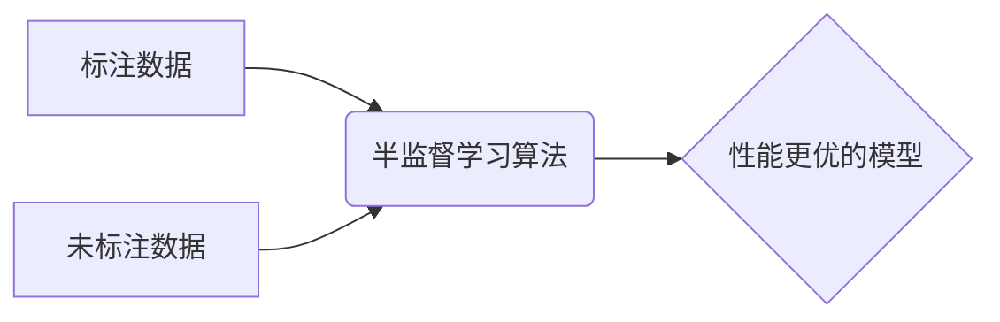

##  半监督学习:利用未标注数据提升模型性能

作者：禅与计算机程序设计艺术

## 1. 背景介绍

### 1.1 机器学习中的数据困境

在机器学习领域，数据被视为推动模型性能提升的燃料。然而，高质量的标注数据往往成本高昂且难以获取。这对于许多实际应用场景，如图像识别、自然语言处理等，构成了巨大的挑战。试想一下，如果要训练一个能够识别数百万种不同物体的图像分类器，我们需要为每一张图片都打上正确的标签，这几乎是不可能完成的任务。

### 1.2 半监督学习的崛起

为了解决数据困境，半监督学习应运而生。与传统的监督学习（完全依赖标注数据）和无监督学习（完全不依赖标注数据）不同，半监督学习旨在利用少量标注数据和大量未标注数据来训练模型，从而在降低数据标注成本的同时提升模型性能。

### 1.3 本文目标

本文将深入探讨半监督学习的核心概念、算法原理、应用场景以及未来发展趋势，旨在帮助读者全面了解这一重要领域，并为实际应用提供参考。

## 2. 核心概念与联系

### 2.1 半监督学习的定义

半监督学习是一种介于监督学习和无监督学习之间的机器学习范式，其目标是利用少量标注数据和大量未标注数据来构建性能更优的模型。

### 2.2 半监督学习的基本假设

半监督学习算法通常基于以下假设：

* **平滑性假设:**  如果两个样本在特征空间中距离较近，则它们很有可能属于同一类别。
* **聚类假设:**  属于同一类别的样本倾向于聚集在一起，形成明显的簇结构。
* **流形假设:**  高维数据通常分布在一个低维流形上，而数据的标签信息通常在流形上是平滑变化的。

### 2.3 半监督学习与其他学习范式的联系

* **监督学习:** 半监督学习可以看作是监督学习的一种扩展，它利用未标注数据来增强模型的泛化能力。
* **无监督学习:** 半监督学习可以利用无监督学习方法来探索数据的结构信息，例如使用聚类算法对未标注数据进行分组。
* **迁移学习:**  半监督学习可以与迁移学习结合，将从源领域学习到的知识迁移到目标领域，从而缓解目标领域标注数据不足的问题。

## 3. 核心算法原理具体操作步骤

### 3.1 自训练 (Self-Training)

#### 3.1.1 算法描述

1. 使用少量标注数据训练一个初始模型。
2. 利用训练好的模型对未标注数据进行预测，并将预测结果中置信度较高的样本及其预测标签加入到训练集中。
3. 使用更新后的训练集重新训练模型。
4. 重复步骤 2 和 3，直到模型性能不再提升或达到预设的迭代次数。

#### 3.1.2 算法优缺点

* **优点:**  简单易实现，无需对模型结构进行修改。
* **缺点:**  容易出现模型对自身错误的预测结果过度自信，导致性能下降的问题（模型偏差）。

### 3.2 协同训练 (Co-Training)

#### 3.2.1 算法描述

1. 假设数据具有两个或多个独立且充分的特征视图。
2.  针对每个特征视图训练一个独立的分类器。
3.  利用每个分类器对未标注数据进行预测，并将预测结果中置信度较高的样本及其预测标签加入到其他分类器的训练集中。
4.  重复步骤 3，直到所有分类器的性能不再提升或达到预设的迭代次数。

#### 3.2.2 算法优缺点

* **优点:**  可以有效地利用数据的多个特征视图，提高模型的泛化能力。
* **缺点:**  需要满足数据具有多个独立且充分的特征视图的假设，实际应用中难以满足。

### 3.3 图传播算法 (Graph-Based Methods)

#### 3.3.1 算法描述

1. 将所有样本（包括标注数据和未标注数据）表示为图中的节点，节点之间的边权重表示样本之间的相似度。
2.  利用标注数据的标签信息在图上进行传播，使得距离较近的样本具有相似的标签。
3.   根据标签传播的结果对未标注数据进行分类。

#### 3.3.2 算法优缺点

* **优点:**  可以有效地利用数据的流形结构信息，对高维数据具有较好的处理能力。
* **缺点:**  图的构建和计算复杂度较高，在大规模数据集上难以应用。

## 4. 数学模型和公式详细讲解举例说明

### 4.1  生成式半监督学习模型

#### 4.1.1 模型描述

生成式半监督学习模型假设数据是由某个概率分布生成的，并试图通过估计该概率分布来进行分类。

#### 4.1.2  高斯混合模型 (Gaussian Mixture Model, GMM)

GMM 是一种常用的生成式模型，它假设数据服从多个高斯分布的混合。

##### 4.1.2.1 模型公式

$$
p(x) = \sum_{k=1}^K \pi_k \mathcal{N}(x|\mu_k, \Sigma_k)
$$

其中：

*  $x$ 表示样本数据点。
*  $K$ 表示高斯混合成分的个数。
*  $\pi_k$ 表示第 $k$ 个高斯成分的权重。
*  $\mathcal{N}(x|\mu_k, \Sigma_k)$ 表示均值为 $\mu_k$，协方差矩阵为 $\Sigma_k$ 的高斯分布。

##### 4.1.2.2  参数估计

GMM 的参数可以通过最大似然估计 (Maximum Likelihood Estimation, MLE) 来进行估计。

##### 4.1.2.3  半监督学习中的应用

在半监督学习中，可以利用标注数据来初始化 GMM 的参数，然后使用期望最大化 (Expectation-Maximization, EM) 算法来迭代优化模型参数，直到模型收敛。

### 4.2  判别式半监督学习模型

#### 4.2.1 模型描述

判别式半监督学习模型直接学习从输入空间到输出空间的映射关系，而不关注数据的生成过程。

#### 4.2.2  半监督支持向量机 (Semi-Supervised Support Vector Machine, S3VM)

S3VM 是一种常用的判别式半监督学习模型，它在 SVM 的基础上引入了未标注数据，通过最大化分类间隔和最小化未标注数据预测结果的熵来进行模型训练。

##### 4.2.2.1  模型公式

$$
\min_{w, b, \xi, \hat{y}_u} \frac{1}{2}||w||^2 + C_1 \sum_{i=1}^l \xi_i + C_2 \sum_{j=1}^u H(\hat{y}_j)
$$

其中：

*  $w$ 和 $b$ 分别表示超平面的法向量和截距。
*  $\xi_i$ 表示第 $i$ 个标注样本的松弛变量。
*  $\hat{y}_j$ 表示第 $j$ 个未标注样本的预测标签。
*  $H(\hat{y}_j)$ 表示第 $j$ 个未标注样本预测结果的熵。
*  $C_1$ 和 $C_2$ 分别表示控制标注数据和未标注数据重要性的参数。

##### 4.2.2.2  参数估计

S3VM 的参数可以通过梯度下降等优化算法来进行估计。

##### 4.2.2.3  半监督学习中的应用

在半监督学习中，S3VM 可以有效地利用未标注数据来调整分类超平面，从而提高模型的泛化能力。

## 5. 项目实践：代码实例和详细解释说明

### 5.1 Python 代码实例：使用 Scikit-learn 实现半监督学习

```python
from sklearn.datasets import make_classification
from sklearn.model_selection import train_test_split
from sklearn.semi_supervised import LabelPropagation
from sklearn.metrics import accuracy_score

# 生成模拟数据集
X, y = make_classification(n_samples=1000, n_features=2, n_informative=2, n_redundant=0, random_state=42)

# 将部分样本标记为未标记 (-1)
y[500:] = -1

# 划分训练集和测试集
X_train, X_test, y_train, y_test = train_test_split(X, y, test_size=0.2, random_state=42)

# 创建标签传播模型
model = LabelPropagation()

# 训练模型
model.fit(X_train, y_train)

# 预测测试集
y_pred = model.predict(X_test)

# 评估模型性能
accuracy = accuracy_score(y_test, y_pred)
print("Accuracy:", accuracy)
```

### 5.2 代码解释

1. **生成模拟数据集:**  使用 `make_classification` 函数生成一个包含 1000 个样本，2 个特征的二分类数据集。
2. **将部分样本标记为未标记:**  将标签数组 `y` 中索引从 500 开始的元素设置为 -1，表示这些样本未标记。
3. **划分训练集和测试集:**  使用 `train_test_split` 函数将数据集划分为训练集和测试集。
4. **创建标签传播模型:**  创建 `LabelPropagation` 模型对象。
5. **训练模型:**  使用训练集数据 `X_train` 和 `y_train` 训练标签传播模型。
6. **预测测试集:**  使用训练好的模型对测试集数据 `X_test` 进行预测。
7. **评估模型性能:**  使用 `accuracy_score` 函数计算模型的准确率。

## 6. 实际应用场景

### 6.1 图像分类

* **场景描述:**  利用少量标注图像和大量未标注图像训练图像分类器。
* **算法选择:**  自训练、协同训练、图传播算法等。

### 6.2 自然语言处理

* **场景描述:**  利用少量标注语料和大量未标注语料训练文本分类器、情感分析器等。
* **算法选择:**  自训练、协同训练、半监督主题模型等。

### 6.3 网络安全

* **场景描述:**  利用少量已知恶意软件样本和大量未知软件样本训练恶意软件检测器。
* **算法选择:**  单分类支持向量机、半监督聚类等。

## 7. 工具和资源推荐

### 7.1 Python 库

* **Scikit-learn:** 包含多种半监督学习算法，例如标签传播、半监督 KMeans 等。
* **PyTorch Geometric:** 专注于图神经网络的 PyTorch 库，支持多种图传播算法。

### 7.2 数据集

* **UCI 机器学习库:** 包含多个适合半监督学习的数据集。
* **ImageNet:**  大规模图像数据集，可以用于训练图像分类器。

## 8. 总结：未来发展趋势与挑战

### 8.1 未来发展趋势

* **深度半监督学习:**  将深度学习与半监督学习相结合，构建更强大的模型。
* **弱监督学习:**  利用更弱的监督信息，例如图像级别的标签、部分标注数据等，来训练模型。
* **对抗式半监督学习:**  利用生成对抗网络 (GAN) 来生成更真实的未标注数据，从而提高模型的泛化能力。

### 8.2 面临挑战

* **模型偏差:**  半监督学习算法容易受到模型偏差的影响，导致性能下降。
* **可解释性:**  半监督学习模型的可解释性较差，难以理解模型的决策过程。
* **数据效率:**  如何更有效地利用未标注数据仍然是一个挑战。

## 9. 附录：常见问题与解答

### 9.1  什么是半监督学习？

半监督学习是一种介于监督学习和无监督学习之间的机器学习范式，其目标是利用少量标注数据和大量未标注数据来构建性能更优的模型。

### 9.2 半监督学习有哪些应用场景？

半监督学习的应用场景非常广泛，包括图像分类、自然语言处理、网络安全等。

### 9.3 半监督学习有哪些算法？

常见的半监督学习算法包括自训练、协同训练、图传播算法等。


## 10. Mermaid流程图


