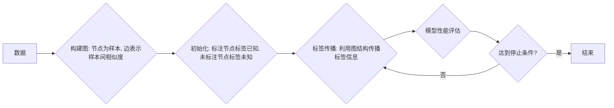

# 半监督学习的开源工具链：快速上手的利器

作者：禅与计算机程序设计艺术

## 1. 背景介绍

### 1.1 机器学习发展历程

机器学习作为人工智能领域的核心分支，其发展经历了多个阶段：从早期的符号主义、专家系统，到统计学习理论的兴起，再到如今深度学习的蓬勃发展，机器学习已经渗透到我们生活的方方面面。而在这其中，如何利用有限的标注数据进行高效的模型训练一直是研究的热点和难点。

### 1.2 半监督学习的兴起

传统的机器学习方法主要分为监督学习和无监督学习。监督学习需要大量的标注数据进行训练，成本高昂；而无监督学习则只能利用数据自身的结构信息，难以完成复杂的预测任务。为了解决这一矛盾，半监督学习应运而生。它旨在利用少量的标注数据和大量的未标注数据进行模型训练，从而在保证模型性能的同时降低标注成本。

### 1.3 本文目标

本文将重点介绍目前主流的半监督学习开源工具链，帮助读者快速上手并应用到实际项目中。

## 2. 核心概念与联系

### 2.1 半监督学习的定义

半监督学习 (Semi-Supervised Learning, SSL) 是一种介于监督学习和无监督学习之间的机器学习方法，其目标是利用少量的标注数据和大量的未标注数据来训练模型，以提高模型的泛化能力。

### 2.2 半监督学习的基本假设

半监督学习通常基于以下假设：

* **平滑假设 (Smoothness Assumption):** 相似的样本点倾向于拥有相同的标签。
* **聚类假设 (Cluster Assumption):** 数据倾向于形成不同的簇，同一个簇内的样本点拥有相同的标签。
* **流形假设 (Manifold Assumption):** 高维数据通常分布在一个低维流形上，样本点的标签在流形上是平滑变化的。

### 2.3 半监督学习的主要方法

常见的半监督学习方法包括：

* **自训练 (Self-Training):** 利用已有的标注数据训练一个初始模型，然后用该模型对未标注数据进行预测，并将置信度高的预测结果加入到标注数据集中，重新训练模型，如此迭代直到模型性能不再提升。
* **协同训练 (Co-Training):** 利用数据的不同视图训练多个分类器，每个分类器都将自己预测结果中置信度高的样本加入到其他分类器的训练集中，从而互相促进，共同提高。
* **图半监督学习 (Graph-Based Semi-Supervised Learning):** 将数据表示成图的形式，利用图的结构信息进行标签传播，将已知标签从标注节点传递到未标注节点。

### 2.4 半监督学习的应用

半监督学习在图像识别、自然语言处理、生物信息学等领域都有广泛的应用。例如：

* **图像分类:** 利用少量的标注图像和大量的未标注图像进行模型训练，可以提高图像分类的准确率。
* **文本分类:** 利用少量的标注文本和大量的未标注文本进行模型训练，可以提高文本分类的准确率。
* **药物发现:** 利用少量的已知药物分子结构和大量的未知药物分子结构进行模型训练，可以加速药物发现的进程。

## 3. 核心算法原理具体操作步骤

### 3.1 自训练 (Self-Training)

#### 3.1.1 算法流程图

```mermaid
graph LR
A[训练集(少量标注数据)] --> B{训练初始模型}
B --> C{使用模型预测未标注数据}
C --> D{选择置信度高的预测结果}
D --> E{将预测结果加入训练集}
E --> B
C --> F{模型性能评估}
F --> G{达到停止条件?}
G -- 是 --> H[结束]
G -- 否 --> B
```

#### 3.1.2 算法步骤

1. 使用少量的标注数据训练一个初始模型。
2. 使用训练好的模型对未标注数据进行预测。
3. 选择预测结果中置信度高的样本。
4. 将这些样本及其预测标签加入到训练集中。
5. 使用新的训练集重新训练模型。
6. 重复步骤2-5，直到模型性能不再提升或达到预设的迭代次数。

### 3.2 协同训练 (Co-Training)

#### 3.2.1 算法流程图

```mermaid
graph LR
A[训练集(少量标注数据)] --> B{数据划分: 视图1, 视图2}
B --> C{训练模型1 (视图1)}
B --> D{训练模型2 (视图2)}
C --> E{使用模型1预测未标注数据}
D --> F{使用模型2预测未标注数据}
E --> G{选择置信度高的预测结果}
F --> G
G --> H{交换置信度高的预测结果}
H --> I{将预测结果加入对方训练集}
I --> C
I --> D
E --> J{模型性能评估}
J --> K{达到停止条件?}
K -- 是 --> L[结束]
K -- 否 --> C
```

#### 3.2.2 算法步骤

1. 将数据划分为两个视图，例如：图像的像素信息和文本描述。
2. 使用每个视图的标注数据分别训练一个分类器。
3. 使用训练好的分类器对未标注数据进行预测。
4. 每个分类器选择自己预测结果中置信度高的样本。
5. 将这些样本及其预测标签加入到对方分类器的训练集中。
6. 使用新的训练集重新训练两个分类器。
7. 重复步骤3-6，直到两个分类器的性能都不再提升或达到预设的迭代次数。

### 3.3 图半监督学习 (Graph-Based Semi-Supervised Learning)

#### 3.3.1 算法流程图



#### 3.3.2 算法步骤

1. 根据数据构建一个图，节点表示样本，边表示样本间的相似度。
2. 初始化图中节点的标签，标注节点的标签已知，未标注节点的标签未知。
3. 利用图的结构信息进行标签传播，将已知标签从标注节点传递到未标注节点。
4. 重复步骤3，直到所有节点的标签都收敛或达到预设的迭代次数。

## 4. 数学模型和公式详细讲解举例说明

### 4.1 自训练 (Self-Training)

自训练没有明确的数学模型，其核心思想是利用模型自身对未标注数据的预测结果进行迭代训练。

### 4.2 协同训练 (Co-Training)

协同训练也没有明确的数学模型，其核心思想是利用数据的不同视图训练多个分类器，并通过交换置信度高的预测结果来互相促进。

### 4.3 图半监督学习 (Graph-Based Semi-Supervised Learning)

#### 4.3.1 标签传播算法 (Label Propagation Algorithm)

标签传播算法是一种常用的图半监督学习方法，其目标是最小化图上的能量函数：

$$
E(Y) = \frac{1}{2} \sum_{i,j=1}^n w_{ij} (y_i - y_j)^2
$$

其中：

* $Y = \{y_1, y_2, ..., y_n\}$ 表示所有节点的标签向量。
* $w_{ij}$ 表示节点 $i$ 和节点 $j$ 之间的边权重，表示两者的相似度。

为了最小化能量函数，可以采用迭代更新的方法：

$$
y_i^{(t+1)} = \frac{\sum_{j \in N(i)} w_{ij} y_j^{(t)}}{\sum_{j \in N(i)} w_{ij}}
$$

其中：

* $y_i^{(t)}$ 表示节点 $i$ 在第 $t$ 次迭代时的标签。
* $N(i)$ 表示节点 $i$ 的邻居节点集合。

#### 4.3.2 举例说明

假设有一个社交网络，其中一些用户已经标注了性别，而另一些用户尚未标注。我们可以利用标签传播算法来预测未标注用户的性别。

首先，根据社交网络构建一个图，节点表示用户，边表示用户之间的关系，边权重表示用户之间的亲密程度。

然后，初始化图中节点的标签，已知性别的用户标签为其真实性别，未知性别的用户标签随机初始化。

最后，利用标签传播算法进行迭代更新，直到所有用户的标签都收敛或达到预设的迭代次数。

## 5. 项目实践：代码实例和详细解释说明

### 5.1 Python 代码实例

```python
import numpy as np
from sklearn.semi_supervised import LabelPropagation

# 生成示例数据
X = np.array([[1, 2], [2, 1], [2, 3], [3, 2], [3, 3]])
y = np.array([0, 0, 1, 1, -1])  # -1 表示未标注

# 创建标签传播模型
model = LabelPropagation(kernel='rbf', gamma=20)

# 训练模型
model.fit(X, y)

# 预测未标注数据的标签
y_pred = model.predict([[2, 2]])

# 打印预测结果
print(y_pred)  # 输出: [0]
```

### 5.2 代码解释

1. 首先，我们使用 `numpy` 库生成了一个示例数据集，其中 `X` 表示样本特征，`y` 表示样本标签，`-1` 表示未标注样本。
2. 然后，我们使用 `sklearn.semi_supervised` 模块中的 `LabelPropagation` 类创建了一个标签传播模型。
3. 我们将 `kernel` 参数设置为 `'rbf'`，表示使用径向基函数核计算样本间的相似度，将 `gamma` 参数设置为 `20`，表示控制核函数的形状。
4. 我们调用 `fit()` 方法训练模型，传入训练数据 `X` 和标签 `y`。
5. 训练完成后，我们可以调用 `predict()` 方法对新的样本进行预测，例如我们这里预测了样本 `[2, 2]` 的标签。
6. 最后，我们打印了预测结果，可以看到模型成功地将未标注样本 `[2, 2]` 预测为标签 `0`。

## 6. 实际应用场景

### 6.1 图像分类

* **场景描述:** 在图像分类任务中，通常需要大量的标注数据才能训练出高精度的模型。然而，标注图像数据成本高昂且耗时。
* **解决方案:** 可以利用半监督学习方法，利用少量的标注图像和大量的未标注图像进行模型训练，例如使用自训练或协同训练方法。
* **优势:** 可以有效地利用未标注数据，提高模型的泛化能力，降低标注成本。

### 6.2 文本分类

* **场景描述:** 在文本分类任务中，同样需要大量的标注文本数据才能训练出高精度的模型。然而，标注文本数据同样成本高昂且耗时。
* **解决方案:** 可以利用半监督学习方法，利用少量的标注文本和大量的未标注文本进行模型训练，例如使用自训练或图半监督学习方法。
* **优势:** 可以有效地利用未标注文本数据，提高模型的泛化能力，降低标注成本。

### 6.3 欺诈检测

* **场景描述:** 在欺诈检测任务中，通常只有少量的已知欺诈样本，而大量的正常样本。
* **解决方案:** 可以利用半监督学习方法，利用少量的已知欺诈样本和大量的正常样本进行模型训练，例如使用异常检测方法。
* **优势:** 可以有效地利用正常样本信息，提高模型对欺诈样本的识别能力。

## 7. 工具和资源推荐

### 7.1 Python 库

* **scikit-learn:** Python 中最常用的机器学习库之一，提供了多种半监督学习算法的实现，例如 `LabelPropagation`、`LabelSpreading` 等。
* **PyTorch Geometric:** 基于 PyTorch 的图神经网络库，提供了多种图半监督学习算法的实现。
* **Deep Graph Library (DGL):** 另一个常用的图神经网络库，也提供了多种图半监督学习算法的实现。

### 7.2 数据集

* **CIFAR-10/100:** 常用的图像分类数据集，包含 10 或 100 个类别，每个类别包含 6000 张图片。
* **IMDB:** 常用的文本分类数据集，包含 50000 条电影评论，分为正面和负面两类。
* **Cora/Citeseer/Pubmed:** 常用的图半监督学习数据集，包含论文的引用关系和类别信息。

## 8. 总结：未来发展趋势与挑战

### 8.1 未来发展趋势

* **深度半监督学习:** 将深度学习与半监督学习相结合，利用深度模型强大的特征提取能力来提高半监督学习的性能。
* **对抗半监督学习:** 利用生成对抗网络 (GAN) 来生成更真实的样本，从而提高半监督学习的性能。
* **多模态半监督学习:** 利用多种模态的数据进行半监督学习，例如图像和文本，可以提高模型的泛化能力。

### 8.2 面临挑战

* **如何有效地利用未标注数据:** 未标注数据可能包含噪声或与标注数据分布不一致，如何有效地利用未标注数据是半监督学习面临的主要挑战之一。
* **如何设计更鲁棒的半监督学习算法:** 半监督学习算法容易受到噪声数据的影响，如何设计更鲁棒的算法是另一个挑战。
* **如何将半监督学习应用到更广泛的领域:** 半监督学习在图像识别、自然语言处理等领域已经取得了成功，如何将其应用到更广泛的领域，例如医疗、金融等，也是未来的一个重要方向。

## 9. 附录：常见问题与解答

### 9.1 什么是半监督学习？

半监督学习是一种介于监督学习和无监督学习之间的机器学习方法，其目标是利用少量的标注数据和大量的未标注数据来训练模型，以提高模型的泛化能力。

### 9.2 半监督学习有哪些应用场景？

半监督学习在图像识别、自然语言处理、生物信息学等领域都有广泛的应用，例如图像分类、文本分类、药物发现等。

### 9.3 半监督学习有哪些开源工具链？

常用的半监督学习开源工具链包括 scikit-learn、PyTorch Geometric、Deep Graph Library (DGL) 等。
