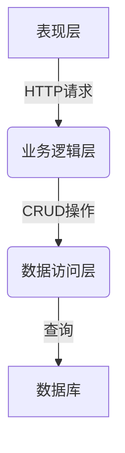

# 固定资产管理系统详细设计与具体代码实现

## 1. 背景介绍

### 1.1 固定资产管理的重要性

固定资产是企业生产经营活动中不可或缺的重要资源,对企业的正常运转和发展具有重要作用。有效的固定资产管理不仅能够最大限度地发挥固定资产的使用价值,延长资产使用寿命,降低运营成本,还能够为企业的决策提供准确的资产数据支持。因此,构建一套科学、高效的固定资产管理系统对于企业的可持续发展至关重要。

### 1.2 传统固定资产管理存在的问题

1. 管理效率低下
2. 数据不准确
3. 资产利用率低
4. 决策依据缺失

### 1.3 固定资产管理系统的作用

1. 提高管理效率
2. 保证数据准确性
3. 最大化资产利用
4. 为决策提供支持

## 2. 核心概念与联系

### 2.1 固定资产的定义

固定资产是指企业为生产商品、提供劳务或经营管理而持有的、使用年限超过一年、单位价值较高的有形资产。主要包括房屋及建筑物、机器设备、运输工具、电子设备等。

### 2.2 固定资产管理的核心概念

1. **资产分类与编码**：对固定资产进行合理分类,并为每个资产赋予唯一编码,方便识别和管理。
2. **资产增加**：固定资产的购置、自行建造、融资租赁等方式导致的资产增加。
3. **资产减少**：固定资产报废、出售、非偿债资产抵债等导致的资产减少。
4. **折旧**：固定资产在使用过程中,因正常损耗、技术陈旧或市场价格变动而发生的贬值。
5. **维修**：为延长固定资产使用寿命或恢复使用功能而进行的修理和大修理。
6. **盘点**：对企业现有固定资产的实物和账面记录进行核对,保证记录数据的真实性和完整性。

### 2.3 核心概念之间的关系

固定资产管理的核心任务是对企业固定资产的增加、减少、折旧、维修等全生命周期进行有效管控,并通过资产分类与编码实现精细化管理,最终实现资产的合理配置和高效利用。同时,定期盘点是保证资产数据准确性的重要手段。

## 3. 核心算法原理具体操作步骤

### 3.1 资产分类与编码算法

#### 3.1.1 分类算法

固定资产通常按资产类型、使用年限、重要程度等进行分类。常见的分类方法有：

1. **类型分类**:按资产性质划分,如房屋建筑物、机器设备、运输工具等。
2. **使用年限分类**:按资产使用年限划分,如2年以内、2-5年、5年以上等。
3. **重要程度分类**:按资产对企业运营的重要性划分,如核心资产、重要资产、一般资产等。

#### 3.1.2 编码算法

资产编码需要满足唯一性、顺序性和识别性的要求。常见的编码算法有:

1. **层次编码**:按资产类别、地理位置等层次赋予不同编码段,各编码段组合形成唯一编码。
2. **流水编码**:按资产入账时间顺序赋予连续的流水编号。
3. **特征编码**:根据资产的型号、规格等特征确定编码。

### 3.2 资产增加处理算法

资产增加主要包括购置、自建、融资租赁入账等情况,处理步骤如下:

1. 录入资产基本信息:名称、类别、型号、编号等。
2. 确认资产价值:根据购置合同、建造决算或租赁协议等确定资产入账价值。
3. 计算折旧方法和年限:根据资产类型和企业会计政策确定。
4. 生成资产卡片:包括基本信息、价值、折旧信息等。
5. 入账处理:更新资产总账和明细账。

### 3.3 资产减少处理算法  

资产减少主要包括报废、出售、非偿债资产抵债等情况,处理步骤如下:

1. 确认减少原因:报废、出售或抵债。
2. 计算资产净残值:账面价值扣除已计提折旧。
3. 生成资产减少单:包括减少原因、资产信息、净残值等。
4. 出账处理:更新资产总账和明细账。
5. 处理收入或损失:出售收入或报废损失。

### 3.4 折旧计提算法

企业通常采用直线法、双倍余额递减法等方法计提固定资产折旧,具体算法如下:

1. **直线法**:
   $$
   年折旧额=\frac{资产原值-预计净残值}{预计使用年限}
   $$

2. **双倍余额递减法**:
   $$
   年折旧额=\frac{2\times资产净值}{预计使用年限}\times折旧年率
   $$
   其中折旧年率=1-$\sqrt[预计使用年限]{\frac{预计净残值}{资产原值}}$

### 3.5 维修费用资本化算法

对于大修理费用,如果满足以下条件,应予以资本化,计入固定资产原值:

1. 在资产使用寿命延长期间内,预计能给企业带来经济利益流入。
2. 支出金额可靠计量。

资本化金额的计算公式为:

$$
资本化金额=实际发生的维修费用-资产账面价值\times\frac{尚可使用年限}{重新估计的尚可使用年限}
$$

### 3.6 盘点算法

盘点是对固定资产的实物和账面记录进行核对,主要步骤如下:

1. 制定盘点计划:确定盘点范围、人员、时间等。
2. 账实核对:对照资产卡片,核对实物资产的存在及状况。
3. 处理盘盈盘亏:对盘盈入账,对盘亏计提损失。
4. 编制盘点报告:反映盘点结果。

## 4. 数学模型和公式详细讲解举例说明

### 4.1 直线法年折旧额计算

假设一台设备原值为100万元,预计使用年限为5年,预计净残值为10万元,则其每年的折旧额为:

$$
年折旧额=\frac{100万元-10万元}{5年}=18万元
$$

因此,该设备在使用5年后,将全部计提折旧,账面价值为预计净残值10万元。

### 4.2 双倍余额递减法年折旧额计算

假设一台设备原值为200万元,预计使用年限为4年,预计净残值为20万元,则其折旧年率为:

$$
折旧年率=1-\sqrt[4]{\frac{20万元}{200万元}}=0.5
$$

第一年的折旧额为:

$$
第一年折旧额=\frac{2\times200万元}{4年}\times0.5=50万元
$$

第二年的折旧额为:

$$
第二年折旧额=\frac{2\times(200万元-50万元)}{4年}\times0.5=37.5万元
$$

### 4.3 维修费用资本化金额计算

假设一台设备账面价值为80万元,尚可使用年限为3年,在大修理后重新估计的尚可使用年限为5年,实际发生的维修费用为20万元,则其资本化金额为:

$$
\begin{aligned}
资本化金额&=20万元-80万元\times\frac{3年}{5年}\\
          &=20万元-48万元\\
          &=-28万元
\end{align}
$$

由于资本化金额为负值,因此该维修费用应当全部计入当期费用,不进行资本化处理。

## 5. 项目实践:代码实例和详细解释说明

为了更好地理解固定资产管理系统的设计与实现,我们将使用Java语言,基于Spring Boot框架开发一个简单的示例项目。

### 5.1 系统架构

我们将采用经典的三层架构,分为表现层、业务逻辑层和数据访问层,如下所示:



### 5.2 数据模型

我们将使用关系型数据库MySQL存储固定资产数据,数据库中包含以下几个核心表:

1. 资产信息表(asset)
2. 资产分类表(asset_category)
3. 资产变更记录表(asset_change_log)

其中,资产信息表的结构如下:

```sql
CREATE TABLE `asset` (
  `id` bigint(20) NOT NULL AUTO_INCREMENT COMMENT '主键ID',
  `name` varchar(100) NOT NULL COMMENT '资产名称',
  `category_id` bigint(20) NOT NULL COMMENT '资产分类ID',
  `code` varchar(50) NOT NULL COMMENT '资产编码',
  `original_value` decimal(10,2) NOT NULL COMMENT '资产原值',
  `net_value` decimal(10,2) NOT NULL COMMENT '资产净值',
  `depreciation_method` varchar(20) NOT NULL COMMENT '折旧方法',
  `depreciation_years` int(11) NOT NULL COMMENT '折旧年限',
  `purchase_date` date NOT NULL COMMENT '购置日期',
  `status` varchar(20) NOT NULL COMMENT '资产状态',
  `remark` varchar(500) DEFAULT NULL COMMENT '备注',
  `create_time` datetime NOT NULL COMMENT '创建时间',
  `update_time` datetime NOT NULL COMMENT '更新时间',
  PRIMARY KEY (`id`),
  UNIQUE KEY `code_unique` (`code`)
) ENGINE=InnoDB DEFAULT CHARSET=utf8mb4 COMMENT='资产信息表';
```

### 5.3 业务逻辑层

在业务逻辑层,我们将实现固定资产的增加、减少、折旧计提、维修费用资本化等核心功能。

以资产增加功能为例,伪代码如下:

```java
// 资产增加服务
public class AssetAddService {

    @Autowired
    private AssetRepository assetRepo; // 资产信息存储库

    public void addAsset(AssetAddDTO assetAddDTO) {
        // 1. 生成资产编码
        String code = generateAssetCode(assetAddDTO.getCategoryId());

        // 2. 创建资产实体
        Asset asset = new Asset();
        asset.setName(assetAddDTO.getName());
        asset.setCategoryId(assetAddDTO.getCategoryId());
        asset.setCode(code);
        asset.setOriginalValue(assetAddDTO.getOriginalValue());
        asset.setNetValue(assetAddDTO.getOriginalValue());
        asset.setDepreciationMethod(assetAddDTO.getDepreciationMethod());
        asset.setDepreciationYears(assetAddDTO.getDepreciationYears());
        asset.setPurchaseDate(assetAddDTO.getPurchaseDate());
        asset.setStatus(AssetStatus.PURCHASED);

        // 3. 保存资产
        assetRepo.save(asset);

        // 4. 记录资产变更日志
        AssetChangeLog log = new AssetChangeLog();
        log.setAssetId(asset.getId());
        log.setChangeType(AssetChangeType.ADD);
        log.setDescription("资产增加");
        assetChangeLogRepo.save(log);
    }

    // 生成资产编码的具体算法
    private String generateAssetCode(Long categoryId) {
        // ...
    }
}
```

### 5.4 数据访问层

在数据访问层,我们将使用Spring Data JPA简化数据库操作。以资产信息存储库为例:

```java
@Repository
public interface AssetRepository extends JpaRepository<Asset, Long> {
    // 根据资产编码查询资产
    Optional<Asset> findByCode(String code);
}
```

### 5.5 表现层

在表现层,我们将使用Spring MVC提供RESTful API。以资产增加接口为例:

```java
@RestController
@RequestMapping("/assets")
public class AssetController {

    @Autowired
    private AssetAddService assetAddService;

    @PostMapping
    public ResponseEntity<Void> addAsset(@RequestBody AssetAddDTO assetAddDTO) {
        assetAddService.addAsset(assetAddDTO);
        return ResponseEntity.status(HttpStatus.CREATED).build();
    }
}
```

## 6. 实际应用场景

固定资产管理系统在各行业的企业中都有广泛的应用,主要应用场景包括但不限于:

1. **制造业**:管理厂房、机器设备等生产资产。
2. **服务业**:管理办公楼、电子设备等经营资产。
3. **交通运输业**:管理车辆、船舶等运输资产。
4. **能源行业**: