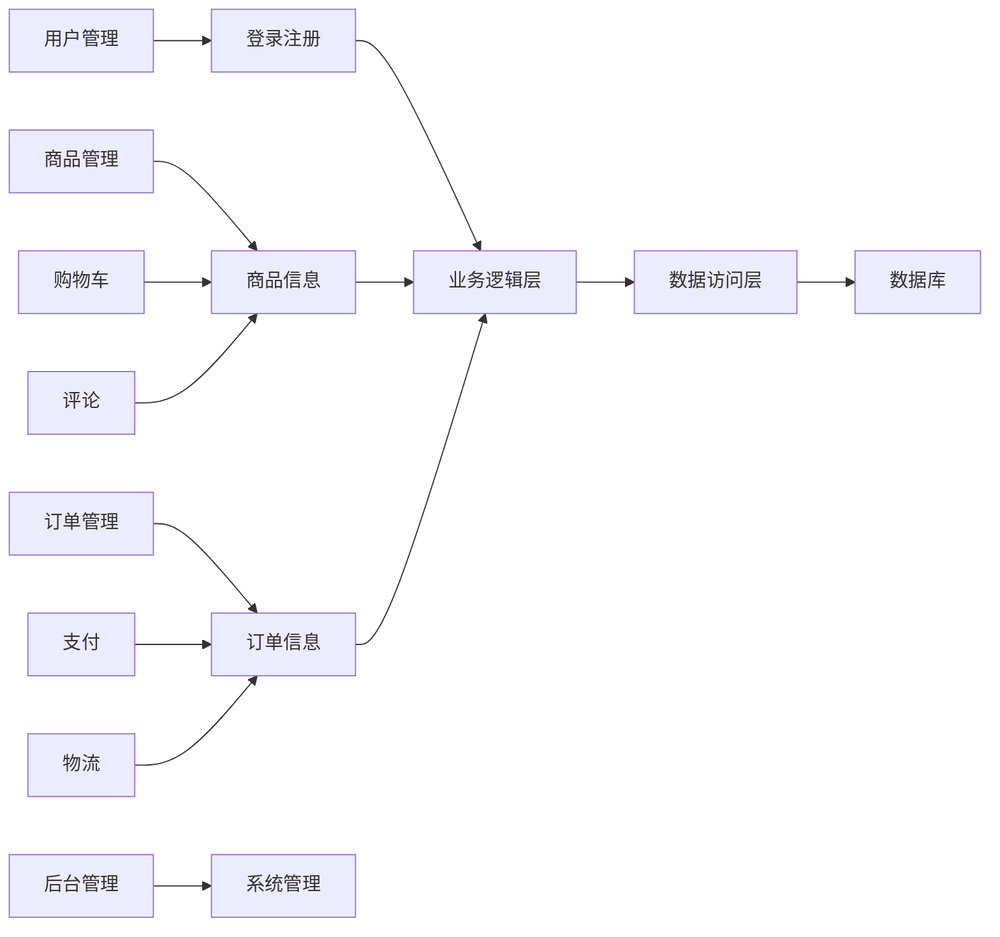

## 基于BS结构的工艺品销售系统详细设计与具体代码实现

作者：禅与计算机程序设计艺术

## 1. 背景介绍

### 1.1 工艺品市场现状分析

随着人们生活水平的提高和对精神文化追求的提升，工艺品市场近年来呈现出蓬勃发展的态势。消费者对工艺品的个性化、艺术性、文化内涵等方面的需求日益增长，传统的手工制作和线下销售模式已难以满足市场需求。

### 1.2  B/S架构优势

传统的工艺品销售模式存在诸多弊端，例如地域限制、信息不对称、销售渠道单一等。而基于B/S架构的在线销售系统可以有效解决这些问题，为消费者提供更加便捷、高效、优质的购物体验。

### 1.3 系统目标

本系统旨在构建一个功能完善、安全可靠、易于维护的工艺品在线销售平台，实现以下目标：

* 为工艺品商家提供一个便捷的展示和销售平台；
* 为消费者提供一个丰富多样、安全可靠的购物渠道；
* 提高工艺品销售效率和市场竞争力；
* 推动工艺品行业的数字化转型和升级。

## 2. 核心概念与联系

### 2.1 系统架构

本系统采用经典的三层架构设计，包括：

* **表现层（Presentation Layer）:**  负责用户界面展示和用户交互，使用HTML、CSS、JavaScript等技术实现。
* **业务逻辑层（Business Logic Layer）:** 负责处理业务逻辑，例如用户管理、商品管理、订单管理等，使用Java、Spring Boot等技术实现。
* **数据访问层（Data Access Layer）:** 负责与数据库交互，进行数据的增删改查操作，使用MyBatis等技术实现。

### 2.2  核心模块

系统主要包括以下模块：

* **用户管理模块:**  负责用户注册、登录、信息修改、密码找回等功能。
* **商品管理模块:** 负责商品信息的添加、修改、删除、上下架等功能。
* **订单管理模块:** 负责订单的生成、查询、取消、支付、发货、确认收货等功能。
* **购物车模块:** 负责用户添加商品到购物车、修改商品数量、删除商品等功能。
* **支付模块:**  对接第三方支付平台，实现在线支付功能。
* **物流模块:**  对接物流平台，实现订单物流信息跟踪查询功能。
* **评论模块:**  用户可以对已购买的商品进行评论，其他用户可以查看评论信息。
* **后台管理模块:**  管理员可以对系统进行管理，例如用户管理、商品管理、订单管理、数据统计等。

### 2.3 模块间联系



## 3. 核心算法原理具体操作步骤

### 3.1 用户登录注册流程

1. 用户访问网站，点击“注册”按钮，进入注册页面。
2. 用户填写注册信息，包括用户名、密码、邮箱等，点击“提交”按钮。
3. 系统验证用户信息是否合法，如果合法则将用户信息保存到数据库中，并跳转到登录页面；否则提示用户注册失败。
4. 用户输入用户名和密码，点击“登录”按钮。
5. 系统验证用户名和密码是否匹配，如果匹配则生成token，并将token返回给客户端，跳转到首页；否则提示用户登录失败。

### 3.2 商品浏览和搜索

1. 用户访问网站，系统展示推荐商品列表。
2. 用户可以根据商品分类、关键字等条件进行商品搜索。
3. 系统根据用户输入的条件查询数据库，返回符合条件的商品列表。

### 3.3  购物车和下单流程

1. 用户浏览商品详情页，点击“加入购物车”按钮，将商品添加到购物车。
2. 用户进入购物车页面，可以修改商品数量、删除商品等操作。
3. 用户确认购物车信息后，点击“结算”按钮，进入订单确认页面。
4. 用户填写收货地址、联系方式等信息，选择支付方式，点击“提交订单”按钮。
5. 系统生成订单，并将订单信息保存到数据库中，同时调用支付接口完成支付。
6. 支付成功后，系统更新订单状态，并跳转到订单成功页面。

## 4. 数学模型和公式详细讲解举例说明

本系统不涉及复杂的数学模型和算法，主要采用数据库技术实现数据的存储和查询。

## 5. 项目实践：代码实例和详细解释说明

### 5.1 技术选型

* 后端框架：Spring Boot
* 数据库：MySQL
* ORM框架：MyBatis
* 前端框架：Vue.js
* 缓存：Redis

### 5.2 代码示例

**用户实体类**

```java
public class User {

    private Long id;
    private String username;
    private String password;
    private String email;
    // getter and setter methods
}
```

**用户Mapper接口**

```java
@Mapper
public interface UserMapper {

    @Select("select * from user where username = #{username}")
    User findByUsername(@Param("username") String username);

    @Insert("insert into user(username, password, email) values(#{username}, #{password}, #{email})")
    int insert(User user);
}
```

**用户服务类**

```java
@Service
public class UserService {

    @Autowired
    private UserMapper userMapper;

    public User login(String username, String password) {
        User user = userMapper.findByUsername(username);
        if (user == null || !user.getPassword().equals(password)) {
            return null;
        }
        return user;
    }
}
```

### 5.3 代码解释

* 用户实体类定义了用户的基本信息，包括id、用户名、密码、邮箱等。
* 用户Mapper接口定义了用户数据的操作方法，例如根据用户名查询用户、插入用户信息等。
* 用户服务类实现了用户登录的业务逻辑，首先根据用户名查询用户信息，然后验证密码是否匹配。

## 6. 实际应用场景

本系统适用于各种类型的工艺品销售，例如：

* 陶瓷工艺品
* 木雕工艺品
* 刺绣工艺品
* 玉石工艺品
* 书画作品
* 民间工艺品

## 7. 工具和资源推荐

* **Spring Boot官方文档:** https://spring.io/projects/spring-boot
* **MySQL官方文档:** https://dev.mysql.com/doc/
* **MyBatis官方文档:** https://mybatis.org/mybatis-3/
* **Vue.js官方文档:** https://vuejs.org/
* **Redis官方文档:** https://redis.io/

## 8. 总结：未来发展趋势与挑战

### 8.1 未来发展趋势

* **个性化推荐:**  利用大数据和人工智能技术，为用户提供更加精准的商品推荐服务。
* **虚拟现实技术:** 利用VR/AR技术，为用户打造更加沉浸式的购物体验。
* **社交电商:**  将社交元素融入到电商平台中，增强用户粘性和互动性。
* **跨境电商:**  拓展海外市场，将中国优秀工艺品推向世界。

### 8.2 挑战

* **数据安全:**  电商平台积累了大量的用户数据，如何保障用户数据安全是一个重要的挑战。
* **竞争压力:**  电商行业竞争激烈，如何提升平台竞争力是一个重要的挑战。
* **用户体验:**  用户对电商平台的购物体验要求越来越高，如何不断提升用户体验是一个重要的挑战。

## 9. 附录：常见问题与解答

### 9.1  如何注册账号？

访问网站首页，点击“注册”按钮，按照提示填写注册信息即可。

### 9.2 如何修改密码？

登录账号后，进入“个人中心”页面，点击“修改密码”按钮，按照提示操作即可。

### 9.3 如何联系客服？

在网站底部找到“联系我们”页面，可以查看客服电话、邮箱等联系方式。
