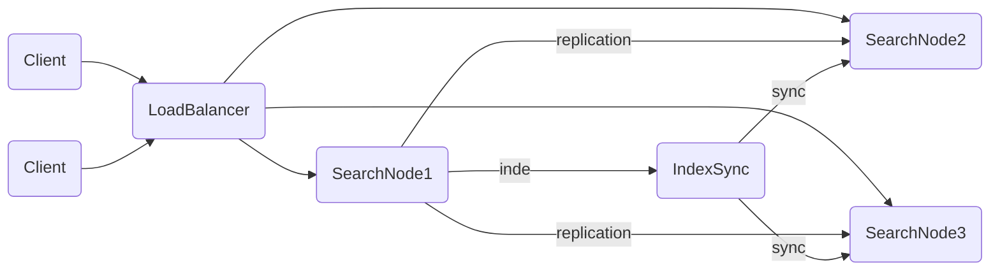

# 基于Lucene构建高可用搜索引擎架构

作者：禅与计算机程序设计艺术

## 1. 背景介绍

### 1.1 搜索引擎的重要性
在当今信息爆炸的时代,高效、准确的信息检索已成为各行各业的迫切需求。搜索引擎技术在互联网、企业内部信息化中扮演着至关重要的角色。一个优秀的搜索引擎能够极大提升用户获取信息的效率,为企业创造巨大价值。

### 1.2 Lucene简介
Apache Lucene是一个成熟、高性能、可扩展的开源搜索引擎库。自2001年诞生以来,Lucene凭借其优秀的架构设计和强大的功能特性,已成为业界广泛采用的搜索引擎解决方案。Lucene提供了完整的全文检索功能,支持多语言分词、索引构建、搜索排序、高亮等一系列核心功能。

### 1.3 高可用性的重要性
在实际应用中,搜索引擎往往需要面对海量数据、高并发请求的挑战。任何搜索服务的中断都可能给业务造成巨大损失。因此,如何基于Lucene构建一个高可用、高性能的搜索引擎架构,成为了工程实践中亟待解决的问题。本文将重点探讨这一话题。

## 2. 核心概念与关联

### 2.1 Lucene的核心概念
要深入理解Lucene,首先需要掌握其几个核心概念:
- Document:文档,即要检索的基本单元,包含多个Field。
- Field:域,文档的一个属性,由name和value构成,支持存储、索引、分词等配置。 
- Term:词,Field分词后的最小单位。
- Analyzer:分词器,将Field的value拆分为一系列Term。
- IndexWriter:索引写入器,提供了创建、更新索引的API。
- IndexSearcher:索引搜索器,提供了索引搜索的API。

### 2.2 搜索引擎架构的关键因素
影响搜索引擎架构的关键因素包括:
- 数据量:数据规模决定了索引构建、增量更新的效率瓶颈。
- 查询复杂度:查询语法的复杂程度影响搜索性能。
- 实时性:索引更新延迟影响搜索结果的实时性。
- 可用性:搜索服务的稳定性直接影响业务连续性。
- 扩展性:架构需要能够灵活应对数据量和访问量的增长。

综合考虑上述因素,一个理想的高可用搜索引擎架构应具备高性能索引构建、准实时索引更新、负载均衡、故障转移等关键特性。接下来的章节将逐一展开。

## 3. 核心算法原理与具体操作步骤

### 3.1 索引构建
#### 3.1.1 文档解析与字段提取
将原始数据(如数据库记录、XML、JSON等)转换为Lucene的Document对象,提取出要索引的Field。

#### 3.1.2 文档分析
通过Analyzer对Field进行分词、过滤、归一化等处理,生成最终要写入索引的Term序列。Lucene内置了多种通用的Analyzer,也支持自定义Analyzer以满足特定领域分词需求。

#### 3.1.3 索引写入
IndexWriter通过调用addDocument方法将文档写入索引,同时还会更新反向索引、词典等内部数据结构。IndexWriter支持多线程并发写入,可显著提升索引速度。

### 3.2 索引更新
#### 3.2.1 更新策略
索引更新可分为完全重建和增量更新两种模式。完全重建即抛弃旧索引,根据最新数据重新构建,代价较高但实现简单。增量更新则是在旧索引基础上添加新文档或删除过期文档,实现准实时搜索。

#### 3.2.2 提交与刷新
Lucene采用延迟写入的策略,写入的文档首先会缓存在内存中,然后定期刷新到磁盘,从而平衡写入效率与实时性。可通过参数控制自动刷新的频率,也可调用commit方法手动刷新。

### 3.3 索引搜索
#### 3.3.1 搜索语法解析
将用户输入的搜索词解析为Lucene的Query对象。Lucene支持多种Query类型,可组合实现复杂的搜索逻辑,如TermQuery, BooleanQuery, PhraseQuery等。

#### 3.3.2 相关度排序
IndexSearcher根据Query从倒排索引中获取符合条件的文档,然后根据相关度模型(如TF-IDF, BM25等)对结果进行排序。可通过自定义Similarity实现特定领域的相关度计算。

#### 3.3.3 分页与高亮
IndexSearcher支持分页获取topN搜索结果。结合Highlighter组件,可实现关键词高亮。高亮处理一般在搜索时进行,以避免影响索引性能。

## 4. 数学模型与公式详解

### 4.1 向量空间模型(VSM)
Lucene使用向量空间模型对文档和查询进行向量化表示。文档向量$\vec{d}$和查询向量$\vec{q}$分别为:

$$
\vec{d} = (w_{1,d}, w_{2,d}, ..., w_{n,d})
$$

$$
\vec{q} = (w_{1,q}, w_{2,q}, ..., w_{n,q})  
$$

其中$w_{i,d}$和$w_{i,q}$表示词项$t_i$在文档$d$和查询$q$中的权重。

### 4.2 TF-IDF权重
Lucene默认使用TF-IDF(Term Frequency-Inverse Document Frequency)来计算词项权重。TF衡量词项在文档中的出现频率,IDF衡量词项在语料库中的稀缺程度。词项$t_i$在文档$d$中的权重为:

$$
w_{i,d} = tf_{i,d} \cdot idf_i
$$

其中,$tf_{i,d}$为词频,$idf_i$为逆文档频率,计算公式为:

$$
idf_i = \log(\frac{N}{n_i})
$$

$N$为语料库文档总数,$n_i$为包含词项$t_i$的文档数。

### 4.3 余弦相似度
Lucene使用余弦相似度(Cosine Similarity)来衡量查询向量与文档向量的相关程度。余弦相似度计算公式为:

$$
sim(\vec{q},\vec{d}) = \frac{\vec{q} \cdot \vec{d}}{|\vec{q}| \cdot |\vec{d}|} = \frac{\sum_{i=1}^n w_{i,q} \cdot w_{i,d}}{\sqrt{\sum_{i=1}^n w_{i,q}^2} \cdot \sqrt{\sum_{i=1}^n w_{i,d}^2}}
$$

余弦相似度的取值范围为[0,1],值越大表示查询与文档的相关度越高。Lucene以此为依据对搜索结果进行排序。

## 5. 项目实践:构建高可用搜索集群

### 5.1 系统架构设计
一个典型的高可用搜索集群由以下几个关键组件构成:
- 负载均衡:如Nginx, LVS等,将请求分发到多个搜索节点。
- 搜索节点:基于Lucene实现,提供索引存储和搜索服务。
- 索引同步:将主节点的索引增量同步到从节点,保证数据一致性。
- 故障转移:节点失效时自动将请求切换到其他可用节点。

下图展示了一个简要的系统架构:



### 5.2 核心代码实现

#### 5.2.1 索引构建
```java
// 创建IndexWriter
IndexWriterConfig config = new IndexWriterConfig(analyzer);
IndexWriter writer = new IndexWriter(directory, config);

// 创建Document
Document doc = new Document();
doc.add(new TextField("title", title, Field.Store.YES)); 
doc.add(new TextField("content", content, Field.Store.YES));

// 写入索引 
writer.addDocument(doc);
writer.commit();
writer.close();
```

#### 5.2.2 索引搜索
```java
// 创建IndexSearcher
IndexReader reader = DirectoryReader.open(directory);
IndexSearcher searcher = new IndexSearcher(reader);

// 创建Query
QueryParser parser = new QueryParser("content", analyzer);
Query query = parser.parse(keyword);

// 执行搜索
TopDocs topDocs = searcher.search(query, 10);

// 处理结果
ScoreDoc[] scoreDocs = topDocs.scoreDocs;
for (ScoreDoc scoreDoc : scoreDocs) {
    int docId = scoreDoc.doc;
    Document doc = searcher.doc(docId);
    // ...
}
```

#### 5.2.3 索引同步
主从节点间可通过rsync等工具实现索引文件的增量同步。同步过程中搜索服务可保持可用,但可能读取到旧版本索引。为保证数据一致性,可在同步完成后再原子性切换索引目录。

### 5.3 性能优化实践
- 内存索引:将索引文件缓存到内存,提高搜索速度。
- 多线程搜索:并发执行多个搜索请求,提高吞吐量。
- 分片:将索引水平拆分为多个分片,不同节点分别处理部分分片请求。
- 预热:定期对常用查询进行预热,使其结果常驻内存。
- 缓存:对频繁查询建立查询结果缓存。

## 6. 实际应用场景

### 6.1 电商搜索
用户通过关键词搜索商品,后台基于商品的标题、属性、评价等多个Field构建倒排索引。可通过同义词扩展、拼音纠错等优化策略提高搜索的友好性。

### 6.2 论坛站内搜索
对帖子标题、正文分别创建索引,搜索结果可展示关键词高亮片段。可通过对帖子的点赞数、评论数加权,提高热门帖子的排名。

### 6.3 企业知识库搜索
将Word、PDF等非结构化文档解析为纯文本并创建索引。通过对员工行为如浏览、点击等隐式反馈的挖掘,优化搜索结果的个性化推荐。

## 7. 工具与资源推荐
- Luke:Lucene索引结构查看工具。
- Solr:基于Lucene构建的开源搜索服务器。
- Elasticsearch:基于Lucene构建的开源分布式搜索引擎。
- Lucene实战:经典的Lucene应用开发指南。
- Lucene官方文档:权威的Lucene使用手册。

## 8. 总结与展望

### 8.1 全文总结
本文系统地探讨了如何基于Lucene构建高可用搜索引擎架构。首先介绍了Lucene的核心概念,然后重点剖析了索引构建、更新、搜索等关键技术的算法原理,并结合数学公式加以阐释。在此基础上,提出了一种典型的高可用搜索集群架构设计,给出了部分关键代码实现,并总结了常见的性能优化实践。最后,列举了几个Lucene在实际场景中的应用案例,推荐了一些有价值的工具和学习资源。

### 8.2 未来发展趋势与挑战
未来搜索引擎技术的发展趋势主要体现在:
- 智能化:利用机器学习、知识图谱等技术,实现查询意图理解、个性化推荐等智能搜索。
- 异构数据融合:除文本外,图片、视频、语音等非结构化数据的检索需求日益增长。
- 语义搜索:从关键词匹配走向语义相关性匹配。

面临的主要挑战包括:
- 数据爆炸:如何高效应对PB、EB量级数据的索引和检索。
- 实时性:如何实现秒级、毫秒级搜索响应。
- 稳定性:如何保障大流量、高并发下搜索服务的可用性。

## 9. 附录:常见问题解答

### 9.1 Luc