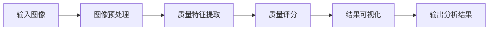

# 基于OpenCV 图像质量分析系统详细设计与具体代码实现

作者：禅与计算机程序设计艺术

## 1. 背景介绍
### 1.1 图像质量分析的重要性
在当今数字化时代,图像已成为信息传递和存储的重要载体。然而,由于各种因素的影响,如拍摄设备、压缩算法、传输过程等,图像质量往往会受到不同程度的损害。图像质量的好坏直接影响到图像的应用效果和用户体验。因此,对图像质量进行客观、准确的评估和分析,对于图像处理、计算机视觉等领域具有重要意义。

### 1.2 OpenCV简介
OpenCV(Open Source Computer Vision Library)是一个开源的计算机视觉库,由Intel公司发起并参与开发,以BSD许可证授权发布,可以在商业和研究领域中免费使用。OpenCV提供了大量的图像处理和计算机视觉算法,涵盖了图像处理、模式识别、三维重建、机器学习等多个方面,被广泛应用于人机交互、物体识别、图像分割、人脸识别等领域。

### 1.3 基于OpenCV的图像质量分析系统
本文将介绍一个基于OpenCV的图像质量分析系统的详细设计与具体代码实现。该系统利用OpenCV提供的图像处理和分析算法,对输入的图像进行质量评估,给出客观的质量分数,并提供直观的质量分析结果展示。系统主要包括图像预处理、质量特征提取、质量评分、结果可视化等模块,能够自动、高效地完成图像质量分析任务。

## 2. 核心概念与联系
### 2.1 图像质量的定义
图像质量是指图像的清晰度、锐利度、对比度、色彩还原度等方面的综合表现。一幅高质量的图像应该能够准确、清晰地再现原始场景,细节丰富,纹理清晰,没有明显的失真、噪声和模糊等质量缺陷。

### 2.2 图像质量评估方法
图像质量评估方法主要分为主观评估和客观评估两大类。

主观评估是指通过人的视觉系统对图像质量进行主观打分,优点是评估结果与人的主观感受直接相关,缺点是评估过程耗时耗力,受评估者主观因素影响大。

客观评估是指通过算法对图像进行客观测量和计算,得出质量分数,优点是评估过程自动化程度高,速度快,缺点是评估结果与人的主观感受可能存在一定差异。

### 2.3 图像质量评估指标
常用的图像质量评估指标包括:
- 峰值信噪比(PSNR):衡量图像相对于参考图像的失真程度,分值越高,失真越小,质量越好。
- 结构相似性(SSIM):衡量两幅图像在结构、亮度、对比度等方面的相似程度,取值范围为[0,1],越接近1,相似度越高,质量越好。
- 边缘保持度(EPSNR):衡量图像的边缘、纹理等细节信息的保持程度,分值越高,细节保持越好,质量越高。
- 噪声方差:衡量图像中噪声的多少,方差越大,噪声越多,质量越差。
- 模糊度:衡量图像的清晰程度,模糊度越大,质量越差。

### 2.4 OpenCV中的图像质量分析功能
OpenCV中提供了一些现成的图像质量评估和分析功能,主要包括:
- cv::quality::QualityPSNR:计算PSNR。
- cv::quality::QualitySSIM:计算SSIM。 
- cv::quality::QualityGMSD:计算GMSD(梯度幅值相似性偏差)。
- cv::quality::QualityBRISQUE:计算BRISQUE(盲/无参考图像空间质量评估器)。

同时,OpenCV还提供了大量图像处理和分析算法,如图像滤波、边缘检测、形态学处理等,可用于图像质量特征的提取和计算。

## 3. 核心算法原理具体操作步骤
### 3.1 系统总体架构
图像质量分析系统的总体架构如下图所示:



### 3.2 图像预处理
图像预处理阶段主要完成图像的标准化,为后续处理奠定基础。主要步骤包括:
1. 图像读取:使用cv::imread()函数读取输入图像。
2. 图像缩放:使用cv::resize()函数将图像缩放到固定大小,保证后续处理的一致性。
3. 色彩空间转换:根据需要,使用cv::cvtColor()函数将图像转换到合适的色彩空间,如灰度、HSV等。
4. 图像归一化:使用cv::normalize()函数对图像进行归一化,将像素值缩放到[0,1]范围内。

### 3.3 质量特征提取
在质量特征提取阶段,我们从图像中提取一系列能够反映图像质量的特征指标,主要包括:
1. 边缘强度:使用Sobel算子等方法计算图像的梯度幅值图,梯度幅值越大,边缘越明显,质量越好。
2. 纹理复杂度:使用局部二值模式(LBP)等方法提取图像的纹理特征,纹理复杂度越高,质量越好。 
3. 对比度:计算图像的对比度,对比度越大,质量越好。
4. 噪声水平:使用高斯滤波等方法平滑图像,原图与平滑图之差即为噪声图,计算噪声图的均方差,反映噪声水平,噪声越多,质量越差。
5. 清晰度:使用拉普拉斯算子等方法计算图像的二阶导数,反映图像的清晰程度,越清晰,质量越好。

### 3.4 质量评分
在质量评分阶段,我们将提取到的质量特征汇总,综合考虑各个特征指标,给出最终的质量分数。可以使用加权平均、机器学习等方法构建质量评分模型。

以加权平均为例,假设提取到的质量特征向量为$\mathbf{f} = [f_1, f_2, ..., f_n]$,各个特征的权重向量为$\mathbf{w} = [w_1, w_2, ..., w_n]$,则质量分数$s$可以表示为:

$$
s = \sum_{i=1}^n w_i \cdot f_i
$$

其中,$w_i$表示第$i$个特征的权重,$f_i$表示第$i$个特征的值。权重可以根据各个特征对质量的影响程度进行设置,也可以通过机器学习的方法自动学习得到。

### 3.5 结果可视化
质量分析的结果需要以直观、易于理解的方式呈现给用户。常见的可视化方式包括:
1. 质量分数:以数值或等级的形式给出整体质量评分,如85分、A级等。
2. 质量地图:生成与原图大小相同的质量地图,不同位置的像素值表示该处图像质量的好坏,可以使用热力图的方式着色,直观反映质量分布。
3. 局部放大:对质量较差的区域进行局部放大,并标注具体的质量缺陷,如模糊、噪声等。
4. 质量曲线:绘制质量分数随时间或空间位置的变化曲线,反映质量的动态变化趋势。

## 4. 数学模型和公式详细讲解举例说明
### 4.1 峰值信噪比(PSNR)
峰值信噪比(Peak Signal-to-Noise Ratio, PSNR)是一种常用的图像质量评估指标,反映图像受到噪声或失真的影响程度。设参考图像为$I$,失真图像为$K$,图像尺寸为$M \times N$,像素位深为$B$,则PSNR的定义为:

$$
\mathrm{PSNR} = 10 \log_{10} \left(\frac{(2^B-1)^2}{\mathrm{MSE}}\right)
$$

其中,MSE为均方误差(Mean Squared Error),计算公式为:

$$
\mathrm{MSE} = \frac{1}{MN} \sum_{i=1}^M \sum_{j=1}^N (I(i,j) - K(i,j))^2
$$

可以看出,PSNR与MSE呈负相关,即MSE越小,失真越小,PSNR越大,质量越好。PSNR的单位为dB,一般认为,PSNR高于40dB时,图像质量极好,肉眼难以察觉失真;30-40dB时,图像质量良好,失真较轻微;20-30dB时,图像质量一般,失真较为明显;低于20dB时,图像质量较差,失真严重。

例如,对于一幅8位深度(B=8)的512x512图像,计算其PSNR值的代码如下:

```cpp
Mat ref = imread("ref.jpg", IMREAD_GRAYSCALE);
Mat test = imread("test.jpg", IMREAD_GRAYSCALE);

double psnr = PSNR(ref, test);
printf("PSNR: %.2f dB\n", psnr);
```

### 4.2 结构相似性(SSIM)
结构相似性(Structural Similarity, SSIM)是一种衡量两幅图像相似程度的指标,综合考虑了亮度、对比度、结构等方面的相似性。SSIM取值范围为[0,1],越接近1,表示图像失真越小,质量越高。

设图像块$x$和$y$的均值、方差和协方差分别为$\mu_x, \mu_y, \sigma_x^2, \sigma_y^2, \sigma_{xy}$,SSIM的计算公式为:

$$
\mathrm{SSIM}(x,y) = \frac{(2\mu_x\mu_y+c_1)(2\sigma_{xy}+c_2)}{(\mu_x^2+\mu_y^2+c_1)(\sigma_x^2+\sigma_y^2+c_2)}
$$

其中,$c_1$和$c_2$为常数,用于避免分母为0。常取$c_1=(0.01L)^2, c_2=(0.03L)^2$,其中$L$为像素动态范围。

对整幅图像的SSIM值,可以通过滑动窗口的方式,计算局部窗口内的SSIM值,然后对所有局部SSIM值取平均。

例如,使用OpenCV计算SSIM的示例代码如下:

```cpp
Mat ref = imread("ref.jpg", IMREAD_GRAYSCALE);
Mat test = imread("test.jpg", IMREAD_GRAYSCALE);

Scalar ssim = quality::QualitySSIM::compute(ref, test, noArray());
printf("SSIM: %.2f\n", ssim[0]);
```

## 5. 项目实践：代码实例和详细解释说明
下面给出一个基于OpenCV的图像质量分析系统的C++代码实现示例,并对关键部分进行详细解释说明。

```cpp
#include <opencv2/opencv.hpp>
#include <opencv2/quality.hpp>

using namespace std;
using namespace cv;
using namespace cv::quality;

// 图像质量分析系统
class ImageQualityAnalyzer {
public:
    ImageQualityAnalyzer() {}

    // 设置参考图像
    void setRefImage(const Mat& ref) {
        ref.copyTo(refImg);
    }

    // 图像质量分析
    QualityScore analyze(const Mat& img) {
        // 图像预处理
        Mat preprocImg;
        preprocess(img, preprocImg);

        // 提取质量特征
        vector<double> features;
        extractFeatures(preprocImg, features);

        // 计算质量分数
        double score = computeQualityScore(features);

        // 生成质量地图
        Mat qualityMap;
        generateQualityMap(preprocImg, qualityMap);

        // 返回质量分析结果
        return QualityScore(score, qualityMap);
    }

private:
    Mat refImg; // 参考图像

    // 图像预处理
    void preprocess(const Mat& img, Mat& preprocImg) {
        // 图像缩放
        resize(img, preprocImg, Size(512, 512));
        
        // 色彩空间转换
        cvtColor(preprocImg, preprocImg, COLOR_BGR2GRAY);

        // 图像归一化
        normalize(preprocImg, preprocImg, 0, 1, NORM_MINMAX);
    }

    // 提取质量特征
    void extractFeatures(const Mat& img, vector<double>& features) {
        // 计算PSNR