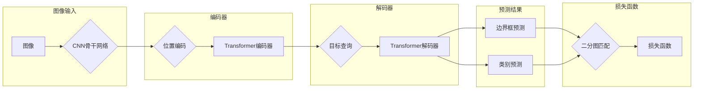

# 基于PyTorch的DETR模型实现

作者：禅与计算机程序设计艺术

## 1. 背景介绍

### 1.1 目标检测的挑战

目标检测是计算机视觉领域的一项重要任务，其目标是从图像或视频中识别和定位出特定的物体。传统的目标检测方法，如Faster R-CNN和YOLO，通常依赖于预定义的锚框或区域建议，这些方法存在以下局限性：

* **人工先验知识:** 锚框的设计需要大量的先验知识，而这些知识往往是特定于数据集的，难以泛化到其他数据集。
* **计算复杂度:** 区域建议的生成和分类过程计算量大，限制了模型的推理速度。
* **小目标检测:** 由于特征图分辨率的限制，传统方法在小目标检测方面表现不佳。

### 1.2 DETR的突破

为了克服传统目标检测方法的局限性，Facebook AI Research团队于2020年提出了DETR (**DE**tection **TR**ansformer) 模型。DETR是一种基于Transformer的端到端目标检测方法，它具有以下优点：

* **无需锚框:** DETR直接预测物体边界框的坐标和类别，无需预定义锚框。
* **全局建模:** Transformer的自注意力机制可以对图像进行全局建模，有利于检测不同尺度的物体。
* **简单高效:** DETR的结构简单，训练和推理速度快。

## 2. 核心概念与联系

### 2.1 Transformer

Transformer是一种基于自注意力机制的深度学习模型，最初应用于自然语言处理领域。DETR将Transformer应用于目标检测任务，取得了令人瞩目的效果。

#### 2.1.1 自注意力机制

自注意力机制允许模型关注输入序列中不同位置的信息，从而学习到序列中元素之间的关系。在DETR中，自注意力机制用于学习图像中不同区域之间的关系，从而实现全局建模。

#### 2.1.2 编码器-解码器结构

Transformer通常采用编码器-解码器结构。编码器将输入序列编码为一个固定长度的向量表示，解码器根据编码器输出的向量表示生成目标序列。在DETR中，编码器用于提取图像特征，解码器用于生成目标预测结果。

### 2.2 二分图匹配

DETR使用二分图匹配算法将预测结果与真实目标进行匹配。二分图匹配算法可以找到预测结果与真实目标之间的一一对应关系，从而计算损失函数并更新模型参数。

## 3. 核心算法原理具体操作步骤

### 3.1 模型结构

DETR模型的结构如下图所示：



**模型结构说明:**

1. **图像输入:** 输入图像首先经过一个CNN骨干网络提取特征。
2. **编码器:** 提取的特征图经过位置编码后输入到Transformer编码器中，编码器通过自注意力机制学习图像中不同区域之间的关系。
3. **解码器:** 解码器接收编码器的输出和一组可学习的目标查询，通过自注意力机制生成目标预测结果。
4. **预测结果:** 解码器输出边界框的坐标和类别概率。
5. **损失函数:** 使用二分图匹配算法将预测结果与真实目标进行匹配，并计算损失函数。

### 3.2 训练过程

DETR的训练过程如下：

1. 将图像输入模型，得到预测结果。
2. 使用二分图匹配算法将预测结果与真实目标进行匹配。
3. 计算损失函数，并使用反向传播算法更新模型参数。
4. 重复步骤1-3，直到模型收敛。

## 4. 数学模型和公式详细讲解举例说明

### 4.1 二分图匹配

DETR使用匈牙利算法进行二分图匹配。匈牙利算法可以找到预测结果与真实目标之间的一一对应关系，从而最小化损失函数。

**损失函数定义:**

$$
\mathcal{L}(\hat{\sigma}, \hat{y}) = \sum_{i=1}^{N} [- \mathbb{1}_{\{c_i \neq \emptyset\}} \hat{p}_{\sigma(i)}(c_i) + \mathbb{1}_{\{c_i \neq \emptyset\}} L_{box}(b_i, \hat{b}_{\sigma(i)})]
$$

其中：

* $\hat{\sigma}$ 表示预测结果与真实目标之间的匹配关系。
* $\hat{y}$ 表示预测结果，包括边界框 $\hat{b}$ 和类别概率 $\hat{p}$。
* $N$ 表示真实目标的数量。
* $c_i$ 表示第 $i$ 个真实目标的类别。
* $b_i$ 表示第 $i$ 个真实目标的边界框。
* $L_{box}$ 表示边界框损失函数，例如 L1 损失或 GIoU 损失。

### 4.2 Transformer

#### 4.2.1 自注意力机制

自注意力机制的计算公式如下：

$$
\text{Attention}(Q, K, V) = \text{softmax}(\frac{QK^T}{\sqrt{d_k}})V
$$

其中：

* $Q$ 表示查询矩阵。
* $K$ 表示键矩阵。
* $V$ 表示值矩阵。
* $d_k$ 表示键的维度。

#### 4.2.2 多头注意力机制

多头注意力机制是自注意力机制的扩展，它将查询、键和值分别线性投影到多个不同的子空间中，并在每个子空间中计算自注意力，最后将所有子空间的结果拼接起来。

## 5. 项目实践：代码实例和详细解释说明

### 5.1 数据集准备

DETR模型可以使用 COCO 数据集进行训练和评估。

### 5.2 模型训练

```python
import torch
from torch.utils.data import DataLoader
from torchvision.models import detr_resnet50
from torchvision.datasets import COCO
from torchvision.transforms import ToTensor

# 定义数据集和数据加载器
train_dataset = COCO(root='./data', annFile='./data/annotations/instances_train2017.json', transform=ToTensor())
train_loader = DataLoader(train_dataset, batch_size=2, shuffle=True)

# 定义模型、优化器和损失函数
model = detr_resnet50(pretrained=True)
optimizer = torch.optim.AdamW(model.parameters(), lr=1e-4)
criterion = torch.nn.CrossEntropyLoss()

# 训练循环
for epoch in range(10):
    for images, targets in train_loader:
        # 前向传播
        outputs = model(images)

        # 计算损失函数
        loss = criterion(outputs, targets)

        # 反向传播和参数更新
        optimizer.zero_grad()
        loss.backward()
        optimizer.step()

# 保存模型
torch.save(model.state_dict(), 'detr_model.pth')
```

### 5.3 模型评估

```python
import torch
from torchvision.models import detr_resnet50
from torchvision.datasets import COCO
from torchvision.transforms import ToTensor
from pycocotools.cocoeval import COCOeval

# 定义数据集和数据加载器
test_dataset = COCO(root='./data', annFile='./data/annotations/instances_val2017.json', transform=ToTensor())
test_loader = DataLoader(test_dataset, batch_size=1, shuffle=False)

# 加载模型
model = detr_resnet50(pretrained=False)
model.load_state_dict(torch.load('detr_model.pth'))

# 评估模型
coco_results = []
for images, targets in test_loader:
    # 前向传播
    outputs = model(images)

    # 将预测结果转换为 COCO 格式
    for output in outputs:
        coco_results.append({
            'image_id': targets['image_id'].item(),
            'category_id': output['labels'].item(),
            'bbox': output['boxes'].tolist(),
            'score': output['scores'].item(),
        })

# 使用 COCO API 评估模型性能
coco_gt = COCO('./data/annotations/instances_val2017.json')
coco_dt = coco_gt.loadRes(coco_results)
coco_eval = COCOeval(coco_gt, coco_dt, 'bbox')
coco_eval.evaluate()
coco_eval.accumulate()
coco_eval.summarize()
```

## 6. 实际应用场景

DETR模型可以应用于各种目标检测任务，例如：

* **自动驾驶:** 检测车辆、行人、交通信号灯等目标。
* **安防监控:** 检测可疑人员、物体和行为。
* **医学影像分析:** 检测肿瘤、病变等目标。

## 7. 工具和资源推荐

### 7.1 PyTorch

PyTorch是一个开源的深度学习框架，DETR模型的官方实现基于PyTorch。

### 7.2 Transformers

Transformers是一个用于自然语言处理的库，DETR模型使用了其中的Transformer模块。

### 7.3 COCO API

COCO API提供了用于加载和评估COCO数据集的工具。

## 8. 总结：未来发展趋势与挑战

### 8.1 未来发展趋势

* **更高效的Transformer架构:** 研究人员正在探索更高效的Transformer架构，以进一步提高DETR模型的性能。
* **多模态目标检测:** 将DETR模型扩展到多模态目标检测任务，例如结合图像和文本信息进行目标检测。
* **轻量级DETR:** 开发轻量级的DETR模型，以适应资源受限的设备。

### 8.2 挑战

* **训练数据需求:** DETR模型的训练需要大量的标注数据。
* **小目标检测:** 虽然DETR模型在小目标检测方面优于传统方法，但仍有提升空间。
* **模型解释性:** Transformer模型的可解释性较差，需要进一步研究。

## 9. 附录：常见问题与解答

### 9.1 DETR模型与传统目标检测方法相比有哪些优势？

**优势：**

* 无需锚框
* 全局建模
* 简单高效

### 9.2 DETR模型的训练过程是什么？

**训练过程：**

1. 将图像输入模型，得到预测结果。
2. 使用二分图匹配算法将预测结果与真实目标进行匹配。
3. 计算损失函数，并使用反向传播算法更新模型参数。
4. 重复步骤1-3，直到模型收敛。

### 9.3 DETR模型可以应用于哪些实际场景？

**应用场景：**

* 自动驾驶
* 安防监控
* 医学影像分析