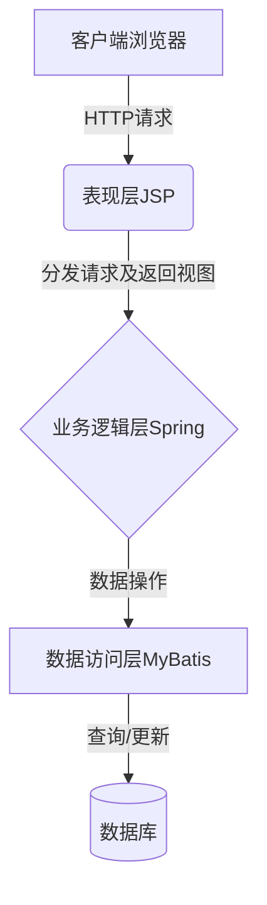

# 基于JSP和SSM的客户关系管理系统设计与实现

## 1. 背景介绍

### 1.1 客户关系管理系统概述

在当今竞争激烈的商业环境中，建立良好的客户关系对于企业的持续发展至关重要。客户关系管理系统(Customer Relationship Management, CRM)是一种帮助企业有效管理客户数据、分析客户行为、优化销售流程、提高客户满意度的应用系统。通过CRM系统，企业可以全面了解客户需求、个性化定制营销策略、提高客户黏性和忠诚度,从而实现与客户的长期合作关系。

### 1.2 传统CRM系统的缺陷

早期的CRM系统大多采用单机版本或基于C/S架构,存在着诸多缺陷:

- 系统扩展性差,难以满足企业业务发展需求
- 客户端安装和维护成本高
- 数据共享和实时更新存在困难
- 用户体验较差,界面单一

### 1.3 基于Web的CRM系统优势

基于Web的CRM系统可以很好地解决传统系统的不足,主要优势包括:

- 跨平台,无需安装客户端程序
- 方便部署和维护升级
- 支持多用户并发访问
- 界面友好,操作便捷
- 数据实时共享和更新

基于以上优势,本文将介绍一种基于JSP(Java Server Pages)和SSM(Spring、SpringMVC、MyBatis)框架的Web客户关系管理系统的设计与实现方案。

## 2. 核心概念与联系

### 2.1 JSP(Java Server Pages)

JSP是一种动态网页开发技术,允许Web开发人员将Java代码嵌入到HTML页面中。JSP的执行过程是:

1. 浏览器发送HTTP请求到Web服务器
2. Web服务器识别JSP,将其交给JSP引擎处理
3. JSP引擎加载JSP文件,将其与嵌入的Java代码编译为Servlet
4. Servlet程序执行,生成HTML页面响应
5. Web服务器将渲染后的HTML页面返回给浏览器

JSP的主要优势是简化了Web开发流程,使开发者可以在传统HTML页面中编写Java代码,实现动态功能。

### 2.2 SSM框架

SSM框架是指Spring、SpringMVC和MyBatis三个框架的集成应用,适用于构建高效、高质量的企业级Web应用。

#### 2.2.1 Spring

Spring是一个轻量级的控制反转(IoC)和面向切面编程(AOP)的框架,主要用于管理应用程序的对象及依赖关系。它可以降低耦合度,提高代码的可重用性和可维护性。

#### 2.2.2 SpringMVC

SpringMVC是Spring框架的一个模块,是一种基于MVC设计模式的Web框架。它通过一个中央Servlet分发请求给控制器对象,将视图逻辑与业务逻辑分离,降低了代码的耦合度。

#### 2.2.3 MyBatis

MyBatis是一个优秀的持久层框架,支持定制化SQL、存储过程以及高级映射。它可以与Spring无缝集成,方便管理数据库连接和执行SQL操作。

三个框架的协同使用可以简化Web应用的开发过程,提高开发效率和系统质量。Spring负责对象管理和依赖注入,SpringMVC负责请求分发和视图渲染,MyBatis负责数据持久化操作。

### 2.3 系统架构

基于JSP和SSM框架的客户关系管理系统通常采用经典的三层架构,包括表现层(JSP)、业务逻辑层(Spring)和数据访问层(MyBatis)。



1. 客户端浏览器发送HTTP请求
2. 表现层JSP接收请求,调用业务逻辑层的方法
3. 业务逻辑层Spring处理业务逻辑,调用数据访问层的方法
4. 数据访问层MyBatis执行数据库操作
5. 业务逻辑层将处理结果返回给表现层
6. 表现层JSP渲染视图,返回给客户端浏览器

该架构将系统各个模块的职责分离,有利于代码的维护和扩展。

## 3. 核心算法原理与实现步骤

### 3.1 系统功能模块

客户关系管理系统主要包含以下核心功能模块:

- **客户管理**:维护客户基本信息、联系方式、交易记录等
- **营销管理**:制定营销策略、促销活动、分配营销任务等
- **服务管理**:处理客户投诉、提供技术支持和咨询服务等
- **统计分析**:分析客户构成、销售业绩、营销效果等
- **系统管理**:管理系统用户、权限分配、系统配置等

### 3.2 客户管理模块实现

客户管理模块是CRM系统的核心,其主要实现步骤如下:

#### 3.2.1 数据库设计

使用关系型数据库如MySQL,设计客户信息表、联系人表、交易记录表等,并建立适当的关系约束。

#### 3.2.2 持久层实现(MyBatis)

1. 编写SQL映射文件,定义查询、插入、更新、删除等操作的SQL语句
2. 定义与数据库表对应的Java实体类
3. 创建Mapper接口,定义持久化操作方法

#### 3.2.3 业务逻辑层实现(Spring)

1. 创建Service接口和实现类,封装业务逻辑处理
2. 在Service实现类中注入Mapper接口,调用持久层方法执行数据库操作
3. 实现客户信息的增删改查、联系人管理、交易记录管理等功能

#### 3.2.4 表现层实现(JSP)

1. 设计JSP页面,包括列表展示、表单输入、按钮操作等UI元素
2. 使用JSTL(JSP Standard Tag Library)简化页面逻辑
3. 发送请求到SpringMVC的Controller,获取模型数据
4. 展示数据并提供用户交互界面

### 3.3 营销管理模块实现

营销管理模块的实现步骤类似于客户管理模块,需要设计营销策略表、促销活动表、营销任务表等,并完成相应的持久层、业务逻辑层和表现层的开发工作。

此外,营销管理模块还需要与客户管理模块进行数据交互,例如:

- 根据客户信息进行客户分类和精准营销
- 记录客户参与营销活动的情况
- 分配营销任务给负责的客户经理

### 3.4 服务管理模块实现

服务管理模块需要设计客户投诉表、服务请求表等,并实现以下主要功能:

- 客户投诉受理与处理
- 服务请求受理与分派
- 知识库维护(常见问题解答)
- 在线客服系统

该模块需要与客户管理模块和营销管理模块紧密配合,及时处理客户反馈,提供优质服务,提升客户满意度。

### 3.5 统计分析模块实现

统计分析模块的主要功能是对系统中的各种数据进行多维度分析,为企业决策提供依据。实现步骤包括:

1. 设计统计分析视图,用于存储统计数据
2. 编写SQL或使用数据分析工具进行数据统计
3. 使用图表插件(如ECharts)在表现层呈现统计结果
4. 提供自定义查询和数据导出功能

统计分析可以关注以下几个方面:

- 客户构成分析(地区、行业、规模等)
- 销售业绩分析(产品销量、销售员绩效等)
- 营销效果分析(活动参与率、投资回报率等)
- 服务质量分析(投诉率、服务响应时间等)

### 3.6 系统管理模块实现

系统管理模块主要实现以下功能:

- 用户管理:添加、修改、删除系统用户
- 角色管理:创建角色,分配权限
- 权限管理:细化功能模块的操作权限
- 系统参数配置:设置系统参数,如数据备份策略等

该模块需要对用户进行身份认证与授权,确保系统安全。可以使用Spring Security等安全框架实现用户认证、权限控制等功能。

## 4. 数学模型和公式详细讲解

在客户关系管理系统中,可能需要使用一些数学模型和公式进行客户价值分析、营销策略优化等。以下是一些常见的模型和公式:

### 4.1 RFM模型

RFM模型是一种常用的客户价值分析模型,它根据客户的最近一次购买时间(Recency)、购买频率(Frequency)和购买金额(Monetary)对客户进行打分和分类。

客户价值分数计算公式如下:

$$
\text{RFM分数} = w_R \times R + w_F \times F + w_M \times M
$$

其中:

- $R$是最近一次购买时间的得分,时间越近得分越高
- $F$是购买频率的得分,频率越高得分越高
- $M$是购买金额的得分,金额越大得分越高
- $w_R$、$w_F$、$w_M$是三个权重系数,根据企业实际情况确定

根据RFM分数,可以将客户划分为不同的价值等级,制定相应的营销策略。

### 4.2 客户生命周期价值模型

客户生命周期价值(Customer Lifetime Value, CLV)是指一个客户在其整个与企业的交易期间可能产生的净现值。计算CLV有助于企业了解客户的长期价值,制定合理的营销投资策略。

CLV的计算公式如下:

$$
\text{CLV} = \sum_{t=0}^{n} \frac{(R_t - C_t)}{(1 + d)^t}
$$

其中:

- $n$是客户的预计存活期(购买周期)
- $R_t$是第$t$年的客户收入
- $C_t$是第$t$年的客户维护成本
- $d$是折现率

通过预测客户的存活期、收入和成本,可以计算出客户的CLV,从而优化营销资源的投入。

### 4.3 营销活动响应模型

营销活动响应模型用于预测客户对某一营销活动的响应概率,有助于提高营销活动的精准性和投资回报率。

常用的响应模型是Logistic回归模型,其公式如下:

$$
\log\left(\frac{p}{1-p}\right) = \beta_0 + \beta_1 x_1 + \beta_2 x_2 + \cdots + \beta_n x_n
$$

其中:

- $p$是客户响应的概率
- $x_1, x_2, \cdots, x_n$是影响响应的自变量(如客户属性、活动特征等)
- $\beta_0, \beta_1, \cdots, \beta_n$是回归系数,需要通过训练数据估计得到

通过构建Logistic回归模型,可以预测客户响应概率,从而针对性地开展营销活动,提高营销效果。

以上是一些常见的数学模型和公式,在实际应用中还可以根据需求引入更多模型,如聚类模型、协同过滤推荐模型等,以支持更精准的客户分析和决策。

## 5. 项目实践:代码实例和详细解释

在本节中,我们将通过具体的代码实例,详细解释客户关系管理系统的关键实现细节。

### 5.1 持久层实现(MyBatis)

以客户信息管理为例,首先定义客户实体类`Customer.java`:

```java
public class Customer {
    private Integer id;
    private String name;
    private String contact;
    private String email;
    // 省略getter/setter
}
```

然后,在`CustomerMapper.xml`中定义SQL映射:

```xml
<?xml version="1.0" encoding="UTF-8" ?>
<!DOCTYPE mapper PUBLIC "-//mybatis.org//DTD Mapper 3.0//EN" "http://mybatis.org/dtd/mybatis-3-mapper.dtd">
<mapper namespace="com.example.crm.mapper.CustomerMapper">
    <resultMap id="customerResultMap" type="com.example.crm.model.Customer">
        <id property="id" column="id"/>
        <result property="name" column="name"/>
        <result property="contact" column="contact"/>
        <result property="email" column="email"/>
    