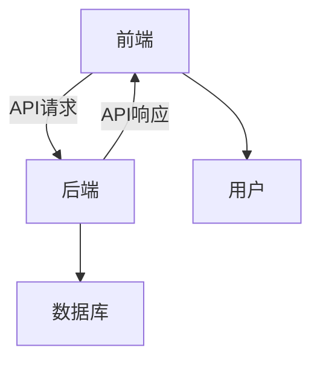

# 基于SpringBoot的前后端分离高校体育赛事管理系统

作者：禅与计算机程序设计艺术

## 1.背景介绍

### 1.1 项目背景

在现代高校中，体育赛事是学生生活中不可或缺的一部分。管理这些赛事不仅需要大量的人力物力，还需要一个高效、便捷的系统来处理赛事的报名、组织、管理和结果统计等工作。传统的手工管理方式已经无法满足现代化高校的需求，因此，开发一个基于SpringBoot的前后端分离的高校体育赛事管理系统显得尤为重要。

### 1.2 前后端分离的优势

前后端分离是一种现代化的Web开发架构，它将前端界面和后端逻辑完全分离，前端通过API与后端进行数据交互。这种架构的主要优势包括：

- **开发效率高**：前后端开发人员可以并行工作，提高开发效率。
- **维护方便**：前后端代码分离，维护时可以各自独立进行，不会互相影响。
- **性能优化**：前端可以使用现代化的框架如Vue.js、React等，提高用户体验和响应速度。
- **技术栈灵活**：前端和后端可以使用不同的技术栈，选择更适合各自需求的技术。

### 1.3 SpringBoot简介

SpringBoot是基于Spring框架的全新框架，它简化了Spring应用的开发和部署。SpringBoot提供了一套快速构建应用的工具集，能够极大地提高开发效率。其主要特点包括：

- **简化配置**：通过自动配置和约定优于配置的理念，减少了繁琐的XML配置。
- **内嵌服务器**：支持内嵌Tomcat、Jetty等服务器，无需单独部署。
- **强大的生态系统**：与Spring生态系统无缝集成，提供了丰富的功能和扩展。

## 2.核心概念与联系

### 2.1 前后端分离架构

前后端分离架构的核心思想是将前端和后端的职责进行明确划分。前端主要负责用户界面的展示和交互，而后端负责业务逻辑处理和数据存储。两者通过API进行通信。以下是一个典型的前后端分离架构图：



### 2.2 SpringBoot与前端框架的结合

在前后端分离的架构中，前端通常使用现代化的框架如Vue.js、React或Angular，而后端则使用SpringBoot来提供RESTful API。前端通过HTTP请求与后端进行数据交互，后端处理请求并返回数据。以下是一个简单的前后端交互流程：

1. 用户在前端界面进行操作，例如填写报名表。
2. 前端通过AJAX请求将数据发送到后端API。
3. 后端接收到请求后，进行业务逻辑处理，并将结果存储到数据库。
4. 后端将处理结果通过API响应返回给前端。
5. 前端根据响应结果进行界面更新。

### 2.3 RESTful API的设计

RESTful API是一种基于HTTP协议的API设计风格，它通过使用HTTP方法（如GET、POST、PUT、DELETE）来表示不同的操作。RESTful API的设计原则包括：

- **资源的概念**：将系统中的数据和功能抽象为资源，每个资源通过URI进行标识。
- **统一接口**：通过标准的HTTP方法对资源进行操作。
- **无状态性**：每个请求都是独立的，服务器不会保存客户端的状态。
- **可缓存性**：服务器可以通过HTTP头信息来指示响应是否可以被缓存。

## 3.核心算法原理具体操作步骤

### 3.1 用户认证与授权

在高校体育赛事管理系统中，用户认证与授权是一个重要的环节。通过Spring Security框架，我们可以实现基于角色的访问控制。以下是具体的操作步骤：

1. **用户注册**：用户通过前端界面提交注册信息，后端接收到请求后，将用户信息存储到数据库。
2. **用户登录**：用户通过前端界面提交登录信息，后端进行验证，验证通过后生成JWT令牌并返回给前端。
3. **访问控制**：前端在每次请求时将JWT令牌附加到请求头中，后端通过过滤器验证令牌的有效性，并根据用户角色进行访问控制。

### 3.2 赛事管理

赛事管理模块包括赛事的创建、修改、删除和查询等功能。以下是具体的操作步骤：

1. **创建赛事**：管理员通过前端界面提交赛事信息，后端接收到请求后，将赛事信息存储到数据库。
2. **修改赛事**：管理员通过前端界面提交修改后的赛事信息，后端接收到请求后，更新数据库中的赛事信息。
3. **删除赛事**：管理员通过前端界面提交删除请求，后端接收到请求后，删除数据库中的赛事信息。
4. **查询赛事**：前端通过AJAX请求查询赛事信息，后端接收到请求后，从数据库中读取赛事信息并返回给前端。

### 3.3 报名管理

报名管理模块包括报名的创建、修改、删除和查询等功能。以下是具体的操作步骤：

1. **创建报名**：用户通过前端界面提交报名信息，后端接收到请求后，将报名信息存储到数据库。
2. **修改报名**：用户通过前端界面提交修改后的报名信息，后端接收到请求后，更新数据库中的报名信息。
3. **删除报名**：用户通过前端界面提交删除请求，后端接收到请求后，删除数据库中的报名信息。
4. **查询报名**：用户通过AJAX请求查询报名信息，后端接收到请求后，从数据库中读取报名信息并返回给前端。

## 4.数学模型和公式详细讲解举例说明

### 4.1 数据库设计

在高校体育赛事管理系统中，数据库设计是一个关键环节。我们需要设计合理的数据库表结构，以便高效地存储和查询数据。以下是一个简化的数据库表结构：

```sql
CREATE TABLE users (
  id INT PRIMARY KEY AUTO_INCREMENT,
  username VARCHAR(50) NOT NULL,
  password VARCHAR(100) NOT NULL,
  role VARCHAR(20) NOT NULL
);

CREATE TABLE events (
  id INT PRIMARY KEY AUTO_INCREMENT,
  name VARCHAR(100) NOT NULL,
  date DATE NOT NULL,
  location VARCHAR(100) NOT NULL,
  description TEXT
);

CREATE TABLE registrations (
  id INT PRIMARY KEY AUTO_INCREMENT,
  user_id INT NOT NULL,
  event_id INT NOT NULL,
  registration_date DATE NOT NULL,
  FOREIGN KEY (user_id) REFERENCES users(id),
  FOREIGN KEY (event_id) REFERENCES events(id)
);
```

### 4.2 数据库查询优化

为了提高系统的性能，我们需要对数据库查询进行优化。以下是一些常用的优化策略：

- **索引**：为经常查询的字段添加索引，可以显著提高查询速度。
- **缓存**：使用缓存机制，如Redis，将经常查询的数据缓存起来，减少数据库的查询压力。
- **分表**：对于数据量较大的表，可以进行水平分表，将数据分散到多个表中，提高查询效率。

### 4.3 数学模型

在赛事管理系统中，我们可以使用一些数学模型来优化资源分配和调度。例如，可以使用线性规划模型来优化场地的使用：

$$
\text{Maximize} \quad \sum_{i=1}^{n} c_i x_i
$$

Subject to:

$$
\sum_{i=1}^{n} a_{ij} x_i \leq b_j, \quad j = 1, \ldots, m
$$

其中，$c_i$ 表示每个赛事的收益，$x_i$ 表示每个赛事的场地分配，$a_{ij}$ 表示资源消耗矩阵，$b_j$ 表示资源约束。

## 5.项目实践：代码实例和详细解释说明

### 5.1 项目结构

一个典型的SpringBoot项目结构如下：

```
src/
├── main/
│   ├── java/
│   │   └── com/
│   │       └── example/
│   │           └── sports/
│   │               ├── controller/
│   │               ├── model/
│   │               ├── repository/
│   │               ├── service/
│   │               └── SportsApplication.java
│   ├── resources/
│   │   ├── application.properties
│   │   └── static/
│   │       ├── css/
│   │       ├── js/
│   │       └── index.html
├── test/
