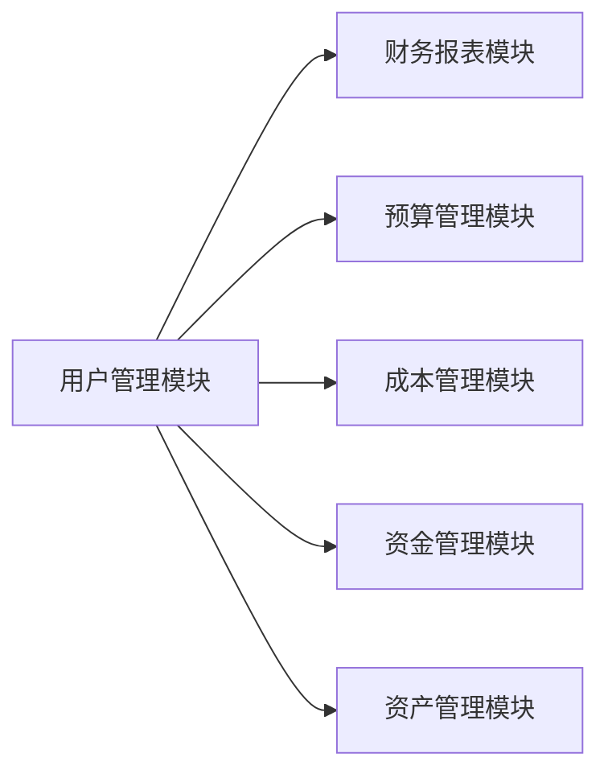

## 基于SSM的企业财务管理系统

## 1. 背景介绍

### 1.1 财务管理的重要性

在当今竞争激烈的商业环境中，有效的财务管理对于企业的生存和发展至关重要。财务管理涉及企业资金的筹集、使用、分配和控制，直接影响企业的盈利能力、偿债能力和发展潜力。

### 1.2 传统财务管理模式的弊端

传统的财务管理模式主要依赖手工操作和纸质文档，存在着效率低下、易出错、数据安全性差等弊端，难以满足现代企业对财务管理精细化、信息化、智能化的需求。

### 1.3 SSM框架的优势

SSM（Spring+Spring MVC+MyBatis）框架作为一种轻量级的Java EE开发框架，具有以下优势：

* **模块化设计:**  SSM框架采用分层架构，将应用程序的不同功能模块进行分离，降低了模块之间的耦合度，提高了代码的可重用性和可维护性。
* **轻量级:**  SSM框架的核心jar包都很小，不会对应用程序的性能造成太大影响。
* **易于学习和使用:**  SSM框架的API设计简洁易懂，文档齐全，学习曲线平缓。
* **强大的生态系统:**  SSM框架拥有庞大的用户群体和活跃的社区支持，可以方便地找到各种学习资料、开源组件和技术支持。

基于以上优势，SSM框架成为开发企业财务管理系统的理想选择。

## 2. 核心概念与联系

### 2.1 系统架构设计

本系统采用经典的三层架构设计，即表示层、业务逻辑层和数据访问层。

* **表示层:** 负责与用户进行交互，接收用户请求，并将请求转发给相应的业务逻辑层处理。
* **业务逻辑层:** 负责处理业务逻辑，调用数据访问层进行数据操作。
* **数据访问层:** 负责与数据库进行交互，执行数据的增删改查操作。

### 2.2 核心模块划分

本系统主要包括以下模块：

* **用户管理模块:**  负责用户的注册、登录、权限管理等功能。
* **财务报表模块:**  负责生成各种财务报表，如资产负债表、利润表、现金流量表等。
* **预算管理模块:**  负责编制、执行和控制企业预算。
* **成本管理模块:**  负责企业成本的核算、分析和控制。
* **资金管理模块:**  负责企业资金的筹集、使用、分配和控制。
* **资产管理模块:**  负责企业固定资产、流动资产的管理。

### 2.3 模块间关系图



## 3. 核心算法原理具体操作步骤

### 3.1 财务报表生成算法

本系统采用**平衡法**生成财务报表。平衡法是指将企业在一定时期内的所有经济业务，按照“有借必有贷，借贷必相等”的会计等式进行记录，最终汇总编制出资产负债表、利润表和现金流量表。

**具体操作步骤如下:**

1. 收集整理企业在一定时期内的所有经济业务凭证。
2. 根据经济业务凭证，编制会计分录。
3. 将所有会计分录登记到相应的会计账簿中。
4. 根据会计账簿的记录，编制试算平衡表，检查借贷方是否平衡。
5. 根据试算平衡表，编制正式的财务报表。

### 3.2 预算编制算法

本系统采用**滚动预算**的方式进行预算编制。滚动预算是一种动态的预算编制方法，它将预算期分为若干个滚动周期，每个周期结束后，根据实际情况对下一个周期的预算进行调整。

**具体操作步骤如下:**

1. 确定预算目标和预算期。
2. 将预算期分为若干个滚动周期。
3. 编制第一个滚动周期的预算。
4. 在每个滚动周期结束后，根据实际情况对下一个周期的预算进行调整。

## 4. 数学模型和公式详细讲解举例说明

### 4.1 资产负债表

**公式:** 资产=负债+所有者权益

**举例说明:**

假设某企业在2023年12月31日的资产负债表如下：

| 项目 | 金额（万元） |
|---|---|
| **资产** |  |
| 流动资产 | 100 |
| 固定资产 | 200 |
| **负债** |  |
| 短期借款 | 50 |
| 长期借款 | 100 |
| **所有者权益** |  |
| 实收资本 | 100 |
| 未分配利润 | 50 |

根据资产负债表公式，可以验证该企业的资产负债表是否平衡：

```
资产 = 负债 + 所有者权益
100 + 200 = 50 + 100 + 100 + 50
300 = 300
```

### 4.2 利润表

**公式:** 净利润=营业收入-营业成本-税金及附加-销售费用-管理费用-财务费用-资产减值损失+公允价值变动收益+投资收益

**举例说明:**

假设某企业在2023年度的利润表如下：

| 项目 | 金额（万元） |
|---|---|
| 营业收入 | 1000 |
| 营业成本 | 600 |
| 税金及附加 | 50 |
| 销售费用 | 100 |
| 管理费用 | 50 |
| 财务费用 | 20 |
| 资产减值损失 | 30 |
| 公允价值变动收益 | 10 |
| 投资收益 | 40 |

根据利润表公式，可以计算出该企业的净利润：

```
净利润 = 营业收入 - 营业成本 - 税金及附加 - 销售费用 - 管理费用 - 财务费用 - 资产减值损失 + 公允价值变动收益 + 投资收益
净利润 = 1000 - 600 - 50 - 100 - 50 - 20 - 30 + 10 + 40
净利润 = 160
```

## 5. 项目实践：代码实例和详细解释说明

### 5.1 用户登录功能实现

**代码实例:**

```java
@Controller
@RequestMapping("/user")
public class UserController {

    @Autowired
    private UserService userService;

    @RequestMapping("/login")
    public String login(User user, Model model) {
        // 调用业务逻辑层进行用户验证
        User loginUser = userService.login(user.getUsername(), user.getPassword());
        if (loginUser != null) {
            // 登录成功，将用户信息存储到session中
            model.addAttribute("user", loginUser);
            return "redirect:/index";
        } else {
            // 登录失败，返回登录页面
            model.addAttribute("message", "用户名或密码错误");
            return "login";
        }
    }
}
```

**代码解释:**

* `@Controller` 注解表示该类是一个控制器类。
* `@RequestMapping("/user")` 注解表示该控制器类处理所有以 `/user` 开头的请求。
* `@Autowired` 注解用于自动注入 `UserService` 对象。
* `@RequestMapping("/login")` 注解表示该方法处理 `/user/login` 请求。
* `login()` 方法接收用户提交的用户名和密码，调用 `UserService` 对象的 `login()` 方法进行验证。
* 如果验证成功，将用户信息存储到 `session` 中，并重定向到首页；否则，返回登录页面，并提示错误信息。

### 5.2 财务报表生成功能实现

**代码实例:**

```java
@Service
public class ReportServiceImpl implements ReportService {

    @Autowired
    private ReportDao reportDao;

    @Override
    public List<Map<String, Object>> generateBalanceSheet(String endDate) {
        // 查询资产负债表数据
        List<Map<String, Object>> balanceSheet = reportDao.getBalanceSheet(endDate);
        // 计算资产总额、负债总额和所有者权益总额
        BigDecimal totalAssets = BigDecimal.ZERO;
        BigDecimal totalLiabilities = BigDecimal.ZERO;
        BigDecimal totalEquity = BigDecimal.ZERO;
        for (Map<String, Object> item : balanceSheet) {
            String subjectName = (String) item.get("subjectName");
            BigDecimal amount = (BigDecimal) item.get("amount");
            if (subjectName.startsWith("流动资产") || subjectName.startsWith("固定资产")) {
                totalAssets = totalAssets.add(amount);
            } else if (subjectName.startsWith("短期借款") || subjectName.startsWith("长期借款")) {
                totalLiabilities = totalLiabilities.add(amount);
            } else if (subjectName.startsWith("实收资本") || subjectName.startsWith("未分配利润")) {
                totalEquity = totalEquity.add(amount);
            }
        }
        // 将计算结果添加到报表数据中
        Map<String, Object> totalItem = new HashMap<>();
        totalItem.put("subjectName", "资产总额");
        totalItem.put("amount", totalAssets);
        balanceSheet.add(totalItem);
        totalItem = new HashMap<>();
        totalItem.put("subjectName", "负债总额");
        totalItem.put("amount", totalLiabilities);
        balanceSheet.add(totalItem);
        totalItem = new HashMap<>();
        totalItem.put("subjectName", "所有者权益总额");
        totalItem.put("amount", totalEquity);
        balanceSheet.add(totalItem);
        return balanceSheet;
    }
}
```

**代码解释:**

* `@Service` 注解表示该类是一个业务逻辑层类。
* `@Autowired` 注解用于自动注入 `ReportDao` 对象。
* `generateBalanceSheet()` 方法接收报表结束日期作为参数，调用 `ReportDao` 对象的 `getBalanceSheet()` 方法查询资产负债表数据。
* 遍历查询结果，计算资产总额、负债总额和所有者权益总额。
* 将计算结果添加到报表数据中，并返回报表数据。

## 6. 实际应用场景

### 6.1 企业财务报表分析

企业管理层可以利用本系统生成的财务报表，对企业的经营状况进行分析，例如：

* 通过分析资产负债表，可以了解企业的资产结构、负债水平和偿债能力。
* 通过分析利润表，可以了解企业的盈利能力、成本控制水平和费用构成。
* 通过分析现金流量表，可以了解企业的现金流入流出情况、资金来源和使用情况。

### 6.2 企业预算编制与控制

企业财务部门可以利用本系统进行预算编制，并对预算执行情况进行跟踪和控制，例如：

* 可以根据历史数据和未来发展规划，编制企业的年度预算、季度预算和月度预算。
* 可以将预算分解到各个部门和责任人，并对预算执行情况进行监控。
* 可以根据实际情况对预算进行调整，确保预算的有效性和可执行性。

## 7. 工具和资源推荐

### 7.1 开发工具

* **Eclipse:** 一款功能强大的Java IDE，支持SSM框架开发。
* **IntelliJ IDEA:** 另一款优秀的Java IDE，也支持SSM框架开发。

### 7.2 数据库

* **MySQL:** 一款开源的关系型数据库，性能优异，成本低廉。
* **Oracle:** 一款商业的关系型数据库，功能强大，稳定性高。

### 7.3 学习资源

* **SSM框架官方文档:** https://docs.spring.io/
* **MyBatis官方文档:** https://mybatis.org/mybatis-3/
* **廖雪峰的官方网站:** https://www.liaoxuefeng.com/

## 8. 总结：未来发展趋势与挑战

### 8.1 未来发展趋势

* **云计算:** 随着云计算技术的不断发展，企业财务管理系统将逐步迁移到云端，实现资源共享、弹性扩展和按需付费。
* **大数据:** 企业积累了大量的财务数据，利用大数据技术可以对这些数据进行深度挖掘和分析，为企业经营决策提供支持。
* **人工智能:** 人工智能技术可以应用于财务报表的自动生成、财务风险的预警和财务决策的智能化等方面。

### 8.2 面临的挑战

* **数据安全:** 企业财务数据属于敏感信息，如何保障数据的安全性和隐私性是一个重要挑战。
* **系统集成:** 企业财务管理系统需要与其他业务系统进行集成，如何实现数据的互联互通是一个挑战。
* **人才培养:** 随着财务管理技术的发展，需要培养更多掌握新技术和新理念的财务管理人才。

## 9. 附录：常见问题与解答

### 9.1 问：如何解决SSM框架中的SQL注入问题？

答：可以使用MyBatis提供的预编译功能来防止SQL注入。预编译是指将SQL语句中的参数替换成占位符，然后将参数值传递给数据库进行处理。这样可以避免SQL语句被恶意篡改。

### 9.2 问：如何提高SSM框架的性能？

答：可以从以下几个方面入手：

* 使用缓存技术，例如Redis、Memcached等，可以减少数据库访问次数，提高查询效率。
* 对SQL语句进行优化，例如创建索引、避免使用通配符等，可以提高查询速度。
* 使用异步处理机制，例如消息队列等，可以将耗时的操作放到后台执行，提高系统响应速度。
