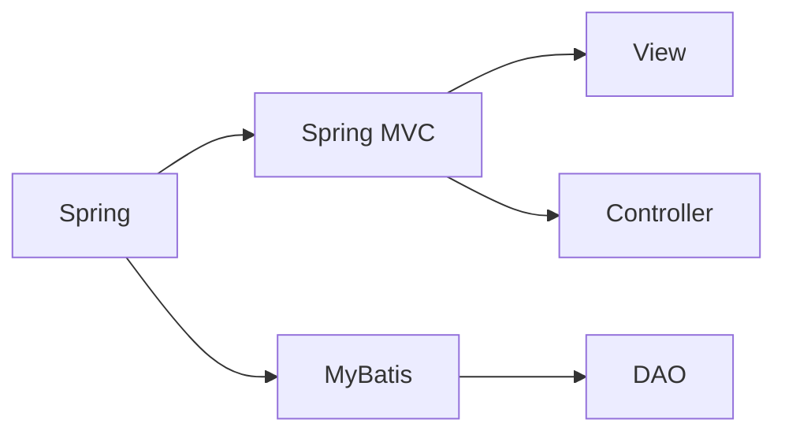

# 基于ssm的医院挂号系统

作者：禅与计算机程序设计艺术

## 1. 背景介绍

### 1.1 医院挂号系统的重要性
在现代医疗服务中,医院挂号系统扮演着至关重要的角色。它是连接患者与医疗机构的桥梁,直接影响到医疗服务的质量和效率。传统的人工挂号方式存在诸多问题,如排队时间长、挂号效率低、易出错等。因此,开发一套高效、便捷、准确的医院挂号系统势在必行。

### 1.2 计算机技术在医疗领域的应用
随着计算机技术的飞速发展,将其应用于医疗领域已成为大势所趋。利用计算机强大的信息处理和存储能力,可以极大地提升医疗管理和服务水平。在门诊挂号、医生排班、处方开具、费用结算等方面,计算机系统能够提供高效准确的支持。

### 1.3 SSM框架简介
SSM框架是Java Web开发中一种成熟的轻量级框架,由Spring、Spring MVC和MyBatis三个框架组成。Spring是一个IoC和AOP容器框架,Spring MVC是一个MVC Web框架,MyBatis是一个ORM持久层框架。SSM框架充分利用了三者的优势,具有开发效率高、可维护性好、可扩展性强等特点,广泛应用于各类Web系统的开发。

## 2. 核心概念与联系

### 2.1 Spring框架
- IoC(Inversion of Control)控制反转:通过依赖注入(DI)实现松耦合
- AOP(Aspect Oriented Programming)面向切面编程:将横切关注点模块化
- 提供了声明式事务、数据访问、Web开发等丰富功能

### 2.2 Spring MVC框架  
- 基于Servlet的MVC Web框架
- 支持Restful风格的URL请求
- 采用了松散耦合可插拔组件结构,扩展性好

### 2.3 MyBatis框架
- 支持定制化SQL、存储过程和高级映射的优秀持久层框架
- 避免了几乎所有的JDBC代码和手动设置参数以及获取结果集
- 可以使用简单的XML或注解来配置和映射原生类型、接口和Java POJO为数据库中的记录

### 2.4 三大框架的关系
在SSM框架中,Spring框架处于核心地位,它管理着Spring MVC和MyBatis。Spring MVC负责MVC分层中的View和Controller层,MyBatis负责持久层DAO。三者相辅相成,共同构建出一个完整的Web应用系统。它们的关系如下图所示:



## 3. 核心算法原理与具体操作步骤

### 3.1 注册用户信息
1. 用户在前端填写注册信息并提交
2. Controller接收请求数据,调用Service处理
3. Service调用DAO将用户信息持久化到数据库
4. DAO使用MyBatis执行SQL将数据插入用户表

### 3.2 用户登录认证
1. 用户在前端输入账号密码并提交登录请求
2. Controller接收请求,调用Service进行处理  
3. Service调用DAO根据账号查询用户信息
4. 比对密码,若匹配则认证通过,否则返回错误信息
5. 认证通过后,将用户信息存入Session

### 3.3 科室医生排班
1. 管理员在后台设置科室和医生信息  
2. 管理员为医生排班,设置可预约时段
3. 排班信息持久化到数据库
4. 前端查询排班信息并显示可预约时段

### 3.4 在线实时预约
1. 用户浏览科室医生排班,选择预约时段
2. 用户填写预约信息并提交请求
3. Controller调用Service处理预约请求
4. Service调用DAO将预约信息持久化到数据库
5. 实时更新医生排班,减少可预约号源数量

## 4. 数学模型和公式详解

### 4.1 预约成功率计算
设医院有$m$个科室,第$i$个科室有$n_i$个医生。第$i$个科室第$j$个医生在时段$t$的最大可预约数为$c_{ijt}$,已预约数为$r_{ijt}$。则第$i$个科室第$j$个医生在时段$t$的预约成功率$s_{ijt}$为:

$$
s_{ijt}=\begin{cases}
1, & r_{ijt} < c_{ijt} \\
0, & r_{ijt} = c_{ijt}
\end{cases}
$$

进一步,第$i$个科室的总体预约成功率$S_i$为:

$$
S_i=\frac{\sum_{j=1}^{n_i}\sum_{t=1}^{T}s_{ijt}}{n_i \times T}
$$

其中$T$为考察的总时段数。

### 4.2 负载均衡算法
为了提高系统并发性能,避免服务器过载,需要对多台服务器进行负载均衡。设有$n$台服务器,第$i$台服务器的权重为$w_i$,已分配的连接数为$c_i$。当有新的连接请求到达时,采用加权最小连接数算法选择服务器。即选择满足以下条件的服务器$s$:

$$
\frac{c_s}{w_s}=\min_{1 \leq i \leq n}\frac{c_i}{w_i}
$$

该算法综合考虑了服务器的性能权重和当前负载情况,能够实现更加合理的负载分配。

## 5. 项目实践:代码实例和详解

### 5.1 Spring配置
```xml
<!-- 配置自动扫描的包 -->
<context:component-scan base-package="com.hospital.registration" />

<!-- 配置数据源 -->
<bean id="dataSource" class="com.alibaba.druid.pool.DruidDataSource"
    destroy-method="close">
  <property name="driverClassName" value="${jdbc.driverClassName}" />
  <property name="url" value="${jdbc.url}" />   
  <property name="username" value="${jdbc.username}" />
  <property name="password" value="${jdbc.password}" />
</bean>

<!-- 配置SqlSessionFactory -->
<bean id="sqlSessionFactory" class="org.mybatis.spring.SqlSessionFactoryBean">
  <property name="dataSource" ref="dataSource" />
  <!-- 自动扫描mapper.xml文件 -->
  <property name="mapperLocations" value="classpath:mapper/*.xml" /> 
</bean>

<!-- 配置事务管理器 -->
<bean id="transactionManager"
  class="org.springframework.jdbc.datasource.DataSourceTransactionManager">
  <property name="dataSource" ref="dataSource" />
</bean>

<!-- 启用事务注解 -->
<tx:annotation-driven transaction-manager="transactionManager" />
```

这段代码配置了Spring的核心功能:
- 自动扫描注解组件
- 配置数据源(这里使用了Druid连接池)
- 配置MyBatis的SqlSessionFactory
- 配置事务管理器并启用注解式事务

### 5.2 用户注册的Controller
```java
@Controller
@RequestMapping("/user")
public class UserController {
    
    @Autowired
    private UserService userService;
    
    @PostMapping("/register")
    public String register(User user) {
        try {
            userService.register(user);
            return "redirect:/login";
        } catch (Exception e) {
            e.printStackTrace();
            return "register";
        }
    }
}
```

这段代码实现了用户注册的Controller层逻辑:
- 使用`@Controller`注解标识控制器
- 使用`@RequestMapping`注解设置请求路径
- 使用`@Autowired`注解自动注入UserService
- 定义register方法处理POST请求
- 调用UserService的register方法注册用户
- 注册成功重定向到登录页,失败返回注册页

### 5.3 预约信息的MyBatis Mapper
```xml
<mapper namespace="com.hospital.registration.dao.AppointmentDao">
    <insert id="insert" parameterType="Appointment">
        INSERT INTO appointment(user_id, doctor_id, appointment_time)
        VALUES (#{userId}, #{doctorId}, #{appointmentTime}) 
    </insert>
    
    <select id="countByDoctorAndTime" resultType="int">
        SELECT COUNT(*) FROM appointment
        WHERE doctor_id = #{doctorId} AND appointment_time = #{appointmentTime}
    </select>
</mapper>
```

这段代码定义了预约信息的MyBatis Mapper:  
- `namespace`属性设置Mapper接口的全限定名
- `<insert>`标签定义了插入预约信息的SQL
- `<select>`标签定义了根据医生ID和预约时间统计预约数的SQL
- `parameterType`属性设置参数类型
- `resultType`属性设置结果类型
- `#{}`占位符实现参数绑定

## 6. 实际应用场景

医院挂号系统在实际应用中大大提高了患者挂号的便利性和医院的管理效率。以下是一些具体的应用场景:

### 6.1 网上预约挂号
患者可以通过医院官网或微信公众号等渠道进行在线预约挂号。只需选择科室、医生和预约时段,填写个人信息即可完成预约,无需排队等候。

### 6.2 数据统计分析
系统可以自动统计医生的预约量、就诊量等数据,生成各类报表,为医院管理决策提供数据支持。同时还可以对患者数据进行分析,了解患者的就医偏好、满意度等信息。  

### 6.3 信息推送提醒
系统可以向预约成功的患者发送就诊提醒信息,减少患者遗忘和爽约的情况。如果医生临时停诊,系统也可以及时通知患者,避免患者白跑一趟。

### 6.4 移动端应用
医生可以通过移动端APP随时查看自己的排班和预约情况,患者也可以使用APP进行预约操作和查询,提高了用户体验。

## 7. 工具和资源推荐

### 7.1 开发工具
- IntelliJ IDEA:功能强大的Java IDE
- MySQL:关系型数据库
- Git:版本控制工具
- Maven:项目构建和依赖管理工具

### 7.2 学习资源
- [Spring官方文档](https://spring.io/docs)
- [MyBatis官方文档](https://mybatis.org/mybatis-3/)
- [SSM框架整合教程](http://how2j.cn/k/ssm/ssm-tutorial/1137.html)
- [Java工程师成神之路](https://hollischuang.github.io/toBeTopJavaer/)

### 7.3 部署工具
- Tomcat:Java Web应用服务器
- Docker:应用容器引擎
- Jenkins:自动化部署工具

## 8. 总结:未来发展趋势与挑战

### 8.1 微服务架构
随着系统规模和复杂度的增长,单体架构渐渐暴露出弊端。未来医院挂号系统可能会采用微服务架构,将系统拆分为多个独立的微服务,每个微服务负责一个单一功能。这种架构具有易开发、易部署、易扩展等优势。

### 8.2 云原生技术
云计算的发展带来了云原生技术的兴起。将医院挂号系统容器化并部署到云平台上,可以提供弹性伸缩、高可用等能力。Kubernetes作为业界领先的容器编排平台,值得关注和学习。

### 8.3 人工智能应用
人工智能技术在医疗领域有广阔的应用前景。医院挂号系统可以引入智能问诊、智能导诊等功能,利用自然语言处理、知识图谱等技术,为患者提供智能化的服务。

### 8.4 数据安全与隐私保护
医疗数据涉及患者的隐私,对数据安全和隐私保护提出了很高的要求。如何在便利患者的同时保证数据安全,是一个亟待解决的难题。区块链、同态加密等新兴技术可能会在这方面发挥重要作用。

## 9. 附录:常见问题与解答

### 9.1 如何处理并发预约的问题?
可以使用悲观锁或乐观锁来处理并发预约。悲观锁通过数据库锁来保证同一时刻只有一个用户能够预约成功。乐观锁通过版本号机制来检测并发冲突,适用于并发量较高的场景。

### 9.2 如何保证系统的高可用?
可以采用集群部署和负载均衡的方式来提高系统的可用性。同时要做好数据备份和容灾,确保在故障发生时能够及时恢复服务。

### 9.3 如何提高系统的性能?
可以从以下几个方面入手:
- 