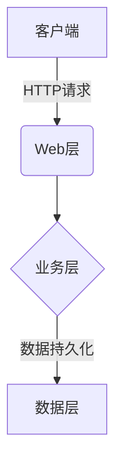
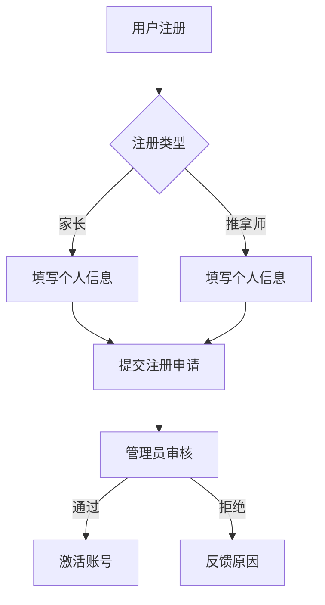

# 基于SSM的小儿推拿预约平台

## 1. 背景介绍

### 1.1 小儿推拿的重要性

小儿推拿是中医传统疗法之一,具有调理机体、预防疾病的作用。它通过对婴幼儿特定部位的按摩和推拿,可以促进儿童的生长发育,增强体质,预防常见病、多发病的发生。随着人们对健康理念的重视,小儿推拿越来越受到家长的青睐。

### 1.2 传统预约模式的弊端

传统的小儿推拿预约方式存在诸多不足,如:

- 信息不对称,家长难以全面了解推拿师的资质和服务质量
- 预约流程繁琐,需线下拨打电话或现场预约,效率低下
- 缺乏统一的管理平台,导致资源调配困难

### 1.3 在线预约平台的必要性  

基于以上弊端,构建一个基于互联网的在线小儿推拿预约平台就显得尤为必要。该平台可以:

- 整合推拿师资源,提供全面的服务信息
- 实现在线预约,提高预约效率
- 建立统一的管理系统,优化资源调配

## 2. 核心概念与联系

### 2.1 系统架构

本平台采用经典的SSM(Spring+SpringMVC+MyBatis)架构,具有低耦合、可扩展等优点。



### 2.2 角色与功能

平台包含三类主要角色:

1. **家长用户**: 可查看推拿师信息、在线预约服务、评价服务等
2. **推拿师用户**: 维护个人信息、管理服务、接受预约等
3. **管理员**: 审核注册、管理订单、处理投诉等

### 2.3 关键技术

- **Spring**: 核心框架,实现控制反转(IOC)和面向切面编程(AOP)
- **SpringMVC**: MVC模式的请求驱动框架,接受请求并调用服务
- **MyBatis**: 持久层框架,实现数据的持久化操作
- **MySQL**: 关系型数据库,存储系统数据
- **Redis**: 分布式内存数据库,用于缓存热点数据
- **RabbitMQ**: 消息队列,实现异步可靠消息传递  

## 3. 核心算法原理具体操作步骤

### 3.1 注册与审核流程



1. 用户选择注册类型(家长或推拿师)
2. 填写个人信息,推拿师还需提供资质证明
3. 提交注册申请
4. 管理员审核注册信息
5. 审核通过则激活账号,拒绝则反馈原因

该流程确保了注册信息的真实性和推拿师资质的合规性。

### 3.2 推拿师排名算法

平台对推拿师进行智能排名,为家长推荐优质服务。主要考虑因素有:

- 服务评分
- 预约单数
- 好评率
- 响应速度
- 从业年限

算法使用加权算法对各因素进行打分,最终得分高的排名靠前。

```python
score = w1*评分 + w2*预约单数 + w3*好评率 + w4*响应速度 + w5*从业年限
```

其中w1-w5为各因素的权重系数,可根据实际情况调整。

### 3.3 智能推荐算法

针对家长用户,系统会基于其历史预约记录、评价内容等数据,采用协同过滤算法为其推荐合适的推拿师和服务。

1. 计算用户相似度矩阵
2. 根据相似用户的评分,预测目标用户的兴趣
3. 为目标用户推荐评分较高的项目

该算法可以较好地解决数据稀疏、冷启动等常见推荐问题。

### 3.4 异步消息机制

平台采用消息队列实现异步可靠消息传递,提高系统的响应性和可扩展性。

例如,当推拿师接受一个预约单时:

1. 系统将预约信息发送到消息队列
2. 队列的消费者订阅该消息,执行发送通知、更新库存等操作
3. 消费者处理完成后,手动确认消息

这种方式避免了请求线程阻塞,提高了系统的吞吐量。

## 4. 数学模型和公式详细讲解举例说明

### 4.1 基于地理位置的推荐算法

为了方便家长选择就近的推拿师,系统使用基于地理位置的推荐算法。首先计算家长与各推拿师之间的距离,距离越近则推荐权重越高。

已知家长坐标为(x1,y1),推拿师坐标为(x2,y2),则二者距离d为:

$$d = \sqrt{(x_1-x_2)^2 + (y_1-y_2)^2}$$

算法会综合考虑距离因素、评分等其他因素,得到最终的推荐分数:

$$\text{score} = w_1 \cdot \frac{1}{d} + w_2 \cdot \text{rating} + \ldots$$

其中$w_1, w_2$分别为距离、评分的权重系数。

### 4.2 推拿师空闲时间段匹配算法 

为了提高预约成功率,系统需要智能匹配推拿师的空闲时间段。设推拿师已有n个预约单,每个预约单的时间范围为$(s_i, e_i)$。则推拿师的空闲时间段可表示为:

$$\text{Available} = [0,s_1) \cup (e_1,s_2) \cup (e_2,s_3) \cup \ldots \cup (e_n,+\infty)$$

当有新的预约请求时间段为$(t_1, t_2)$时,算法需要判断该时间段是否包含在Available中。若包含,则可以接受该预约,否则拒绝。

该算法的时间复杂度为$O(n)$,其中n为已有预约单数量。可使用高效的线段树等数据结构进一步优化。

## 4. 项目实践:代码实例和详细解释说明

### 4.1 用户注册模块

```java
// UserController.java
@RequestMapping("/register")
public String register(@Valid User user, BindingResult result) {
    if (result.hasErrors()) {
        // 处理表单验证错误
    }
    
    UserType type = user.getType();
    if (type == UserType.PARENT) {
        // 家长用户注册逻辑
    } else {
        // 推拿师用户注册逻辑,需提供资质证明
    }
    
    // 发送注册审核消息
    rabbitTemplate.convertAndSend(RegistrationQueue, user);
    return "success";
}
```

上述代码展示了注册流程的控制器部分,主要包括:

1. 使用JSR-303校验注解对表单数据进行验证
2. 根据用户类型执行不同的注册逻辑
3. 将注册信息发送到消息队列,等待管理员审核

```java
// RegistrationListener.java 
@RabbitListener(queues = "RegistrationQueue")
public void handleRegistration(User user) {
    // 管理员审核逻辑
    boolean approved = reviewUser(user);
    
    if (approved) {
        userService.activateUser(user);
        // 发送激活通知
    } else {
        // 反馈拒绝原因
    }
}
```

上面是消费者监听器代码,用于处理注册审核消息。管理员审核通过后,调用userService激活用户账号并发送通知;否则反馈拒绝原因。

通过消息队列解耦注册流程,既保证了流程的可靠性,又避免了请求线程阻塞,提高了系统的吞吐量。

### 4.2 预约服务模块

```java
// AppointmentController.java
@RequestMapping("/createAppt")
public String createAppointment(Appointment appt) {
    // 查找合适的推拿师
    List<Massager> candidates = massagerService.findAvailable(appt.getTimeRange());
    Massager selectedMassager = recommendationEngine.recommend(candidates, appt.getLocation());
    
    if (selectedMassager != null) {
        appt.setMassager(selectedMassager);
        appointmentService.createAppointment(appt);
        return "success";
    } else {
        return "failure";
    }
}
```

预约服务的控制器方法如上所示,流程为:

1. 根据预约时间段,查找有空闲的推拿师列表
2. 使用基于位置的推荐算法,为家长推荐最合适的推拿师
3. 创建预约单,持久化到数据库

```java
// MassagerService.java
public List<Massager> findAvailable(TimeRange range) {
    // 从Redis读取推拿师的预约缓存
    Map<String, TreeSet<ScheduleSlot>> cache = redisTemplate.opsForHash()
                                  .entries("massager.schedule");
                                  
    // 遍历所有推拿师,找出时间段符合的
    List<Massager> available = new ArrayList<>();
    for (Map.Entry<String, TreeSet<ScheduleSlot>> entry : cache.entrySet()) {
        String massagerId = entry.getKey();
        TreeSet<ScheduleSlot> schedule = entry.getValue();
        if (isAvailable(schedule, range)) {
            available.add(massagerRepo.findById(massagerId));
        }
    }
    return available;
}
```

在查找空闲推拿师时,系统会先从Redis中读取推拿师的预约时间缓存,使用线段树等数据结构高效判断时间段是否可用。这样可以避免频繁访问数据库,提升系统性能。

### 4.3 评价与排名模块

```java
// ReviewController.java
@RequestMapping("/review")
public String leaveReview(Review review) {
    reviewService.saveReview(review);
    
    // 更新推拿师排名分数
    Massager massager = review.getMassager();
    double newScore = rankingEngine.updateScore(massager, review.getScore());
    massagerService.updateRankingScore(massager, newScore);
    
    return "success";
}
```

当家长为推拿师的服务留下评价时,系统会:

1. 将评价数据持久化到数据库
2. 根据新的评价,重新计算该推拿师的排名分数
3. 更新推拿师的排名分数,用于后续排序和推荐

```java
// RankingEngine.java
public double updateScore(Massager massager, double newReview) {
    double oldScore = massager.getRankingScore();
    int totalReviews = massager.getReviewCount();
    
    // 计算加权平均评分
    double newScore = (oldScore * totalReviews + newReview) / (totalReviews + 1);
    
    // 考虑其他排名因素,如预约单数、响应速度等
    newScore = newScore * 0.6 + massager.getBookingCount() * 0.2 + massager.getResponseTime() * 0.2;
    return newScore;
}
```

排名引擎会根据新的评价,重新计算该推拿师的综合评分,作为排名的主要依据。算法会将评分、预约单数、响应速度等多个因素综合考虑,得到最终的排名分数。

该分数越高,该推拿师在排名中的位置就越靠前,从而为家长推荐优质的推拿服务。

## 5. 实际应用场景

### 5.1 家长预约流程

1. 家长注册并登录平台
2. 查看附近推拿师的个人主页,包括服务评分、预约价格等信息
3. 选择心仪的推拿师,预约服务时间段
4. 在线支付预约费用
5. 当日接受推拿服务,并为服务质量评分
6. 基于历史评分,系统会为家长推荐合适的推拿师

### 5.2 推拿师使用场景

1. 推拿师注册并通过资质审核
2. 维护个人主页,包括服务项目、时间安排、收费标准等
3. 接受并处理家长的预约请求
4. 完成服务后,由家长对服务质量进行评价
5. 优质服务会提升个人的排名和曝光率,吸引更多家长预约

### 5.3 管理员运维场景

1. 审核注册的家长和推拿师账号
2. 处理家长的投诉举