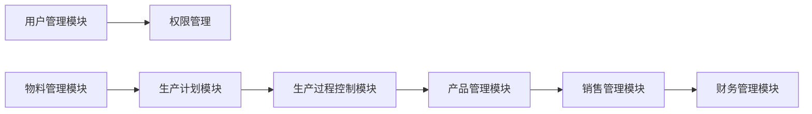

# 基于SSM的钢铁工厂管理系统

## 1. 背景介绍

### 1.1 钢铁行业信息化现状

随着信息技术的快速发展和钢铁行业竞争的日益激烈，钢铁企业面临着越来越大的生产经营压力。传统的管理模式已经无法满足现代钢铁企业的需求，信息化建设已成为钢铁企业提高管理水平、降低生产成本、增强市场竞争力的必然选择。

### 1.2  钢铁工厂管理系统概述

钢铁工厂管理系统是针对钢铁企业生产经营特点而设计的，涵盖了从原材料采购、生产计划、生产过程控制、产品销售到财务管理等各个环节的综合性管理系统。其主要目标是实现企业资源的优化配置和高效利用，提高生产效率和产品质量，降低生产成本，增强企业市场竞争力。

### 1.3  SSM框架优势

SSM（Spring+SpringMVC+MyBatis）框架作为目前Java Web开发的主流框架之一，具有以下优势：

* **轻量级框架:**  相较于传统Java EE框架，SSM框架更加轻量级，配置简单，易于上手。
* **松耦合:**  SSM框架采用模块化设计，各层之间相互独立，耦合度低，便于维护和扩展。
* **灵活性和可扩展性:**  SSM框架支持多种视图技术、数据库和缓存技术，可以根据项目需求灵活选择。
* **强大的社区支持:**  SSM框架拥有庞大的用户群体和活跃的社区，可以方便地获取技术支持和解决方案。

## 2. 核心概念与联系

### 2.1 系统架构

本系统采用经典的MVC（Model-View-Controller）三层架构，并结合SSM框架进行开发。

* **表现层（View）：** 负责与用户进行交互，展示数据和接收用户输入。采用JSP、HTML、CSS、JavaScript等技术实现。
* **控制层（Controller）：** 负责接收用户请求，调用业务逻辑层处理请求，并将处理结果返回给表现层。采用SpringMVC框架实现。
* **业务逻辑层（Service）：** 负责处理业务逻辑，包括数据校验、业务规则判断、数据处理等。采用Spring框架实现。
* **数据访问层（DAO）：** 负责与数据库进行交互，实现数据的持久化操作。采用MyBatis框架实现。

### 2.2  核心模块

本系统主要包括以下模块：

* **用户管理模块:**  负责管理系统用户信息，包括用户注册、登录、权限管理等。
* **物料管理模块:**  负责管理钢铁生产所需的各种原材料，包括入库、出库、库存查询等。
* **生产计划模块:**  负责制定和管理生产计划，包括计划制定、计划调整、计划查询等。
* **生产过程控制模块:**  负责监控和管理生产过程，包括生产进度跟踪、质量控制、设备管理等。
* **产品管理模块:**  负责管理钢铁产品信息，包括产品入库、出库、库存查询等。
* **销售管理模块:**  负责管理产品销售业务，包括订单管理、发货管理、客户管理等。
* **财务管理模块:**  负责管理企业财务信息，包括成本核算、收入管理、支出管理等。

### 2.3 模块间联系




## 3. 核心算法原理具体操作步骤

### 3.1 生产计划排程算法

生产计划排程是钢铁工厂管理系统中的核心算法之一，其目的是在满足客户需求和生产约束条件的前提下，制定出最优的生产计划。

#### 3.1.1 算法原理

本系统采用遗传算法进行生产计划排程。遗传算法是一种模拟自然界生物进化过程的优化算法，其基本思想是将问题的解表示为染色体，通过模拟自然选择、交叉和变异等操作，不断迭代进化，最终得到问题的最优解或近似最优解。

#### 3.1.2  操作步骤

1. **初始化种群:**  随机生成一定数量的初始解，每个解表示一种生产计划方案。
2. **计算适应度:**  根据预先设定的目标函数，计算每个解的适应度值，适应度值越高表示该解越优。
3. **选择操作:**  根据适应度值，选择优良的个体进入下一代种群。
4. **交叉操作:**  将选中的两个父代个体进行基因交叉，生成新的子代个体。
5. **变异操作:**  对子代个体进行基因变异，增加种群的多样性。
6. **重复步骤2-5:**  不断迭代进化，直到满足终止条件。
7. **输出最优解:**  选择适应度值最高的个体作为最优解，即最优的生产计划方案。

### 3.2 库存管理算法

库存管理是钢铁工厂管理系统中的另一个重要算法，其目的是在保证生产需求的前提下，尽量减少库存积压，降低库存成本。

#### 3.2.1 算法原理

本系统采用经济订货批量（EOQ）模型进行库存管理。EOQ模型是一种经典的库存管理模型，其基本思想是在订购成本和库存成本之间找到一个平衡点，使得总成本最小。

#### 3.2.2 操作步骤

1. **确定需求量:**  根据历史数据和未来预测，确定每个物料的年需求量。
2. **确定订购成本:**  每个物料每次订购所产生的费用，包括运输费、装卸费、人工费等。
3. **确定库存成本:**  每个物料每单位每年所产生的费用，包括仓储费、保险费、损耗费等。
4. **计算经济订货批量:**  根据EOQ公式计算每个物料的经济订货批量。
    $$EOQ = \sqrt{\frac{2*需求量*订购成本}{库存成本}}$$
5. **确定订货点:**  根据物料的订货周期和安全库存量，确定每个物料的订货点。

## 4. 数学模型和公式详细讲解举例说明

### 4.1  经济订货批量（EOQ）模型

EOQ模型是一种经典的库存管理模型，其目标是在订购成本和库存成本之间找到一个平衡点，使得总成本最小。

#### 4.1.1  模型假设

* 需求是已知的，并且是恒定的。
* 订购提前期是已知的，并且是恒定的。
* 每次订购的成本是固定的。
* 库存持有成本是单位库存价值的线性函数。
* 不允许缺货。

#### 4.1.2  模型公式

$$EOQ = \sqrt{\frac{2*D*S}{H}}$$

其中：

* $EOQ$：经济订货批量
* $D$：年需求量
* $S$：每次订购成本
* $H$：单位库存年持有成本

#### 4.1.3  举例说明

假设某钢铁企业每年需要消耗1000吨钢材，每次订购钢材的成本为500元，每吨钢材每年的库存成本为100元。则该企业的经济订货批量为：

$$EOQ = \sqrt{\frac{2*1000*500}{100}} = 100吨$$

即该企业每次应该订购100吨钢材，才能使得总成本最小。

### 4.2  线性规划模型

线性规划模型是一种用于在给定约束条件下优化线性目标函数的数学方法。

#### 4.2.1  模型要素

* **决策变量:**  需要求解的未知量。
* **目标函数:**  需要优化的函数，通常表示为决策变量的线性组合。
* **约束条件:**  对决策变量的限制条件，通常表示为线性等式或不等式。

#### 4.2.2  模型求解

线性规划模型可以使用单纯形法、内点法等算法进行求解。

#### 4.2.3  举例说明

假设某钢铁企业生产两种产品：A和B。生产每吨A产品需要消耗2吨铁矿石和1吨煤炭，生产每吨B产品需要消耗1吨铁矿石和2吨煤炭。该企业每天最多可以获得100吨铁矿石和80吨煤炭。A产品的利润为每吨1000元，B产品的利润为每吨800元。请问该企业应该如何安排生产计划，才能使得利润最大化？

**决策变量:**

* $x_1$：每天生产A产品的吨数
* $x_2$：每天生产B产品的吨数

**目标函数:**

* $max Z = 1000x_1 + 800x_2$

**约束条件:**

* $2x_1 + x_2 <= 100$  (铁矿石约束)
* $x_1 + 2x_2 <= 80$  (煤炭约束)
* $x_1 >= 0, x_2 >= 0$  (非负约束)

使用线性规划模型可以求解出该问题的最优解为：$x_1 = 40, x_2 = 20$，即该企业每天应该生产40吨A产品和20吨B产品，才能使得利润最大化。

## 5. 项目实践：代码实例和详细解释说明

### 5.1  项目环境搭建

1.  安装Java开发环境（JDK）。
2.  安装IDE（Eclipse、IntelliJ IDEA等）。
3.  安装数据库（MySQL）。
4.  安装Maven项目管理工具。

### 5.2  创建Maven项目

1.  打开IDE，新建一个Maven项目。
2.  选择webapp模板。
3.  填写项目信息，例如GroupId、ArtifactId等。

### 5.3  添加依赖

在pom.xml文件中添加项目所需依赖，例如：

```xml
<dependencies>
  <!-- Spring -->
  <dependency>
    <groupId>org.springframework</groupId>
    <artifactId>spring-context</artifactId>
    <version>${spring.version}</version>
  </dependency>
  <dependency>
    <groupId>org.springframework</groupId>
    <artifactId>spring-webmvc</artifactId>
    <version>${spring.version}</version>
  </dependency>

  <!-- MyBatis -->
  <dependency>
    <groupId>org.mybatis</groupId>
    <artifactId>mybatis</artifactId>
    <version>${mybatis.