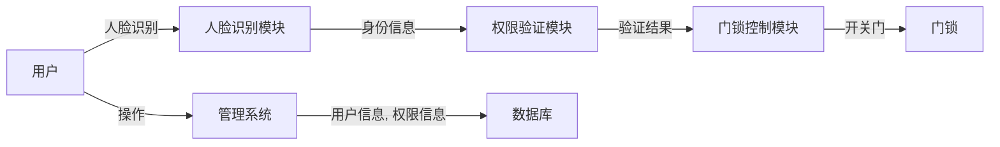

# 基于人脸识别的功能区门禁系统设计与实现

作者：禅与计算机程序设计艺术

## 1. 背景介绍

### 1.1  传统门禁系统的局限性

传统的门禁系统，例如使用密码、磁卡或钥匙的系统，存在着一些难以克服的缺陷：

* **安全性不足:** 密码容易被遗忘、泄露或破解；磁卡容易被复制或丢失；钥匙容易被复制或被他人拾取。
* **便捷性不足:**  携带钥匙或卡片会带来不便，尤其是在携带物品较多时；输入密码需要时间，尤其是在光线不足或手指不灵活的情况下。
* **管理成本高:**  发行、更换和管理大量的钥匙、卡片或密码需要耗费大量的人力和物力。

### 1.2 人脸识别技术的优势

近年来，随着人工智能技术的快速发展，人脸识别技术作为一种新兴的生物识别技术，凭借其高精度、高效率、非接触式等优势，逐渐应用于各个领域，尤其是在安防领域，人脸识别门禁系统正逐步取代传统的门禁系统。

人脸识别技术应用于门禁系统，具有以下显著优势：

* **安全性高:**  每个人的面部特征都是独一无二的，难以伪造或复制，因此人脸识别门禁系统具有更高的安全性。
* **便捷性高:** 人脸识别门禁系统无需携带任何实体物品，只需在摄像头前进行人脸识别即可完成身份验证，操作简便快捷。
* **管理效率高:**  人脸识别门禁系统可以与数据库进行连接，实现人员信息的自动化管理，提高管理效率。

### 1.3 功能区门禁系统的需求

功能区门禁系统是指对不同区域进行权限控制的门禁系统，例如公司内部的不同部门、生产车间的不同区域、住宅小区的不同楼栋等。与传统的门禁系统相比，功能区门禁系统需要更加灵活、安全和高效。

## 2. 核心概念与联系

### 2.1 人脸识别技术

#### 2.1.1 人脸检测

人脸检测是指从图像或视频中自动定位人脸区域的技术。它是人脸识别技术的第一步，只有先检测到人脸，才能进行后续的人脸识别。

#### 2.1.2 人脸特征提取

人脸特征提取是指从人脸图像中提取出能够区分不同个体的特征信息，例如五官的位置、形状、大小等。它是人脸识别的关键步骤，提取到的特征信息将用于后续的人脸比对。

#### 2.1.3 人脸比对

人脸比对是指计算两个人脸特征之间的相似度，判断是否为同一个人。它是人脸识别的最后一步，根据比对结果可以判断用户的身份。

### 2.2 门禁控制系统

#### 2.2.1 硬件组成

门禁控制系统通常由以下硬件组成：

* **读卡器:**  用于读取用户的身份信息，例如人脸识别摄像头、IC卡读卡器等。
* **控制器:** 用于接收读卡器的信息，并根据预设的权限进行判断，控制门锁的开关。
* **门锁:** 用于控制门的开关。
* **电源:** 用于给整个系统供电。
* **其他设备:** 例如出门按钮、报警器等。

#### 2.2.2 软件系统

门禁控制系统的软件系统主要负责以下功能：

* **用户管理:**  添加、删除、修改用户信息，设置用户权限等。
* **门禁权限管理:** 设置不同用户对不同门的访问权限。
* **记录查询:**  记录用户的进出时间、地点等信息，方便查询和管理。

### 2.3 功能区划分

功能区划分是指根据实际需求，将不同的区域进行划分，并设置不同的访问权限。例如，可以将公司划分为办公区、生产区、仓库等不同的功能区，并设置不同的访问权限，只有拥有相应权限的用户才能进入相应的区域。

## 3. 核心算法原理具体操作步骤

### 3.1 人脸识别算法

#### 3.1.1 基于深度学习的人脸识别算法

近年来，基于深度学习的人脸识别算法取得了突破性的进展，其识别精度和效率已经远远超过了传统的基于特征的人脸识别算法。

基于深度学习的人脸识别算法的基本原理是：首先使用大量的标注人脸数据训练一个深度神经网络模型，然后将待识别的人脸图像输入到训练好的模型中，模型会自动提取人脸特征并进行比对，最终输出识别结果。

#### 3.1.2 人脸识别算法的操作步骤

基于深度学习的人脸识别算法的操作步骤如下：

1. **数据收集和预处理:** 收集大量的标注人脸数据，并对数据进行清洗、对齐、归一化等预处理操作。
2. **模型训练:** 使用预处理后的数据训练一个深度神经网络模型，例如卷积神经网络（CNN）。
3. **人脸检测:**  将待识别的人脸图像输入到训练好的人脸检测模型中，检测出人脸区域。
4. **人脸特征提取:** 将检测到的人脸区域输入到训练好的人脸识别模型中，提取出人脸特征向量。
5. **人脸比对:**  将提取到的人脸特征向量与数据库中已注册的人脸特征向量进行比对，计算相似度。
6. **识别结果输出:** 根据相似度判断是否为同一个人，并输出识别结果。

### 3.2 门禁控制算法

#### 3.2.1 权限验证

门禁控制算法的核心是权限验证，即根据用户的身份信息和预设的权限规则，判断用户是否拥有访问权限。

权限验证的步骤如下：

1. **读取用户身份信息:** 通过人脸识别摄像头读取用户的身份信息。
2. **查询用户权限:**  根据用户的身份信息，查询数据库中存储的用户权限信息。
3. **权限比对:**  将用户的权限信息与当前门对应的权限信息进行比对。
4. **验证结果输出:**  如果用户的权限信息符合当前门的权限要求，则验证通过，否则验证失败。

#### 3.2.2 门锁控制

门锁控制是指根据权限验证的结果，控制门锁的开关。

门锁控制的步骤如下：

1. **接收权限验证结果:**  接收权限验证模块发送的验证结果。
2. **控制门锁:**  如果验证通过，则控制门锁打开，否则保持门锁关闭。
3. **记录进出信息:**  记录用户的进出时间、地点等信息。

## 4. 数学模型和公式详细讲解举例说明

### 4.1 人脸识别算法中的数学模型

#### 4.1.1 卷积神经网络（CNN）

卷积神经网络（CNN）是一种前馈神经网络，它的人工神经元可以响应一部分覆盖范围内的周围单元，对于大型图像处理有出色表现。

CNN 的核心在于卷积层和池化层：

* **卷积层:**  通过卷积核对输入数据进行卷积运算，提取出局部特征。
* **池化层:**  对卷积层的输出进行降维操作，减少参数数量，防止过拟合。

#### 4.1.2  损失函数

损失函数用于衡量模型预测值与真实值之间的差距。在人脸识别算法中，常用的损失函数有：

* **Softmax 损失函数:**  用于多分类问题，例如人脸识别。
* **Contrastive 损失函数:**  用于度量两个样本之间的相似度，例如人脸验证。
* **Triplet 损失函数:** 用于学习样本之间的相对距离，例如人脸检索。

### 4.2  人脸识别算法中的公式举例

#### 4.2.1 卷积运算

卷积运算的公式如下：

$$
(f * g)(t) = \int_{-\infty}^{\infty} f(\tau)g(t - \tau)d\tau
$$

其中，$f(t)$ 为输入信号，$g(t)$ 为卷积核，$*$ 表示卷积运算。

#### 4.2.2 Softmax 函数

Softmax 函数的公式如下：

$$
\sigma(z)_j = \frac{e^{z_j}}{\sum_{k=1}^{K}e^{z_k}} \quad \text{for} \ j = 1, ..., K
$$

其中，$z$ 为输入向量，$K$ 为输出类别数。

## 5. 项目实践：代码实例和详细解释说明

### 5.1  项目架构

本项目采用 Python 语言开发，使用 OpenCV 库进行人脸检测和识别，使用 MySQL 数据库存储用户信息和权限信息。

项目架构图如下所示：



### 5.2 代码实例

#### 5.2.1 人脸识别模块

```python
import cv2

# 加载人脸识别模型
face_recognizer = cv2.face.LBPHFaceRecognizer_create()
face_recognizer.read('face_model.yml')

# 加载人脸检测器
face_detector = cv2.CascadeClassifier('haarcascade_frontalface_default.xml')

# 打开摄像头
cap = cv2.VideoCapture(0)

while True:
    # 读取视频帧
    ret, frame = cap.read()

    # 将视频帧转换为灰度图像
    gray = cv2.cvtColor(frame, cv2.COLOR_BGR2GRAY)

    # 进行人脸检测
    faces = face_detector.detectMultiScale(gray, 1.3, 5)

    # 遍历检测到的人脸
    for (x, y, w, h) in faces:
        # 提取人脸区域
        face = gray[y:y+h, x:x+w]

        # 进行人脸识别
        label, confidence = face_recognizer.predict(face)

        # 如果置信度大于阈值，则认为识别成功
        if confidence > 80:
            # 获取用户姓名
            user_name = get_user_name(label)

            # 显示用户姓名
            cv2.putText(frame, user_name, (x, y-10), cv2.FONT_HERSHEY_SIMPLEX, 0.9, (0, 255, 0), 2)

            # 发送身份信息到权限验证模块
            send_user_info(user_name)

    # 显示视频帧
    cv2.imshow('Face Recognition', frame)

    # 按下 'q' 键退出
    if cv2.waitKey(1) & 0xFF == ord('q'):
        break

# 释放资源
cap.release()
cv2.destroyAllWindows()
```

#### 5.2.2 权限验证模块

```python
import mysql.connector

# 连接数据库
mydb = mysql.connector.connect(
    host="localhost",
    user="root",
    password="password",
    database="door_access"
)

# 创建游标对象
mycursor = mydb.cursor()

def verify_permission(user_name, door_id):
    # 查询用户权限
    sql = "SELECT * FROM user_permissions WHERE user_name = %s AND door_id = %s"
    val = (user_name, door_id)
    mycursor.execute(sql, val)

    # 获取查询结果
    result = mycursor.fetchone()

    # 如果查询结果不为空，则验证通过
    if result:
        return True
    else:
        return False
```

#### 5.2.3 门锁控制模块

```python
import RPi.GPIO as GPIO

# 设置 GPIO 引脚编号
door_pin = 18

# 设置 GPIO 引脚模式
GPIO.setmode(GPIO.BCM)
GPIO.setup(door_pin, GPIO.OUT)

def control_door(is_open):
    if is_open:
        # 打开门锁
        GPIO.output(door_pin, GPIO.HIGH)
    else:
        # 关闭门锁
        GPIO.output(door_pin, GPIO.LOW)
```

### 5.3 代码解释

#### 5.3.1 人脸识别模块

* 首先加载人脸识别模型和人脸检测器。
* 然后打开摄像头，读取视频帧，并将视频帧转换为灰度图像。
* 接着进行人脸检测，遍历检测到的人脸，提取人脸区域，进行人脸识别。
* 如果置信度大于阈值，则认为识别成功，获取用户姓名，显示用户姓名，并发送身份信息到权限验证模块。
* 最后显示视频帧，按下 'q' 键退出，释放资源。

#### 5.3.2  权限验证模块

* 首先连接数据库，创建游标对象。
* 然后定义一个 `verify_permission` 函数，用于验证用户权限。
* 在 `verify_permission` 函数中，首先查询用户权限，然后获取查询结果，如果查询结果不为空，则验证通过，否则验证失败。

#### 5.3.3  门锁控制模块

* 首先设置 GPIO 引脚编号和模式。
* 然后定义一个 `control_door` 函数，用于控制门锁的开关。
* 在 `control_door` 函数中，根据传入的参数 `is_open` 控制门锁的打开或关闭。

## 6. 实际应用场景

### 6.1 企业办公区域门禁

*  将人脸识别技术应用于企业办公区域门禁系统，可以有效提高办公区域的安全性，防止外来人员随意进入。
*  同时，人脸识别门禁系统还可以与考勤系统、访客系统等进行集成，实现更加智能化的管理。

### 6.2 校园宿舍门禁

* 将人脸识别技术应用于校园宿舍门禁系统，可以有效防止外来人员进入宿舍楼，保障学生的人身安全。
* 同时，人脸识别门禁系统还可以与学生管理系统进行集成，实现学生信息的自动化管理。

### 6.3  住宅小区门禁

* 将人脸识别技术应用于住宅小区门禁系统，可以有效提高小区的安全性和便捷性。
*  业主无需携带门禁卡或钥匙，只需刷脸即可进入小区，方便快捷。
*  同时，人脸识别门禁系统还可以与物业管理系统进行集成，实现更加智能化的管理。

## 7. 工具和资源推荐

### 7.1 人脸识别算法库

* **OpenCV:**  开源计算机视觉库，提供了丰富的人脸检测和识别算法。
* **Dlib:**  开源 C++ 机器学习库，提供了高性能的人脸识别算法。
* **FaceNet:**  Google 开源的人脸识别算法，具有较高的识别精度。

### 7.2  门禁控制系统硬件

* **海康威视:**  全球领先的视频监控产品及解决方案提供商，提供多种型号的门禁控制系统硬件。
* **大华股份:**  全球领先的以视频为核心的智慧物联解决方案提供商及运营服务商，提供多种型号的门禁控制系统硬件。
* **宇视科技:**  全球 AIoT 产品、解决方案与运营服务提供商，提供多种型号的门禁控制系统硬件。

## 8. 总结：未来发展趋势与挑战

### 8.1 未来发展趋势

*  **更高的识别精度和效率:** 随着人工智能技术的不断发展，人脸识别算法的精度和效率将不断提高。
* **更丰富的应用场景:** 人脸识别技术将应用于更多的场景，例如金融支付、身份验证、智能家居等。
* **与其他技术的融合:** 人脸识别技术将与其他技术，例如物联网、云计算、大数据等进行融合，实现更加智能化的应用。

### 8.2 面临的挑战

* **安全性问题:**  人脸识别技术仍然存在着被攻击的风险，例如照片攻击、视频攻击等。
* **隐私保护问题:** 人脸信息属于个人隐私，如何保护用户的隐私是人脸识别技术应用面临的一个重要挑战。
* **成本问题:**  人脸识别技术的应用成本仍然较高，如何降低成本是推广人脸识别技术应用的关键。

## 9.  附录：常见问题与解答

### 9.1  人脸识别门禁系统如何防止照片攻击？

为了防止照片攻击，人脸识别门禁系统通常会采用活体检测技术，例如：

* **眨眼检测:**  要求用户在识别时眨眼，以判断用户是否为真人。
* **头部姿态检测:**  要求用户在识别时转头，以判断用户是否为真人。
* **光线检测:**  通过检测环境光线的变化，以判断用户是否为真人。

### 9.2  人脸识别门禁系统如何保护用户隐私？

为了保护用户隐私，人脸识别门禁系统应该采取以下措施：

* **数据加密存储:** 将用户的人脸信息进行加密存储，防止数据泄露。
* **权限控制:**  严格控制用户对人脸信息的访问权限，防止信息被滥用。
* **用户知情权和选择权:**  告知用户人脸信息的收集、使用和存储方式，并给予用户选择权，例如是否同意收集人脸信息。
