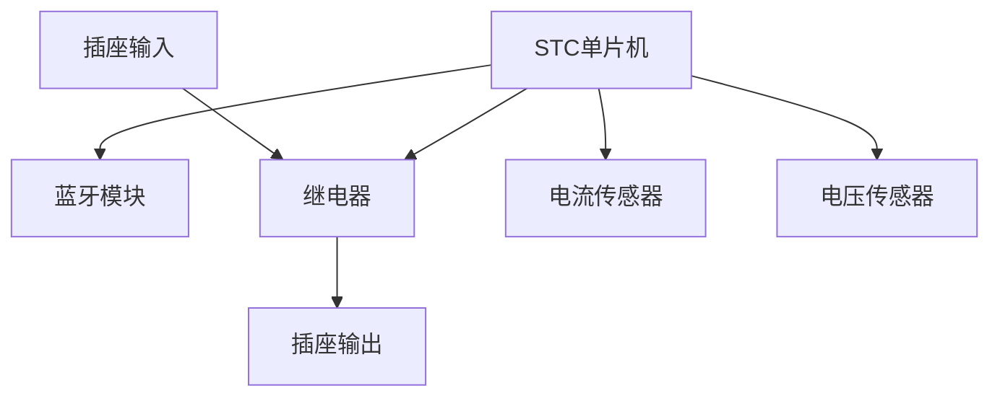

# 基于单片机智能蓝牙APP定时开关插座的设计与实现

## 1. 背景介绍

### 1.1 智能家居的兴起

随着物联网技术的不断发展,智能家居已经成为一种新兴的生活方式。智能家居系统通过将家用电器与互联网相连,实现了对家电的远程控制和自动化管理,极大地提高了生活质量和能源利用效率。在智能家居系统中,智能插座作为一种重要的控制终端,可以实现对家电设备的远程开关控制,并支持定时开关等高级功能。

### 1.2 传统插座的局限性

传统的机械插座虽然简单实用,但存在一些明显的不足。首先,它们无法实现远程控制,用户必须亲自操作开关;其次,缺乏定时功能,无法根据用户的使用习惯自动开关电器;此外,传统插座无法与其他智能设备集成,难以融入智能家居系统。

### 1.3 智能插座的应用前景

相比传统插座,智能插座具有远程控制、定时开关、能耗监测等诸多优势,可以更好地满足现代生活的需求。通过手机APP或语音助手,用户可以随时随地控制家中电器的工作状态,实现真正的智能化管理。此外,智能插座还可以收集用电数据,帮助用户分析用电情况,从而实现节能减排。因此,智能插座在智能家居领域具有广阔的应用前景。

## 2. 核心概念与联系

### 2.1 单片机

单片机(Single-Chip Microcomputer)是一种高度集成的微型计算机系统,它将CPU、RAM、ROM、I/O接口等组件集成在一个芯片上。单片机具有体积小、功耗低、价格便宜等优点,非常适合应用于智能插座等嵌入式系统。

在本项目中,我们选择使用STC单片机作为智能插座的控制核心。STC单片机是一款基于8051内核的低功耗单片机,具有丰富的I/O接口和较高的性能,可以满足智能插座的各项需求。

### 2.2 蓝牙通信

蓝牙(Bluetooth)是一种无线通信技术,工作在2.4GHz的ISM频段,传输距离一般在10米左右。蓝牙具有低功耗、低成本、安全可靠等特点,广泛应用于各种移动设备和物联网产品中。

在本项目中,我们采用蓝牙模块实现单片机与手机APP之间的无线通信。用户可以通过手机APP发送控制指令,单片机接收指令后执行相应的操作,如开关插座、设置定时等。同时,单片机也可以将插座的工作状态和用电数据通过蓝牙模块反馈给APP。

### 2.3 APP开发

APP(Application)是运行在智能手机或平板电脑上的应用程序。APP为用户提供了友好的图形界面,方便用户与智能设备进行交互。

在本项目中,我们需要开发一款Android APP,作为智能插座的控制终端。APP需要实现与蓝牙模块的连接、发送控制指令、接收状态反馈等功能,为用户提供直观的操作界面。

## 3. 核心算法原理具体操作步骤

### 3.1 蓝牙通信协议

为了实现单片机与手机APP之间的无线通信,我们需要遵循一定的通信协议。常见的蓝牙通信协议包括SPP(Serial Port Profile)和BLE(Bluetooth Low Energy)等。

在本项目中,我们采用了SPP协议。SPP协议基于RFCOMM协议,可以在主机和从机之间建立虚拟串行端口连接,实现双向数据传输。具体的通信过程如下:

1. 手机APP搜索并连接附近的蓝牙设备(即智能插座)。
2. 建立SPP连接,打开虚拟串行端口。
3. APP向串行端口发送控制指令。
4. 单片机接收指令,并执行相应的操作。
5. 单片机将执行结果或状态数据通过串行端口发送回APP。
6. APP接收并解析数据,更新界面显示。

为了确保通信的可靠性,我们还需要设计一套数据帧格式,用于封装控制指令和状态数据。数据帧通常包括帧头、数据长度、数据内容、校验码等字段。

### 3.2 定时开关算法

定时开关是智能插座的一项重要功能,可以根据用户的预设时间自动开启或关闭插座。实现定时开关功能需要单片机具备计时和闹钟功能。

在本项目中,我们采用了基于实时时钟(RTC)的定时开关算法。RTC是一种专门用于计时的电路,它可以持续记录当前的时间和日期,并提供闹钟功能。算法的具体步骤如下:

1. 用户通过APP设置定时开关的时间点。
2. APP将时间点数据发送给单片机。
3. 单片机根据RTC模块获取当前时间,并将时间点数据存储在内存中。
4. 单片机持续监测RTC模块的时间变化。
5. 当RTC时间与预设时间点匹配时,单片机触发相应的开关操作。
6. 单片机将操作结果反馈给APP。

为了提高系统的可靠性,我们还需要考虑掉电保护和时钟校准等问题。可以在单片机上配置备用电池,确保RTC在断电情况下仍能正常工作;同时,可以通过网络时间服务器或手机APP对RTC进行定期校准,保证时钟的准确性。

### 3.3 用电监测算法

除了远程控制和定时开关功能之外,智能插座还可以实现用电监测,帮助用户了解家电的用电情况,从而实现节能减排。

用电监测的原理是测量插座输出端的电流和电压,根据公式计算出有功功率,并对功率值进行积分,得到用电量。具体的算法步骤如下:

1. 使用电流传感器和电压传感器分别测量插座输出端的电流和电压。
2. 对电流和电压的模拟量进行A/D转换,得到数字量。
3. 根据公式 $P=U\times I\times \cos\phi$ 计算有功功率P,其中$\cos\phi$为功率因数。
4. 对功率值P进行积分,得到用电量E,即 $E=\int_{t_1}^{t_2}P(t)dt$。
5. 单片机将用电量数据通过蓝牙模块发送给APP。
6. APP接收并显示用电量数据,为用户提供直观的用电分析。

在实现用电监测算法时,我们需要注意以下几点:

- 选择合适的电流和电压传感器,确保测量精度。
- 对A/D转换结果进行滤波和去毛刺处理,提高数据质量。
- 根据实际情况调整积分步长,平衡计算精度和效率。
- 考虑不同类型的负载(如电阻性、感性等),选择合理的功率因数值。

## 4. 数学模型和公式详细讲解举例说明

在智能插座的设计与实现过程中,涉及到一些重要的数学模型和公式,下面我们将对其进行详细的讲解和举例说明。

### 4.1 有功功率计算

有功功率(Active Power)是指电路中实际被消耗或转换为其他形式能量的功率。在交流电路中,有功功率的计算公式为:

$$P=U\times I\times \cos\phi$$

其中,P为有功功率(单位为瓦特W),U为电压有效值(单位为伏特V),I为电流有效值(单位为安培A),$\cos\phi$为功率因数。

功率因数$\cos\phi$的取值范围为0到1,它反映了电路中有功功率与视在功率之比。对于纯电阻性负载,$\cos\phi=1$;对于纯感性或纯容性负载,$\cos\phi=0$;对于混合性负载,$\cos\phi$介于0到1之间。

以一台额定功率为800W的电视机为例,假设电源电压为220V,电流为4A,功率因数为0.8,则有功功率为:

$$P=220\times 4\times 0.8=704W$$

因此,虽然电视机的额定功率为800W,但实际消耗的有功功率为704W。

### 4.2 用电量计算

用电量(Electric Energy)是指一定时间内电路消耗的电能,单位为千瓦时(kWh)。用电量可以通过对有功功率进行积分来计算:

$$E=\int_{t_1}^{t_2}P(t)dt$$

其中,E为用电量,P(t)为时刻t的有功功率。

在实际计算中,我们通常采用数值积分的方法,将积分区间离散为多个小区间,然后对每个小区间内的功率值进行求和近似计算用电量。假设将时间区间[t1,t2]等分为n个小区间,步长为$\Delta t=(t_2-t_1)/n$,则用电量可以近似计算为:

$$E=\sum_{i=1}^{n}P(t_i)\Delta t$$

其中,P(t_i)为第i个时间点的功率值。

假设一台电视机在1小时内的平均功率为700W,则用电量为:

$$E=700W\times 1h=0.7kWh$$

### 4.3 A/D转换及误差分析

在智能插座中,我们需要使用模数转换器(A/D转换器)将传感器测量的模拟电压信号转换为数字量,以便单片机进行处理。A/D转换的基本原理是将连续的模拟信号量化为离散的数字码字。

假设A/D转换器的分辨率为n位,那么它可以将模拟量分为$2^n$个等级。对于给定的模拟量x,它对应的数字量D可以表示为:

$$D=\lfloor\frac{x}{V_R}\times 2^n\rfloor$$

其中,$V_R$为A/D转换器的基准电压,$\lfloor\cdot\rfloor$表示向下取整操作。

A/D转换过程中会引入一些误差,主要包括量化误差和非线性误差。量化误差是由于模拟量被量化为离散数字码字而产生的,其最大值为$\pm\frac{1}{2}LSB$(最小有效位)。非线性误差则是由A/D转换器本身的非线性特性所导致的。

为了提高A/D转换的精度,我们可以采取以下措施:

- 选择合适的分辨率,一般16位或更高的分辨率可以满足大多数应用场景。
- 对模拟信号进行滤波和调理,减小噪声和失真。
- 使用自校准功能,减小非线性误差。
- 采用过采样和数字滤波技术,提高有效分辨率。

## 4. 项目实践:代码实例和详细解释说明

在上一节中,我们介绍了智能插座设计与实现的核心算法原理。接下来,我们将通过代码实例和详细解释,展示如何将这些算法应用于实际项目中。

### 4.1 硬件连接

首先,我们需要连接好智能插座的硬件部分,包括单片机、蓝牙模块、继电器、电流传感器和电压传感器等。下面是硬件连接的示意图:



其中,单片机通过串口与蓝牙模块连接,实现无线通信;单片机还控制继电器的开关状态,从而控制插座的通断电;电流传感器和电压传感器分别测量插座输出端的电流和电压,并将模拟量传递给单片机进行A/D转换和功率计算。

### 4.2 蓝牙通信代码

下面是单片机与蓝牙模块进行串口通信的代码示例(基于STC单片机):

```c
#include <reg52.h>

// 蓝牙模块串口初始化
void UART_Init()
{
    TMOD = 0x20; // 设置定时器1为模式2(8位自动重载)
    TH1 = 0xFD; // 设置波特率为9600
    TL1 = 0xFD;
    TR