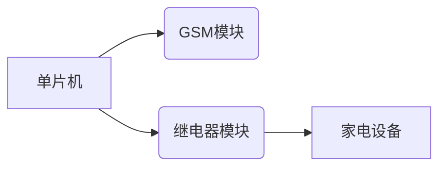
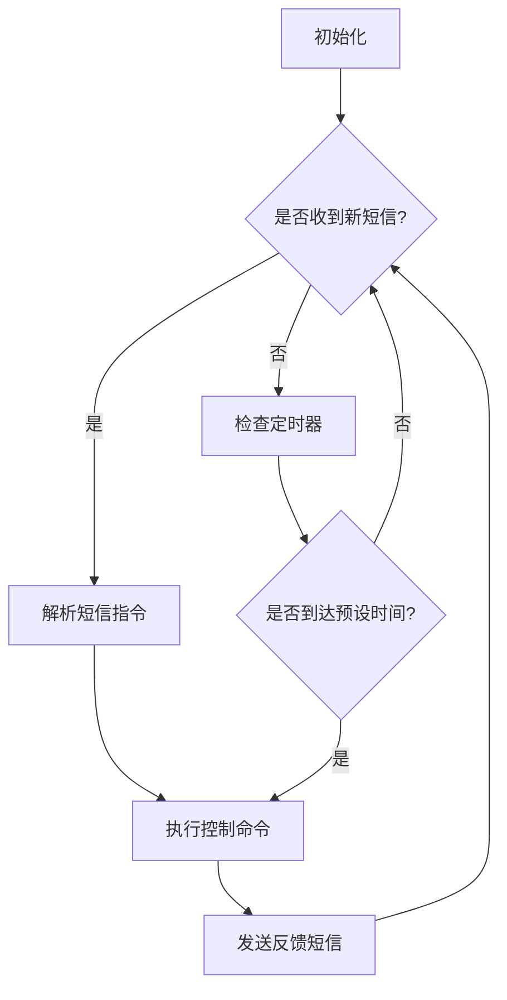

以下是基于单片机短信定时控制家电的设计与实现的技术博客文章正文:

## 1. 背景介绍

### 1.1 家电控制的重要性

在当今快节奏的生活方式中,人们越来越渴望能够远程控制家中电器的便利性。无论是出于节能、安全还是舒适的目的,远程控制家电已经成为一种迫切的需求。传统的家电控制方式如定时器虽然可以在一定程度上满足需求,但缺乏灵活性和实时性。

### 1.2 短信控制的优势

短信作为一种成熟且广泛使用的通信方式,具有低成本、覆盖范围广、操作简单等优势。利用短信控制家电不仅可以实现远程遥控,还能根据预设的时间表自动执行开关操作,极大地提高了家电控制的灵活性和可靠性。

### 1.3 单片机在家电控制中的应用

单片机是一种高度集成、功能强大且价格低廉的微处理器,非常适合应用于各种嵌入式系统中。在家电控制领域,单片机可以实现对家电状态的检测、解析控制指令并执行相应动作,是实现短信家电控制的理想选择。

## 2. 核心概念与联系  

### 2.1 短信通信

短信通信是本系统的核心,它负责将用户发送的控制指令传递给单片机。常用的短信通信协议有PDU(协议数据单元)模式和文本模式,前者使用十六进制编码,后者使用可读字符串。

### 2.2 单片机硬件

硬件部分主要包括单片机芯片、GSM模块、继电器模块等。单片机是系统的大脑,负责接收和解析短信指令、控制继电器开关。GSM模块用于无线收发短信。继电器模块则控制着家电的通断电状态。

### 2.3 软件控制流程

软件控制流程包括以下几个主要步骤:

1. 初始化各硬件模块
2. 循环检测是否收到新短信
3. 解析短信指令
4. 执行相应的家电开关操作
5. 发送反馈短信

## 3. 核心算法原理具体操作步骤

### 3.1 短信解析算法

短信解析算法的作用是将收到的原始短信数据解码为可读的指令。以PDU模式为例,算法流程如下:

1. 去除短信数据首尾的协议头
2. 按每两个字符一组进行解码
3. 根据编码对照表将十六进制转换为实际字符
4. 对解码后的字符串进行命令识别和参数解析

### 3.2 定时控制算法

定时控制算法的核心是一个计时器,它根据预设的时间表执行开关操作。算法流程如下:

1. 初始化时间表,可通过短信指令设置
2. 循环检查当前时间是否与时间表中的某个时间点匹配
3. 若匹配则执行对应的开关操作
4. 发送反馈短信

### 3.3 故障处理算法  

为确保系统的可靠运行,需要对常见故障如短信发送失败、硬件故障等进行处理。算法流程如下:

1. 设置故障标志和故障类型代码
2. 当发生故障时,记录故障信息并设置相应标志
3. 根据故障类型采取相应的处理措施,如重新发送短信、硬件复位等
4. 发送故障报告短信

## 4. 数学模型和公式详细讲解举例说明

在短信定时控制系统中,需要对时间进行精确计算和匹配。这里介绍一种常用的时间计算模型。

假设有两个时间点$t_1$和$t_2$,其时间表示为:

$$t_1 = h_1 \times 3600 + m_1 \times 60 + s_1$$
$$t_2 = h_2 \times 3600 + m_2 \times 60 + s_2$$

其中$h$、$m$、$s$分别表示小时、分钟和秒。

那么两个时间点的时间差$\Delta t$可以计算为:

$$\Delta t = t_2 - t_1 = (h_2 - h_1) \times 3600 + (m_2 - m_1) \times 60 + (s_2 - s_1)$$

在定时控制中,我们可以将当前时间$t_c$与预设时间点$t_p$进行比较,当$|t_c - t_p| < \epsilon$时,其中$\epsilon$是一个很小的时间阈值,就认为匹配成功,从而触发相应的开关操作。

## 4. 项目实践:代码实例和详细解释说明  

### 4.1 硬件连接



单片机通过串口与GSM模块连接,用于发送和接收短信。同时单片机也控制着继电器模块的开关状态,进而控制家电的通断电。

### 4.2 主程序流程



程序首先初始化各硬件模块,然后进入主循环。每次循环首先检查是否收到新的短信,若收到则解析指令并执行相应的控制操作,最后发送反馈短信。若没有新短信,则检查定时器,若匹配预设时间则执行相应操作。

### 4.3 关键代码分析

以下是一段解析PDU模式短信的关键代码:

```c
// 去除首尾标识字符
char *pdu = msg + 2; 
pdu[strlen(msg) - 5] = '\0';

// 解码
char decoded[160] = {0};
int len = HexToByte(pdu, decoded);

// 命令识别和参数解析
if(strstr(decoded, "SWITCH=ON")) {
    // 打开家电
    ...
}
...
```

该代码首先去除PDU数据的首尾标识字符,然后调用`HexToByte`函数将十六进制数据转换为实际字符。最后在解码后的字符串中查找关键词,如"SWITCH=ON",并执行相应的控制操作。

## 5. 实际应用场景

短信定时控制系统可广泛应用于家庭、酒店、办公室等场景,用于控制各种家电设备,如:

- 空调
- 电视
- 电热水器
- 路由器/网络设备
- 安防系统
- 照明系统

用户可以在外出时远程控制这些设备,实现节能环保;也可以通过预设时间表,让设备自动运行,提高生活品质。

此外,该系统还可扩展应用于工业控制、农业自动化等领域,为自动化控制提供了一种简单可靠的解决方案。

## 6. 工具和资源推荐

### 6.1 硬件工具

- 单片机开发板(如Arduino、51单片机等)
- GSM模块(如SIM900A)
- 继电器模块

### 6.2 软件工具

- 单片机编程环境(如Keil、Arduino IDE等)
- 串口调试工具(如putty、串口调试助手等)

### 6.3 学习资源

- 《单片机原理及应用》
- 《GSM模块开发指南》
- Arduino官方文档和教程
- 各单片机芯片手册

## 7. 总结:未来发展趋势与挑战

### 7.1 发展趋势

1. 物联网技术的融合,实现更智能化的家电控制
2. 语音控制、手机APP等多种控制方式并存
3. 云端管理,实现家电状态的远程监控

### 7.2 挑战

1. 系统安全性,防止非法操控
2. 可靠性和容错性,确保控制精准可靠
3. 成本和功耗,追求更高的性价比

## 8. 附录:常见问题与解答  

**Q: 短信控制是否安全可靠?**
A: 可以采用密码验证、加密传输等措施来提高安全性。同时硬件电路上也需要有防止误操作的保护措施。

**Q: 如何提高系统的实时性和响应速度?**
A: 可以优化软件算法,使用更高性能的硬件模块。同时也可以采用蓝牙等低延迟通信方式。

**Q: 系统是否支持同时控制多个家电?**  
A: 完全可以,只需要在软件和硬件上做相应扩展,增加更多的继电器通道即可。

**Q: 如何降低系统的功耗?**
A: 可以采用低功耗的硬件模块,在软件上也要对系统进行功耗优化,如设置休眠模式等。